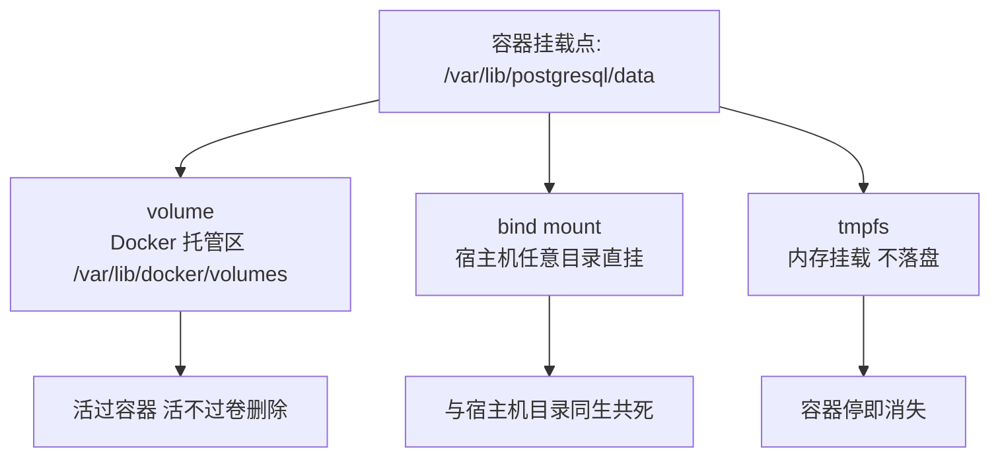
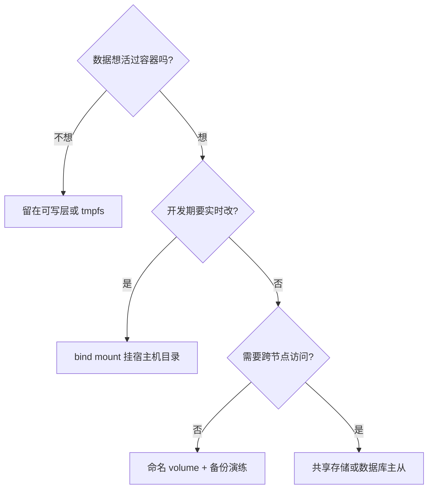

# 存储卷与数据持久化

> **一句话摘要**：容器的可写层是临时且低效的，持久化数据的答案是「外挂存储」——volume 由 Docker 托管（首选）、bind mount 直挂宿主机目录（开发利器）、tmpfs 留在内存（敏感临时数据）；判断标准一句话：数据想不想活过容器。

前置阅读：[容器是什么](./1_容器是什么-从虚拟机到容器-入门.md)。集群里的持久化（PV/PVC/StorageClass）归[K8s 生态系列](../../../kubernetes/入门层/从零开始认识K8s生态系列/0_系列导读-全景.md)。

## 1. 背景：为什么需要存储卷

容器的可写层有两个致命问题。**临时性**：容器删除，可写层随之消失——数据库容器重建，数据全没；**性能**：写时复制机制让可写层的 IO 比直接写磁盘慢（镜像层的文件要先拷过来再改），高频写场景（数据库）会显著拖慢且层会越写越厚。

存储卷的思路与「变化外置」一脉相承：**把「需要活过容器生命周期的数据」从容器里挪出来**，放进宿主机或外部存储的独立空间，容器只负责挂载使用。数据与容器从此解耦：容器可随时销毁重建，数据原地不动。

## 2. 核心机制：三种挂载方式



- **volume（Docker 托管卷）**：数据存在 Docker 管理的目录区（`/var/lib/docker/volumes/`），生命周期由 Docker API 管理。优点：跨平台一致（Mac/Windows 也是 Linux 语义）、便于备份（`docker volume` 命令族）、可接卷驱动对接云盘/NFS。**生产持久化的首选**。
- **bind mount（绑定挂载）**：把宿主机任意目录直接映射进容器，两边看到同一份文件。优点：直观、实时同步——开发时把源码目录挂进容器，本机改代码容器里立刻生效。缺点：路径强依赖宿主机（可移植性差）、权限与 UID 映射要小心。**开发场景首选，生产慎用**。
- **tmpfs**：挂在内存的临时空间，不落盘、容器停即消失。适合敏感临时数据（密钥文件）与高 IO 临时缓冲。

判断口诀：**开发想实时看代码 → bind；生产数据要持久 → volume；临时敏感留内存 → tmpfs；都不需要 → 什么都不挂，让容器保持无状态**。

## 3. 落地实践：挂载、备份与权限

```bash
# volume: 命名卷给数据库
docker volume create pgdata
docker run -d --name db -v pgdata:/var/lib/postgresql/data postgres:16

# bind mount: 开发时挂源码 (注意绝对路径)
docker run -d --name dev -v "$(pwd)/src:/app/src" -p 3000:3000 node:22 sh -c "npm run dev"

# tmpfs: 敏感临时文件
docker run --rm --tmpfs /run/secrets:rw,size=64m myapp

# 备份: 借一个临时容器打包卷
docker run --rm -v pgdata:/data -v "$(pwd)":/backup alpine \
  tar czf /backup/pgdata-backup.tgz -C /data .

# 体检: 谁在占空间、卷里有什么
docker system df -v && docker volume ls
```

权限是 bind mount 的第一坑：容器内进程的 UID 与宿主机目录属主不一致时会读写失败（尤其 PostgreSQL/MySQL 这类会检查数据目录权限的软件）。惯例是容器内以宿主机属主的 UID 运行（`user: "1000:1000"`）或使用支持 UID 映射的卷驱动。

## 4. 生产视角：数据事故的形态

- **「数据库容器重建后数据没了」**：没挂卷，数据写在可写层里。复盘时数据已随容器删除——这类事故无法补救，只能预防：有状态服务的部署清单里，卷挂载是评审必查项。
- **卷变成了黑洞**：`docker rm` 容器默认不删卷，孤儿卷长期堆积吃满磁盘（`docker volume prune` 清理，但先确认没人在用）。反过来，`docker rm -v` 会顺手删卷——对数据库容器用这个命令前想三秒。
- **bind mount 的路径漂移**：compose 文件里写了相对路径或机器特定路径，换台机器部署行为就变了。bind 路径必须是显式绝对路径，且部署文档要写明宿主机侧的目录约定。
- **单机卷的高可用幻觉**：volume 解决「容器死了数据在」，不解决「机器挂了数据活」。生产数据库的持久化要的是「卷 + 备份 + （跨机）复制」的组合——卷只保证第一层，备份策略与主从复制（归 MySQL 系列）才是数据安全的主体。

## 5. 主流方案怎么做：从单机卷到共享存储

| 场景 | 主流机制 | tips |
|---|---|---|
| 单机持久化 | 命名 volume | 数据库/消息队列的本地卷；注意「卷在但不备份 = 裸奔」 |
| 开发热重载 | bind mount | 挂源码不挂依赖目录（`node_modules` 用匿名卷盖掉宿主机版本——compose 的经典技巧） |
| 共享存储 | NFS / 云盘卷驱动 | volume driver（local-persist、云厂商插件）把卷后端换成网络存储 |
| K8s 集群 | PV/PVC + StorageClass | 卷概念的标准升维：声明式申请、动态供给、跨节点附着 |
| 对象存储 | S3 类 + 应用层集成 | 大文件与静态资源别放块卷，对象存储才是对的工具 |

规律：**卷的可移植性决定了架构的上限**——单机卷上生长不出多机架构。挂载方式的选择本质上是一场代价权衡：bind mount 用「可移植性代价」换直观，volume 用「一层托管」换管理与备份能力，网络存储用「延迟代价」换共享；数据形态的演进路线也很清晰——单机 volume → 共享存储 → 数据库主从/对象存储，各阶段代价与收益见容量与数据架构的权衡。设计时问一句「数据要不要被第二个节点访问」，要，就一开始就上共享存储或数据库主从，别在单机卷上打补丁。

挂载选型的判断链：



## 6. 典型场景

- **数据库容器**（交易级）：命名卷 + 定时备份任务 + 恢复演练——三件齐了才叫持久化，只挂卷只是第一步。
- **本地开发栈**（效率级）：源码 bind mount + 依赖匿名卷 + 数据卷三件套，代码热更新、依赖不串、数据常驻。
- **日志与临时文件**（运维级）：日志目录 bind 到宿主机统一收集（或直接 stdout 让 Docker 日志驱动接管——生产惯例，见踩坑深度篇）；高 IO 临时目录挂 tmpfs。

## 7. 与相邻概念的区别

- **volume vs bind mount**：volume 由 Docker 托管（可移植、命令齐全）、bind 是裸目录映射（直观、开发友好）。生产选 volume，开发选 bind——混用导致「在开发机好的、上生产权限炸」的经典事故。
- **卷 vs 可写层**：卷是独立于容器生命周期的持久空间，可写层是临时的 CoW 层。写密集负载放卷，还有性能收益。
- **挂载 vs 复制（COPY 进镜像）**：不变的静态资源可以 COPY 固化进镜像（跟随版本）；会变的数据必须挂载。把频繁变化的数据 COPY 进镜像 = 每次变化都要重建镜像，反模式。

## 8. 常见误区与不适用

- **「挂了卷 = 数据安全」**：卷只解决「容器死了数据在」。磁盘坏了、误删卷、勒索加密——没有备份的卷是单点。持久化的完整公式：卷 + 备份 + 恢复演练。
- **「bind mount 随便挂，方便就行」**：挂根目录、挂系统目录进容器是危险操作（容器内进程可改宿主机文件）；挂 Docker 的 sock 文件（`/var/run/docker.sock`）等于交出宿主机 root 级控制权。
- **「数据放容器里先跑着，回头再迁移」**：可写层的数据无法优雅迁出（没有卷的快照与备份接口），「回头迁移」往往变成「停机抢救」。有状态服务第一天就挂卷。
- **「tmpfs 的数据也要持久」**：tmpfs 就是不落盘的，选它就是选「可丢」；要持久的老实用 volume。
- **「volume 性能一定好」**：卷驱动接了网络后端（NFS/云盘）后性能取决于后端，不是「卷」这个词本身。数据库类负载先压测 IO。

## 9. 你们可能会问

- **匿名卷和命名卷怎么选？** 命名卷（有名字可管理可备份）用于一切需要「找回」的数据；匿名卷只用于「占位屏蔽」（如盖住镜像里的依赖目录）这类不需要管理的场景。
- **怎么把可写层里的既有数据搬到卷里？** 停容器 → 起新容器挂目标卷 → `docker cp` 或 tar 管道把数据拷进卷 → 切换。趁机建立备份机制，别只搬一次。
- **卷会随 `docker compose down` 删掉吗？** 默认不会；`down -v` 才删。compose 文件里命名的卷要写 external 或明确接受生命周期，团队约定要显式。
- **多容器共享一个卷会打架吗？** 同一文件并发写会冲突——卷只是共享空间，没有并发控制。共享读写要么分目录各写各的，要么用支持并发的存储服务（数据库、对象存储），不要让两个进程直接写同一个文件。
- **容器删了卷还在，怎么知道哪些卷没人在用？** `docker volume ls -q` 逐个 `docker ps -a --filter volume=名` 反查；没有好用的内建反向索引，孤儿卷清理脚本靠这个思路写。

## 10. 一句话总结 + 5W 速记卡 + 自测三问

**一句话总结**：持久化 = 把「想活过容器的数据」外挂出去——volume 给生产、bind 给开发、tmpfs 给敏感临时；卷 + 备份 + 演练才是数据安全，卷本身只是第一步。

**5W 速记卡**：

| 维度 | 内容 |
|---|---|
| What | volume / bind mount / tmpfs 三种挂载与生命周期 |
| Why | 可写层临时且低效，有状态负载必须外挂存储 |
| When | 容器要存数据库、上传文件、日志、开发热重载时 |
| Where | 单机卷；集群持久化归 K8s PV/PVC |
| How | 判断数据生命周期 → 选挂载方式 → 权限对齐 → 备份演练 |

**自测三问**：

1. 你所有「删了容器会心疼」的数据，现在分别在哪种存储里？
2. 你数据库卷的上一次成功恢复演练是什么时候？
3. 开发栈的 bind mount 里有没有混进该用 volume 的数据？

---

**下篇预告**：单机跑一堆容器手敲命令太苦——下一篇[Docker Compose](./6_DockerCompose与本地编排-入门.md)讲声明式的本地多容器编排。

---

## 📌 数据与事实声明

本文版本锚点（截至 2026-09-09）：Docker Engine v29.8.0。三种挂载机制与卷命令为 Docker 官方文档内容；「挂载 docker.sock 等于交出宿主机控制权」为公开的安全共识；性能量级为业内通用认知，具体 IO 请以自身压测为准。

## 📚 参考资料

| 类型 | 标题 | 来源 |
|---|---|---|
| 文档 | Docker storage / volumes 官方文档 | docs.docker.com |
| 文档 | K8s PersistentVolumes（集群卷对照） | kubernetes.io |
| 系列文章 | MySQL 系列（备份与复制） | 本仓库 docs/data/mysql/ |
