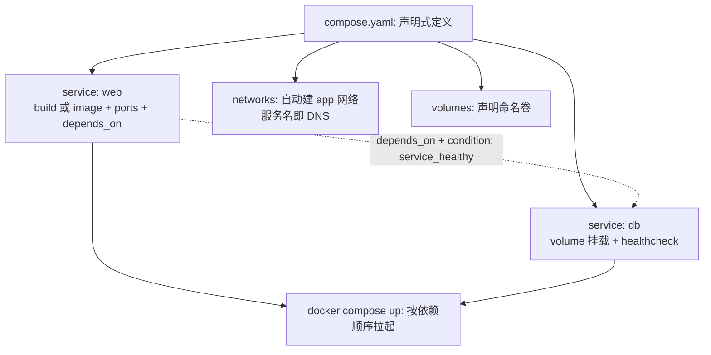
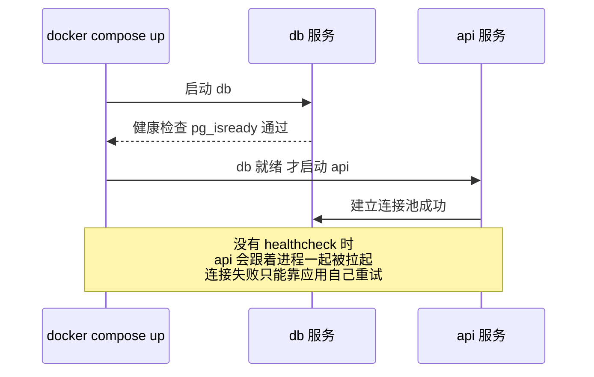

# Docker Compose 与本地编排

> **一句话摘要**：Compose 把「一组容器的定义」从命令行搬进一个 YAML 文件——`up` 一条命令起整套环境，网络、卷、依赖顺序自动配好；它是单机声明式编排，也是理解 K8s「声明式资源定义」思想的最低成本入口。

前置阅读：[容器网络](./4_容器网络-入门.md)、[存储卷](./5_存储卷与数据持久化-入门.md)。集群级编排见[K8s 生态系列](../../../kubernetes/入门层/从零开始认识K8s生态系列/0_系列导读-全景.md)。

## 1. 背景：为什么需要 Compose

一个像样的应用栈 = Web + API + 数据库 + 缓存 + 消息队列。手敲 `docker run` 的问题不止是累：**参数记不住**（每次起都要翻历史命令）、**顺序靠运气**（应用先起，数据库还没 ready 就崩）、**网络卷要手工连**（谁在哪个网络、哪个卷，全是口头约定）、**环境不可复制**（同事机器起得来，你的起不来）。

Compose 的解法是**声明式**：把整套栈写进 `compose.yaml`（服务、网络、卷、依赖关系），`docker compose up` 一条命令按定义拉起全部——定义进版本库，环境随代码走。「一条命令复现整套环境」改变的不只是效率，是团队协作的方式。

## 2. 核心机制：服务、网络、卷的声明式组装



四个机制要点：

- **project（项目）**：compose 把同目录的整套服务视为一个项目（默认目录名），`up/down/ps` 都按项目操作——容器、网络、卷自动带项目前缀，互不干扰。
- **网络与 DNS 自动化**：声明了服务就自动建项目网络，服务名即 DNS（接[容器网络篇](./4_容器网络-入门.md)的自定义网络惯例），应用配置里直接写 `db:5432`。
- **depends_on 与健康检查**：`depends_on` 只管「启动顺序」，不管「就绪」——数据库进程起来了不等于能接受连接。生产级写法是服务自带 `healthcheck`，依赖方写 `depends_on.condition: service_healthy`，「起得来」与「能用了」分开表达。
- **build 与 image 的选择**：本地开发用 `build:`（源码进镜像或挂载），部署描述用 `image:`（引用制品）。同一个 compose 文件两种写法混用是团队混乱之源——业内惯例是「开发 compose 用 build、部署用 K8s manifests 或 CD 工具」，compose 一般不直接上生产重负载。

## 3. 落地实践：一个标准开发栈模板

```yaml
services:
  web:
    build: ./web                 # 本地构建
    ports: ["8080:80"]
    depends_on:
      api: { condition: service_healthy }
    volumes: ["./web/src:/app/src"]   # 源码热重载
  api:
    build: ./api
    environment:
      - DATABASE_URL=postgres://app:pass@db:5432/app
    healthcheck:
      test: ["CMD", "curl", "-f", "http://localhost:8080/healthz"]
      interval: 5s
      retries: 10
    depends_on:
      db: { condition: service_healthy }
  db:
    image: postgres:16
    volumes: ["pgdata:/var/lib/postgresql/data"]
    healthcheck:
      test: ["CMD-SHELL", "pg_isready -U app"]
volumes:
  pgdata:
```

日常操作五连：`docker compose up -d`（后台起）、`logs -f api`（跟日志）、`exec api sh`（进容器）、`restart api`（只动一个服务）、`down`（收摊，数据卷保留）。环境差异用 `compose.override.yaml`（本地自动叠加）或 `--env-file` 管理变量，别靠注释切换配置。

## 4. 生产视角：Compose 用到生产的样子与边界

- **小规模单机部署确实有人在用**：`compose up -d` 就是轻量部署工具，个人项目与内部工具完全够用。但它的边界也在这里：**没有滚动更新**（down 再 up 有停机窗口）、**没有自愈**（容器挂了不会自动拉起，要配 `restart: unless-stopped` 兜底）、**没有多机**（单机边界，见下节对比）。
- **「环境漂移」的起点**：当 compose 文件里开始出现 `extra_hosts`、`privileged`、手工进容器改配置的「惯例」，说明栈的复杂度已经越过 Compose 的表达力——这是迁往 K8s 的信号，继续打补丁只会让漂移加深。
- **健康检查是分水岭**：没有 healthcheck 的 compose 栈，依赖顺序全靠 sleep 与运气，重启后「起得来但连不上」的事故反复出现。给每个服务写 healthcheck 是 Compose 实践里性价比最高的一条。就绪门控的时序长这样（对照上面「depends_on 只管顺序」的坑）：


- **密钥与配置分离**：`environment` 里写明文密码、进版本库，是最常见的泄密起点。用 `secrets` 声明或 `.env`（gitignore）+ 环境注入，版本库里只有占位符。

## 5. 主流方案怎么做：编排工具的定位谱系

| 工具 | 定位 | tips |
|---|---|---|
| Docker Compose（v2 起为 Go 插件，截至 2026-09 已演进到 v5.5） | 单机声明式编排 / 开发环境标准 | 命令从 `docker-compose`（连字符）变为 `docker compose`（子命令），老脚本注意迁移 |
| Kubernetes | 集群编排的事实标准 | Compose 的服务概念 ≈ K8s 的 Service+Deployment 简化版；compose.yaml 可用工具半自动转 K8s manifests |
| Docker Swarm | Docker 原生多机 | 语法与 compose 接近、上手快，但社区活跃度远低于 K8s，新项目慎选 |
| Podman Compose | 无守护进程生态的兼容层 | Podman 用户的 compose 兼容实现，语义与 Docker Compose 有细微差异 |

规律：**Compose 与 K8s 不是竞争关系，是开发与生产的分工**——开发环境用 Compose 追求快，生产用 K8s 追求稳。从交付架构的上下游看，Compose 处在「环境定义」这一环：它向下游（CI、编排平台）交付可复现的环境描述，自己不承担调度、自愈与多机架构这些上游平台的责任。业内大量团队「本地 Compose、线上 K8s」双轨，代价是要维护两份定义（这是当前生态公认的不优雅，转换工具在持续演进）。

## 6. 典型场景

- **新人入职环境**（效率级）：clone 仓库 → `docker compose up` → 十分钟拿到全栈环境，环境文档就是 compose.yaml 本身。
- **集成测试环境**（质量级）：CI 里 compose 起真实数据库 + 依赖服务跑集成测试，比 mock 环境真实、比共享测试环境干净（用完即 down）。
- **内部工具单机部署**（成本级）：给运营后台、监控面板这类低频工具用 compose 部署，`restart: unless-stopped` + 健康检查 + 定期备份，运维成本极低。

## 7. 与相邻概念的区别

- **Compose vs docker run**：命令式（一条条敲、状态在脑子里）vs 声明式（一个文件、状态在版本库）。超过两个容器的栈，直接上 Compose。
- **Compose vs K8s**：单机 vs 集群、简单 vs 全能。Compose 没有的：调度、自愈、滚动更新、扩缩容、跨节点存储——每一个都是生产刚需，所以生产重负载终归 K8s。
- **compose.yaml vs Dockerfile**：Dockerfile 定义「一个镜像怎么构建」，compose 定义「一组容器怎么组装」。层次不同，通常项目两个都有。

## 8. 常见误区与不适用

- **「depends_on 写了就万事大吉」**：它只保证启动顺序不保证就绪。没有 healthcheck 的 depends_on 是安慰剂——数据库「进程起来」到「能接受连接」之间的窗口照样把应用打崩。
- **「compose 文件里写明文密码没关系，反正是内网」**：compose 文件进版本库 = 密码进版本库。密钥分离从第一天做起，迁移成本为零、泄密成本极高。
- **「开发环境的 compose 直接拿去上生产」**：热重载挂载、固定端口、无资源限制、无更新策略——开发配置的每一项便利在生产都是风险。两边文件可以同源，但不该是同一份。
- **「服务越写越多，一个 compose 文件塞下整个公司」**：compose 没有多级抽象，文件超过几百行就该按业务域拆成多个 compose 项目（或认真考虑上 K8s），而不是靠注释管理。
- **「restart: always 是高可用」**：它只管「进程退出拉起来」，管不了宿主机宕机后的数据与依赖、也管不了无限崩溃重启的循环。自愈与调度是编排平台的能力。

## 9. 你们可能会问

- **compose.yaml 和 docker-compose.yml 什么区别？** 同一东西——v2 官方推荐 `compose.yaml` 文件名，旧名继续兼容；命令 `docker compose`（子命令）取代 `docker-compose`。
- **怎么只重建一个服务而不打断整个栈？** `docker compose up -d --build api` 只构建并更新 api；`--no-deps` 连依赖都不碰。局部重建是日常高频操作。
- **健康检查的 test 命令怎么写才靠谱？** 检查「业务可用」而不是「进程存在」：数据库用自带 ready 工具（pg_isready），HTTP 服务探健康端点，避免 curl 检查端口但服务其实没 ready 的假阳性。
- **Compose 能跑生产吗？** 小规模单机、可接受分钟级停机更新的场景可以；需要滚动更新、自愈、多机的，直接上 K8s——「生产能不能用」的答案是「能，但知道边界在哪」。
- **本地 Compose 与线上 K8s 双份定义怎么维护？** 业内现状是工具辅助转换 + 人审差异；更重要的是纪律——两边共用的镜像 tag、环境变量清单、端口约定单独维护成单一事实源，别让两份编排各自漂移。

## 10. 一句话总结 + 5W 速记卡 + 自测三问

**一句话总结**：Compose = 单机声明式编排——服务、网络、卷、健康检查写进一个 YAML，`up` 复现整套环境；它是开发环境的标准答案，也生产重负载之前的那一级台阶。

**5W 速记卡**：

| 维度 | 内容 |
|---|---|
| What | 服务/网络/卷的声明式定义 + depends_on + healthcheck |
| Why | 多容器栈需要可版本化、可复现的组装方式 |
| When | 本地开发、集成测试、单机小规模部署 |
| Where | 单机；集群编排归 K8s |
| How | 写 compose.yaml → healthcheck 全覆盖 → 密钥外置 → 版本库 |

**自测三问**：

1. 你的 compose 栈里每个服务都有 healthcheck 吗？重启一遍全部服务能自愈吗？
2. compose 文件里有没有明文密钥？它在版本库里躺了多久？
3. 哪个服务没有它就起不来的依赖？depends_on 的 condition 表达对了吗？

---

**下篇预告**：容器多了，「跑得安全」成为前提——下一篇[容器安全与资源限制](./7_容器安全与资源限制-入门.md)讲非 root 运行、capabilities、资源限制与镜像扫描。

---

## 📌 数据与事实声明

本文版本锚点（截至 2026-09-09，gh CLI 实测）：Compose v5.5.1、Docker Engine v29.8.0。depends_on/healthcheck 语义、v2 命令迁移为官方文档内容；Swarm 社区活跃度对比、Compose-K8s 转换工具现状为生态公开认知。具体行为以官方文档为准。

## 📚 参考资料

| 类型 | 标题 | 来源 |
|---|---|---|
| 文档 | Compose file reference | docs.docker.com/compose |
| 文档 | K8s 对象对照（Deployment/Service/ConfigMap） | kubernetes.io |
| 系列文章 | K8s 生态系列 | 本仓库 docs/devops/kubernetes/ |
