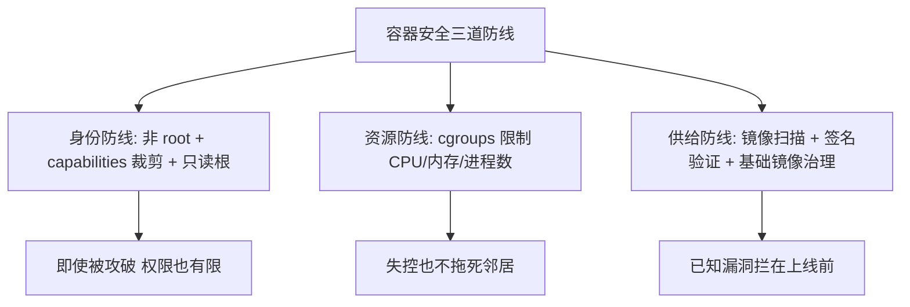
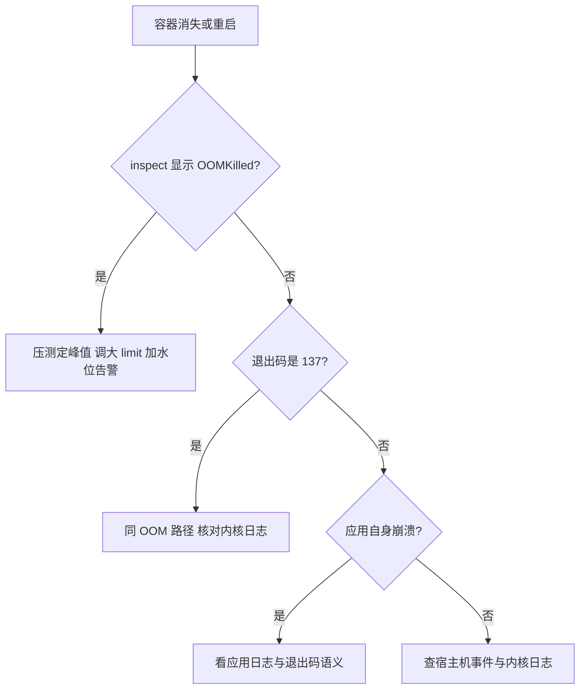

# 容器安全与资源限制

> **一句话摘要**：容器安全 = 让进程「拿不到不该拿的」（非 root + 裁剪 capabilities + 只读根文件系统）+ 让资源「抢不到别人的」（cgroups 限制）+ 让镜像「不带病进来」（扫描与签名）——三道防线都是配置问题，却是最常被跳过的配置。

前置阅读：[容器是什么](./1_容器是什么-从虚拟机到容器-入门.md)、[镜像与分层](./2_镜像与分层-入门.md)。集群级安全（RBAC/NetworkPolicy/多租户）归[K8s 专题](../../../kubernetes/入门层/从零开始认识K8s生态系列/0_系列导读-全景.md)。

## 1. 背景：为什么容器的「默认配置」不安全

容器共享宿主机内核，隔离强度止步于 namespace——而 Docker 的默认配置在隔离上做了大量「便利性让步」：容器默认以 root 运行、默认携带一整套 Linux capabilities（root 特权的细粒度拆分）、根文件系统可写、不设资源上限。默认配置下的容器，一次内核漏洞或应用漏洞就可能波及宿主机。

资源维度同理：不设限制的容器可以吃光宿主机 CPU 与内存，一个失控进程把整机的邻居全部拖死。所以「上生产」的安全底线不是加一个防火墙，是**把默认配置里的每一项便利性让步收回来**。

## 2. 核心机制：三道防线的原理

把容器安全放进系统架构的上下游看：镜像供给侧（CI 构建 → 仓库分发 → 拉取）与运行侧（宿主机 → 内核 → 进程）各自有攻击面，三道防线分别卡在「身份、资源、供给」三个环节——每一道都是安全强度与运维代价之间的权衡：



- **身份防线**：`user` 指定非 root 运行（Dockerfile 的 `USER` 指令或 run 的 `--user`）；`--cap-drop=ALL` 后按需加回（多数 Web 服务只需要极少能力）；`--read-only` 根文件系统只读（写需求走挂载）；`--security-opt no-new-privileges` 禁止进程提权（setuid 失效）。这些开关组合的思路是**纵深防御**：应用被攻破时，攻击者拿到的只是一个低权限、无工具、只读环境的受限进程。
- **资源防线（cgroups 落地）**：`--memory` 内存上限（超限触发 OOM kill）、`--cpus` CPU 上限、`--pids-limit` 进程数上限（防 fork 炸弹）。设定依据是压测与监控水位（方法见[容量规划与性能评估](../../../../architecture/system-design/distributed-system-design/入门层/从零开始认识分布式系统设计系列/9_容量规划与性能评估-入门.md)），不是拍脑袋的「4 核 8G」。
- **供给防线**：镜像进来的第一道关——漏洞扫描（Trivy/Grype 一类，扫 OS 包与应用依赖的已知 CVE）、签名验证（cosign 签名 + 拉取侧校验，防镜像被篡改）、基础镜像白名单（只用受治理的基础镜像，版本升级走受控流程）。

## 3. 落地实践：一条生产级 run 命令长什么样

```bash
docker run -d \
  --name api \
  --user 10001:10001 \              # 非 root (与镜像内 UID 对齐)
  --cap-drop=ALL \                  # 全部特权收回
  --security-opt no-new-privileges \ # 禁止进程内提权
  --read-only \                     # 根文件系统只读
  --tmpfs /tmp \                    # 需要写的临时目录单独给
  -v appdata:/data \                # 持久数据走卷
  --memory=1g --cpus=1.0 \          # 资源上限
  --pids-limit=200 \                # 进程数上限
  --restart=unless-stopped \
  registry.example.com/app:1.4.2    # 私有仓库 + 明确版本
```

镜像侧配套两步：CI 里加扫描门禁（高危 CVE 拦截构建），基础镜像季度性升级走流水线。**把这套配置固化为组织模板**（项目脚手架里内置），比指望每个项目自觉有效得多——业内惯例是「安全基线进模板，不进记忆」。

## 4. 生产视角：安全与资源事故的形态

- **容器「莫名消失」**：先查 OOM——`docker inspect` 看 `State.OOMKilled`，真凶几乎总是内存 limit 低于应用真实峰值（JVM 类应用尤其常见：堆内限制与容器 limit 不对齐）。修法是「压测定峰值 + limit 留余量」，不是无脑调大。排查决策链：


- **CPU 抢占型性能抖动**：多容器无 limit 共存时，一个批处理任务吃满 CPU，邻居全部抖动。给每个容器设 `--cpus` 后整机变成「按份额分蛋糕」，抖动消失——资源限制不只是安全，更是公平性。
- **镜像投毒与供应链**：拉取了被篡改的第三方镜像或带后门的依赖版本。防御组合：私有仓库中转（不直连公网仓库）+ 签名验证 + SBOM 审计。公开的供应链攻击案例（依赖包投毒）说明「能拉到 ≠ 能信」。
- **特权容器的滥用**：为了「省事」挂 docker.sock、加 `--privileged` 的容器，等于宿主机 root。这类配置常出现在 CI 执行器与监控 agent 里——要用的组件用最小权限方案替代，做不到就把它的部署面收窄并重点监控。
- **只读根文件系统的「不适配」阵痛**：首次开启 `--read-only` 会暴露一堆「应用悄悄往根目录写东西」的历史债务（日志、临时文件、上传文件）——逐一外置到挂载点，本身也是一次健康检查。

## 5. 主流方案怎么做：生态工具链

| 环节 | 主流工具 | tips |
|---|---|---|
| 镜像扫描 | Trivy / Grype | 扫 OS 包 + 语言依赖，CI 门禁按严重级别拦截；误报靠 .trivyignore 白名单管理 |
| 签名与验签 | cosign（Sigstore 生态） | CI 签名、部署侧验签，密钥可用无证书模式起步 |
| 运行时加固 | 默认 seccomp profile / rootless 模式 | Docker 自带 seccomp 默认集；rootless 模式把守护进程也降权，适合多租宿主机 |
| 强隔离 | gVisor / Kata Containers | 不可信负载的安全容器方案（机制见[容器是什么](./1_容器是什么-从虚拟机到容器-入门.md)） |
| 合规扫描 | Docker Bench / 镜像 CIS 基线 | 定期跑基线检查脚本，输出与标准的差距清单 |

规律：**单机容器安全的成熟度，取决于「多少控制项被固化进模板与流水线」**。手工能做对的配置，换个项目就漏——自动化的门禁才是安全，文档里的安全只是愿望。攻防本身也在演进：容器安全基线这几年随攻击面演进持续加码——从镜像扫描到签名验证再到 SBOM 物料清单，每一个控制项背后都是某次真实攻击的代价，也是供应链架构的一次补位。

## 6. 典型场景

- **面向公网的 Web 服务**（攻击面级）：非 root + 只读根 + capabilities 全收 + 端口只经反代暴露，镜像 distroless 化（无 shell，攻破后可用工具为零）。
- **多团队共享构建机**（公平级）：全部容器强制资源限制 + 磁盘配额 + 定时清理，防止单团队的构建任务拖垮共享设施。
- **处理不可信内容的组件**（强隔离级）：文件转换、用户上传解析类服务放安全容器（gVisor/Kata），与普通业务容器物理分宿主机部署。

## 7. 与相邻概念的区别

- **容器安全 vs 网络安全**：容器安全管「进程与镜像的权限与资源」，网络安全管「谁能访问谁」。容器逃逸走的是内核面，防火墙拦不住——两道防线互补不可替代。
- **限制（limits）vs 预留（reservations）**：limit 是硬上限（超了被杀/被限），reservation 是保障下限（调度时确保有）。生产实践「预留按真实均值、上限按峰值余量」。
- **扫描 vs 渗透测试**：扫描是「已知漏洞比对」（自动化、持续、门禁级），渗透是「未知路径探测」（人工、周期性）。容器治理里扫描是日常，渗透是年度加菜。

## 8. 常见误区与不适用

- **「容器天然比虚拟机安全」**：恰恰相反——共享内核使容器隔离弱于虚拟机。容器的安全优势是「镜像不可变 + 环境一致」让补丁与审计更可控，不是隔离更强。
- **「加了资源限制就没性能问题了」**：limit 之下还有应用层的连接池、线程数、缓存配置要与 cgroups 对齐（经典案例：容器 1 核但应用线程池按 8 核配，互相踩踏）。限制要与应用参数联动调。
- **「扫描过了就安全了」**：扫描只覆盖已知 CVE。逻辑漏洞、配置错误（密钥进镜像）、供应链攻击都不在扫描射程内——扫描是必要非充分。
- **「--privileged 图省事，内网没事」**：特权 + 内网是横向移动的经典起点，历史上的多起公开入侵都从「一台被忽视的特权容器」开始。特权是例外，要走审批与收窄。
- **「安全是上线前的事」**：镜像基线、密钥管理、资源限制都要在开发期进模板——上线前才做的安全检查，只会变成「风险接受会」。

## 9. 你们可能会问

- **内存 limit 设多少合适？** 压测真实峰值 × 1.3-1.5 余量起步（行业经验值），上线后按监控水位回调；JVM 类应用同时对齐堆参数与容器 limit（老版本 JVM 不感知 cgroups 的坑已在新版本修复，但配置习惯要跟上）。
- **非 root 运行改哪些东西？** 镜像里 USER 指令 + 目录属主调整 + 避免绑 1024 以下端口（或用反向代理转发）。改造成本通常半天以内，收益是攻破后的权限天花板骤降。
- **seccomp/apparmor 要自己写吗？** 不要——Docker 默认 seccomp profile 已拦截高危系统调用，先用好默认值；有特殊需求再裁剪，自定义 profile 的维护成本常被低估。
- **镜像里发现高危 CVE 但没法立刻升级依赖怎么办？** 三步：评估可达性（漏洞路径是否真的会被触发）→ 缓解措施（配置规避/WAF 规则）→ 排期修复 + 临时白名单带过期时间。白名单没有过期时间 = 永不修复。
- **如何证明我们的容器是合规的？** 基线检查记录（Docker Bench 报告）+ 扫描门禁流水记录 + 签名验签日志——合规的本质是「持续的可证明」，不是一次性的截图。

## 10. 一句话总结 + 5W 速记卡 + 自测三问

**一句话总结**：容器安全三道防线——身份收权（非 root/裁剪/只读）、资源限界（cgroups 四项）、供给把关（扫描/签名/基线），全部进模板与 CI 门禁，不进记忆与文档。

**5W 速记卡**：

| 维度 | 内容 |
|---|---|
| What | 非 root/capabilities/只读根 + cgroups 限制 + 镜像扫描签名 |
| Why | 默认配置是便利性优先，生产必须收回让步 |
| When | 容器上生产前、新组件引入前、共享宿主机规划时 |
| Where | Dockerfile、run/compose 参数、CI 门禁三处固化 |
| How | 安全基线模板化 → 扫描进 CI → 压测定 limit → 定期基线复查 |

**自测三问**：

1. 你生产容器现在以什么用户运行？带了哪些 capabilities？
2. 上一次容器消失，是 OOM 吗？limit 是压测定的还是拍脑袋的？
3. 你的 CI 里镜像扫描是门禁还是摆设？最近一次拦下过什么？

---

**下篇预告**：入门层到此收官——接下来进入特性层三篇：[镜像分层与构建缓存](../../特性层/深入理解Docker系列/1_镜像分层与构建缓存-深度.md)、[容器运行时与隔离](../../特性层/深入理解Docker系列/2_容器运行时与隔离机制-深度.md)、[生产容器化踩坑与调优](../../特性层/深入理解Docker系列/3_生产容器化踩坑与调优-深度.md)，把机制打穿到生产。

---

## 📌 数据与事实声明

本文版本锚点（截至 2026-09-09）：Docker Engine v29.8.0。capabilities/seccomp/cgroups 机制为 Linux 内核与 Docker 官方文档公开内容；「内存余量 1.3-1.5 倍」为行业经验值；特权容器与供应链攻击的风险描述基于公开安全事件的一般化归纳，不指向具体公司。具体配置以官方文档与自身压测为准。

## 📚 参考资料

| 类型 | 标题 | 来源 |
|---|---|---|
| 文档 | Docker security 官方文档 | docs.docker.com |
| 工具 | Trivy / cosign 官方文档 | github.com/aquasecurity/trivy · github.com/sigstore/cosign |
| 基线 | Docker Bench for Security | github.com/docker/docker-bench-security |
| 系列文章 | 生产容器化踩坑与调优（深度篇） | 本仓库 docs/devops/docker/特性层/ |
