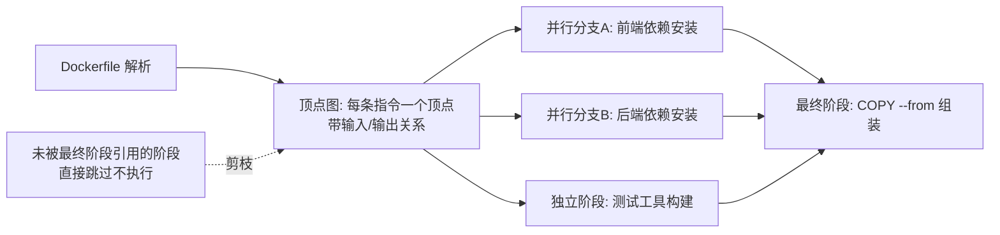
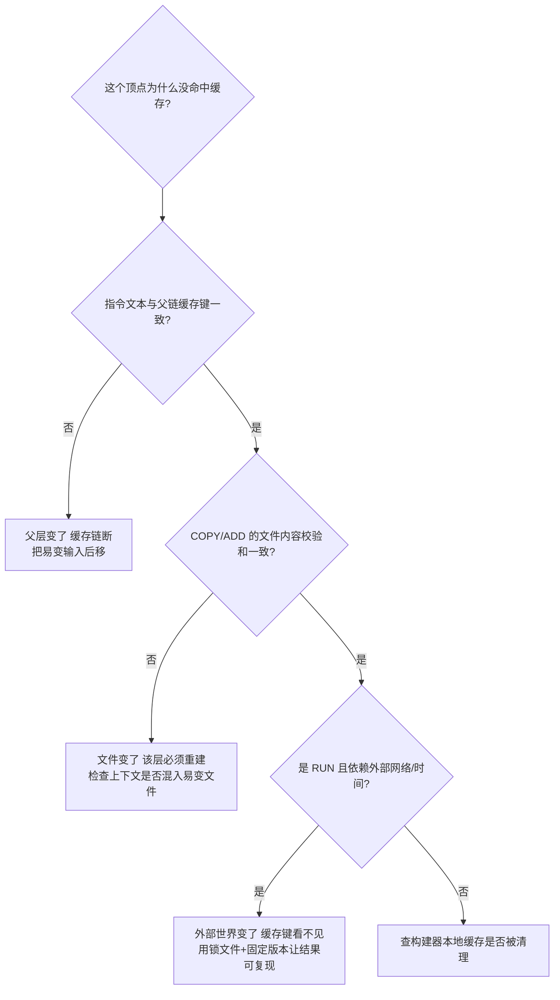
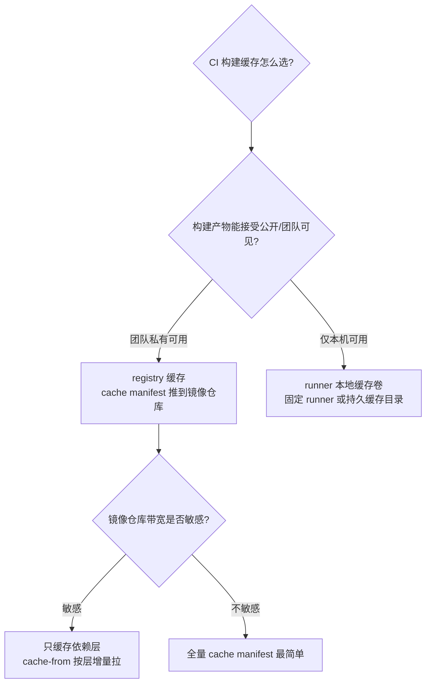

# 镜像分层与构建缓存：BuildKit 的缓存模型与瘦身方法论

> **一句话摘要 + 前置阅读**：构建慢与镜像胖的根源都在「层的内容怎么被判定与复用」——本文穿透 BuildKit 的 DAG 构建模型与缓存键判定机制，讲清 cache mount 为什么能让依赖目录「不进层」，并给出一套可落地的瘦身六步法。
> 前置：[Dockerfile 与构建](../../入门层/从零开始认识Docker系列/3_Dockerfile与构建-入门.md)（指令语义）、[镜像与分层](../../入门层/从零开始认识Docker系列/2_镜像与分层-入门.md)（分层存储）。

## 1. 目标导向：本文是什么、能得到什么

本文是构建优化机制篇：讲的是「缓存为什么命中/不命中」的判定原理与「每一 MB 镜像从哪来」的构成分析，而不是指令语法。功能上，读完你能对慢构建做机制级定位（是上下文大、层序错、还是缓存键断链），能按六步法把镜像瘦到位，能为 CI 选对跨机构建缓存方案。适用场景：构建超过 3 分钟、镜像超过 500MB、CI 构建缓存形同虚设的团队。不适用：还在用 `docker build` 且从未关注过构建耗时的项目——先读入门层。

## 2. 与入门层的边界

入门层讲了「指令的分层语义」与「变化频率排序」的经验法则；本文往下打穿两层：**缓存判定的精确规则**（为什么有时层序对了还是不命中）与**层内容的文件系统构成**（为什么清理必须同层）。边界表：

| 话题 | 入门层 | 本文 |
|---|---|---|
| 指令怎么写 | 逐条语义 | 只谈与缓存/体积相关的行为 |
| 缓存 | 经验法则 | 判定算法 + cache mount + 跨机缓存 |
| 瘦身 | 多阶段思想 | 六步法 + 每步的机制依据 |

**本文能让你讲清**：缓存键怎么算、cache mount 与层缓存的区别、瘦身每一步省的是什么。**不覆盖**：CI 平台的具体配置（归[CI/CD 系列](../../../cicd/index.md)）。

## 3. 核心机制一：BuildKit 的 DAG 构建模型

旧版构建器把 Dockerfile 当串行脚本逐条执行；BuildKit（Docker 23+ 默认）先把它编译成**顶点有向无图（DAG）**，再按依赖关系调度：



三个机制收益直接从 DAG 模型长出来：

1. **独立阶段并行执行**：多阶段构建里互不依赖的阶段（前端依赖、后端依赖、工具编译）并行跑，总耗时 ≈ 最长分支而不是所有阶段之和。
2. **未引用阶段直接剪枝**：最终阶段没 COPY 的中间产物根本不构建——「定义了但不用的阶段零成本」，这养成了「构建工具链全放中间阶段」的惯例。
3. **按顶点复用缓存**：缓存的粒度是顶点（层），命中的顶点整体跳过——这是所有缓存优化的执行基础。

**源码/关键路径视角**：BuildKit 由前端（解析 Dockerfile 生成 LLB 定义——一种中间表示）、调度器（执行顶点图）、worker（runc/容器内执行）、solver（缓存与内容寻址）组成；`buildctl`/`docker buildx` 都是这个管线的客户端。理解「Dockerfile → LLB → DAG → 顶点执行」这条链，就能解释「为什么同样 Dockerfile 换构建器行为不同」——它们编译出的顶点图不同。

## 4. 核心机制二：缓存键的判定与 cache mount



**缓存键的构成**（机制级）：一个顶点的缓存键 ≈ 指令文本 + 父顶点的缓存键 + 输入内容的校验和（COPY 是文件内容哈希、RUN 是指令串）。注意两点容易被误判：① 父链断则全断——第 3 层失效会让后面所有层失效，与后面内容变没变无关；② `RUN apt-get update` 这类「依赖外部世界」的指令，缓存键里没有外部世界的状态，**命中缓存反而可能是错的**（装到旧索引），业内惯例是配合固定版本与锁文件让「命中 = 正确」。

**cache mount：让依赖目录不进层**。传统写法 `RUN pip install -r req.txt` 把下载缓存、编译中间物全部烧进层里（同条清理也只救一部分）。BuildKit 的挂载缓存换了一个思路：

```dockerfile
RUN --mount=type=cache,target=/root/.cache/pip \
    pip install -r requirements.txt
```

缓存放进一个**跨构建持久的外部缓存卷**，构建结果层里只有安装后的最终文件——层瘦了、且下次构建下载缓存仍然热。适用一切「有本地缓存的包管理器」（pip/npm/maven/go mod/apt）。**与层缓存的分工**：层缓存管「跳过不执行」，cache mount 管「执行了但别把过程垃圾留在层里」——两者组合才是完整方案。

## 5. 跨机缓存的决策树

单机构建缓存天然存在；CI 每次都是新环境，缓存从哪来：



- **registry 缓存**（主流）：BuildKit 把缓存层打包成特殊 manifest 推到镜像仓库，下次构建 `--cache-from type=registry` 增量取回。优点：任何 runner 都能用；代价是仓库存储与拉取带宽。
- **本地缓存卷**：固定 runner（自建机器）挂持久缓存目录，最快但绑定基础设施。
- **GHA 的 actions/cache 思路**：把缓存目录打包上传下载——对 cache mount 目录有效，但对「层缓存」无效（层缓存的判定在 BuildKit 内部），两者别混为一谈。

## 6. 生态与演进

构建器三代演进：**旧 builder（串行、无并行、缓存弱）→ BuildKit（DAG、并行、cache mount，Docker 23 起默认）→ buildx（BuildKit 的扩展客户端，多架构 + 远程构建端）**。趋势三条：① 构建端与调用端分离（buildx 连远程 BuildKit 集群，本地笔记本发任务）；② 缓存逐步「内容寻址化」，registry 缓存让缓存成为可分发的资产；③ 与供应链整合（provenance 证明——BuildKit 自动生成构建来源证明 SLSA 生态可消费）。旧 builder 的行为差异（如层缓存粒度）不值得再学——新项目一律 BuildKit，老脚本迁移成本极低（改客户端即可）。

## 7. 业内惯例与反模式

**惯例（业内默认做法，官方文档不强调）**：

- **依赖清单先行**：`COPY package.json package-lock.json` → install → `COPY . .`——锁文件不在时 npm/yarn 会按范围解析，「同清单不同日装出不同树」，所以锁文件必须进镜像构建且被 COPY。
- **基础镜像双 pin**：版本标签 + digest（`node:22.11@sha256:...`），升级走流水线而非 rebuild 顺手拉新——「顺手升级」是构建不可复现的第一来源。
- **瘦身六步法**（按收益排序）：① 换最小基础镜像（alpine/distroless，数量级收益）② 多阶段隔离工具链（GB → 百 MB 级）③ cache mount 接管依赖缓存 ④ 同条 RUN 清理（包管理缓存）⑤ `.dockerignore` 瘦上下文（构建提速 + 防泄漏）⑥ `history` 逐层审计（最后兜底，抓漏网之鱼）。
- **构建耗时进监控**：CI 把构建时长当指标看——劣化在第一时间暴露，而不是等团队忍无可忍。

**反模式（每条都有真实代价）**：

- **`RUN apt-get update && apt-get install` 不带版本、不同条清理**：不可复现 + 缓存垃圾进层，双重负债。
- **用 ENV/ARG 传密钥**：层历史可见，构建缓存跨机构共享时密钥跟着走（安全篇的警告在缓存场景更严重）。
- **`COPY . .` 打底**：任何文件抖动全链失效，缓存形同虚设。
- **盲目 `builder prune`**：清理策略不分级，把热依赖层也清了，构建速度被「磁盘洁癖」拖垮。业内惯例是分层保留策略（基础层长留、应用层滚动）。

## 8. 一句话总结 + 5W 速记卡 + 自测三问

**一句话总结**：构建优化 = 理解缓存键判定（父链 + 指令 + 输入内容）+ 用对两层缓存（层缓存跳执行、cache mount 隔离过程垃圾）+ 瘦身六步法按收益顺序打。

**5W 速记卡**：

| 维度 | 内容 |
|---|---|
| What | BuildKit DAG 模型、缓存键判定、cache mount、跨机缓存、六步瘦身 |
| Why | 构建慢与镜像胖是机制问题，背指令解决不了 |
| When | 构建 >3 分钟、镜像 >500MB、CI 缓存失效时 |
| Where | Dockerfile 层序、构建器配置、CI 缓存策略 |
| How | DAG 定位慢点 → 缓存键断链分析 → cache mount → 六步法 |

**自测三问**：

1. 你当前最慢的一次构建，卡在哪个顶点？上下文多大、缓存键断在哪？
2. 依赖安装用的是层缓存还是 cache mount？层里有没有包管理器缓存？
3. CI 的构建缓存方案是哪种？换一台 runner 还能命中吗？

---

## 📌 数据与事实声明

本文版本锚点（截至 2026-09-09，gh CLI 实测）：Docker Engine v29.8.0、BuildKit v0.33.0。BuildKit 架构（LLB/顶点图/solver）、cache mount、registry cache 为官方文档与源码公开内容（github.com/moby/buildkit）；Docker 23 起 BuildKit 默认为官方发布说明；六步法与经验值为业内通用实践的教学归纳。具体行为以官方文档为准。

## 📚 参考资料

| 类型 | 标题 | 来源 |
|---|---|---|
| 文档 | BuildKit 官方文档（dockerfile 语法/缓存） | github.com/moby/buildkit |
| 文档 | buildx 构建缓存指南 | docs.docker.com/build/cache |
| 文章 | SLSA provenance（构建来源证明） | slsa.dev |
| 系列文章 | Dockerfile 与构建（入门层） | 本仓库 docs/devops/docker/入门层/ |
