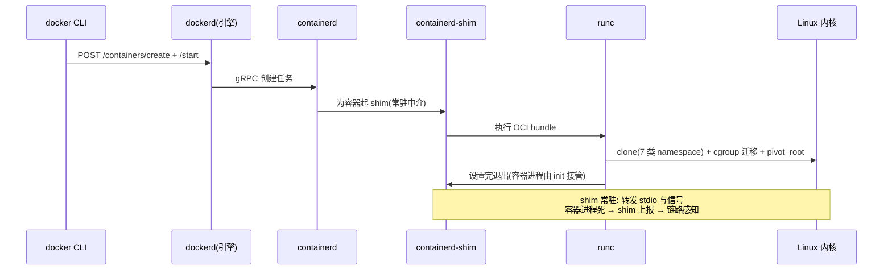
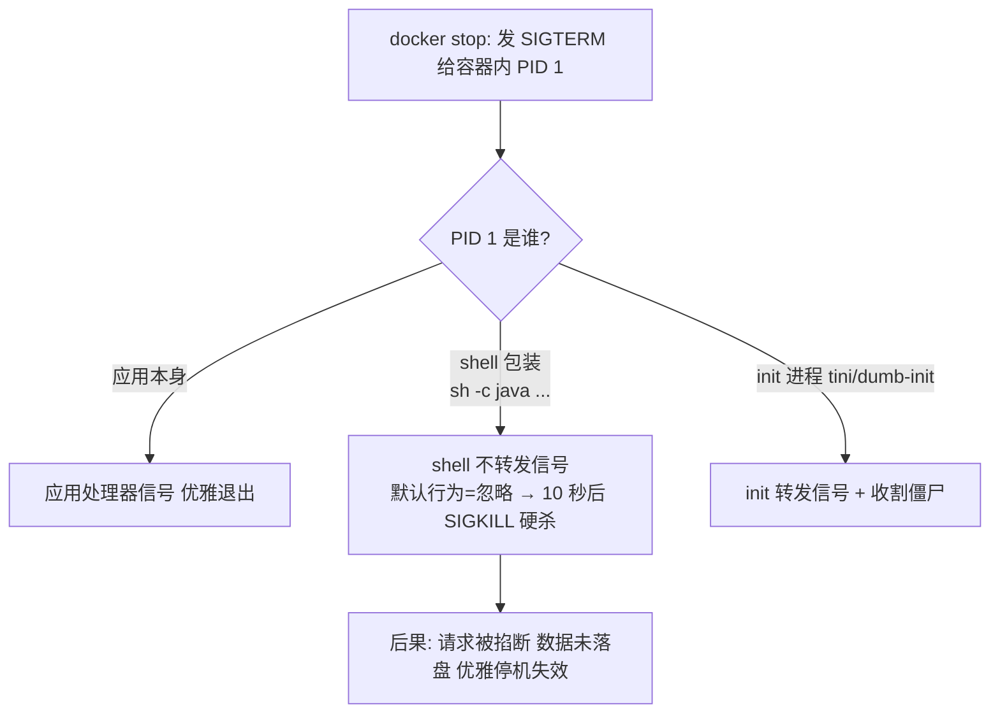
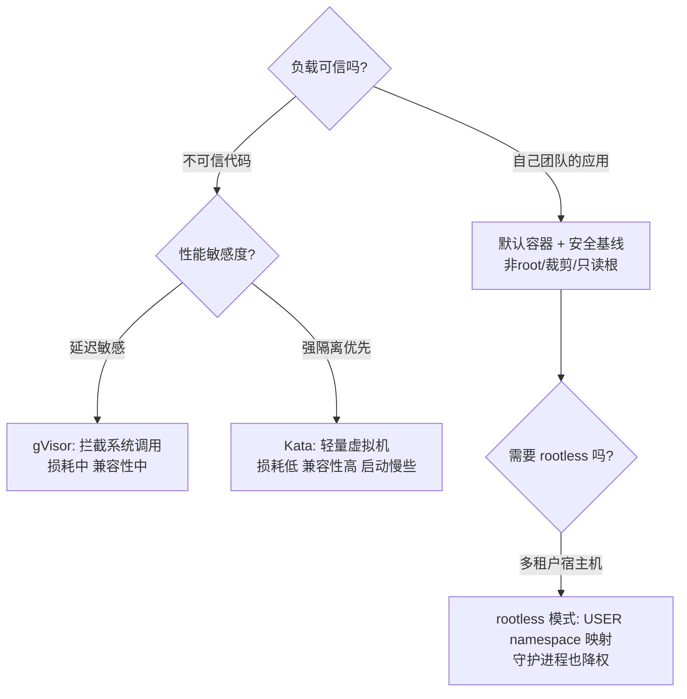

# 容器运行时与隔离机制：namespace、cgroups 与 PID 1 的关键路径

> **一句话摘要 + 前置阅读**：本文从一次 `docker run` 的调用链穿透到内核机制——runc 如何依次创建七类 namespace、cgroups 两版 API 的差异、PID 1 为什么要为信号负责——把「容器怪问题」（僵尸进程、信号收不到、OOM 定位不准）打到机制层解释。
> 前置：[容器是什么](../../入门层/从零开始认识Docker系列/1_容器是什么-从虚拟机到容器-入门.md)、[容器安全与资源限制](../../入门层/从零开始认识Docker系列/7_容器安全与资源限制-入门.md)。

## 1. 目标导向：本文是什么、能得到什么

本文是容器运行时的机制篇：讲「一个进程如何被造成容器」与「隔离的边界在哪」，而不是 Docker 命令。功能上，读完你能解释容器世界的三类经典怪象（PID 1 与信号、僵尸进程、OOM 后无日志），能读懂 `docker inspect` 里的安全与资源字段，能对「要不要安全容器」做出机制依据的判断。适用：容器在生产上跑、且出过「查不清原因」问题的团队。不适用：刚装 Docker 的读者——先走入门层。

## 2. 与入门层的边界

入门层建立了「容器 = 受限进程」的三件套概念（namespace/cgroups/联合文件系统）；本文做三件更深的事：**看调用链**（docker → containerd → runc 的关键路径）、**看内核参数**（每类 namespace 隔离什么、cgroups v1/v2 差异）、**看边界与失效**（OOM kill、信号传递、僵尸进程的机制成因）。边界表：

| 话题 | 入门层 | 本文 |
|---|---|---|
| 三件套 | 是什么 | 调用链与内核参数级 |
| 容器消失 | OOM 是头号嫌疑 | OOM kill 的内核判定路径与定位方法 |
| 多进程 | 反模式 | 为什么：PID 1 的机制责任 |

## 3. 核心机制一：一次 docker run 的调用链

关键路径上的三个设计点：

- **shim 常驻中介**：每个容器一个 shim 进程，负责 stdio 与信号的转发、退出状态上报。这样 dockerd/containerd 重启（升级、崩溃）**不影响运行中的容器**——这是 2016 年前后「重启 Docker 引擎容器全死」问题的机制解法，也是理解「容器生命周期属于 containerd 而不是 dockerd」的关键。
- **runc 是「一次性」的**：它按 OCI bundle（config.json + 根文件系统）创建容器，设置完 namespace、cgroups、挂载后退出，容器进程由 shim 收养。所以「runc 版本漏洞」的攻击面在**创建时刻**，运行时加固（seccomp 等）是另一层。
- **内核侧动作序列**（源码/关键路径）：`clone()` 带 `CLONE_NEW*` 标志位创建各 namespace → 写入目标 cgroup（限制生效）→ `pivot_root` 切换根文件系统到镜像层 → 加载 seccomp profile → `exec` 用户进程。容器在内核眼里就是「一组 flags + 一个 cgroup 目录 + 一个切换过根的进程」——没有任何神秘实体。

## 4. 核心机制二：namespace 的边界与 cgroups v1/v2

**七类 namespace 各管一摊**：PID（进程号视图）、NET（网络栈）、MNT（挂载点）、UTS（主机名）、IPC（进程间通信）、USER（用户映射——rootless 的基石）、CGROUP（cgroup 视图根）。隔离的**边界**值得背下来：共享的内核状态（内核全局变量、某些系统调用的全局影响、/proc 部分信息、时间）不在 namespace 隔离范围——`clock_gettime` 拿到的时间、内核日志时间戳都是全机一致的，「容器里改时间」改不了 namespace 化的时间（time namespace 只覆盖部分时钟），这是时区/时间类怪问题的根源。

**cgroups v1 与 v2**：v1 每类资源一个独立层级（CPU/memory/blkio 各自挂载），控制器松散、语义含糊；v2 统一单一层级、以进程为中心、增加压力失速信息（PSI）。机制差异的工程影响：

- 内存限制语义：v2 的 `memory.max` + `memory.high`（软限触发回收）比 v1 的 `memory.limit_in_bytes` 行为更可控；
- PSI（Pressure Stall Information）：v2 才有的「资源压力」指标，是比使用率更准确的饱和度信号——监控演进的内核基础；
- 发行版现状：主流发行版已默认 v2（统一层级挂 `/sys/fs/cgroup`），老内核/老工具链的 v1 假设脚本会失效。

**OOM kill 的判定路径**：内存超 `memory.max` → 内核触发 cgroup 级 OOM → 在该 cgroup 内选 victim（oom_score，默认倾向内存占用大者）→ SIGKILL，**用户态无感知、来不及打日志**。定位手段因此不是翻应用日志，而是：`docker inspect` 的 `State.OOMKilled`、内核日志（`dmesg | grep -i oom`）、cgroup 的 `memory.events` 计数器（v2），以及监控上 PSI/内存水位的先行告警。

## 5. PID 1 与信号：容器世界的经典怪象之源

三个机制事实串成一条线：

1. **内核对 PID 1 的特殊处理**：信号处理未注册时，普通进程的默认行为是执行默认动作（如终止），但 **PID 1 忽略未注册的信号**——这是内核对 init 进程的保护。后果：容器里 PID 1 是 shell 时，SIGTERM 被默默忽略，`docker stop` 等满超时后改发 SIGKILL 硬杀。
2. **PID 1 是孤儿进程的收养者**：子进程死后变僵尸，必须被父进程 `wait()` 收割；父进程先死则孤儿交给 PID 1 收养。应用作为 PID 1 若不收割，僵尸在容器里堆积——「容器进程数莫名涨满 pids-limit」的经典根因。
3. **解法是显式 init**：镜像里放一个极小的 init（tini 类，约 30KB），由它当 PID 1：转发信号给子进程 + 收割僵尸 + 退出时带回状态码。`docker run --init` 一键启用，是业内默认建议。

「一个容器一个进程」的语义根因也在这：容器的生命周期锚定在 PID 1 上，PID 1 退容器退——多进程管理是 init 系统的职责，塞进容器只会让信号树和责任边界混乱。

## 6. 对比与决策：隔离强度的选择

- **默认容器**：namespace/cgroups 级隔离，性能几乎无损，适合可信自研负载。
- **gVisor**（用户态内核）：拦截系统调用在用户态实现沙箱，兼容性有缺口（部分系统调用不支持），性能损耗中高——适合处理不可信文件/脚本的短任务。
- **Kata**（轻量虚机）：每个容器/ Pod 一个独立内核，隔离接近虚拟机、损耗低于 gVisor，代价是内存占用与启动速度。
- **rootless**：利用 USER namespace 把「容器内 root」映射为「宿主机普通用户」，连 Docker 守护进程本身都无特权——多租户宿主机的配置基线，代价是部分网络/存储特性受限。

## 7. 生态与演进

运行时栈的三层标准化：**OCI 运行时规范**（runc 是参考实现）→ **containerd**（从 Docker 剥离捐给 CNCF，生命周期与镜像管理）→ **K8s CRI**（K8s 1.24 起 dockershim 移除，直连 containerd）。把运行时栈放进整个系统架构看：runc 向下贴着内核、containerd 向上服务编排平台，上下游之间靠 OCI 与 CRI 两个标准接口解耦——正是这层架构解耦，让 2022 年 dockershim 移除这样的大变动以最小的代价平稳落地。演进方向三条：① 安全容器从「特殊方案」走向「敏感负载标配」，K8s 侧以 RuntimeClass 一等公民接入；② eBPF 改造可观测与网络数据面（不依赖 namespace 内部视角也能看容器行为）；③ systemd 与容器的和解——cgroup v2 统一层级让 systemd 成为宿主机唯一的 cgroup 管理者，容器 cgroup 委托给它的子树（「systemd 作为 cgroup 驱动」已是 K8s 推荐配置）。机制层（namespace/cgroups）十余年稳定，学一次用很久。

## 8. 业内惯例与反模式

**惯例（生产实践沉淀）**：

- **`--init` 全量开启**：tini 解决信号与僵尸两件事，成本近零——把它放进组织镜像模板。
- **`docker stop -t` 与应用优雅退出对齐**：默认 10 秒超时，应用若需更长清理时间（刷缓冲、连接排空），显式调大并让应用尽快响应 SIGTERM。
- **OOM 三件排查**：inspect 看 OOMKilled → dmesg 看内核记录 → 监控看内存水位曲线；补一条 cgroup memory.events 做长期计数。
- **时间敏感任务显式配时区与单调时钟语义**：不要假设容器内时间可自由设置。
- **僵尸排查**：容器内 `ps` 看状态为 Z 的进程，有 → 检查 PID 1 是否 init、父进程是否 wait。

**反模式**：

- **`sh -c` 包长命令当 PID 1**：信号黑洞 + 僵尸温床。要 shell 逻辑就用 exec 形式（`exec java ...`）让应用接管 PID 1，或上 init。
- **在容器里跑 systemd 管多服务**：PID 1 语义与生命周期锚定全被破坏，属于把虚拟机思维平移进容器。
- **把 OOM 归因为「内存不够加内存」**：不区分「limit 配小了」与「应用内存泄漏」——前者调 limit，后者修代码，加内存只是推迟爆炸。
- **在生产容器里装调试工具长期驻留**：与 distroless 思想相反；临时排障用 sidecar 或临时容器挂同文件系统。

## 9. 一句话总结 + 5W 速记卡 + 自测三问

**一句话总结**：容器运行时 = 「clone 出 namespace + 迁进 cgroup + 切根 + exec」的内核动作组合——PID 1 的信号与收尸责任、OOM 的内核判定路径、隔离的共享内核边界，解释了容器世界的绝大多数怪象。

**5W 速记卡**：

| 维度 | 内容 |
|---|---|
| What | docker→containerd→shim→runc 调用链、七类 namespace、cgroups v2、PID 1 机制 |
| Why | 容器怪问题（信号/僵尸/OOM/时间）全部是机制问题 |
| When | 容器查不清原因、设计镜像启动命令、选隔离方案时 |
| Where | 运行时配置、镜像 ENTRYPOINT、内核参数与监控 |
| How | 调用链定位 → 内核计数器取证 → 显式 init → 按可信度选隔离 |

**自测三问**：

1. 你生产镜像的 PID 1 是谁？收到 SIGTERM 后的完整退出链路走一遍给我看。
2. 最近一次容器消失，OOMKilled 字段是什么？内存水位曲线当时长什么样？
3. 你的宿主机 cgroups 是 v1 还是 v2？这个答案影响哪些脚本与监控？

---

## 📌 数据与事实声明

本文版本锚点（截至 2026-09-09）：Docker Engine v29.8.0、containerd/runc 跟随主线版本。调用链与内核动作序列依据 runc/containerd 官方文档与公开源码路径归纳；PID 1 信号语义（内核对 init 的特殊处理）为 Linux 内核公开行为；cgroups v2 与 PSI 为内核公开特性；K8s 1.24 移除 dockershim（2022）为公开事实。具体行为以内核文档与官方文档为准。

## 📚 参考资料

| 类型 | 标题 | 来源 |
|---|---|---|
| 文档 | Linux man pages: namespaces(7) / cgroups(7) / clone(2) | man7.org |
| 文档 | runc / containerd 官方文档 | github.com/opencontainers/runc · containerd.io |
| 文档 | Docker `--init` 与信号处理 | docs.docker.com |
| 工具 | tini（PID 1 init） | github.com/krallin/tini |
