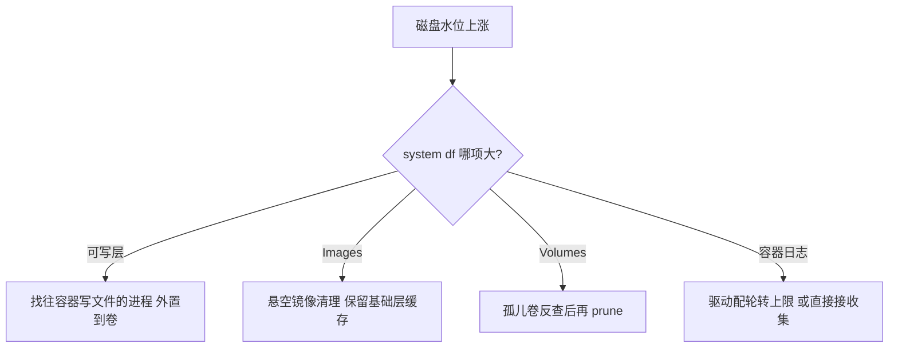
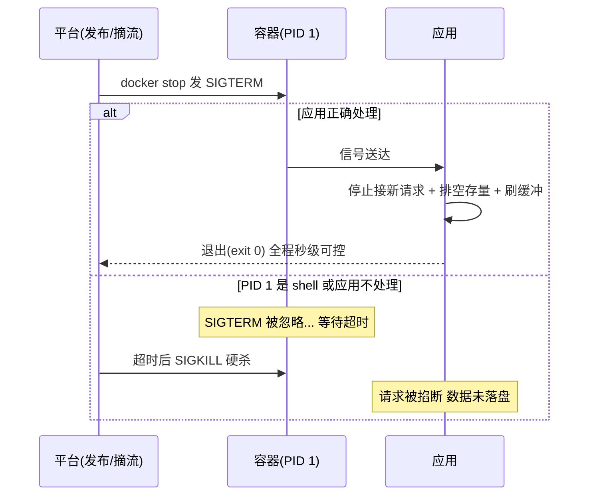

# 生产容器化踩坑与调优：从 OOM 到优雅停机的实战清单

> **一句话摘要 + 前置阅读**：容器上生产的坑高度集中且高度重复——OOM 后无日志、日志膨胀打满磁盘、优雅停机失效、镜像 tag 漂移、时钟与时区错乱——本文按「现象 → 机制根因 → 定位 → 修法」把高频踩坑整理成一张实战清单，并给出上线前的自检清单。
> 前置：[容器运行时与隔离机制](./2_容器运行时与隔离机制-深度.md)（PID 1/信号/OOM 的机制）、[容器安全与资源限制](../../入门层/从零开始认识Docker系列/7_容器安全与资源限制-入门.md)（limits 配置）。

## 1. 目标导向：本文是什么、能得到什么

本文是生产实战篇：不重新讲机制，把机制对准「真实故障形态」。功能上，读完你能按清单排查容器高频故障（每一坑都有定位命令），能在新服务上线前跑完一张自检表，能把「容器化改造常见的隐性成本」（日志、时钟、本地线程池）提前识别。每个坑的定位都落到具体命令与机制关键路径，可执行、可复核。适用：容器正在或即将承载生产流量的团队。不适用：纯本地开发场景。

## 2. 与入门层的边界

入门层与运行时篇给了机制与配置；本文给「故障现场的操作序列」。格式统一为：**现象（监控/用户看到什么）→ 根因（机制解释）→ 定位（具体命令）→ 修法（配置或代码）**。边界表：入门层讲「怎么配」，本文讲「配错了长什么样、怎么查」。

## 3. 资源类踩坑：OOM、CPU 抖动与磁盘膨胀

**坑 1：容器定期消失且应用无报错日志。** 现象：服务隔几天重启一次，应用日志干干净净。根因：cgroups OOM kill 在内核态直接 SIGKILL，用户态来不及输出。定位三步：`docker inspect` 看容器的 `State.OOMKilled` 与 `State.ExitCode` 字段（exit 137 = SIGKILL，OOMKilled=true）→ `dmesg -T | grep -i 'oom\|killed process'` 看内核记录 → 监控回看内存水位曲线与 limit 的距离。修法：压测峰值 ×1.3-1.5 定 limit（行业经验值）；Java 类应用同时核对 `-Xmx` 与容器 limit 的对齐关系；配内存水位告警（80% 预警）把 OOM 从「事后发现」变「事前预警」。

**坑 2：多容器共存时服务周期性抖动。** 现象：没有单点故障，但整机上的服务 RT 锯齿状波动。根因：无 `--cpus` 限制时，批处理/定时任务容器周期性吃满 CPU，邻居被调度挤压。定位：宿主机 `top` 看哪个容器进程在峰值时段吃满；`docker stats` 观察。修法：全量容器设 CPU 上限与份额；重任务错峰调度；监控补 PSI（cgroups v2 的压力指标）而不是只看使用率。

**坑 3：宿主机磁盘悄悄打满。** 现象：磁盘水位缓慢单调上涨。根因三选一：容器日志（json-file 驱动无上限）、孤儿镜像与卷堆积、应用往容器可写层写大文件。定位：`docker system df` 分项看占用 → `du -sh /var/lib/docker/containers/*/` 找日志大户 → 卷与镜像分别 prune 评估。修法：日志驱动配上限（`max-size`/`max-file`，或直接接收集——见坑 5）、定时清理策略分级（保基础层缓存）、大文件外置到卷/对象存储。磁盘上涨的排查链：

## 4. 生命周期类踩坑：优雅停机、tag 漂移与健康检查

**坑 4：每次发布都有一波 5xx。** 现象：滚动重启瞬间出现少量超时/连接拒绝。根因组合拳：应用不处理 SIGTERM（或 PID 1 是 shell 不转发——机制见运行时篇）+ 平台超时后 SIGKILL 硬杀；或「先摘流量后等就绪」的顺序不对。修法四件套：`--init` 或 exec 形式保证信号可达 → 应用实现优雅退出（停接新请求、排空存量、限时完成）→ `stop_grace_period`/`-t` 与应用清理时长对齐 → 就绪探针确认后再摘流量。四件套是「发布无感」的最低配置。

**坑 5：日志双写与采集缺失。** 现象：要么日志在宿主机文件里没人收，要么应用自己写文件 + 容器又输出 stdout 造成双份。根因：把虚拟机习惯（写本地日志文件）平移进容器。业内惯例：**应用只写 stdout/stderr**，日志收集由宿主机/平台的日志驱动统一接管（Docker 的 json-file/syslog/fluentd 驱动族），文件日志只留给必须审计落盘的场景并配轮转。修法：应用日志配置改 stdout + 驱动层配 max-size + 收集端统一。

**坑 6：「我明明部署了 1.4.2，线上跑的还是旧代码」。** 现象：发布后行为没变，回看镜像却是旧的。根因：引用 `image:latest` 或可变 tag，拉取策略又是「本地有就不拉」。定位：`docker inspect` 看 `Image` 的 digest 与仓库比对。修法：部署清单用不可变引用（版本 + digest），CI 产出的 tag 带 git 短哈希；「latest 只属于开发机」写进团队规范。

## 5. 环境类踩坑：时钟时区、本地线程池与宿主机假设

**坑 7：日志时间差 8 小时 / 定时任务不触发。** 根因：容器默认 UTC（无时区配置），且 namespace 不隔离可自由设置的时间（机制见运行时篇）。修法：统一约定「容器内 UTC、展示层转时区」或在镜像里配 TZ 环境变量与时区包；定时任务的触发时间按容器时区核对一遍。

**坑 8：容器里线程池/连接池按物理机参数配。** 现象：容器限 1 核但应用按 16 核开线程池，上下文切换与锁竞争把 RT 打高。根因：老版本 JVM/运行时不感知 cgroups 限额，或应用配置不随容器伸缩。修法：运行时升级到感知 cgroups 的版本（现代 JVM 已默认感知），线程池/连接池按容器配额显式配置——**应用参数与 cgroups limit 联动**是容器调优的核心动作。

**坑 9：应用假设「宿主机环境可持续访问」。** 典型：写死宿主机 IP、依赖宿主机上的本地文件、假设 `hostname` 稳定。容器的世界只有三种稳定引用：服务名（DNS）、挂载的卷、注入的环境变量。修法：配置审计一遍，把一切「主机假设」替换为这三类。

## 6. 上线前自检清单（可直接抄）

| 检查项 | 通过标准 |
|---|---|
| 资源限制 | memory/cpus/pids-limit 三项都有且经压测校准 |
| OOM 预案 | 内存水位告警在位；OOMKilled 有监控口径 |
| 优雅停机 | SIGTERM 可达（--init/exec）、清理限时、stop 超时对齐 |
| 健康检查 | liveness/readiness 分开，探针指向真实依赖状态 |
| 日志 | stdout 化 + 驱动轮转上限 + 收集链路验证 |
| 镜像引用 | 版本 + digest，CI 产出带 git 短哈希 |
| 安全基线 | 非 root、cap-drop、只读根（或白名单说明） |
| 时钟时区 | TZ 策略明确，定时任务按容器时区核对 |
| 数据持久化 | 有状态数据全部在卷，备份与恢复演练有记录 |
| 配置外置 | 无写死 IP/路径；密钥走注入不进镜像 |

## 7. 调优的量级视角：什么时候该动什么

按「问题出现的量级」排优先级，避免过度调优。踩坑清单本身也随生态演进——旧坑（如 dockershim 兼容）随平台演进消失，新坑随新组件出现，清单要滚动维护：

- **单机几个容器**：把资源限制、优雅停机、日志轮转做对——这三件覆盖九成故障。
- **几十个容器**：加入统一监控口径（OOMKilled、重启次数、内存水位）、镜像清理策略、发布流程标准化（不可变引用）。
- **上百容器/多宿主机**：单机 Docker 已到边界。从系统架构的上下游看，调度、自愈与多机资源池是平台层架构的职责，容器密度问题指向 K8s（迁移判断见[K8s 生态系列](../../../kubernetes/入门层/从零开始认识K8s生态系列/0_系列导读-全景.md)）——迁移时机的判断是一次权衡：继续单机打补丁的稳定性代价 vs 迁移平台的学习与改造成本，两边代价都要算实再取舍，把调优精力投给「该不该换平台」这个更高杠杆的决策。

## 8. 业内惯例与反模式

**惯例**：变更窗口与容器重建解耦（任何容器都可随时重建是容器化的健康标志）；「故障 → 沉淀自检清单项」的滚动机制——本文清单的用法就是当团队 baseline 持续追加；排障容器（netshoot 一类工具镜像）常备，临时加入目标网络排查。

**反模式**：把容器当「可登录的小服务器」长期维护（里面改出来的状态不可复现，正确修法是改镜像/配置再重建）；故障复盘止于「重启解决」（下一台机器会原样复现）；调优只盯应用层不看 cgroups 与运行时参数（两者不对齐，应用层优化全部白做）。

## 9. 一句话总结 + 5W 速记卡 + 自测三问

**一句话总结**：生产容器化的坑高度可枚举——资源（OOM/CPU/磁盘）、生命周期（优雅停机/tag）、环境（时钟/线程池/主机假设）三类九坑，每个都有「现象-机制-定位-修法」的标准解，上线前过一遍自检清单。

**5W 速记卡**：

| 维度 | 内容 |
|---|---|
| What | 九大高频坑 + 定位命令 + 上线自检清单 |
| Why | 容器故障形态高度重复，清单化比个人经验可靠 |
| When | 新服务上线前、故障复盘后、容器化改造评审时 |
| Where | 运行参数、镜像定义、发布流程、监控口径 |
| How | 现象对号入座 → 机制定位 → 标准修法 → 清单沉淀 |

**自测三问**：

1. 你的服务上一次重启，exit code 是多少？是优雅退出还是被硬杀？
2. 自检清单十项里，你现在能立刻确认通过的有几项？
3. 团队最近一次容器故障，复盘产出了新的清单项吗？

---

## 📌 数据与事实声明

本文版本锚点（截至 2026-09-09）：Docker Engine v29.8.0。OOMKilled/exit 137、日志驱动参数、`--init`、探针语义为 Docker 官方文档内容；「峰值 ×1.3-1.5 定 limit」「UTC 约定」为行业经验值；坑类形态为公开运维实践的一般化归纳，不指向具体公司。具体行为以官方文档与自身环境实测为准。

## 📚 参考资料

| 类型 | 标题 | 来源 |
|---|---|---|
| 文档 | Docker 运行时/日志/资源限制官方文档 | docs.docker.com |
| 系列文章 | 容器运行时与隔离机制（深度篇） | 本仓库 docs/devops/docker/特性层/ |
| 图书 | Site Reliability Engineering（故障与演练方法论） | sre.google |
| 系列文章 | 稳定性工程（监控告警联动） | 本仓库 docs/architecture/service-governance/stability/ |
