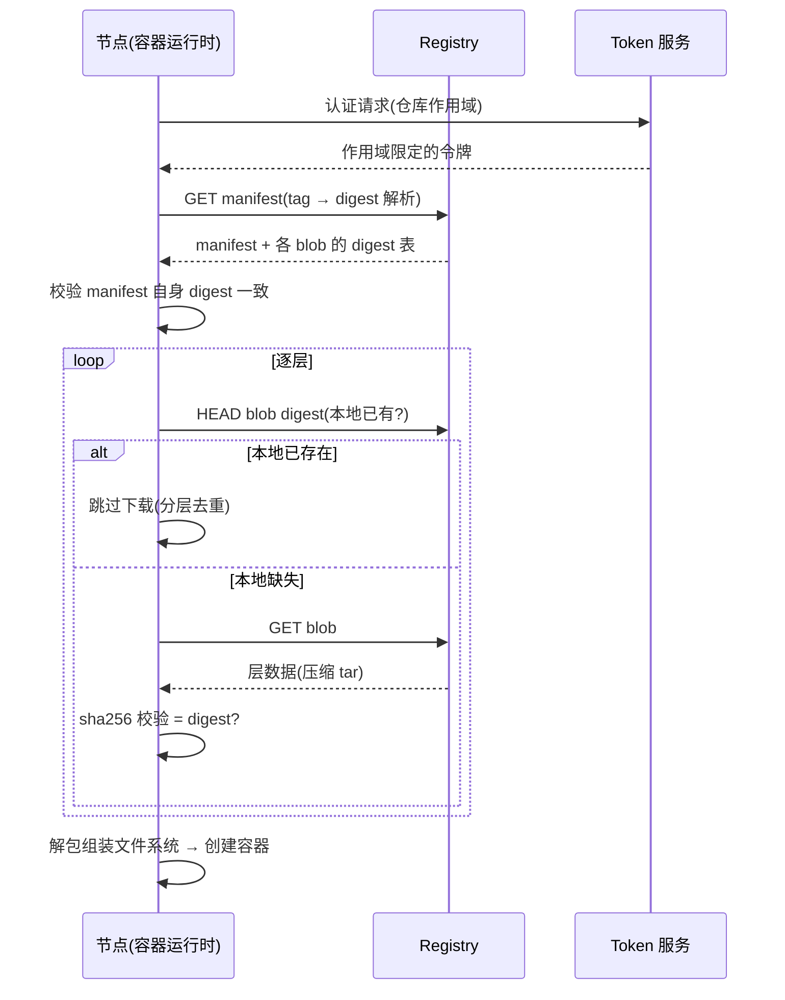
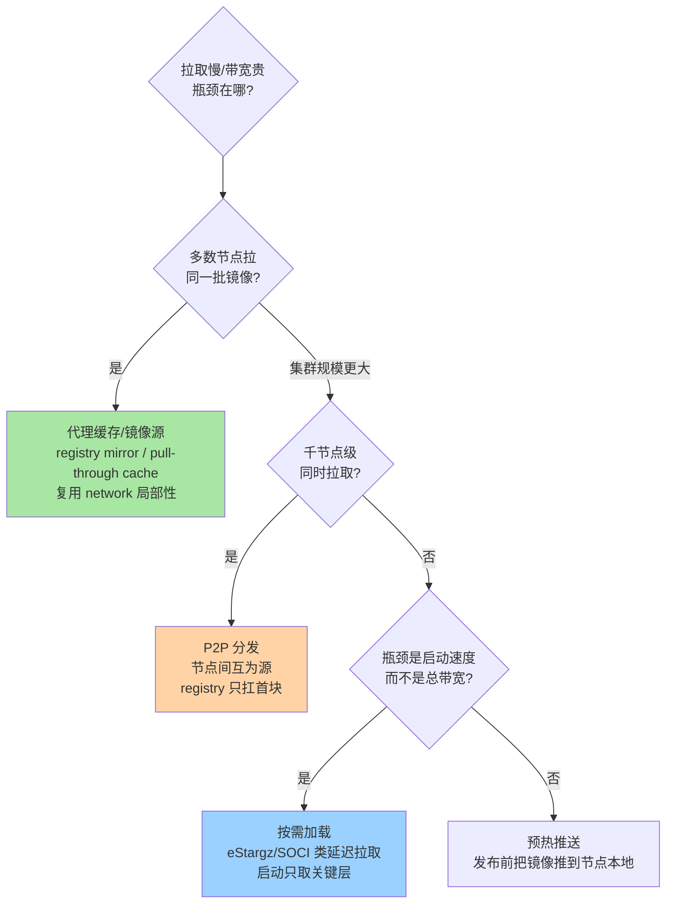
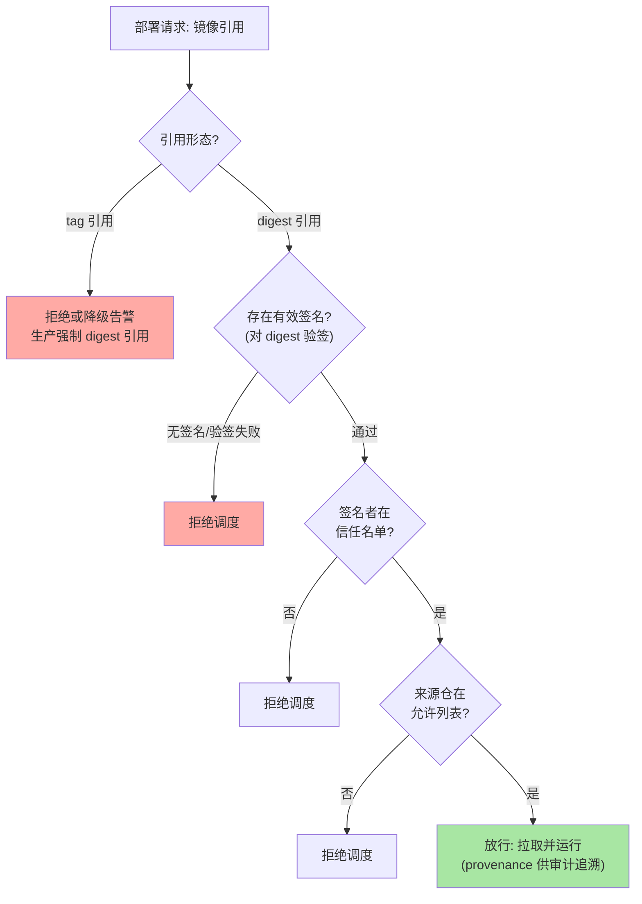

# Registry 与镜像分发：manifest/blob 协议、拉取加速与签名准入

> 一句话摘要：registry 的本质是「**内容寻址的对象存储 + 一层元数据索引**」——镜像不是一个大文件，而是一份 manifest（清单，记录 config 与各层的 digest 引用）加一批 blob（层与配置的压缩包，按 sha256 寻址）。拉取加速、分层去重、签名准入全部建立在这个结构上：加速是在「元数据—数据」分离上做分发拓扑优化，签名是把「对 digest 的信任」从网络路径上解耦出来交给密码学。

## 🎯 本文核心

**核心机制一句话**：镜像分发 = manifest（控制面）+ blob（数据面）的分离架构——tag 是指向 manifest 的可变指针，manifest 引用一批按 sha256 内容寻址的 blob；一切工程问题（去重、加速、签名、准入）都在这两个面上发生。

**机制链**：pull 时先取 manifest（校验签名/引用关系）→ 按 manifest 里的 digest 逐层取 blob（本地已有则跳过）→ 解包组装文件系统；push 时先传 blob（存在性检查跳过已有）→ 最后原子地 PUT manifest。四个坐标：registry 协议（manifest/blob 结构与 pull/push 流程）、拉取加速（镜像源、P2P、按需加载）、镜像签名与准入（cosign 类签名 + 调度侧验签）、私有 registry 选型（最小实现 vs 企业级平台）。

从架构上下游看：registry 是「CI 构建产物」与「运行时调度」之间的分发枢纽——上游是流水线推送，下游是成百上千节点的拉取，模块边界即「registry 保证内容可寻址与可验证，不保证快速与可信——快速靠分发拓扑，可信靠签名体系」。

## 一句话摘要

理解 registry 只需要抓住三个设计决定：**① 内容寻址**（digest = sha256(内容)，内容变则 digest 变，同名 tag 可以被覆盖但 digest 不可变）；**② 控制面与数据面分离**（manifest 几 KB 决定「是什么」，blob 数百 MB 决定「拿什么」，两者可分开缓存与加速）；**③ 层即复用单元**（相同 digest 的层跨镜像、跨节点天然去重）。拉取加速的三大手段——镜像源/代理缓存（复用 network 局部性）、P2P 分发（复用节点间带宽）、按需加载（复用时间局部性）——分别是这三个决定的工程化延伸；签名与准入则是对「tag 可变」这一软肋的密码学补丁。这就是镜像体系全部机制的主干。

## 一、边界：入门层讲过什么，本文讲什么

| 内容 | 入门层/本系列 | 本文 |
|---|---|---|
| 镜像分层与构建缓存 | ✅ 讲过（构建系列） | 只谈分发侧，不重复构建侧 |
| registry 协议与 manifest/blob 结构 | 未讲 | **本文核心一** |
| 拉取加速三手段（镜像源/P2P/按需） | 未讲 | **本文核心二** |
| 签名与调度准入 | 未讲 | **本文核心三** |
| 私有 registry 选型 | 未讲 | **本文核心四** |

## 二、registry 协议：manifest/blob 的结构解剖

registry API（Docker Registry v2 / OCI Distribution 规范，公开口径）的对象模型：

```text
镜像引用的解析链:
  nginx:1.27  (tag, 可变指针)
   └─→ manifest (清单, digest 定位, 自身也是 blob)
        ├─ config blob     (镜像配置: 环境变量/入口/层序)
        ├─ layer blob 1    (基础层, sha256 寻址, tar+gzip)
        ├─ layer blob 2
        └─ layer blob N
  多架构镜像: manifest list / OCI index
   └─→ 按平台(cpu 架构/OS)再指向具体 manifest
```

pull 的关键路径：

```text
1. 鉴权: token 服务换取作用域限定的令牌
2. GET manifest (带 Accept: 各 manifest 媒体类型)
   → 本地校验 manifest digest 与内容一致性
3. 逐层 GET/HEAD blob:
   HEAD /v2/<name>/blobs/<digest> → 已存在则跳过(分层去重)
   GET  → 下载 → 校验 sha256 与 digest 一致(内容寻址的自我验证)
4. 解包组装文件系统(互指运行时系列)
```

push 是反向流程且有一个精妙的次序设计：**blob 先传、manifest 最后原子 PUT**——manifest 是唯一「让镜像可见」的引用点，它不落地镜像就不存在，这保证了不会出现「引用存在但数据不全」的半成品镜像。这个次序是 registry 协议里最值得学的设计：**可见性由一个原子的元数据操作决定**。

pull 的完整交互时序（含去重与校验点）：



两个校验点在图上清晰可见：manifest 取回后先自校验 digest，每个 blob 落地后再校验 sha256——**完整性检查内建于协议本身**，而不是外挂流程。

**反直觉的机制细节**：`HEAD` 检查与 sha256 校验让「网络传输出错」与「内容被篡改」都表现为 digest 不匹配——内容寻址天然自带完整性校验。理解了这一点，`digest 不匹配` 类报错的排查方向就从「网络问题」细化为「中间层改写了内容」（透明代理、镜像源同步缺陷是常见根因）。

## 三、拉取加速：三种手段的机制与分界



三种手段的机制本质各不相同，分界才清晰：

- **代理缓存/镜像源**：一层共享缓存把「全集群对上游的带宽」收敛为「缓存未命中部分的带宽」。机制上就是 pull-through：节点请求镜像源，命中直接回，未命中回源并缓存。配置成本最低，几乎所有规模的第一步。注意上游限流是这条路线的外部约束（公开口径：公共源对匿名拉取有限流），也是自建代理仓的直接动因。
- **P2P 分发**：把 blob 切片后在节点间互传，registry 只需要服务「每片的首个下载者」。机制收益在「同一镜像被海量节点同时拉取」的扇出场景——百节点同时拉一个 500MB 镜像，中心化模式 registry 出口带宽成为硬瓶颈；P2P 把瓶颈转为节点间东西向流量（业内认知量级：大规模发布场景的常用解）。代价是多一套调度与一致性组件的运维。
- **按需加载**：改写层格式（如 eStargz/SOCI），让容器启动只拉「启动必需的文件块」，其余在后台或首次访问时再取。机制取舍是**启动延迟换运行时抖动**——启动确实快了，但首次访问冷文件的延迟会上浮，对延迟敏感业务要先测。

业内惯例的组合拳：**代理缓存打底（人人配），大规模发布叠加 P2P，冷启动敏感场景叠加按需加载或预热**——三者的选择变量是「集群规模 × 发布频率 × 启动敏感度」。

## 四、镜像签名与准入：把信任从网络移到密码学

「tag 可变 + 仓库可写」意味着：拉到一个镜像 ≠ 拉到「我们构建的那个」镜像。签名体系补的就是这个信任缺口：

```text
签名链:
 CI 构建完成 → digest 固定 → 对 digest 签名(私钥/KMS 托管)
   → 签名与 SBOM/来源证明作为附加对象存入 registry(tag 约定挂原镜像)

验证链:
 调度准入(策略引擎/准入控制) → 请求拉取时校验:
   ① 镜像 digest 必须带有效签名(验签通过)
   ② 签名者必须在信任名单
   ③ 来源仓必须在允许列表
   → 任一不满足: 拒绝调度(不是警告)
```

信任链的判定流程（准入侧视角）：




机制要点三条：

1. **签名签的是 digest，不是 tag**——tag 可被覆盖，digest 不可变；验签对象选 digest，签名才有意义。这也直接推出部署纪律：**生产部署按 digest 引用镜像**（互指本系列构建篇的「双 pin」惯例）。
2. **准入必须是拒绝式的**：只告警不拦截的准入策略等于没有策略——镜像体系里的信任链，强度取决于最弱的一道检查。
3. **provenance 把链路闭合**：来源证明（构建流水线、参数、源码版本的可验证陈述）让「这个镜像确实由我们的可信流水线产出」从流程承诺变成可校验事实（SLSA 类分级框架，公开口径；与流水线安全篇的供应链锚点互指）。

## 五、源码/关键路径：一个 digest 在系统里的生命周期

```text
构建端:
  逐层打 tar+gzip → 计算每层 sha256 → 组装 manifest(config+layers 的 digest 表)
  → manifest 自身算 digest → tag 指向该 manifest → push(blob 先, manifest 后)

registry 端:
  blob 按 digest 分目录存储(内容寻址, 天然去重)
  manifest 单独索引 → tag 是 manifest digest 的映射记录
  删除 tag ≠ 删除 blob(blob 等待 GC 按引用计数清理)

运行端:
  pull by tag → 解析出 manifest digest → 校验签名 → 按 digest 逐层取
  运行时容器只认 digest 口径的内容, tag 在拉取完成后即无关
```

生命周期视角给出两个排障入口：**GC 与复制的竞态**（registry 端）——清理任务删除「未被 manifest 引用」的 blob 时，如果并发上传正在引用同一层（多镜像共享基础层），引用计数判断失误会导致「镜像 manifest 完好、blob 拉取 404」；**tag 漂移**（运行端）——同 tag 不同时间拉到不同内容，digest 对不上是唯一可靠的判据。业内惯例：registry 的 GC 只在只读窗口执行、复制任务与清理任务错峰，这两条是运营私有 registry 的保命配置。

## 六、什么时候用与不用：明确推荐

| 场景 | 推荐 | 理由 |
|---|---|---|
| 单集群、中等规模 | **企业级私有 registry 平台** | 缓存/扫描/复制/RBAC 一体 |
| 只需要存储与拉取 | 最小实现（官方 distribution 类） | 组件少、故障面小 |
| 公共镜像拉取 | 代理缓存/镜像源打底 | 收敛上游依赖与限流风险 |
| 千节点级大规模发布 | 叠加 P2P 分发 | 中心带宽不可行 |
| 生产部署 | **强制 digest 引用 + 签名准入** | 信任链的最后一道锁 |
| 团队无运维余量 | 云托管 registry | 换可用性责任为费用 |

明确推荐：**「代理缓存打底 + digest 部署 + 签名准入」是默认基线，P2P 与按需加载按规模与延迟敏感度叠加**——跳过基线直接上高级组件是本末倒置。

## 七、质疑者追问链

**追问一层：digest 部署既然不可变，为什么 tag 还存在且被大量使用？**——tag 的价值是**人机交互层的语义命名**（版本、变体、latest），它是面向「选择」的；digest 是面向「执行」的。惯例不是废掉 tag，而是分工：发布流水线用 tag 组织版本，调度清单落成 digest——「选的时候用 tag，跑的时候认 digest」。

**再追问：P2P 分发把传输交给节点互传，怎么保证节点拿到的还是原镜像？**——机制上 P2P 层只优化「字节从哪来」，完整性仍由 digest 校验兜底：每个分片按内容校验、最终镜像整体 digest 校验，任何篡改在组装时暴露。打破砂锅的推论：**内容寻址是分发系统的信任锚，任何加速手段都不能绕过它**——这也是 OCI 规范坚持 digest 语义的原因。

**打破砂锅：为什么不选「把镜像打成一个 tar 全量分发」绕开 registry 协议？**——反方案分析：全量打包在单机导入场景确实简单（离线环境的合理做法），但放弃了分层去重（同一基础层在集群里传 N 遍）、增量更新（改一行代码拉全量）、以及 manifest 层的签名与元数据生态。打破砂锅问到底：registry 协议的本质贡献不是「能传镜像」，而是「把镜像变成可寻址、可增量、可验证的对象体系」——绕开它等于回到文件分发的黑暗时代。

## 八、典型场景与事故复盘

**事故一：GC 误删在用 blob，节点拉取 404。**某私有 registry 磁盘水位告警后执行清理，随后发布高峰多个节点报 blob 404，镜像 manifest 正常但层文件缺失。排查路径：404 的 digest 恰是多个镜像共享的基础层——清理任务按「manifest 引用」判断存活，而复制作业正在把一批镜像同步进来，同步中的层尚未被目标端 manifest 引用即被清理窗口扫走。应急：从上游重新推送受影响镜像恢复发布。复盘：GC 固定在只读维护窗口执行、复制与清理严格错峰、清理前导出「将删 digest 清单」人工抽检。复盘结论：**registry 是有状态系统，清理策略的引用语义要按「分布式并发」而不是「单机文件删除」来设计。**

**事故二：同 tag 不同内容，两环境构建漂移。**某团队的基础镜像 tag 被上游覆盖（同名 patch 更新），测试环境与生产环境在不同时间拉取，行为出现微妙差异，排查两天定位到「同 tag 不同 digest」。复盘动作：部署清单全部改为 digest 引用；CI 产物以 digest 向下游传递（tag 只做人类可读的别名记录）；上游基础镜像升级走显式流水线而非顺手拉新。生产环境的教训一句话：**tag 是可变的，一切跨时间、跨环境的一致性承诺都必须锚在 digest 上。**

## 九、Trade-off 与代价分析

**自建 registry vs 云托管**：自建换来完全的数据主权与定制空间（缓存策略、复制拓扑、与内部系统集成），代价是可用性、容量与 GC 这些「有状态系统运营课」全要自己修；托管换费用与省心，代价是出网路径、配额与锁定风险。业内惯例的判断句式与流水线选型同构：**镜像资产的敏感度定自建与否，团队运维余量定托管深度**。

**P2P 的复杂度 vs 中心化带宽**：P2P 组件自身要运维（调度、一致性、版本升级），小集群上这笔固定成本远超省下的带宽——它的合理起点在「中心带宽确实成为发布瓶颈」之后，而不是「听说快就上」。

**按需加载的启动收益 vs 运行时抖动**：冷文件首访延迟上浮是按需化的直接代价，对长驻服务影响小、对延迟敏感的短任务可能不划算——先按访问画像评估，别把启动指标优化成运行指标。

## 十、不同量级的思考：架构约束驱动解法

- **十万级（节点十台档、日构建几十次）**：约束来源是运维人力——没人想多养一个组件。这一档的核心问题是**上游依赖稳定与基本缓存**，而不是分发架构；思考方式是代理驱动：一个 pull-through 缓存 + digest 部署纪律，问题基本消失。
- **百万级（节点百台档、日发布数百次）**：约束来源是发布窗口的带宽峰值与跨机房复制。这一档的核心问题是**缓存的命中率与复制拓扑**，而不是单节点速度；思考方式是拓扑驱动：多机房缓存分层、热门镜像预热、清理与复制错峰制度化。
- **千万级（节点千台档、全公司共享 registry）**：约束来源是扇出风暴——任何一次全员升级都是 DDoS 自己的 registry。这一档的核心问题是**分发架构本身**，而不是调参；思考方式是架构驱动：P2P 承接扇出、registry 按业务域分片隔离爆炸半径、签名与准入成为调度强制项。

## 十一、业内惯例

- **生产按 digest 部署**：tag 只做版本组织，跨环境一致性一律锚 digest——这是镜像体系第一条纪律。
- **基础镜像双 pin**：版本 tag + digest 双重固定，升级走显式流水线（互指构建系列）。
- **代理缓存是标配**：无论是否自建 registry，上游拉取都收敛到缓存层——同时解决限流、带宽与可用性三类问题。
- **GC 只在只读窗口、与复制错峰**：有状态 registry 的运营保命配置，写进运维手册而不是口头传承。
- **签名与准入从「建议」走向「强制」**：供应链监管趋严背景下（公开口径），调度侧验签正成为规模化组织的默认门禁。
- **版本锚点**：本文以 OCI Distribution Spec 与主流 registry 实现的当前主线为口径（公开口径）；按需加载类技术（eStargz/SOCI 等）仍在演进，行为以各项目官方文档为准。

## 十二、常见误区

- **「registry 就是个文件服务器」**：它是内容寻址对象体系 + 引用语义（tag/manifest/blob），清理、复制、加速的机制差异全从这里长出来——当文件服务器管会出 GC 类事故。
- **「镜像源配了就一劳永逸」**：镜像源是缓存，同步缺陷与上游覆盖都会造成「缓存与真源不一致」——一致性判据只有 digest。
- **「签名了就安全了」**：签名只是信任链一环，验签侧的准入策略不强制、信任名单不维护，签名就是摆设。
- **「latest 是个正常的部署引用」**：latest 的时间语义不可控（指向随时变），任何跨时间一致的场景都不该用它——它只适合本地开发。

## 十三、你们可能会问

**Q1：多架构镜像拉取时怎么选到对的 manifest？**
客户端在 Accept 头里声明支持的媒体类型与平台信息，registry 的 index/manifest list 按平台（架构/OS/变体）返回对应 manifest——解析逻辑在客户端，registry 只提供索引。跨架构集群排障时，「拉到的 digest 与预期不同」先查平台匹配。

**Q2：怎么估算我们集群的拉取带宽、决定要不要上 P2P？**
按「单镜像体积 × 并发拉取节点数 ÷ 发布窗口时长」估算峰值需求，对上 registry 出口带宽；业内认知的经验线：峰值需求逼近带宽的量级、或发布窗口因拉取被拉长时，P2P 进入考虑范围——先量化再选型。

**Q3：镜像已经被调度运行的实例，tag 被覆盖会影响它吗？**
不影响。运行时容器持有的是本地已解包的层内容，tag 只在拉取解析时起作用——这也是「tag 漂移」事故的表现总是「新拉取行为不一致」而不是「存量实例出问题」的原因。

## 十四、自测三问

1. manifest/blob 的结构与「push 时 manifest 最后落地」的次序设计各解决什么问题？
2. 拉取加速三手段的机制分界（复用什么局部性）与选择变量是什么？
3. 为什么签名必须签 digest？为什么准入必须是拒绝式？

## 开放问题

- 按需加载类技术正在模糊「分发」与「运行时」的边界：拉取决策从调度前移到首次文件访问，分发体系与容器运行时的耦合会加深。
- 供应链监管把「来源可证明」推向硬要求，registry 可能从「存储组件」演化为「信任基础设施」（签名、来源证明、合规标签的原生承载），形态值得持续观察。

## 💡 实战提示

- 💡 排查分发类问题先对 digest：404 是「引用与存储的竞态」（查 GC/复制），不匹配是「中间层改写内容」（查代理/镜像源）——digest 是整个体系的通用排障坐标。
- 💡 部署清单强制 digest 引用：tag 留给流水线做版本组织，「选的时候用 tag、跑的时候认 digest」写成平台纪律。
- 💡 registry 运维三件套进手册：GC 只读窗口、复制与清理错峰、清理前导出将删清单人工抽检——三条都是事故复盘的标准化产物。
- 💡 加速选型按「先量化再选型」：先估扇出峰值带宽与启动延迟画像，再决定叠加 P2P 还是按需加载，跳过量化直接上组件是常见浪费。
- 💡 准入策略上强制门禁（拒绝式）：签名覆盖率可以从试点业务逐步铺开，但「验签失败必须拦截」不能打折——只告警的准入等于敞开门。

## 🎯 核心带走

- **核心一句话**：registry = 内容寻址的 blob 存储 + manifest 引用索引；tag 可变、digest 不可变，一切一致性与信任机制都锚在 digest 上。
- **机制链**：pull 鉴权 → 取 manifest（验签）→ 按 digest 逐层取 blob（去重+完整性自校验）→ 组装；push 反向且 manifest 原子落地；加速靠镜像源（空间局部性）/P2P（节点间带宽）/按需加载（时间局部性）；信任靠「digest 签名 + 拒绝式准入」。
- **失效点/边界**：GC 与复制的引用竞态会删掉在用层；tag 漂移使跨环境一致性必须锚 digest；按需加载用运行时抖动换启动速度；只告警不拦截的准入等于没设防。

## 📌 数据与事实声明

写于 2026-09-18，口径锚点：OCI Distribution Specification 与主流 registry 实现当前主线（公开口径）；manifest/blob 结构、pull/push 次序、内容寻址与 GC 语义为官方规范与源码公开内容。节点规模分档、带宽估算经验线、P2P 适用规模为业内认知的量级归纳，非实测基准；事故案例为多来源实践信息的脱敏复合描述，不指向任何特定公司。具体行为以官方文档与规范为准。

## 📚 参考资料

| 类型 | 标题 | 来源 |
|---|---|---|
| 规范 | OCI Distribution Specification | github.com/opencontainers/distribution-spec |
| 官方文档 | Registry 存储模型与 GC（distribution 实现） | github.com/distribution/distribution |
| 项目 | 按需加载与加速生态（eStargz/SOCI 类） | 各项目官方仓库 |
| 框架 | 镜像签名与来源证明（cosign/SLSA 类） | sigstore.dev / slsa.dev |
| 关联阅读 | 本系列构建篇（分层与缓存）；流水线系列篇 2（供应链锚点） | 本仓库同目录 |
