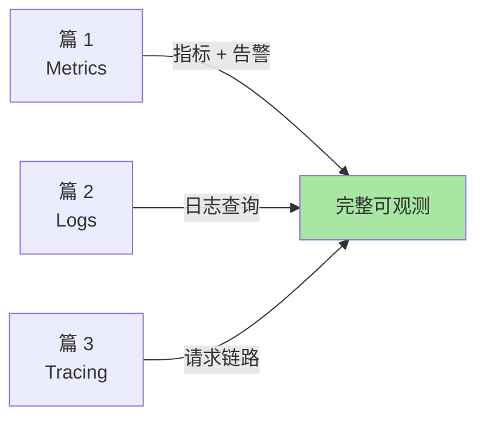

# K8s 可观测性专题导读：从指标到追踪

> L3 专题层子系列 B 导读。讲清 3 篇覆盖范围、与 L1/L2/L4 的边界、与相邻专题的关系。

## 一、这个专题讲什么

生产集群出问题时——你只能看 **metrics（日志/指标）** 是定位不了的。可观测性三大支柱：

```
篇 1  Prometheus + Grafana 监控体系       ← 指标（Metrics）
篇 2  日志采集（EFK / Loki）              ← 日志（Logs）
篇 3  全链路追踪（Jaeger / Tempo）         ← 追踪（Tracing）
```

## 二、3 篇逻辑关系



**关键认知**：3 篇互补，不能互相替代——Metrics 看趋势、Logs 看事件、Tracing 看链路。

## 三、与 L1/L2/L4 的关系

| L1/L2 | L3 本专题 | L4 整合层 |
|---|---|---|
| L2 篇 5 HPA 用 Prometheus Adapter | → 篇 1 Prometheus 深挖 | — |
| — | — | → 篇 1 K8s 架构全景（含可观测架构） |

## 四、与相邻专题的关系

| 专题（可观测性） | 专题（生产化） | 专题（安全） |
|---|---|---|
| 篇 1 Prometheus | ← 篇 2 升级（升级前后对比 metrics） | — |
| 篇 2 日志 | ← 篇 4 故障演练（演练日志分析） | ← 篇 1 PSS（审计日志） |

## 五、读完后你能做什么

- ✅ 部署 Prometheus + Grafana + Alertmanager 全套
- ✅ 配置 EFK / Loki 日志采集
- ✅ 用 OpenTelemetry + Jaeger / Tempo 实现全链路追踪
- ✅ 选型 metrics / logs / tracing 工具

## 📌 数据与事实声明

- 写于 2026-09-07，针对 K8s 1.30+
- Prometheus 当前版本：v2.50+
- 行业认知：OpenTelemetry 已成云原生可观测性标准（公开讨论）
- 免责：可观测性工具演进快

## 📚 参考资料

| 类型 | 标题 | 来源 |
|---|---|---|
| 官方文档 | Prometheus | prometheus.io |
| 官方文档 | OpenTelemetry | opentelemetry.io |
| 系列 index | `docs/devops/kubernetes/专题层/K8s可观测性专题/` | 本仓库 |
