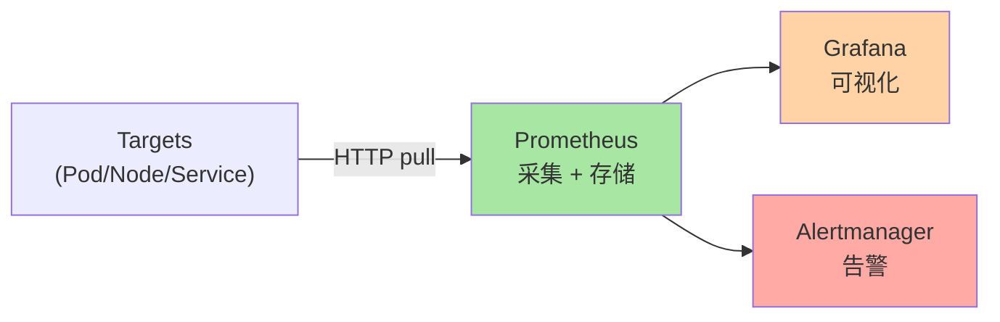
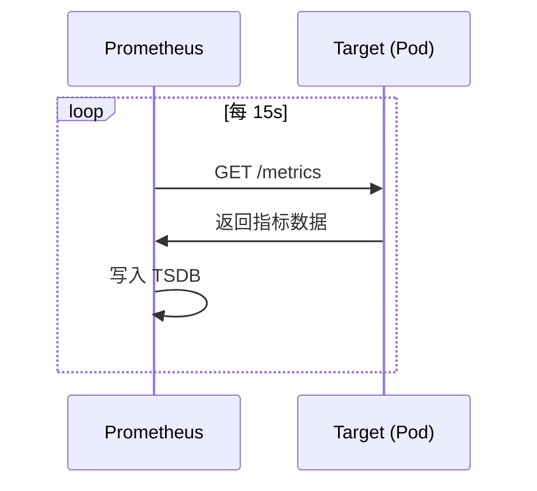
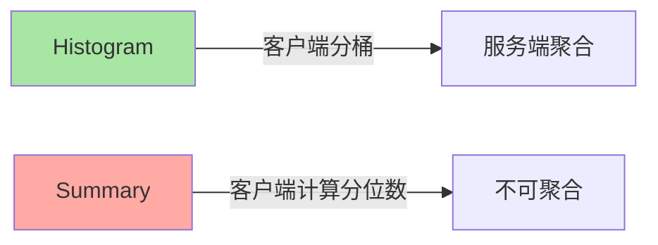
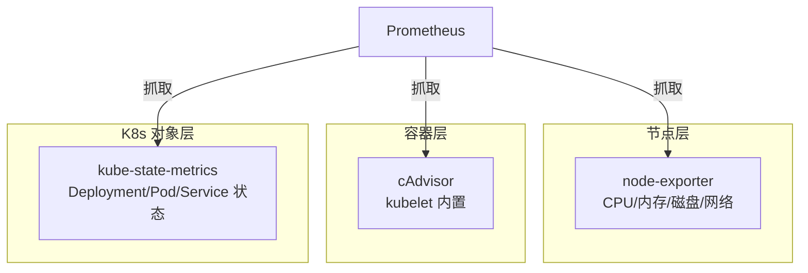
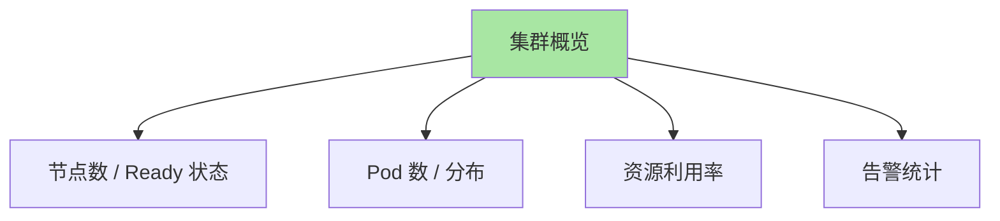
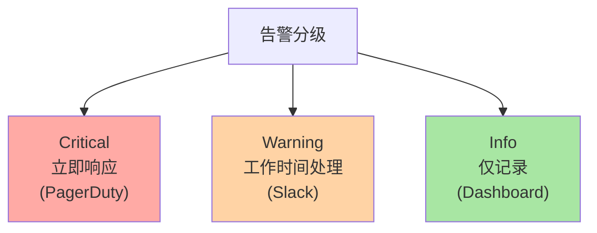
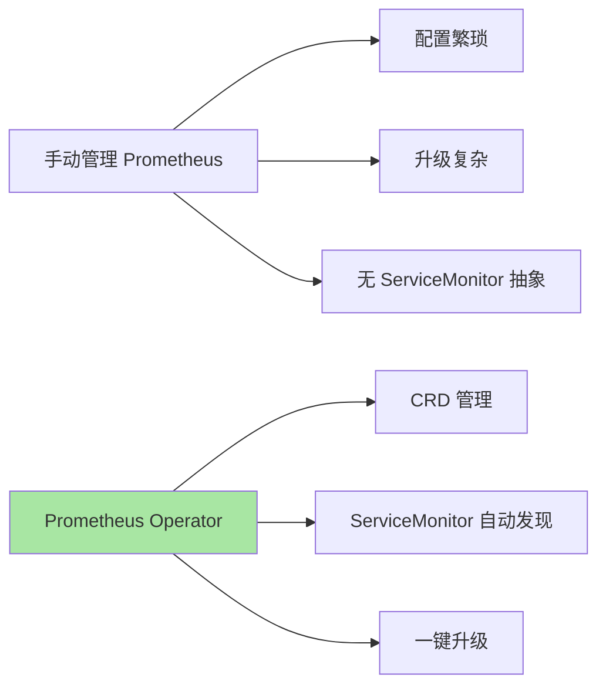
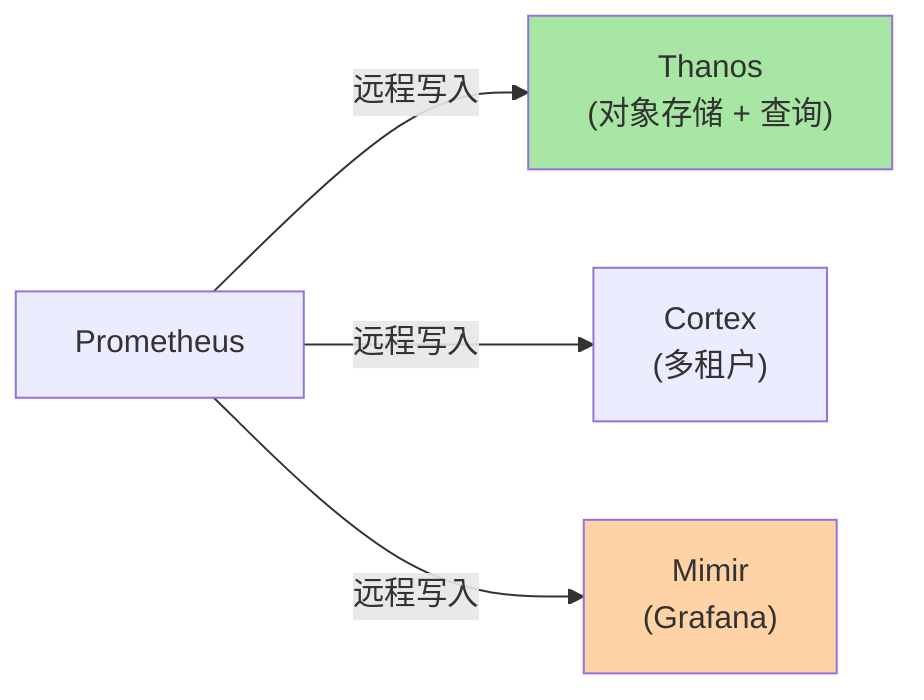

# Prometheus + Grafana 监控体系：从指标到告警

> K8s 默认没有监控——Metrics Server 只给 HPA 用。生产监控靠 Prometheus + Grafana + Alertmanager 三件套。本篇讲清 Prometheus 架构、Metrics 类型、Grafana 看板、告警设计。

## 一句话摘要

Prometheus 用 Pull 模型抓取 metrics，通过 PromQL 查询，Grafana 可视化，Alertmanager 告警；K8s 监控关键组件是 kube-state-metrics（K8s 对象指标）+ cAdvisor（容器指标）+ node-exporter（节点指标）。

## 一、Prometheus 架构

### 1.1 三大组件



### 1.2 Pull 模型



**关键认知**：Prometheus 是 Pull（主动抓取），不是 Push（被动接收）。这与 OpenTelemetry/StatsD 的 Push 模型相反。

## 二、Metrics 类型

### 2.1 4 种核心类型

| 类型 | 含义 | 示例 |
|---|---|---|
| **Counter** | 单调递增 | `http_requests_total` |
| **Gauge** | 任意变化 | `memory_usage_bytes` |
| **Histogram** | 分桶统计 | `http_request_duration_seconds_bucket` |
| **Summary** | 分位数（类似 Histogram） | `http_request_duration_seconds{quantile="0.99"}` |

### 2.2 Histogram vs Summary



**推荐**：Histogram（可聚合 + 可跨实例计算 P99）。

## 三、K8s 监控三大 Exporter

### 3.1 三层监控



### 3.2 kube-state-metrics

```yaml
# 关键指标
kube_pod_info
kube_pod_status_phase           # Pod 状态分布
kube_deployment_status_replicas # Deployment 副本数
kube_node_status_condition      # 节点状态
```

### 3.3 cAdvisor（容器指标）

```yaml
# kubelet 内置
container_cpu_usage_seconds_total
container_memory_usage_bytes
container_network_receive_bytes_total
```

### 3.4 node-exporter（节点指标）

```yaml
# 系统指标
node_cpu_seconds_total
node_memory_MemAvailable_bytes
node_filesystem_avail_bytes
node_network_receive_bytes_total
```

## 四、PromQL 基础

### 4.1 查询语法

```promql
# 1. 简单查询
node_cpu_seconds_total{mode="idle"}

# 2. 范围查询（5min 内）
rate(node_cpu_seconds_total{mode="idle"}[5m])

# 3. 聚合
sum(rate(node_cpu_seconds_total{mode!="idle"}[5m])) by (instance)

# 4. 计算 CPU 利用率
100 - (avg by(instance) (rate(node_cpu_seconds_total{mode="idle"}[5m])) * 100)
```

### 4.2 常用查询模板

```promql
# 节点 CPU 利用率
100 - (avg by(instance)(rate(node_cpu_seconds_total{mode="idle"}[5m])) * 100)

# Pod 内存使用
sum(container_memory_usage_bytes{namespace="prod"}) by (pod)

# K8s 节点 NotReady 数
count(kube_node_status_condition{condition="Ready",status="true"} == 0)

# HTTP 请求 P99 延迟
histogram_quantile(0.99, sum(rate(http_request_duration_seconds_bucket[5m])) by (le, handler))
```

## 五、Grafana 看板

### 5.1 推荐看板

| 看板 | 数据源 | 内容 |
|---|---|---|
| **K8s Cluster Overview** | Prometheus | 节点/Pod/Deployment 总览 |
| **Node Exporter Full** | Prometheus | 节点资源详细 |
| **Pod Detail** | Prometheus | 单 Pod 详细 |
| **K8s API Server** | Prometheus | API Server 性能 |

### 5.2 看板配置

```yaml
# Grafana Helm 安装
helm repo add grafana https://grafana.github.io/helm-charts
helm install grafana grafana/grafana \
  --namespace monitoring \
  --set adminPassword=secret \
  --set service.type=LoadBalancer
```

### 5.3 看板示例



## 六、Alertmanager 告警

### 6.1 告警分组

```yaml
# alertmanager.yml
route:
  group_by: ['alertname', 'cluster']
  group_wait: 30s
  group_interval: 5m
  repeat_interval: 4h
  receiver: 'slack-critical'
  routes:
  - match:
      severity: critical
    receiver: 'pagerduty'
  - match:
      severity: warning
    receiver: 'slack-warning'
```

### 6.2 告警规则

```yaml
# PrometheusRule
apiVersion: monitoring.coreos.com/v1
kind: PrometheusRule
metadata:
  name: k8s-alerts
spec:
  groups:
  - name: k8s.rules
    rules:
    - alert: KubeNodeNotReady
      expr: kube_node_status_condition{condition="Ready",status="true"} == 0
      for: 5m
      annotations:
        summary: "节点 {{ $labels.node }} 失联"
        severity: critical
    - alert: HighCPUUsage
      expr: 100 - (avg by(instance)(rate(node_cpu_seconds_total{mode="idle"}[5m])) * 100) > 80
      for: 10m
      annotations:
        summary: "节点 CPU 使用率 > 80%"
        severity: warning
```

### 6.3 告警分级



## 七、Prometheus Operator

### 7.1 为什么用 Operator



### 7.2 CRD 三大件

```yaml
# 1. Prometheus 实例
apiVersion: monitoring.coreos.com/v1
kind: Prometheus
metadata:
  name: main
spec:
  serviceAccountName: prometheus
  replicas: 2
  resources:
    requests: { cpu: 200m, memory: 2Gi }

---
# 2. ServiceMonitor（自动抓取）
apiVersion: monitoring.coreos.com/v1
kind: ServiceMonitor
metadata:
  name: api-server
spec:
  selector:
    matchLabels:
      component: apiserver
  endpoints:
  - port: https
    interval: 30s

---
# 3. PrometheusRule（告警规则）
apiVersion: monitoring.coreos.com/v1
kind: PrometheusRule
metadata:
  name: k8s-alerts
spec:
  groups: [...]
```

## 八、典型场景

### 8.1 完整监控部署清单

```markdown
□ 1. kube-prometheus-stack Helm 安装
□ 2. Grafana 配置数据源
□ 3. 导入 K8s 推荐看板
□ 4. 配置 Alertmanager 接收器
□ 5. 配置 PrometheusRule（关键告警）
□ 6. 配置 ServiceMonitor（应用暴露 /metrics）
□ 7. 配置持久化（Thanos / Cortex）
□ 8. 验证告警链路
```

### 8.2 应用层 metrics

```python
# Python 应用暴露 /metrics（prometheus_client）
from prometheus_client import Counter, Histogram, start_http_server

REQUESTS = Counter('http_requests_total', 'Total requests', ['method', 'endpoint'])
LATENCY = Histogram('http_request_duration_seconds', 'Request latency')

@app.route('/api/users')
def users():
    start = time.time()
    REQUESTS.labels(method='GET', endpoint='/users').inc()
    # ... 业务逻辑
    LATENCY.observe(time.time() - start)
    return users_list

# 启动 metrics server
start_http_server(8080)
```

### 8.3 长期存储



## 九、自测三问

1. **Prometheus 为什么用 Pull 而不是 Push？**
   - Pull 模型让 Prometheus 控制采集节奏；Target 故障时 Prometheus 主动发现（无需应用主动重试）；适合 K8s 动态环境（Pod 频繁创建/销毁）。

2. **kube-state-metrics 和 cAdvisor 的区别？**
   - kube-state-metrics 提供 K8s 对象状态指标（Deployment 副本数、Pod phase）；cAdvisor 提供容器资源指标（CPU/内存/网络）。

3. **告警分级怎么设计？**
   - 3 档：Critical（立即响应 + PagerDuty）/ Warning（工作时间 + Slack）/ Info（仅 Dashboard 展示）。Critical 阈值要严防告警疲劳。

## 📌 数据与事实声明

- 写于 2026-09-07，针对 K8s 1.30+
- Prometheus 当前版本：v2.50+
- Prometheus Operator 当前版本：v0.70+
- 行业认知：Prometheus 已成为云原生监控事实标准（80%+ K8s 集群使用，公开统计）
- 免责：Grafana 看板演进快

## 📚 参考资料

| 类型 | 标题 | 来源 |
|---|---|---|
| 官方文档 | Prometheus | prometheus.io/docs |
| 官方文档 | Grafana | grafana.com/docs |
| 官方文档 | Prometheus Operator | github.com/prometheus-operator/prometheus-operator |
| 实战 | kube-prometheus-stack | github.com/prometheus-community/helm-charts |
| 实战 | Thanos | thanos.io |
