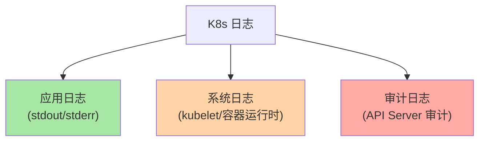
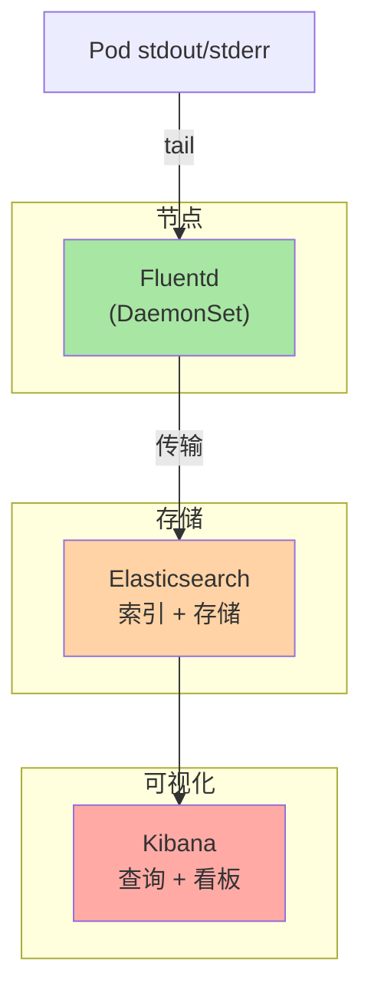
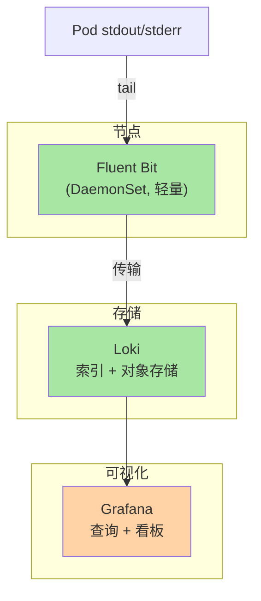
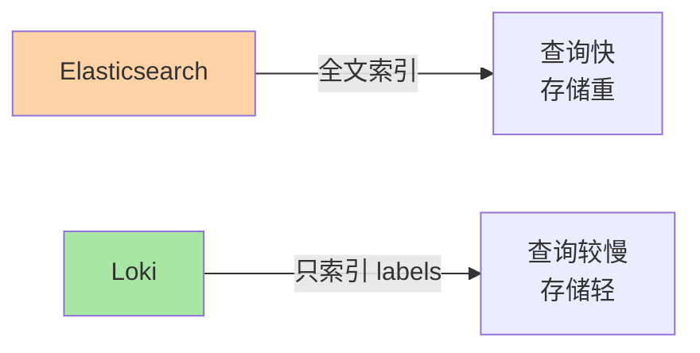
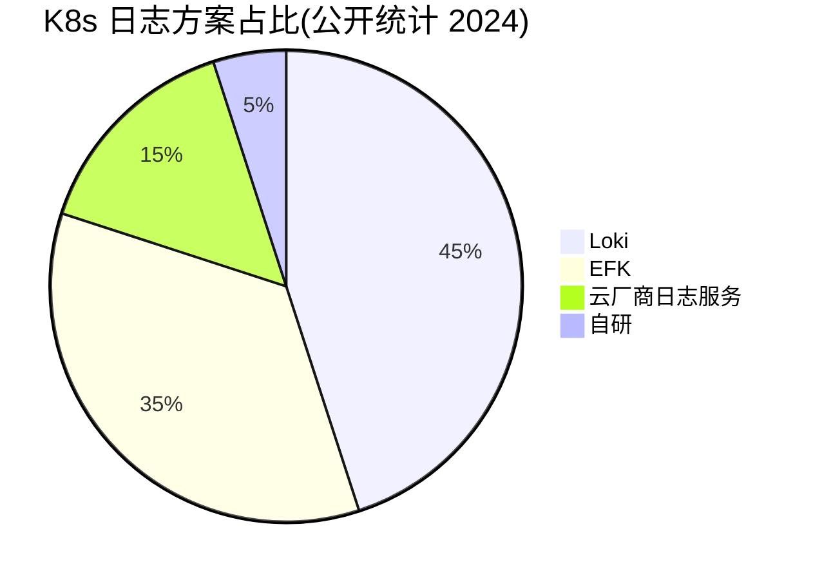
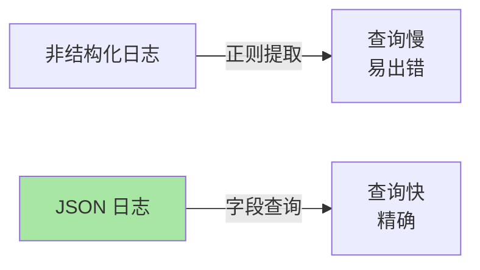
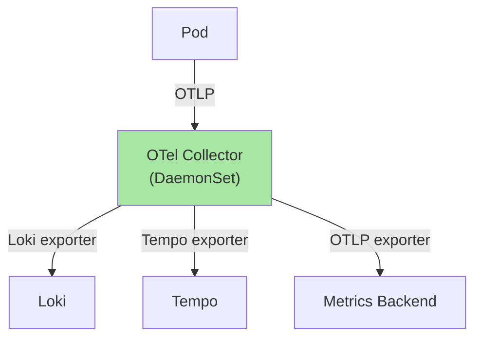

# K8s 日志采集：EFK vs Loki 选型与实践

> Pod 日志是排查问题的第一手证据——stdout/stderr 都丢在容器里，重启就消失。生产环境必须集中采集 + 长期存储 + 高效检索。本篇讲清 EFK vs Loki 选型、采集架构、查询语法。

## 一句话摘要

K8s 日志采集主流方案：EFK（Elasticsearch + Fluentd + Kibana，传统但重）+ Loki + Grafana（云原生 + 轻量）；采集侧用 DaemonSet 跑 Fluentd/Fluent Bit/Vector；结构化日志（JSON）比非结构化日志（日志文本）更易查询。

## 一、K8s 日志基础

### 1.1 三类日志



### 1.2 默认行为

```bash
# Pod 删除时日志丢失
# kubectl logs 只能看当前 Pod 日志
kubectl logs my-pod --previous    # 看上次容器日志
```

**关键认知**：K8s 不持久化日志——必须采集到外部存储。

## 二、EFK 架构（传统）

### 2.1 三大组件



### 2.2 Fluentd 部署

```yaml
apiVersion: apps/v1
kind: DaemonSet
metadata:
  name: fluentd
  namespace: logging
spec:
  selector:
    matchLabels:
      app: fluentd
  template:
    metadata:
      labels:
        app: fluentd
    spec:
      containers:
      - name: fluentd
        image: fluent/fluentd-kubernetes-daemonset:v1.16
        env:
        - name: FLUENT_ELASTICSEARCH_HOST
          value: "elasticsearch.logging"
        - name: FLUENT_ELASTICSEARCH_PORT
          value: "9200"
        volumeMounts:
        - name: varlog
          mountPath: /var/log
        - name: varlibdockercontainers
          mountPath: /var/lib/docker/containers
          readOnly: true
      volumes:
      - name: varlog
        hostPath:
          path: /var/log
      - name: varlibdockercontainers
        hostPath:
          path: /var/lib/docker/containers
```

### 2.3 EFK 优势 / 劣势

| 优势 | 劣势 |
|---|---|
| ✅ 功能强大（全文检索） | ❌ ES 重（资源占用高） |
| ✅ Kibana 看板丰富 | ❌ 运维成本高 |
| ✅ 生态成熟 | ❌ 存储成本高（按字段索引） |
| | ❌ 不云原生（架构老） |

## 三、Loki 架构（云原生）

### 3.1 三大组件



### 3.2 Loki vs ES 的核心差异



**关键认知**：Loki 只索引 labels（namespace/pod/container），不索引日志内容——存储便宜，但不能用全文检索。

### 3.3 Loki 部署

```bash
# 1. 部署 Loki
helm repo add grafana https://grafana.github.io/helm-charts
helm install loki grafana/loki-stack \
  --namespace logging \
  --create-namespace \
  --set promtail.enabled=true

# 2. Grafana 添加 Loki 数据源
# Configuration → Data Sources → Add → Loki
# URL: http://loki.logging:3100
```

### 3.4 Promtail/Fluent Bit 配置

```yaml
# Promtail 自动发现 Pod 日志
# 通过 Kubernetes API 获取 Pod metadata
# 附带 labels：namespace/pod/container/node
```

## 四、EFK vs Loki 选型

### 4.1 决策矩阵

| 维度 | EFK | Loki |
|---|---|---|
| **资源占用** | 重（ES 集群） | 轻（Loki + 对象存储） |
| **存储成本** | 高（全文索引） | 低（只索引 labels） |
| **查询能力** | 全文检索 | label + grep |
| **运维复杂度** | 高（ES 调优） | 低（云原生） |
| **生态成熟度** | 成熟 | 较新但快速增长 |
| **云原生亲和** | ❌ | ✅ |
| **适用规模** | 中小集群 | 大中小都可 |

### 4.2 行业认知



**趋势**：Loki 增长快速，EFK 存量稳定（公开报道 2024）。

## 五、日志规范

### 5.1 结构化 vs 非结构化

```python
# ❌ 非结构化（日志文本）
print("用户登录成功 user_id=12345 role=admin")

# ✅ 结构化（JSON）
import json, logging
logger.info(json.dumps({
    "event": "user_login",
    "user_id": 12345,
    "role": "admin",
    "timestamp": "2026-09-07T10:00:00Z"
}))
```

### 5.2 为什么用 JSON



### 5.3 日志级别

| 级别 | 适用 |
|---|---|
| **ERROR** | 需要立即关注的错误 |
| **WARN** | 潜在问题 |
| **INFO** | 关键业务事件 |
| **DEBUG** | 调试信息（生产关闭） |

## 六、典型场景

### 6.1 排查 Pod CrashLoopBackOff

```bash
# 1. 用 Loki 查询（Label: namespace + pod）
{pod="web-abc123", namespace="prod"} |= "error"

# 2. 用 Kibana 查询（全文搜索）
namespace:prod AND pod:web-abc123 AND message:*error*

# 3. 看上次容器日志
kubectl logs my-pod --previous
```

### 6.2 跨 Pod 请求链路追踪

```python
# 在请求开始时生成 trace_id
import uuid
trace_id = str(uuid.uuid4())

# 把 trace_id 写入日志
logger.info(json.dumps({
    "event": "request_start",
    "trace_id": trace_id,
    "path": "/api/orders"
}))

# 把 trace_id 传给下游
headers = {"X-Trace-Id": trace_id}
```

### 6.3 日志保留策略

```yaml
# Loki 配置
limits_config:
  retention_period: 744h   # 31 天
  compactor:
    working_directory: /data/compactor

# Elasticsearch 配置（ILM）
{
  "policy": {
    "phases": {
      "hot": { "actions": { "rollover": { "max_age": "1d" } } },
      "delete": { "actions": { "delete": { "min_age": "30d" } } }
    }
  }
}
```

## 七、OpenTelemetry 集成

### 7.1 OpenTelemetry Collector



### 7.2 统一采集

```yaml
# OpenTelemetry Collector 配置
receivers:
  otlp:
    protocols:
      grpc:
        endpoint: 0.0.0.0:4317

processors:
  batch:
    timeout: 5s

exporters:
  loki:
    endpoint: http://loki.logging:3100/loki/api/v1/push
  tempo:
    endpoint: tempo:4317

service:
  pipelines:
    logs:
      receivers: [otlp]
      exporters: [loki]
    traces:
      receivers: [otlp]
      exporters: [tempo]
```

## 八、自测三问

1. **Loki 和 ES 的本质区别是什么？**
   - Loki 只索引 labels（namespace/pod/container），不索引日志内容——存储便宜但不能全文检索；ES 全文索引——查询快但存储重。

2. **DaemonSet 为什么是日志采集的标准部署方式？**
   - 每个节点一个采集器 → 覆盖所有 Pod + 节点级日志（kubelet/容器运行时）；不与 Pod 耦合（不影响业务）。

3. **JSON 日志比文本日志好在哪？**
   - JSON 结构化字段可直接查询（namespace=prod AND level=error）；文本日志需要正则解析（慢且易出错）。

## 📌 数据与事实声明

- 写于 2026-09-07，针对 K8s 1.30+
- Loki 当前版本：v3.x
- Fluent Bit 当前版本：v2.2+
- 行业认知：Loki 增长快速（公开报道 2024）
- 免责：日志工具演进快

## 📚 参考资料

| 类型 | 标题 | 来源 |
|---|---|---|
| 官方文档 | EFK on K8s | kubernetes.io/docs/tasks/access-application-cluster/logging-elasticsearch-kibana/ |
| 官方文档 | Loki | grafana.com/oss/loki/ |
| 官方文档 | OpenTelemetry | opentelemetry.io |
| 实战 | Logging with Loki | grafana.com/docs/loki/latest/ |
| 实战 | Fluent Bit | fluentbit.io |
