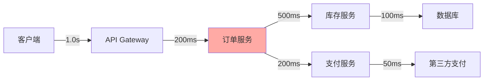
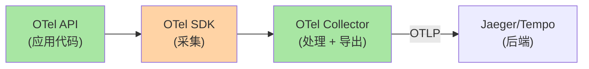
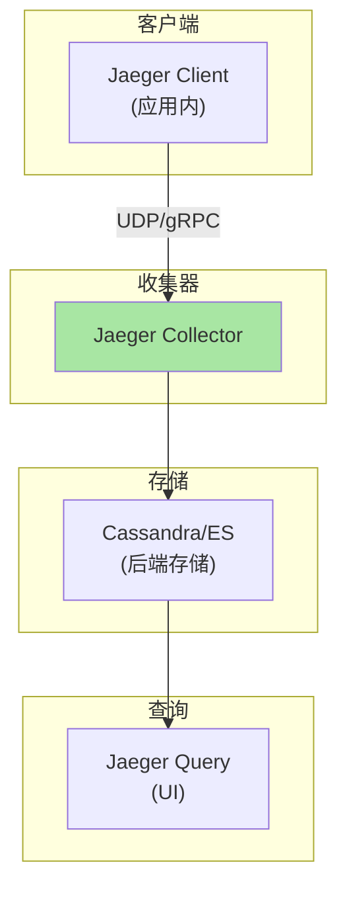
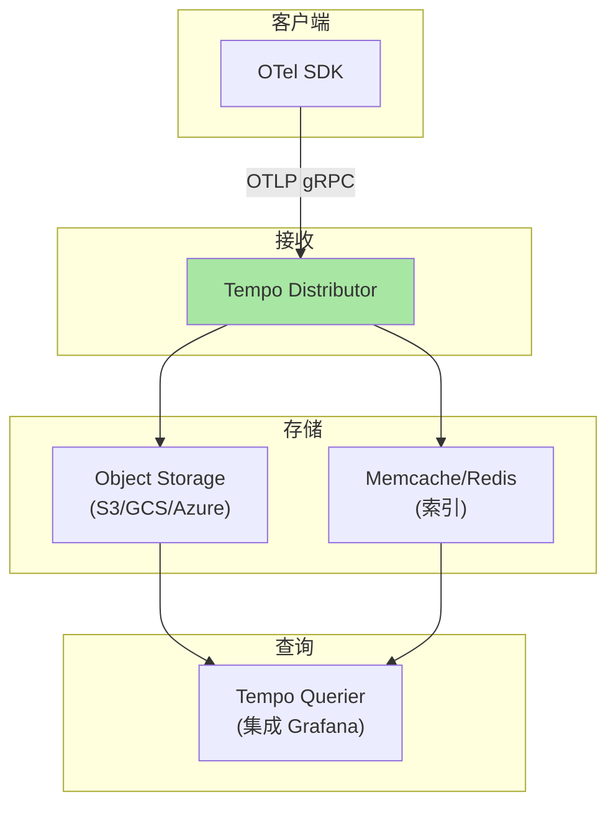
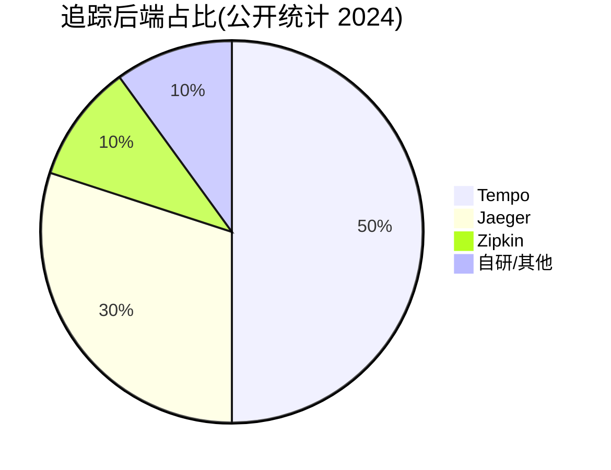
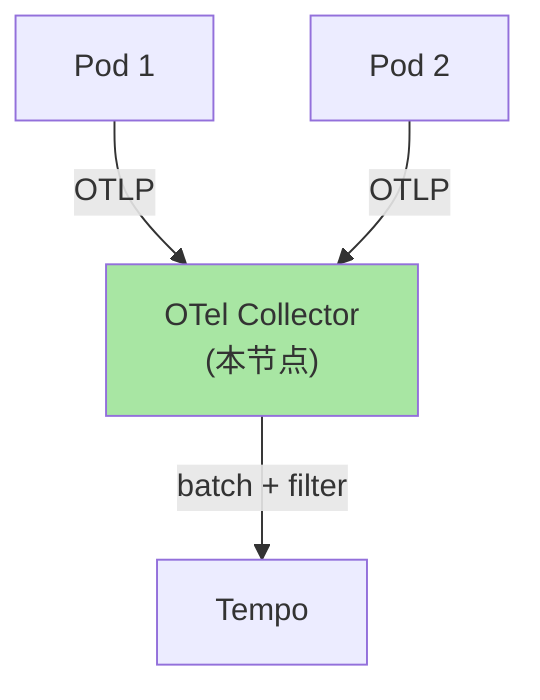
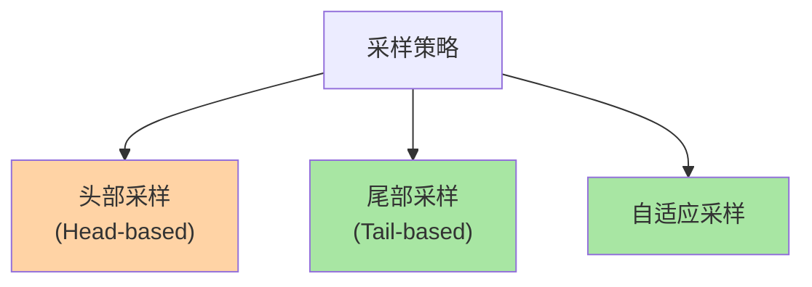
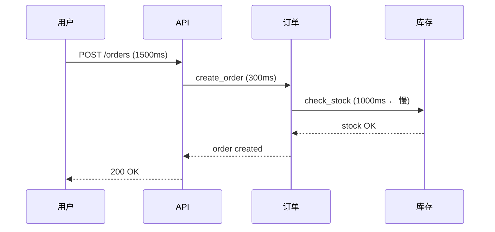

# K8s 全链路追踪：OpenTelemetry + Jaeger / Tempo 实践

> 微服务调用链「一个请求穿越 10 个服务」——出问题时不知道慢在哪。全链路追踪（Distributed Tracing）记录每个请求的完整路径。本篇讲清 OpenTelemetry 标准、Jaeger vs Tempo 选型、生产实践。

## 一句话摘要

OpenTelemetry 是云原生追踪/指标/日志的统一标准（OTel）；Jaeger（功能丰富 + UI 强）和 Tempo（云原生 + 对象存储）是主流后端；通过 trace_id 串联跨服务调用，定位慢请求/错误请求。

## 一、为什么需要全链路追踪

### 1.1 微服务的诊断困境



**问题**：用户说「下单慢」，但不知道是订单服务还是库存服务慢——单服务日志看不出端到端延迟分布。

### 1.2 Trace vs Log

| 维度 | Log（日志） | Trace（追踪） |
|---|---|---|
| **粒度** | 单服务事件 | 跨服务链路 |
| **维度** | 时间 | 时间 + 因果 |
| **回答** | 「发生了什么」 | 「请求穿越了哪些服务」 |
| **存储** | 文本日志 | Span（带 trace_id） |

## 二、OpenTelemetry 标准

### 2.1 OTel 三件套



### 2.2 三个核心概念

| 概念 | 含义 | 示例 |
|---|---|---|
| **Trace** | 完整请求链路（树） | 一个下单请求的完整路径 |
| **Span** | 链路中的一个操作 | 「调用订单服务」「查数据库」 |
| **Context** | Span 间的因果关系 | parent_span_id |

### 2.3 Span 结构

```json
{
  "trace_id": "abc123def456",
  "span_id": "span-001",
  "parent_span_id": "span-000",
  "name": "GET /api/orders",
  "start_time": "2026-09-07T10:00:00Z",
  "duration_ms": 1500,
  "attributes": {
    "http.method": "POST",
    "http.status_code": 200,
    "user.id": "12345"
  },
  "events": [
    { "name": "db.query", "time": "2026-09-07T10:00:00.500Z" }
  ]
}
```

## 三、Jaeger vs Tempo

### 3.1 Jaeger 架构（功能丰富）



### 3.2 Tempo 架构（云原生）



### 3.3 选型矩阵

| 维度 | Jaeger | Tempo |
|---|---|---|
| **架构** | 传统（Cassandra/ES） | 云原生（对象存储） |
| **存储成本** | 高 | 低（对象存储便宜） |
| **运维复杂度** | 高（Cassandra/ES） | 低（无状态服务） |
| **UI** | 自带完整 UI | 依赖 Grafana |
| **采样** | 多种采样策略 | 仅尾部采样 |
| **生态** | 成熟（2016-） | 快速增长（2020-） |
| **适用** | 中小集群 / 自建 | 大集群 / 云原生 |

### 3.4 行业趋势



## 四、应用层 OTel 集成

### 4.1 自动埋点

```python
# Python 自动埋点（OpenTelemetry）
from opentelemetry import trace
from opentelemetry.sdk.trace import TracerProvider
from opentelemetry.sdk.trace.export import BatchSpanProcessor
from opentelemetry.exporter.otlp.proto.grpc.trace_exporter import OTLPSpanExporter
from opentelemetry.instrumentation.requests import RequestsInstrumentor

# 1. 配置 Tracer
provider = TracerProvider()
processor = BatchSpanProcessor(
    OTLPSpanExporter(endpoint="otel-collector:4317")
)
provider.add_span_processor(processor)
trace.set_tracer_provider(provider)

# 2. 自动埋点 requests
RequestsInstrumentor().instrument()

# 3. 业务代码自动追踪
import requests
response = requests.get("http://api-service:8080/orders")  # 自动生成 Span
```

### 4.2 手动埋点

```python
tracer = trace.get_tracer(__name__)

@app.route('/api/orders')
def create_order():
    with tracer.start_as_current_span("create_order") as span:
        span.set_attribute("user.id", user_id)
        # 业务逻辑
        order = create_order_in_db(user_id)
        # 子 span：调用支付
        with tracer.start_as_current_span("call_payment"):
            payment_result = call_payment_service(order_id)
        return order
```

### 4.3 跨服务 trace_id 传递

```python
# 服务 A：注入 trace headers
headers = {"traceparent": "00-trace_id-span_id-01"}
response = requests.post("http://service-b/api", headers=headers)

# 服务 B：自动提取 trace context
# OTel SDK 自动从 HTTP headers 提取 trace_id
# → 父子 Span 自动关联
```

## 五、OTel Collector 部署

### 5.1 DaemonSet 模式



### 5.2 配置

```yaml
# otel-collector-config.yaml
receivers:
  otlp:
    protocols:
      grpc:
        endpoint: 0.0.0.0:4317
      http:
        endpoint: 0.0.0.0:4318

processors:
  batch:
    timeout: 5s
    send_batch_size: 1024
  memory_limiter:
    check_interval: 1s
    limit_percentage: 80
    spike_limit_percentage: 20

exporters:
  otlp/tempo:
    endpoint: tempo-distributor:4317
    tls:
      insecure: true

service:
  pipelines:
    traces:
      receivers: [otlp]
      processors: [memory_limiter, batch]
      exporters: [otlp/tempo]
```

## 六、Tempo 部署

### 6.1 Helm 部署

```bash
helm repo add grafana https://grafana.github.io/helm-charts
helm install tempo grafana/tempo \
  --namespace tracing \
  --create-namespace \
  --set storage.trace.backend=local \
  --set storage.trace.local.path=/var/tempo/traces
```

### 6.2 Grafana 集成

```yaml
# Grafana Data Source
apiVersion: 1
datasources:
- name: Tempo
  type: tempo
  access: proxy
  url: http://tempo.tracing:3100
  isDefault: true
```

### 6.3 Trace 查询

```bash
# Grafana Explore → Tempo → 输入 trace_id
# 或用搜索：
{service.name = "order-service" && http.status_code = 500}
```

## 七、采样策略

### 7.1 三种采样



### 7.2 头部采样（简单）

```yaml
# 在 SDK 端决定是否采样
processors:
  probabilistic_sampler:
    sampling_percentage: 10   # 采样 10%
```

### 7.3 尾部采样（精准）

```yaml
# 在 Collector 端决定是否采样
# 优点：可以基于完整 trace 决策（错误必采、慢请求必采）
# 缺点：需要等所有 span 收齐
exporters:
  loadbalancing:
    routing_key: traceID
```

## 八、典型场景

### 8.1 定位慢请求



**通过 Trace 发现**：库存服务的 check_stock 是慢请求根因——优化库存查询。

### 8.2 定位错误根因

```python
# Span attributes 自动记录错误
with tracer.start_as_current_span("db_query") as span:
    try:
        result = db.execute(query)
    except Exception as e:
        span.set_status(trace.Status(trace.StatusCode.ERROR, str(e)))
        span.record_exception(e)
        raise
```

### 8.3 跨服务 trace_id 查询

```bash
# 1. 用户报告请求失败
# 2. 看应用日志找到 trace_id
grep "trace_id=abc123" app.log

# 3. 在 Grafana Tempo 用 trace_id 查询
# → 看完整调用链 + 哪个 Span 报错
```

## 九、自测三问

1. **Trace 和 Log 的本质区别？**
   - Trace 记录「跨服务因果关系」（树形结构 + trace_id）；Log 记录「单服务事件」（文本流）。两者互补，不能替代。

2. **Jaeger 和 Tempo 的核心差异？**
   - Jaeger 自带存储（Cassandra/ES）+ 自带 UI；Tempo 用对象存储（S3/GCS）+ 依赖 Grafana。Tempo 更云原生，存储更便宜。

3. **为什么生产推荐尾部采样？**
   - 头部采样：进入服务时决定采样率（错误请求可能被丢弃）；尾部采样：等完整 trace 后再决策（错误请求必采、慢请求必采）。

## 📌 数据与事实声明

- 写于 2026-09-07，针对 K8s 1.30+
- OpenTelemetry 当前版本：v1.30+
- Tempo 当前版本：v2.x
- Jaeger 当前版本：v1.60+
- 行业认知：OpenTelemetry 已成云原生可观测性标准（公开讨论）
- 免责：追踪工具演进快

## 📚 参考资料

| 类型 | 标题 | 来源 |
|---|---|---|
| 官方文档 | OpenTelemetry | opentelemetry.io |
| 官方文档 | Jaeger | jaegertracing.io |
| 官方文档 | Tempo | grafana.com/oss/tempo/ |
| 实战 | OTel Collector | opentelemetry.io/docs/collector/ |
| 实战 | Distributed Tracing | kubernetes.io/docs/tasks/access-application-cluster/distributed-tracing/ |
