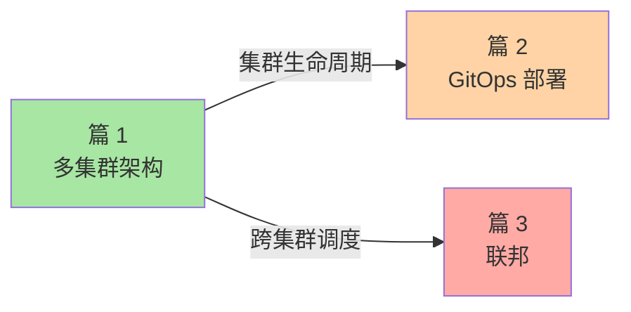

# K8s 多集群治理专题导读：单集群到多集群的演进

> L3 专题层子系列 D 导读。讲清 3 篇覆盖范围、与相邻专题的关系。

## 一、这个专题讲什么

单集群 5000 节点是 K8s 极限——超过就要多集群。多集群治理是 K8s 进阶必经之路：

```
篇 1  多集群架构（Hub-Spoke / Mesh）+ Cluster API       ← 架构基础
篇 2  GitOps 实践（Argo CD / Flux）                       ← 应用部署
篇 3  联邦与跨集群调度（Karmada / KubeFed）              ← 资源调度
```

## 二、3 篇逻辑关系



## 三、与相邻专题的关系

| 专题（多集群） | 专题（生产化） | 专题（安全） |
|---|---|---|
| 篇 1 Cluster API | ← 篇 3 节点扩缩容（Karpenter/CA 与 Cluster API 对比） | — |
| 篇 2 GitOps | ← 篇 2 升级（GitOps 让升级可追溯） | ← 篇 3 镜像签名（GitOps + 签名 = 安全部署） |

## 四、读完后你能做什么

- ✅ 设计多集群架构（Hub-Spoke / Mesh）
- ✅ 用 Cluster API 管理集群生命周期
- ✅ 部署 Argo CD / Flux 实现 GitOps
- ✅ 用 Karmada / KubeFed 实现跨集群调度

## 📌 数据与事实声明

- 写于 2026-09-07，针对 K8s 1.30+
- Karmada 当前版本：v1.x
- Argo CD 当前版本：v2.x
- 行业认知：大厂普遍 10+ 集群（公开报道 2024）
- 免责：多集群工具演进快

## 📚 参考资料

| 类型 | 标题 | 来源 |
|---|---|---|
| 官方文档 | Cluster API | cluster-api.sigs.k8s.io |
| 官方文档 | Argo CD | argoproj.github.io/cd/ |
| 系列 index | `docs/devops/kubernetes/专题层/K8s多集群治理专题/` | 本仓库 |
