# K8s 多集群架构：Hub-Spoke / Mesh / Cluster API

> 单集群 5000 节点是 K8s 极限——超过必须多集群。多集群架构有 Hub-Spoke、Mesh 等多种形态，Cluster API（CAPI）管理集群生命周期。本篇讲清三种架构对比、CAPI 工作机制、生产实践。

## 一句话摘要

多集群三种架构：Hub-Spoke（中心管理 + 多边缘集群）/ Mesh（对等互通）/ Hybrid（混合）；Cluster API（CAPI）通过 CRD + Controller 管理集群生命周期（创建/升级/删除）；生产推荐 Hub-Spoke + CAPI + Argo CD 的组合。

## 一、为什么需要多集群

### 1.1 单集群的极限

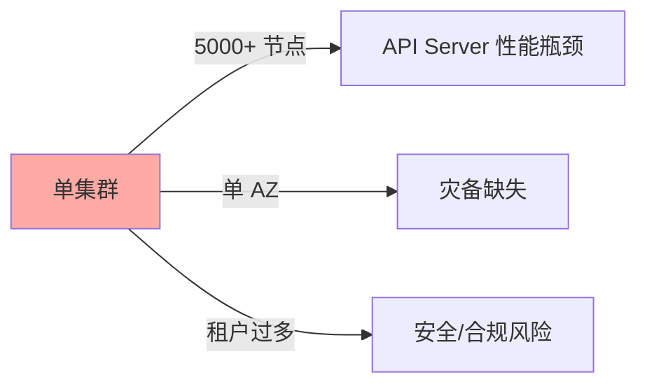

**关键认知**：
- 单集群 5000 节点是 API Server 性能上限
- 单 AZ 部署无灾备
- 多租户混部增加安全风险

### 1.2 多集群的价值

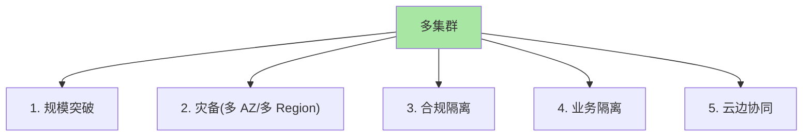

## 二、三种架构对比

### 2.1 Hub-Spoke（中心 + 边缘）

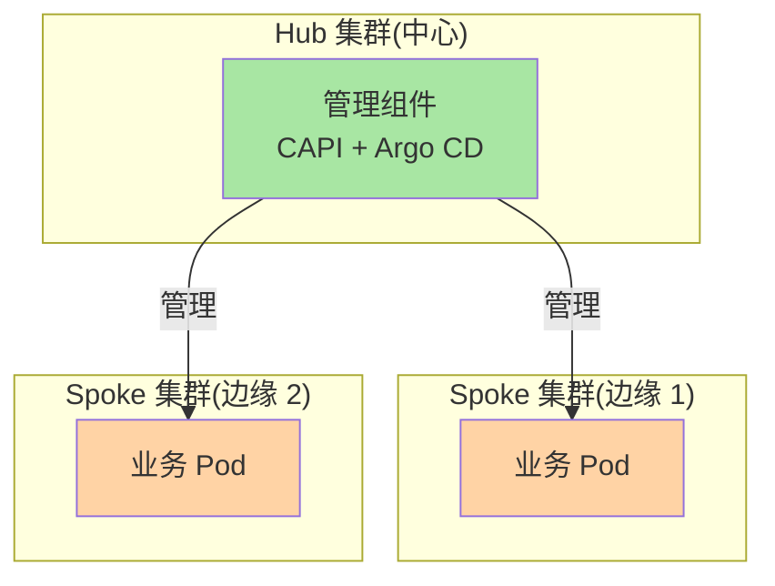

**特点**：
- ✅ 统一管理（中心集群管所有边缘集群）
- ✅ 工具链复用（CAPI/Argo CD 部署在 Hub）
- ❌ Hub 单点故障风险
- 适用：企业 / 大厂

### 2.2 Mesh（对等互通）

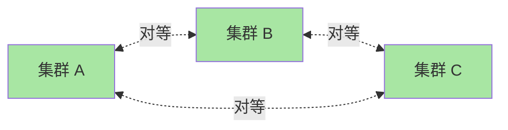

**特点**：
- ✅ 无中心单点
- ✅ 集群间自由互通
- ❌ 管理复杂（每集群都要配工具链）
- 适用：多云 / 多团队

### 2.3 Hybrid（混合）

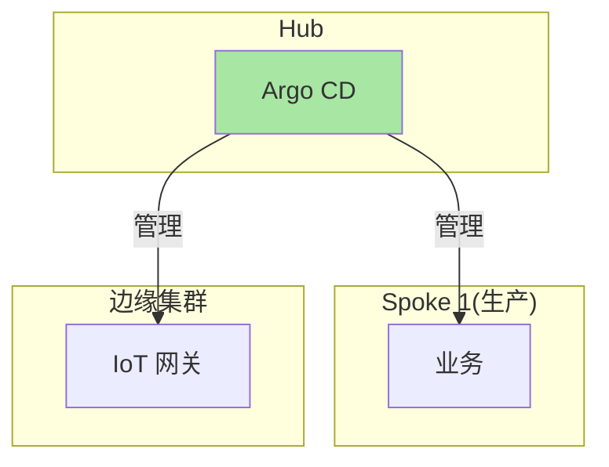

**特点**：
- ✅ Hub-Spoke + Mesh 混合
- ✅ 灵活适配不同场景
- 适用：复杂企业（生产 + 边缘 + 多云）

### 2.4 选型决策

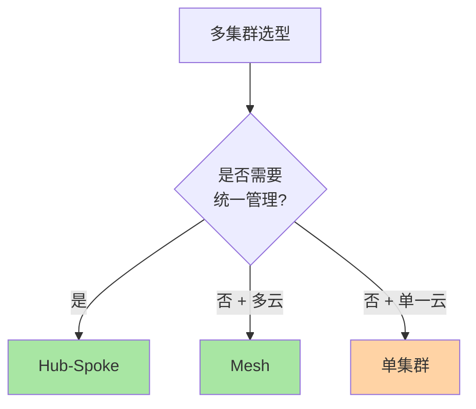

## 三、Cluster API（CAPI）

### 3.1 CAPI 是什么

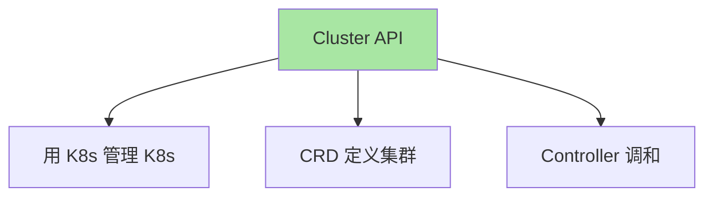

**核心理念**：用 K8s 风格的声明式 API 管理 K8s 集群——和 HPA、Deployment 一致。

### 3.2 CAPI 核心 CRD

| CRD | 作用 |
|---|---|
| **Cluster** | 集群定义 |
| **Machine** | 节点定义（类似 Node 但由 CAPI 管） |
| **MachineDeployment** | 节点池（类似 Deployment） |
| **MachineSet** | 节点副本（类似 ReplicaSet） |
| **MachineHealthCheck** | 节点健康检查 |
| **ClusterClass** | 集群模板（可复用） |

### 3.3 CAPI 工作机制

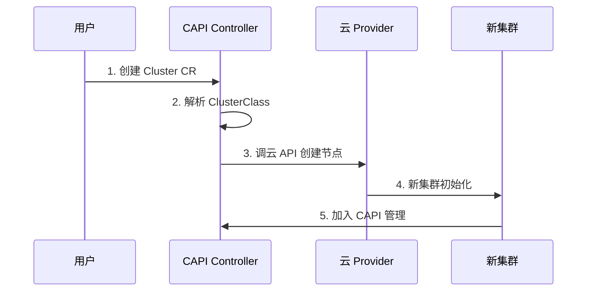

### 3.4 CAPI 安装

```bash
# 1. 安装 clusterctl
curl -L https://github.com/kubernetes-sigs/cluster-api/releases/download/v1.7.0/clusterctl-linux-amd64 -o clusterctl
chmod +x clusterctl
mv clusterctl /usr/local/bin/

# 2. 初始化管理集群
clusterctl init --infrastructure aws

# 3. 创建集群
clusterctl generate cluster my-cluster \
  --kubernetes-version v1.30.0 \
  --control-plane-machine-count 3 \
  --worker-machine-count 3 > my-cluster.yaml
kubectl apply -f my-cluster.yaml
```

### 3.5 ClusterClass 模板

```yaml
apiVersion: cluster.x-k8s.io/v1beta1
kind: ClusterClass
metadata:
  name: aws-prod
spec:
  controlPlane:
    ref:
      apiVersion: controlplane.cluster.x-k8s.io/v1beta1
      kind: KubeadmControlPlaneTemplate
      name: aws-prod-control-plane
  infrastructure:
    ref:
      apiVersion: infrastructure.cluster.x-k8s.io/v1beta1
      kind: AWSClusterTemplate
      name: aws-prod-template
  workers:
    machineDeployments:
    - class: aws-prod-worker
      name: md-0
```

**优势**：定义一次模板，重复用于多个集群——保证一致性。

## 四、生产实践

### 4.1 集群命名规范

```
prod-<region>-<az>
  - prod-us-east-1a
  - prod-us-east-1b
  - prod-cn-north-1a
```

### 4.2 集群分类

| 集群类型 | 用途 | 资源规模 |
|---|---|---|
| **prod** | 生产 | 大 |
| **staging** | 预生产 | 中 |
| **dev** | 开发 | 小 |
| **edge** | 边缘 | 小 |

### 4.3 多集群可观测

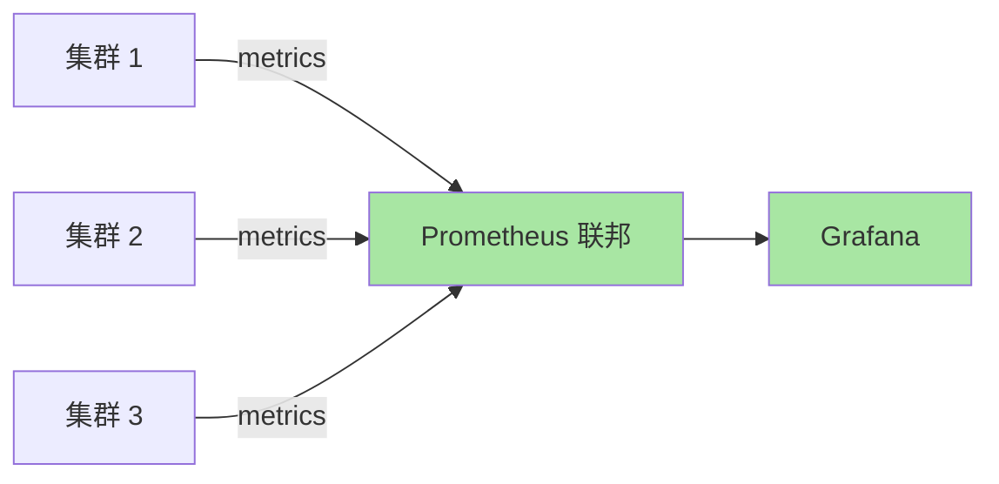

```yaml
# Prometheus 联邦配置
scrape_configs:
- job_name: 'federate'
  honor_labels: true
  metrics_path: '/federate'
  params:
    'match[]':
    - '{job="kube-state-metrics"}'
    - '{__name__="up"}'
  static_configs:
  - targets:
    - 'cluster-1.monitoring:9090'
    - 'cluster-2.monitoring:9090'
```

## 五、典型场景

### 5.1 多 Region 灾备

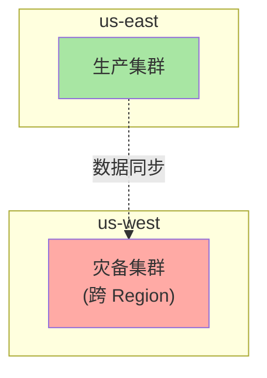

### 5.2 多云部署

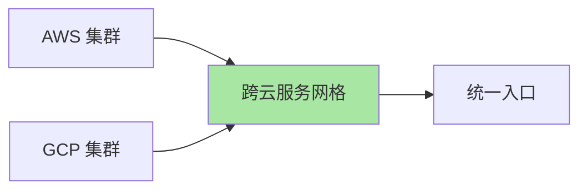

### 5.3 云边协同

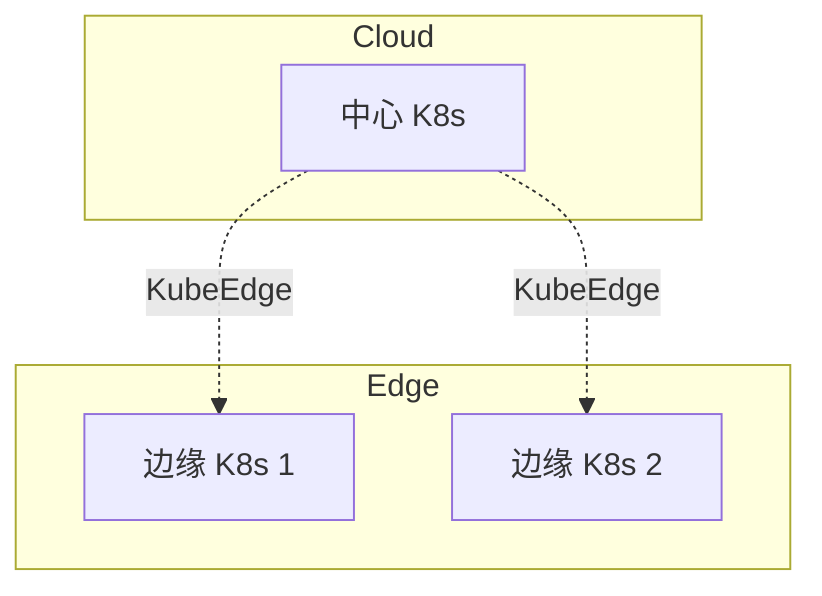

## 六、自测三问

1. **Hub-Spoke 和 Mesh 的核心区别？**
   - Hub-Spoke 有中心管理集群；Mesh 无中心对等互通。Hub-Spoke 管理简单但有单点故障；Mesh 灵活但管理复杂。

2. **Cluster API 的核心价值是什么？**
   - 用 K8s 风格的声明式 API 管理 K8s 集群——CRD + Controller 模式，与 HPA/Deployment 一致。

3. **多集群的最低要求是什么？**
   - ≥ 2 集群（多 AZ 灾备）；统一管理工具（CAPI 或 KubeFed）；统一可观测（Prometheus 联邦）。

## 📌 数据与事实声明

- 写于 2026-09-07，针对 K8s 1.30+
- CAPI 当前版本：v1.7+
- 行业认知：大厂普遍 10+ 集群（公开报道 2024）
- 单集群极限：5000 节点（公开讨论）
- 免责：多集群工具演进快

## 📚 参考资料

| 类型 | 标题 | 来源 |
|---|---|---|
| 官方文档 | Cluster API | cluster-api.sigs.k8s.io |
| 官方文档 | Karmada | karmada.io |
| 实战 | Multi-cluster GitOps | argoproj.github.io/cd/ |
| 实战 | Cluster API Provider AWS | github.com/kubernetes-sigs/cluster-api-provider-aws |
