# K8s GitOps 实践：Argo CD / Flux 深度

> GitOps = Git 作为唯一真相源（Single Source of Truth）——集群状态由 Git 定义，控制器持续调和。本篇讲清 GitOps 原则、Argo CD vs Flux 对比、典型架构、生产实践。

## 一句话摘要

GitOps 三原则：声明式（Git 定义状态）+ 版本化（Git 提交历史）+ 自动调和（控制器持续应用）；Argo CD（UI 强 + 多租户）是主流；Flux（轻量 + GitOps Toolkit）是 CNCF 毕业项目；生产推荐「Argo CD + Image Updater + 镜像签名验证」组合。

## 一、GitOps 原则

### 1.1 三原则

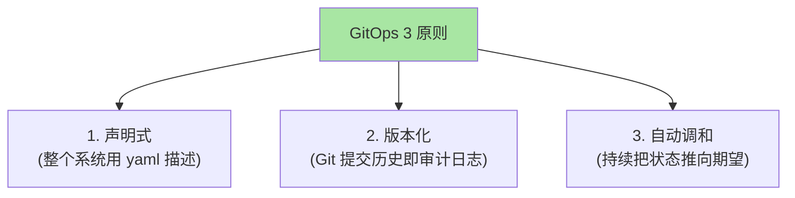

### 1.2 传统部署 vs GitOps

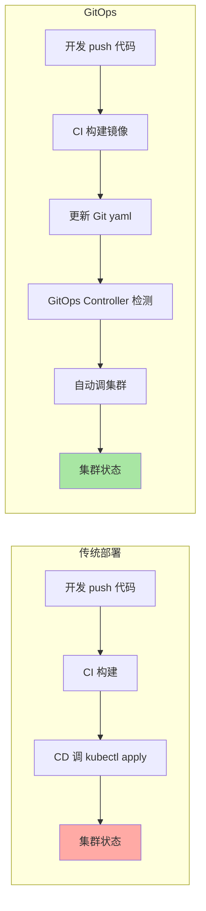

**关键认知**：GitOps 把「部署」从「CI/CD」解耦到「Git + Controller」——kubectl 不直接调集群。

## 二、Argo CD

### 2.1 架构

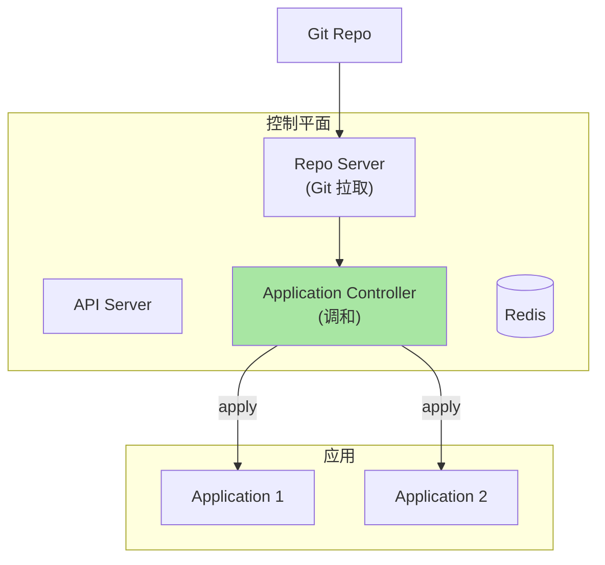

### 2.2 三状态对比

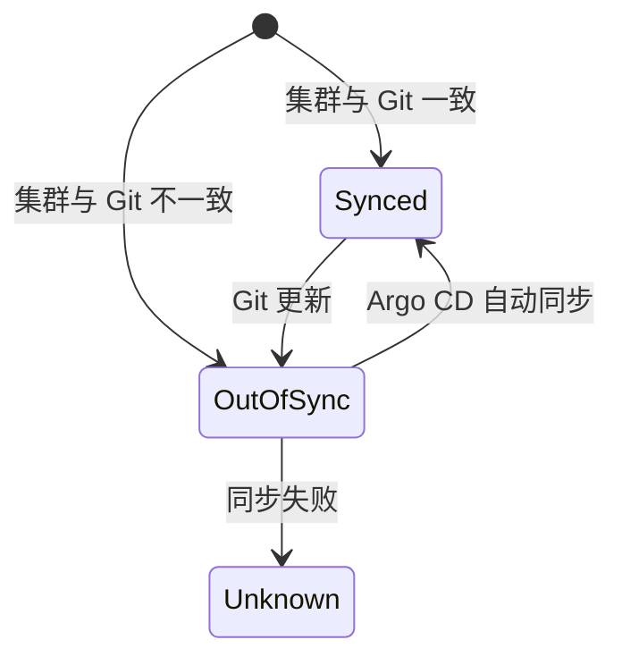

| 状态 | 含义 | 行动 |
|---|---|---|
| **Healthy** + **Synced** | 健康 + 一致 | 无需操作 |
| **Healthy** + **OutOfSync** | 健康 + 不一致 | Argo CD 会自动同步 |
| **Degraded** | 不健康 | 需人工介入 |
| **Unknown** | 状态未知 | 检查 Argo CD 连接 |

### 2.3 Application 资源

```yaml
apiVersion: argoproj.io/v1alpha1
kind: Application
metadata:
  name: web
  namespace: argocd
spec:
  project: default
  source:
    repoURL: https://github.com/myorg/myrepo
    targetRevision: HEAD
    path: manifests/web
  destination:
    server: https://kubernetes.default.svc
    namespace: prod
  syncPolicy:
    automated:
      prune: true             # 自动删除 Git 中移除的资源
      selfHeal: true          # 偏离自动恢复
    syncOptions:
    - CreateNamespace=true
```

### 2.4 Argo CD 优势 / 劣势

| 优势 | 劣势 |
|---|---|
| ✅ Web UI 强大 | ❌ 单租户架构（多租户复杂） |
| ✅ 多 Git 源支持 | ❌ 资源占用较高 |
| ✅ Helm/Kustomize 原生 | ❌ 集群内安装（需先有集群） |
| ✅ ApplicationSet 多集群 | |

## 三、Flux

### 3.1 GitOps Toolkit

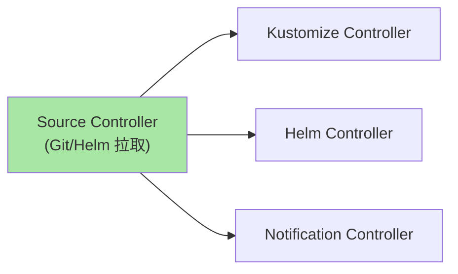

### 3.2 GitRepository + Kustomization

```yaml
# 1. 监听 Git
apiVersion: source.toolkit.fluxcd.io/v1
kind: GitRepository
metadata:
  name: web
  namespace: flux-system
spec:
  interval: 1m0s
  ref:
    branch: main
  url: https://github.com/myorg/myrepo
---
# 2. 应用 Kustomize
apiVersion: kustomize.toolkit.fluxcd.io/v1
kind: Kustomization
metadata:
  name: web
  namespace: flux-system
spec:
  interval: 10m0s
  path: ./manifests/web
  prune: true
  sourceRef:
    kind: GitRepository
    name: web
```

### 3.3 Flux 优势 / 劣势

| 优势 | 劣势 |
|---|---|
| ✅ CNCF 毕业项目 | ❌ UI 较弱（需依赖 Weave GitOps） |
| ✅ GitOps Toolkit 工具化 | ❌ 学习曲线较陡 |
| ✅ 多租户友好 | |
| ✅ 轻量 | |

## 四、Argo CD vs Flux

### 4.1 对比

| 维度 | Argo CD | Flux |
|---|---|---|
| **CNCF 状态** | 毕业 | 毕业 |
| **架构** | 单体 + UI | Toolkit（多个 Controller） |
| **UI** | 强 | 弱（需第三方） |
| **多租户** | 复杂 | 原生支持 |
| **性能** | 中 | 较轻 |
| **生态** | 丰富（Image Updater/Notifications） | 标准 |
| **学习曲线** | 平缓 | 较陡 |
| **社区** | 大 | 中 |

### 4.2 选型决策

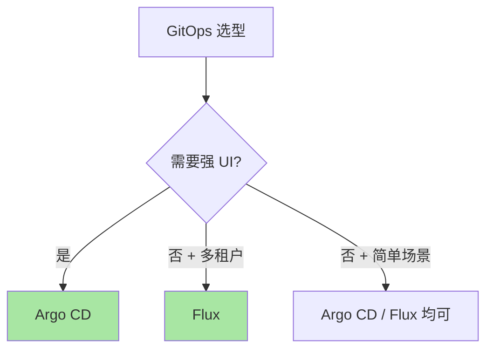

## 五、典型架构

### 5.1 Argo CD + Image Updater

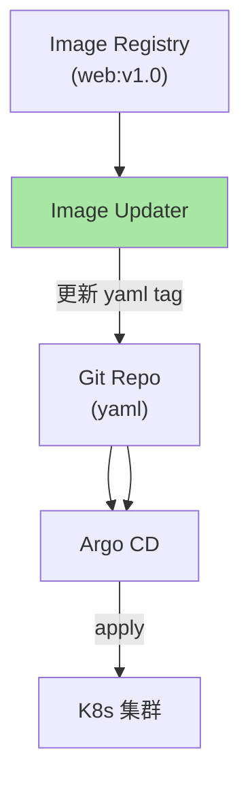

### 5.2 多集群 GitOps

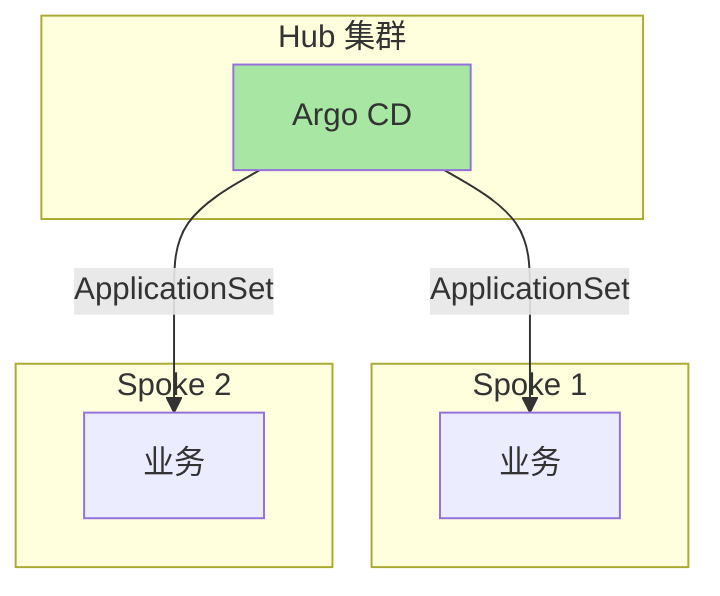

```yaml
# ApplicationSet 多集群部署
apiVersion: argoproj.io/v1alpha1
kind: ApplicationSet
metadata:
  name: web-multicluster
spec:
  generators:
  - list:
      elements:
      - cluster: spoke-1
        url: https://spoke-1.example.com
      - cluster: spoke-2
        url: https://spoke-2.example.com
  template:
    metadata:
      name: 'web-{cluster}'
    spec:
      project: default
      source:
        repoURL: https://github.com/myorg/myrepo
        path: manifests/web
      destination:
        server: '{url}'
        namespace: prod
```

## 六、生产实践

### 6.1 Argo CD 高可用

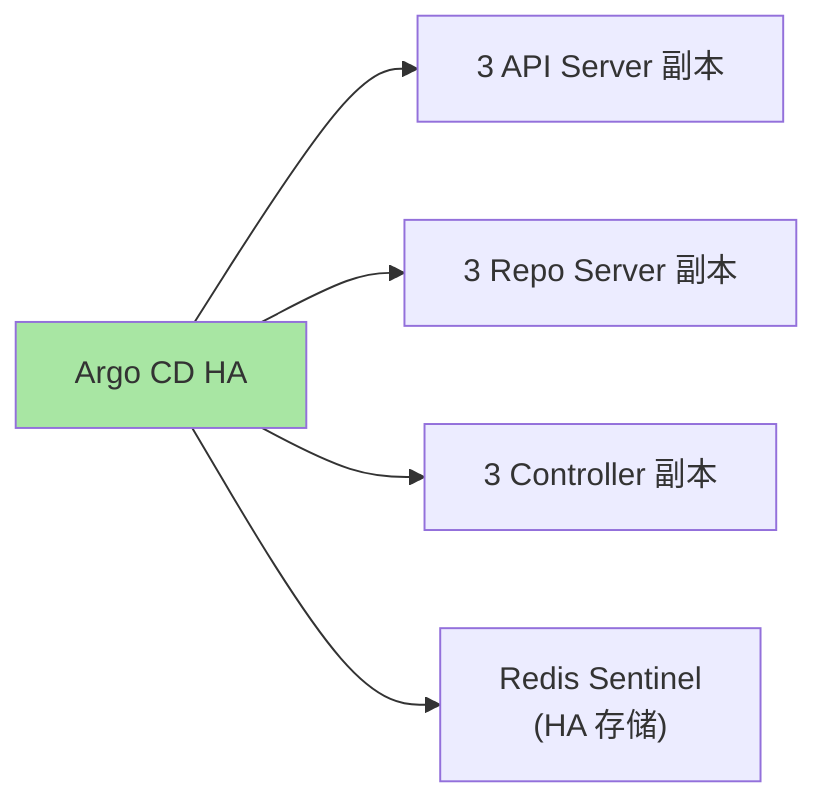

### 6.2 GitOps + 镜像签名验证

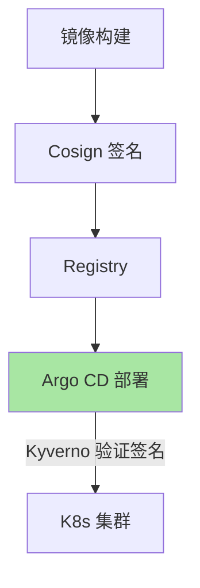

### 6.3 Progressive Delivery（渐进式发布）

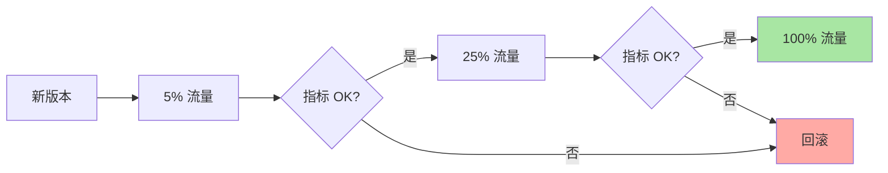

工具：Argo Rollouts / Flagger。

## 七、自测三问

1. **GitOps 和 CI/CD 的本质区别？**
   - CI/CD 把「部署」放在 CI 流水线（CI push 调集群）；GitOps 把「部署」放在 GitOps Controller（Git 是唯一真相源，Controller 持续调和）。

2. **Argo CD 的 selfHeal 和 prune 是什么？**
   - selfHeal：集群状态偏离 Git 时自动恢复；prune：Git 中移除的资源自动从集群删除。

3. **为什么生产需要 GitOps + 镜像签名？**
   - GitOps 保证「期望状态可追溯」；镜像签名保证「实际拉取的镜像是可信的」。两者结合实现「可追溯 + 可验证」。

## 📌 数据与事实声明

- 写于 2026-09-07，针对 K8s 1.30+
- Argo CD 当前版本：v2.10+
- Flux 当前版本：v2.x
- 行业认知：Argo CD 是 GitOps 事实标准（公开讨论）
- 免责：GitOps 工具演进快

## 📚 参考资料

| 类型 | 标题 | 来源 |
|---|---|---|
| 官方文档 | Argo CD | argoproj.github.io/cd/ |
| 官方文档 | Flux | fluxcd.io |
| 实战 | OpenGitOps | opengitops.dev |
| 实战 | Argo Rollouts | argoproj.github.io/rollouts/ |
