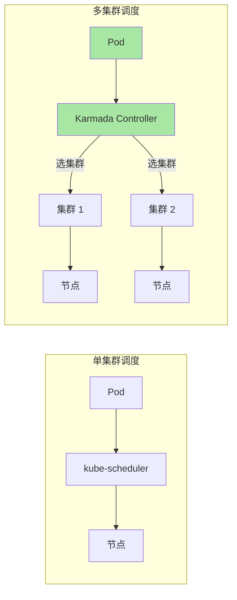
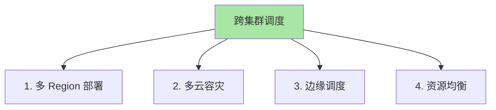
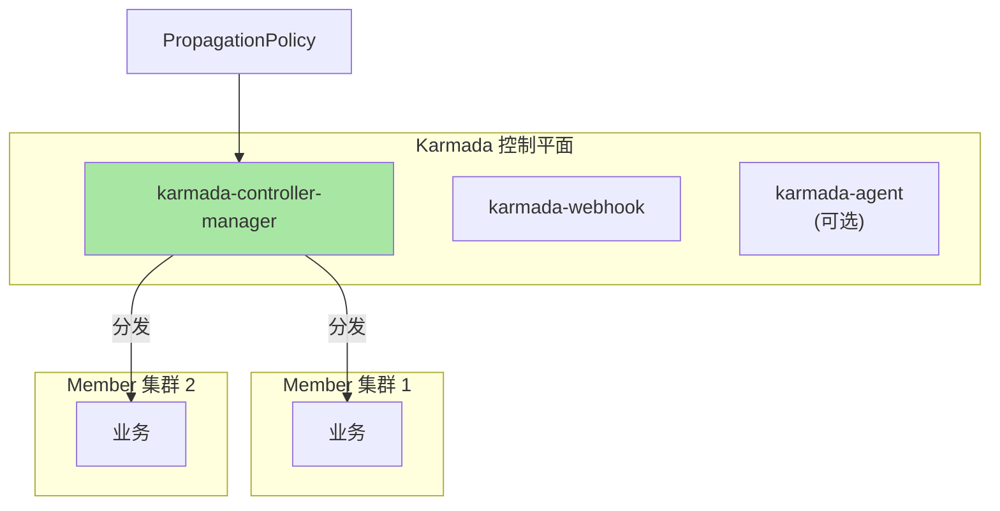
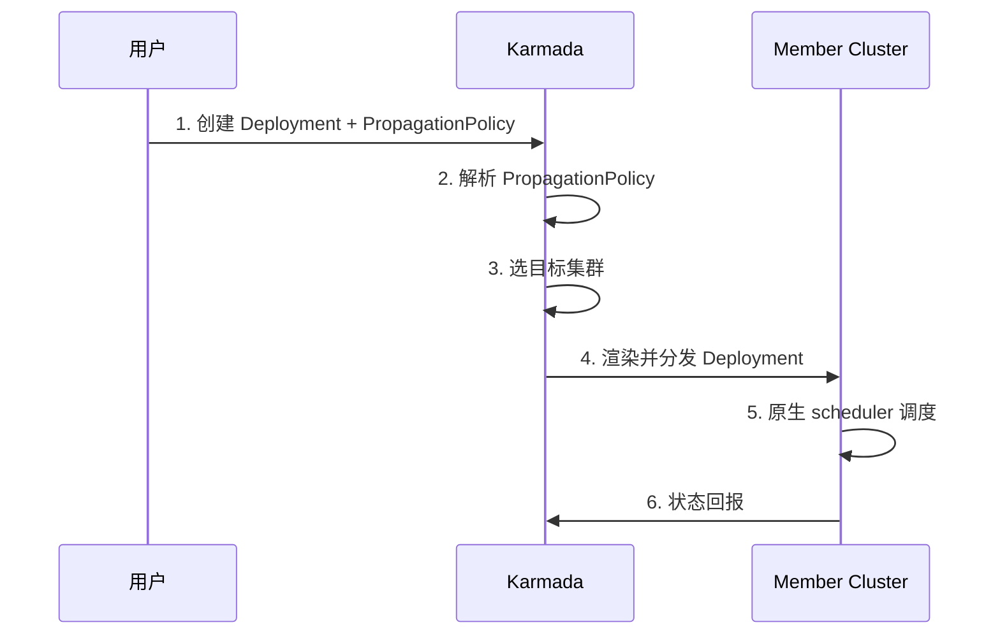
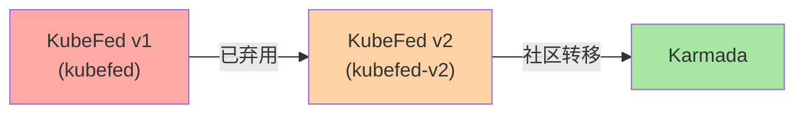
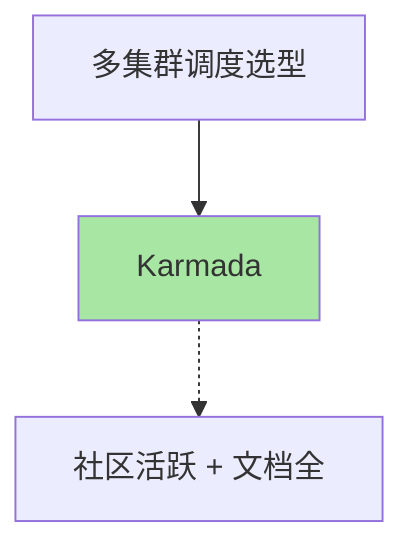
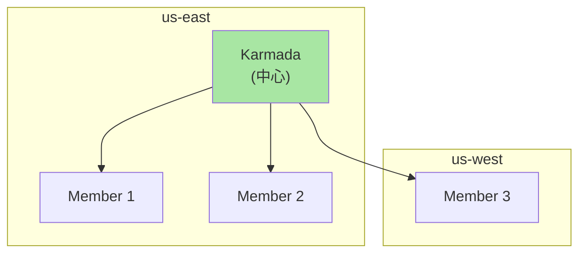
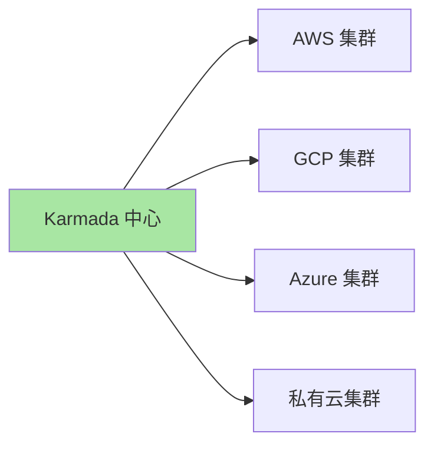
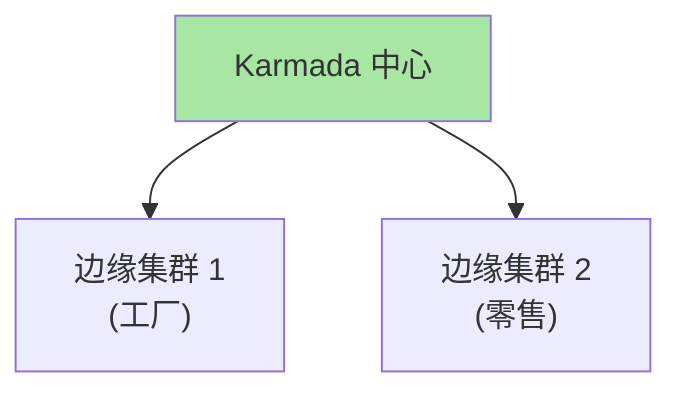
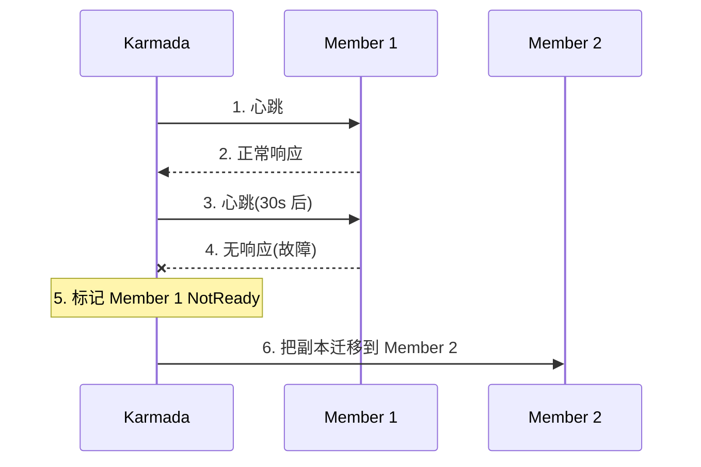

# K8s 联邦与跨集群调度：Karmada / KubeFed

> 单集群 Pod 调度是 scheduler 决定——多集群「Pod 调度到哪个集群」是 Karmada/KubeFed 决定。本篇讲清联邦架构、Karmada vs KubeFed、跨集群调度策略、生产实践。

## 一句话摘要

跨集群调度主流方案：Karmada（华为开源，CNCF 沙箱，多集群调度成熟）和 KubeFed（K8s 官方，kubefed 已被弃用，新版为 kubefed-v2）；Karmada 通过 PropagationPolicy 把资源分发到多个集群，支持 HA/多云/边缘场景。

## 一、为什么需要联邦

### 1.1 单集群调度 vs 多集群调度



**关键认知**：单集群调度是「Pod → 节点」，多集群调度是「Pod → 集群 → 节点」。

### 1.2 多集群调度的价值



## 二、Karmada 架构

### 2.1 三大组件



### 2.2 关键 CRD

| CRD | 作用 |
|---|---|
| **Cluster** | 成员集群注册 |
| **PropagationPolicy** | 资源分发策略 |
| **OverridePolicy** | 集群级覆盖策略 |
| **Work** | Karmada 内部工作单元 |

### 2.3 核心工作流



## 三、Karmada 部署

### 3.1 安装

```bash
# 1. 下载 karmadactl
curl -sSL https://github.com/karmada-io/karmada/releases/latest/download/karmadactl -o karmadactl
chmod +x karmadactl

# 2. 初始化 Karmada
karmadactl init

# 3. 加入成员集群
karmadactl join --cluster-kubeconfig=/path/to/member.yaml --cluster-name=member-1
```

### 3.2 PropagationPolicy 示例

```yaml
# 1. PropagationPolicy（资源分发）
apiVersion: policy.karmada.io/v1alpha1
kind: PropagationPolicy
metadata:
  name: web-propagation
spec:
  resourceSelectors:
  - apiVersion: apps/v1
    kind: Deployment
    name: web
  placement:
    clusterAffinity:
      clusterNames:
      - member-1
      - member-2
    replicaDistribution:
      replicas: 2
    spreadConstraints:
    - maxSkew: 1
      topologyKey: topology.kubernetes.io/region
---
# 2. 用户创建 Deployment（Karmada 自动分发）
apiVersion: apps/v1
kind: Deployment
metadata:
  name: web
spec:
  replicas: 4
  template:
    spec:
      containers:
      - name: web
        image: myapp:1.0
```

**效果**：4 副本 Deployment 自动分发到 member-1（2 副本）+ member-2（2 副本）。

### 3.3 多 Region 调度

```yaml
spec:
  placement:
    spreadConstraints:
    - maxSkew: 1
      topologyKey: topology.kubernetes.io/region
    - maxSkew: 2
      topologyKey: topology.kubernetes.io/zone
```

**含义**：副本在不同 region 最多差 1 个；在不同 zone 最多差 2 个。

## 四、Karmada vs KubeFed

### 4.1 KubeFed 简史



### 4.2 对比

| 维度 | Karmada | KubeFed v2 |
|---|---|---|
| **CNCF 状态** | Sandbox | Sandbox |
| **维护方** | 华为 + 社区 | K8s SIG |
| **架构** | 中心化 + Agent 可选 | 中心化 |
| **集群集成** | Pull + Push | Push |
| **资源分发** | PropagationPolicy | ClusterResourcePlacement |
| **学习曲线** | 平缓 | 较陡 |
| **生产就绪** | ✅ 较多企业采用 | ⚠️ 采用较少 |
| **HA** | ✅ 内置 | ⚠️ 需手动 |

### 4.3 推荐选择



**关键认知**：KubeFed v1 已弃用，v2 采用率不高——**生产推荐 Karmada**。

## 五、典型架构

### 5.1 多 Region HA



### 5.2 多云混合



### 5.3 云边协同



## 六、生产实践

### 6.1 故障转移



### 6.2 OverridePolicy 集群差异化

```yaml
# 不同集群用不同镜像 tag
apiVersion: policy.karmada.io/v1alpha1
kind: OverridePolicy
metadata:
  name: web-image-override
spec:
  resourceSelectors:
  - apiVersion: apps/v1
    kind: Deployment
    name: web
  overrides:
  - clusterName: dev
    imageOverrides:
    - image: web
      tag: latest
  - clusterName: prod
    imageOverrides:
    - image: web
      tag: v1.0
```

### 6.3 资源调度策略

```yaml
# 多维度调度
spec:
  placement:
    clusterAffinity:
      matchLabels:
        cloud: aws
        region: us-east-1
    replicaScheduling:
      replicaDivisionPreference: Weighted    # 加权调度
      replicaWeights:
      - clusterName: prod-1
        weight: 3
      - clusterName: prod-2
        weight: 1
```

## 七、自测三问

1. **Karmada 和 kube-scheduler 的本质区别？**
   - kube-scheduler 调度「Pod → 节点」（单集群内）；Karmada 调度「资源 → 集群 + 副本分布」（多集群间）。两者职责不重叠，组合使用。

2. **KubeFed v1 为什么被弃用？**
   - v1 架构复杂（ClusterRegistry + Federated API）+ 同步机制脆弱。社区转移到 Karmada 或 KubeFed v2，但 v2 采用率不高。

3. **Karmada HA 如何实现？**
   - Karmada 控制平面本身可以多副本部署 + etcd 高可用；Member 集群故障时自动迁移副本。

## 📌 数据与事实声明

- 写于 2026-09-07，针对 K8s 1.30+
- Karmada 当前版本：v1.x
- KubeFed v1 已弃用（kubefed）；KubeFed v2 在维护但采用率低
- 行业认知：Karmada 是多集群调度主流（公开讨论）
- 免责：多集群工具演进快

## 📚 参考资料

| 类型 | 标题 | 来源 |
|---|---|---|
| 官方文档 | Karmada | karmada.io |
| 官方文档 | KubeFed | github.com/kubernetes-sigs/kubefed |
| 实战 | Karmada Quick Start | karmada.io/docs/quickstart/ |
| 实战 | Multi-cluster Scheduling | kubernetes.io/docs/concepts/architecture/ |
