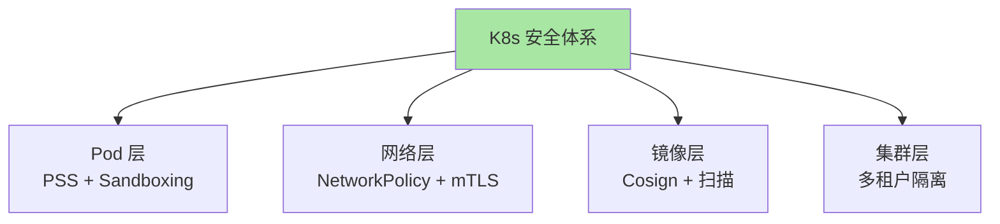

# K8s 安全与多租户专题导读：从 Pod 到集群

> L3 专题层子系列 C 导读。讲清 3 篇覆盖范围、与 L2 抽象层的关系。

## 一、这个专题讲什么

L2 子系列 B 篇 4 讲了 RBAC 基础（权限模型），本专题聚焦**生产级 K8s 安全加固**——

```
篇 1  Pod Security Standards 与 Pod Sandboxing       ← Pod 层安全
篇 2  Network Policy 实战 + 服务网格安全            ← 网络层安全
篇 3  镜像安全（Trivy / Cosign / Sigstore）+ 多租户隔离  ← 镜像 + 集群层
```

## 二、3 篇逻辑关系



## 三、与 L2 抽象层的关系

| L2 子系列 B | L3 本专题 |
|---|---|
| 篇 4 RBAC 与多租户 | → 篇 3 多租户隔离（深挖隔离设计） |
| 篇 5 NetworkPolicy | → 篇 2 NetworkPolicy 实战（深挖配置 + 服务网格） |
| — | → 篇 1 Pod Security Standards（新内容） |
| — | → 篇 3 镜像安全（详见 L2 子系列 C 篇 5） |

## 四、与相邻专题的关系

| 专题（安全） | 专题（生产化） | 专题（多集群） |
|---|---|---|
| 篇 1 PSS | ← 篇 2 升级（升级时验证 PSS） | — |
| 篇 3 多租户 | — | → 篇 1 多集群架构 |

## 五、读完后你能做什么

- ✅ 启用 Pod Security Standards（替换已弃用的 PSP）
- ✅ 配置 NetworkPolicy 零信任网络
- ✅ 选型 Pod Sandboxing 方案（gVisor / Kata）
- ✅ 部署 Cosign 镜像签名验证
- ✅ 设计多租户隔离架构

## 📌 数据与事实声明

- 写于 2026-09-07，针对 K8s 1.30+
- PSP 已弃用（K8s 1.25），被 PodSecurity 取代
- 行业认知：K8s 安全事件 TOP 3 = 配置错误/镜像投毒/权限过大（公开讨论）
- 免责：安全工具演进快

## 📚 参考资料

| 类型 | 标题 | 来源 |
|---|---|---|
| 官方文档 | Pod Security Standards | kubernetes.io/docs/concepts/security/pod-security-standards/ |
| 官方文档 | Network Policies | kubernetes.io/docs/concepts/services-networking/network-policies/ |
| 系列 index | `docs/devops/kubernetes/专题层/K8s安全与多租户专题/` | 本仓库 |
