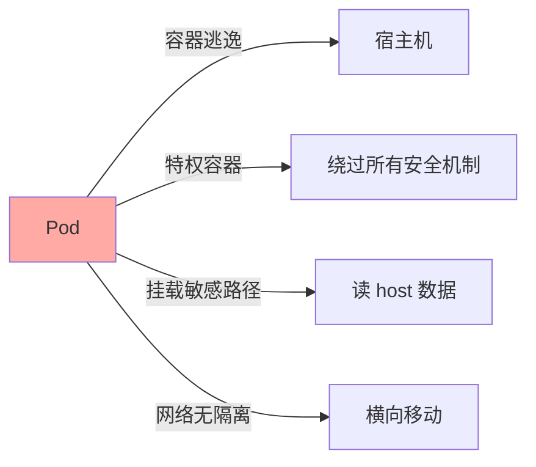
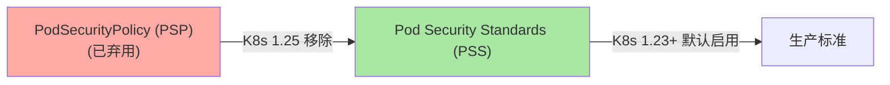
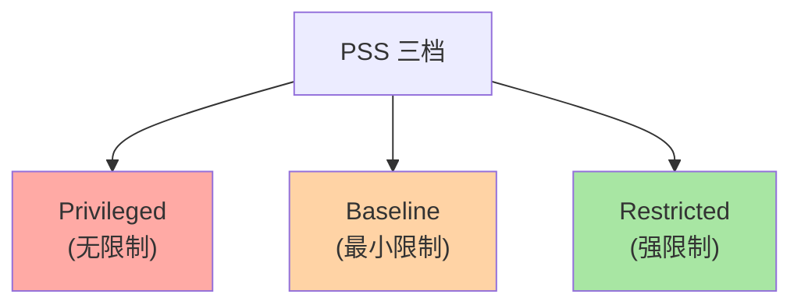
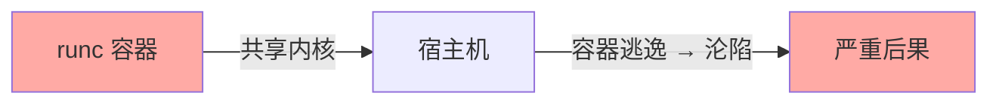
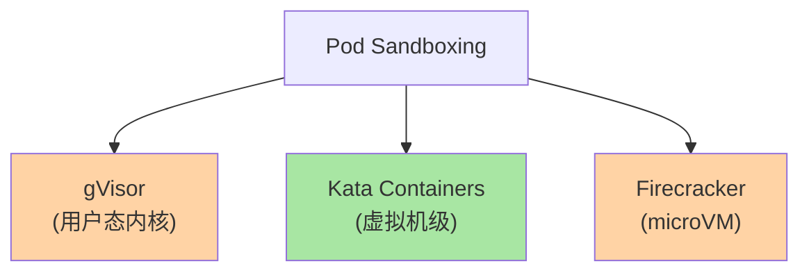
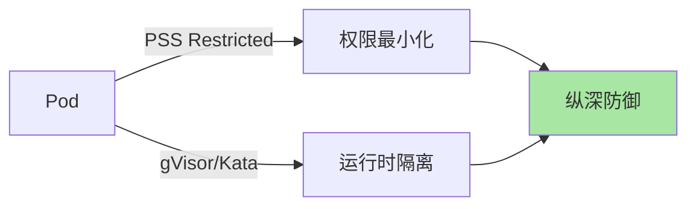
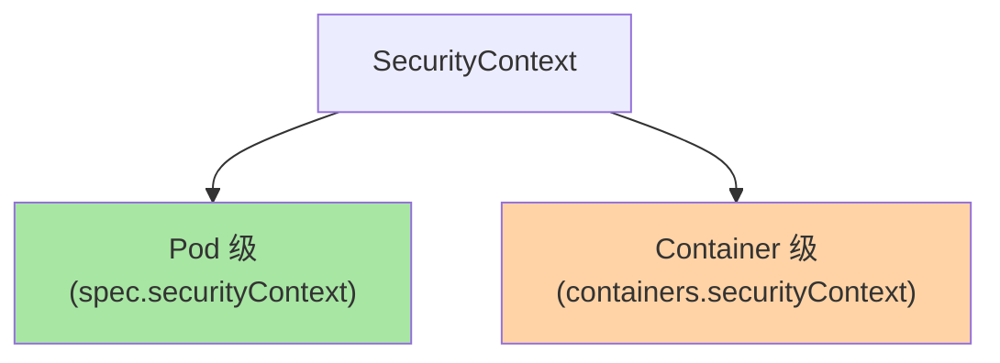
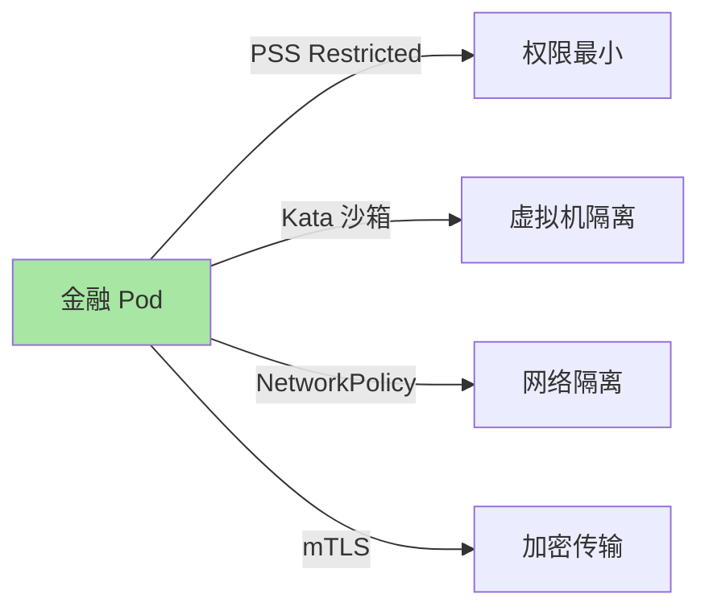
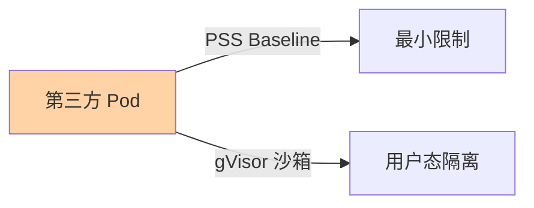

# K8s Pod 安全：Pod Security Standards 与 Pod Sandboxing

> Pod 是 K8s 最小调度单位——Pod 安全是整个集群安全的基石。本篇讲清 Pod Security Standards（PSS，取代已弃用的 PSP）、Pod Sandboxing（gVisor/Kata）、典型配置。

## 一句话摘要

Pod Security Standards（PSS）三档（Privileged/Baseline/Restricted）控制 Pod 权限；Pod Sandboxing（gVisor/Kata）提供额外隔离层（用户态内核/虚拟机级）；生产推荐「Restricted + RuntimeClass 沙箱」双重防御。

## 一、Pod 安全基础

### 1.1 Pod 的攻击面



**关键认知**：容器共享宿主机内核——容器逃逸 = 宿主机沦陷。

### 1.2 K8s 安全演进



## 二、Pod Security Standards (PSS)

### 2.1 三档标准



| 档位 | 限制 | 适用 |
|---|---|---|
| **Privileged** | 无 | 系统组件（kube-proxy/CSI） |
| **Baseline** | 禁止特权容器等高危配置 | 大多数业务 |
| **Restricted** | 强限制（no root、只读 fs 等） | 安全敏感场景 |

### 2.2 各档具体限制

| 项 | Privileged | Baseline | Restricted |
|---|---|---|---|
| 特权容器 | ✅ | ❌ | ❌ |
| 主机命名空间 | ✅ | ❌ | ❌ |
| 主机路径 | ✅ | ❌ | ❌ |
| 危险 capabilities | ✅ | 部分禁止 | 全部禁止 |
| 以 root 运行 | ✅ | ✅ | ❌（必须非 root） |
| 容器 root fs 可写 | ✅ | ✅ | ❌（只读） |
| seccomp | ✅ | ✅ | 必须 RuntimeDefault |

### 2.3 命名空间级启用

```yaml
# 1. namespace 打标签
apiVersion: v1
kind: Namespace
metadata:
  name: prod
  labels:
    pod-security.kubernetes.io/enforce: restricted        # 强制
    pod-security.kubernetes.io/enforce-version: latest
    pod-security.kubernetes.io/audit: restricted          # 审计
    pod-security.kubernetes.io/warn: restricted           # 警告
```

### 2.4 三种执行模式

| 模式 | 行为 |
|---|---|
| **enforce** | 违反拒绝创建 |
| **audit** | 违反记录到审计日志（不阻止） |
| **warn** | 违反产生警告（不阻止） |

**推荐**：
```yaml
# 生产 namespace
pod-security.kubernetes.io/enforce: restricted
pod-security.kubernetes.io/audit: restricted
pod-security.kubernetes.io/warn: restricted

# 临时 namespace（测试）
pod-security.kubernetes.io/enforce: baseline
```

## 三、Pod Sandboxing（运行时隔离）

### 3.1 为什么需要沙箱



**关键认知**：runc 容器共享宿主机内核——一旦容器逃逸，攻击者获得宿主机权限。

### 3.2 三大沙箱方案



### 3.3 三大方案对比

| 维度 | gVisor | Kata Containers | Firecracker |
|---|---|---|---|
| **隔离层** | 用户态内核 | 虚拟机级 | microVM |
| **性能开销** | 中（20-30%） | 高（30-50%） | 中 |
| **启动速度** | 快（< 1s） | 慢（5-10s） | 快（< 100ms） |
| **成熟度** | Google 维护 | OpenInfra | AWS |
| **适用** | 多租户 / 通用 | 安全敏感 | Serverless |

### 3.4 RuntimeClass 配置

```yaml
# 1. 安装 RuntimeClass（gVisor）
apiVersion: node.k8s.io/v1
kind: RuntimeClass
metadata:
  name: gvisor
handler: runsc
---
# 2. Pod 使用 gVisor
spec:
  runtimeClassName: gvisor
  containers:
  - name: app
    image: myapp:1.0
```

### 3.5 Kata Containers 配置

```yaml
# 1. 安装 Kata
apiVersion: node.k8s.io/v1
kind: RuntimeClass
metadata:
  name: kata
handler: kata
---
# 2. Pod 使用 Kata
spec:
  runtimeClassName: kata
  containers:
  - name: app
    image: myapp:1.0
    resources:
      requests:
        memory: 1Gi      # Kata 启动较慢，需要更多内存
```

## 四、PSS + 沙箱组合

### 4.1 双重防御



### 4.2 配置示例

```yaml
# namespace PSS + Pod RuntimeClass
apiVersion: v1
kind: Namespace
metadata:
  name: finance
  labels:
    pod-security.kubernetes.io/enforce: restricted
---
apiVersion: v1
kind: Pod
metadata:
  name: payment
  namespace: finance
spec:
  runtimeClassName: kata     # 强隔离
  containers:
  - name: app
    image: payment:1.0
    securityContext:
      runAsNonRoot: true      # PSS Restricted 要求
      readOnlyRootFilesystem: true
      allowPrivilegeEscalation: false
      capabilities:
        drop: ["ALL"]
      seccompProfile:
        type: RuntimeDefault
```

## 五、其他 Pod 安全配置

### 5.1 SecurityContext 三层



### 5.2 关键字段

```yaml
spec:
  securityContext:                 # Pod 级
    runAsNonRoot: true
    runAsUser: 1000
    fsGroup: 2000
    seccompProfile:
      type: RuntimeDefault
  containers:
  - name: app
    image: myapp:1.0
    securityContext:               # Container 级
      allowPrivilegeEscalation: false
      readOnlyRootFilesystem: true
      runAsNonRoot: true
      runAsUser: 1000
      capabilities:
        drop: ["ALL"]
        add: ["NET_BIND_SERVICE"]  # 仅在需要时添加
```

### 5.3 推荐基线

```yaml
# 任何生产 Pod 应包含
securityContext:
  runAsNonRoot: true                 # 非 root
  allowPrivilegeEscalation: false    # 禁止提权
  readOnlyRootFilesystem: true       # 只读 fs（tmpfs 例外）
  capabilities:
    drop: ["ALL"]                     # 删除所有 capabilities
  seccompProfile:
    type: RuntimeDefault              # seccomp 默认
```

## 六、典型场景

### 6.1 多租户隔离

```yaml
# tenant-a namespace
apiVersion: v1
kind: Namespace
metadata:
  name: tenant-a
  labels:
    name: tenant-a
    pod-security.kubernetes.io/enforce: restricted
---
# tenant-a 网络隔离（详见 L2 子系列 B 篇 5）
apiVersion: networking.k8s.io/v1
kind: NetworkPolicy
metadata:
  name: tenant-a-isolation
  namespace: tenant-a
spec:
  podSelector: {}
  policyTypes: [Ingress, Egress]
  ingress:
  - from:
    - namespaceSelector:
        matchLabels: { name: tenant-a }
  egress:
  - to:
    - namespaceSelector:
        matchLabels: { name: tenant-a }
```

### 6.2 金融级安全（Kata + Restricted）



### 6.3 第三方应用（Baseline + gVisor）



## 七、自测三问

1. **PSP 为什么被弃用？**
   - PSP 配置复杂、权限过大、违反最小权限原则。K8s 1.25 移除；PSS 是替代方案（更简单 + 默认在 namespace 启用）。

2. **gVisor 和 Kata 的本质区别？**
   - gVisor 是「用户态内核」（拦截所有系统调用，在用户态重实现）；Kata 是「虚拟机级隔离」（每个 Pod 独立轻量虚拟机）。前者性能开销小，后者隔离更强。

3. **Restricted PSS 必须包含哪些安全配置？**
   - 必须：runAsNonRoot + readOnlyRootFilesystem + allowPrivilegeEscalation=false + capabilities drop ALL + seccompProfile RuntimeDefault。

## 📌 数据与事实声明

- 写于 2026-09-07，针对 K8s 1.30+
- PSP 移除：K8s 1.25（2022-08）
- PSS 引入：K8s 1.23（2021-12）默认启用
- gVisor 当前版本：v2024.x
- Kata 当前版本：v3.x
- 行业认知：金融/医疗行业普遍使用 Kata + Restricted（公开讨论）
- 免责：沙箱方案演进快

## 📚 参考资料

| 类型 | 标题 | 来源 |
|---|---|---|
| 官方文档 | Pod Security Standards | kubernetes.io/docs/concepts/security/pod-security-standards/ |
| 官方文档 | RuntimeClass | kubernetes.io/docs/concepts/containers/runtime-class/ |
| 官方文档 | gVisor | gvisor.dev |
| 官方文档 | Kata Containers | katacontainers.io |
| 实战 | PSP Migration Guide | kubernetes.io/docs/reference/access-authn-authz/psp-to-pod-security-standards/ |
