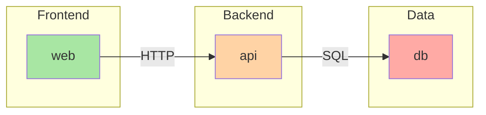
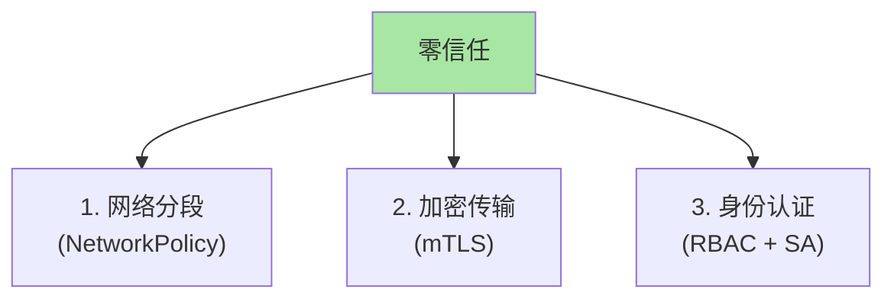
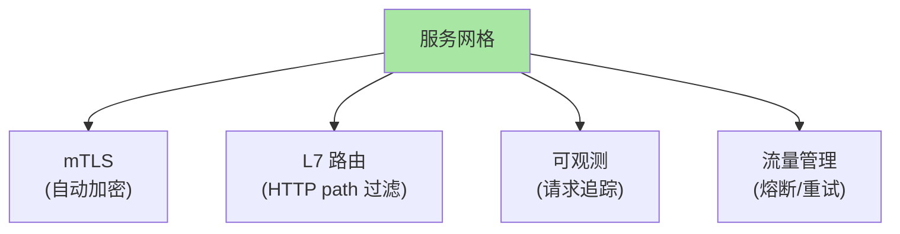
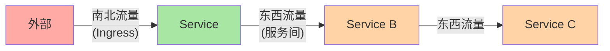
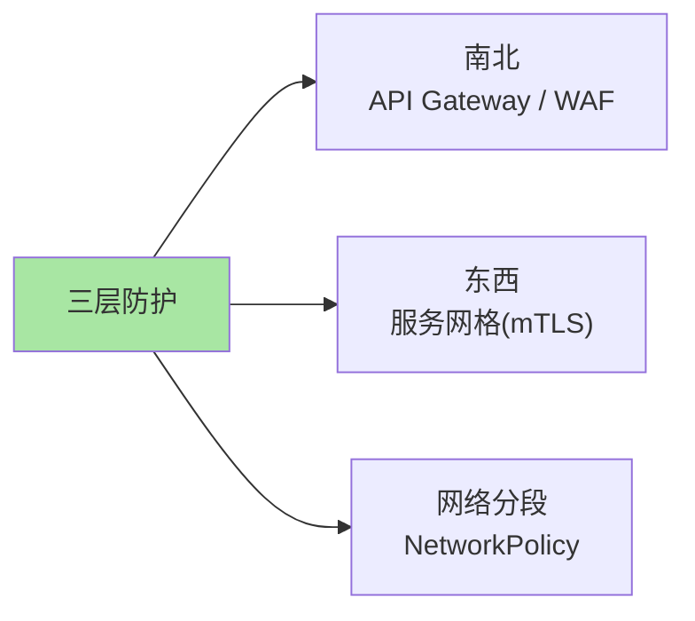
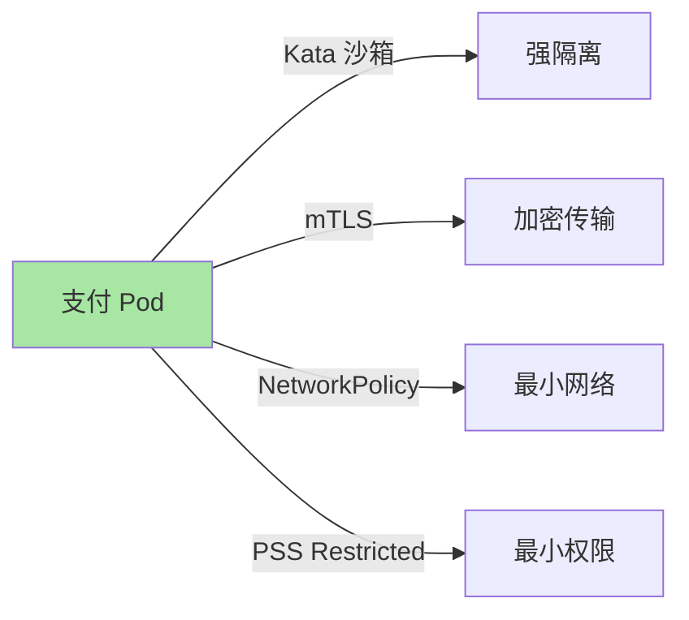

# K8s NetworkPolicy 实战 + 服务网格安全

> L2 子系列 B 篇 5 讲了 NetworkPolicy 基础。本篇讲清生产实战（零信任架构、典型配置）、服务网格（Istio/Linkerd）补足的能力（mTLS/L7）、NetworkPolicy 与服务网格的边界。

## 一句话摘要

NetworkPolicy 解决 L3/L4 网络隔离；服务网格（Istio/Linkerd）补 mTLS/L7 路由/可观测；生产推荐「NetworkPolicy 实现网络分段 + 服务网格实现东西向加密 + API Gateway 实现南北向防护」三层防御。

## 一、NetworkPolicy 实战

### 1.1 实战场景 1：微服务三层隔离



**策略**：
- DB 只接受来自 api 的 SQL 连接
- API 只接受来自 web 的 HTTP
- web 接受来自外部 Ingress 的 HTTP

### 1.2 DB 隔离策略

```yaml
apiVersion: networking.k8s.io/v1
kind: NetworkPolicy
metadata:
  name: db-isolation
  namespace: prod
spec:
  podSelector:
    matchLabels:
      app: db
  policyTypes: [Ingress, Egress]
  ingress:
  - from:
    - podSelector:
        matchLabels:
          app: api          # 只允许 api 访问
    ports:
    - protocol: TCP
      port: 5432            # PostgreSQL
  egress:
  - to:
    - namespaceSelector:
        matchLabels:
          name: kube-system
    ports:
    - protocol: UDP
      port: 53              # DNS
```

### 1.3 API 隔离策略

```yaml
apiVersion: networking.k8s.io/v1
kind: NetworkPolicy
metadata:
  name: api-isolation
  namespace: prod
spec:
  podSelector:
    matchLabels:
      app: api
  policyTypes: [Ingress, Egress]
  ingress:
  - from:
    - podSelector:
        matchLabels:
          app: web          # 只允许 web 访问
    - namespaceSelector:
        matchLabels:
          name: ingress     # 也允许 Ingress namespace
    ports:
    - protocol: TCP
      port: 8080
  egress:
  - to:
    - podSelector:
        matchLabels:
          app: db
    ports:
    - protocol: TCP
      port: 5432
  - to:
    - namespaceSelector:
        matchLabels:
          name: kube-system
    ports:
    - protocol: UDP
      port: 53
```

## 二、零信任架构

### 2.1 三层零信任



### 2.2 实施步骤

```markdown
□ 1. 集群级默认拒绝
□ 2. 按服务放行（白名单）
□ 3. 启用 mTLS（服务网格）
□ 4. 配置 Pod Security Standards
□ 5. 启用审计日志
```

### 2.3 集群级默认拒绝

```yaml
apiVersion: networking.k8s.io/v1
kind: NetworkPolicy
metadata:
  name: default-deny-all
  namespace: kube-system
spec:
  podSelector: {}
  policyTypes: [Ingress, Egress]
  # ingress / egress 为空 = 默认拒绝
```

**关键认知**：必须**显式放行**才能互通——白名单原则。

## 三、服务网格：补 L4 之外的能力

### 3.1 服务网格能做什么



### 3.2 与 NetworkPolicy 边界

| 能力 | NetworkPolicy | 服务网格 |
|---|---|---|
| L3/L4 隔离 | ✅ | ✅ |
| L7 路由 | ❌ | ✅ |
| mTLS | ❌ | ✅ |
| 流量管理（重试/熔断） | ❌ | ✅ |
| 性能开销 | 低 | 中（sidecar） |
| 复杂度 | 低 | 高 |

### 3.3 Istio 部署

```bash
# 1. 安装 Istio
istioctl install --set profile=demo -y

# 2. 给 namespace 打标签（启用 sidecar 自动注入）
kubectl label namespace default istio-injection=enabled

# 3. 重启 Pod 让 sidecar 注入
kubectl rollout restart deployment -n default
```

### 3.4 mTLS 配置

```yaml
# 强制 mTLS（默认 Permissive 模式）
apiVersion: security.istio.io/v1beta1
kind: PeerAuthentication
metadata:
  name: default
  namespace: istio-system
spec:
  mtls:
    mode: STRICT                # 强制 mTLS
```

### 3.5 L7 NetworkPolicy

```yaml
# Cilium L7 策略（基于 HTTP path 过滤）
apiVersion: cilium.io/v2
kind: CiliumNetworkPolicy
metadata:
  name: api-l7-policy
spec:
  endpointSelector:
    matchLabels: { app: api }
  ingress:
  - fromEndpoints:
    - matchLabels: { app: web }
    toPorts:
    - ports:
      - port: "80"
        protocol: TCP
      rules:
        http:
        - method: "GET"
          path: "/api/v1/.*"
```

## 四、东西流量与南北流量

### 4.1 三向流量



### 4.2 三层防护



### 4.3 推荐组合

| 流量方向 | 推荐方案 |
|---|---|
| **南北流量** | API Gateway（Kong/Ambassador）+ WAF |
| **东西流量** | 服务网格（Istio/Linkerd）|
| **网络分段** | NetworkPolicy（Cilium/Calico）|

## 五、典型场景

### 5.1 金融场景



### 5.2 多租户 SaaS

```yaml
# tenant-a 完全隔离
apiVersion: networking.k8s.io/v1
kind: NetworkPolicy
metadata:
  name: tenant-a-isolation
  namespace: tenant-a
spec:
  podSelector: {}
  policyTypes: [Ingress, Egress]
  ingress:
  - from:
    - namespaceSelector:
        matchLabels: { name: tenant-a }
    - namespaceSelector:
        matchLabels: { name: ingress }
  egress:
  - to:
    - namespaceSelector:
        matchLabels: { name: tenant-a }
    - namespaceSelector:
        matchLabels: { name: kube-system }  # DNS
    - ipBlock:
        cidr: 0.0.0.0/0
        except: [10.0.0.0/8]                # 不允许访问内网
```

### 5.3 第三方应用

```yaml
# 第三方应用 + gVisor 沙箱 + 最小网络
apiVersion: node.k8s.io/v1
kind: RuntimeClass
metadata: { name: gvisor }
handler: runsc
---
apiVersion: networking.k8s.io/v1
kind: NetworkPolicy
metadata:
  name: thirdparty-isolation
spec:
  podSelector:
    matchLabels: { vendor: thirdparty }
  policyTypes: [Ingress, Egress]
  ingress:
  - from:
    - podSelector:
        matchLabels: { app: gateway }   # 只接受来自 gateway 的请求
  egress:
  - to:
    - namespaceSelector:
        matchLabels: { name: kube-system }
    ports:
    - port: 53
```

## 六、自测三问

1. **NetworkPolicy 与服务网格的边界？**
   - NetworkPolicy 管 L3/L4（IP/端口/namespace）；服务网格管 mTLS/L7（HTTP path/method/header）。生产常组合使用。

2. **东西流量和南北流量的区别？**
   - 南北：外部到 Pod（Ingress/API Gateway 防护）；东西：Pod 到 Pod（服务网格 + NetworkPolicy 防护）。

3. **mTLS 为什么必须？**
   - 默认 Pod 间 HTTP 通信是明文——中间人攻击可窃听/篡改。mTLS 加密 + 双向认证——零信任基础。

## 📌 数据与事实声明

- 写于 2026-09-07，针对 K8s 1.30+
- Istio 当前版本：v1.22+
- Linkerd 当前版本：v2.15+
- 行业认知：Istio 是服务网格事实标准（公开讨论）
- 免责：服务网格演进快

## 📚 参考资料

| 类型 | 标题 | 来源 |
|---|---|---|
| 官方文档 | Network Policies | kubernetes.io/docs/concepts/services-networking/network-policies/ |
| 官方文档 | Istio Security | istio.io/latest/docs/concepts/security/ |
| 官方文档 | Linkerd Security | linkerd.io/2/features/ |
| 实战 | Zero Trust on K8s | kubernetes.io/docs/concepts/security/security-checklist/ |
