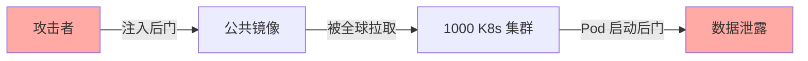
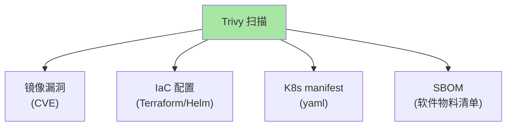
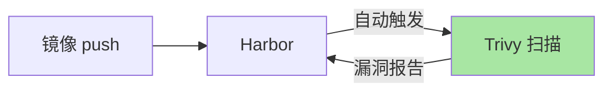
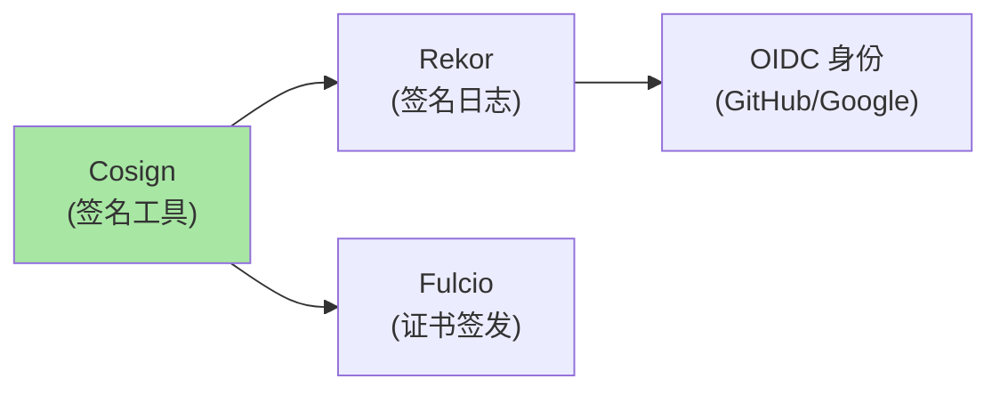
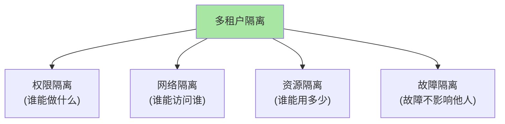
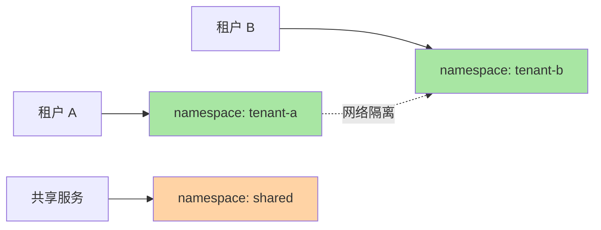
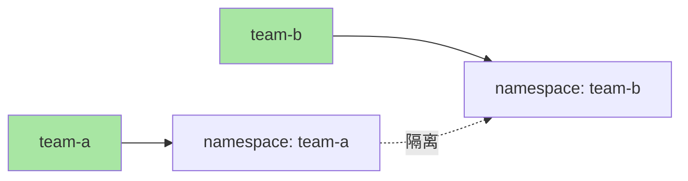
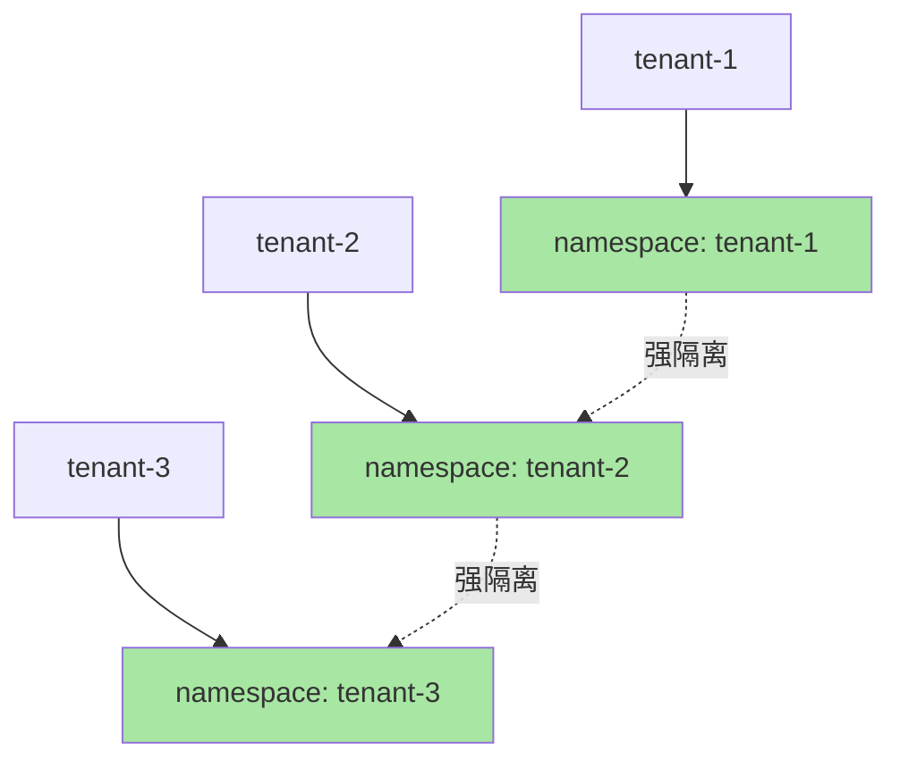
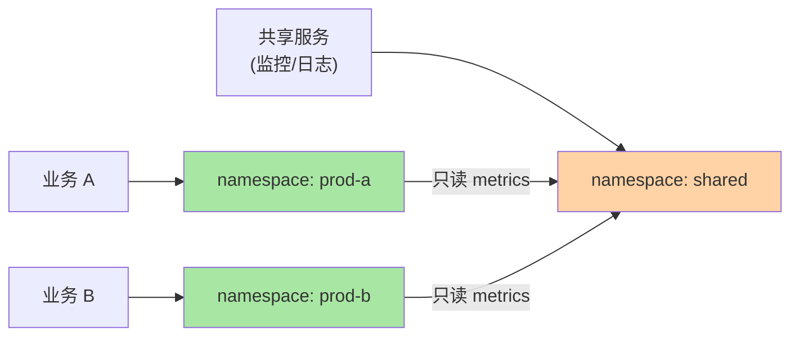
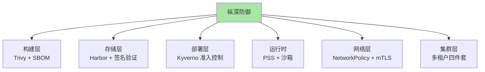

# K8s 镜像安全与多租户隔离：Trivy / Cosign / 多租户设计

> 镜像投毒 + 多租户权限混乱是 K8s 安全事件 TOP 3。本篇讲清镜像签名验证（Cosign/Sigstore）、漏洞扫描（Trivy）、多租户隔离设计（namespace + RBAC + NetworkPolicy + ResourceQuota 四件套）。

## 一句话摘要

镜像安全靠「Trivy 扫描漏洞 + Cosign 签名验证 + 准入控制拒绝未签名」三件套；多租户隔离靠「namespace 边界 + RBAC 权限 + NetworkPolicy 网络 + ResourceQuota 资源」四件套；两者结合构建完整纵深防御。

## 一、镜像安全基础

### 1.1 攻击场景



### 1.2 真实案例（公开报道）

- **2020 Codecov**：CI 工具被篡改
- **2021 SolarWinds**：供应链经典案例
- **2024 xz-utils**：开源工具被后门化

**关键认知**：供应链攻击是云原生时代 TOP 3 威胁（公开讨论）。

## 二、Trivy 漏洞扫描

### 2.1 Trivy 能力



### 2.2 部署方式

#### 2.2.1 Harbor 集成（推荐）



#### 2.2.2 K8s CronJob 模式

```yaml
apiVersion: batch/v1
kind: CronJob
metadata:
  name: trivy-scanner
spec:
  schedule: "0 2 * * *"   # 每天凌晨 2 点
  jobTemplate:
    spec:
      template:
        spec:
          containers:
          - name: trivy
            image: aquasec/trivy:latest
            args:
            - image
            - --severity
            - HIGH,CRITICAL
            - --exit-code
            - "1"
            - my-registry.com/web:v1.0
          restartPolicy: OnFailure
```

### 2.3 漏洞分级

| 等级 | 响应 |
|---|---|
| **Critical** | 立即修复/替换镜像 |
| **High** | 24h 内修复 |
| **Medium** | 一周内修复 |
| **Low** | 评估后决定 |

## 三、Cosign 镜像签名

### 3.1 Sigstore 生态



### 3.2 Cosign 签名流程

```mermaid
sequenceDiagram
    participant D as 开发者
    participant C as Cosign
    participant R as Registry
    participant V as 验证方

    D->>C: 1. cosign sign my-registry.com/web:v1.0
    C->>C: 2. 通过 OIDC 验证身份
    C->>R: 3. 签名附在镜像 manifest
    V->>C: 4. cosign verify my-registry.com/web:v1.0
    C->>R: 5. 拉取签名
    C->>V: 6. 验证签名合法性
    style C fill:#a8e6a3

```

### 3.3 Cosign 命令实战

```bash
# 1. 生成密钥对
cosign generate-key-pair

# 2. 签名镜像
cosign sign --key cosign.key my-registry.com/web:v1.0

# 3. 验证签名
cosign verify --key cosign.pub my-registry.com/web:v1.0

# 4. 签名 + 上传 SBOM
cosign sign --key cosign.key my-registry.com/web:v1.0
cosign attach sbom --sbom sbom.spdx.json my-registry.com/web:v1.0
```

### 3.4 K8s 准入控制验证（Kyverno）

```yaml
apiVersion: kyverno.io/v1
kind: ClusterPolicy
metadata:
  name: verify-cosign-signature
spec:
  validationFailureAction: Enforce
  rules:
  - name: verify-signature
    match:
      any:
      - resources:
          kinds:
          - Pod
    verifyImages:
    - imageReferences:
      - "my-registry.com/*"
      attestors:
      - entries:
        - keys:
            publicKeys: |-
              -----BEGIN PUBLIC KEY-----
              ...
              -----END PUBLIC KEY-----
```

## 四、多租户隔离设计

### 4.1 多租户挑战



### 4.2 四件套隔离

| 隔离维度 | 工具 |
|---|---|
| **权限** | RBAC（Role + RoleBinding） |
| **网络** | NetworkPolicy |
| **资源** | ResourceQuota + LimitRange |
| **运行时** | Pod Security Standards + RuntimeClass |

### 4.3 namespace 设计



### 4.4 完整多租户配置

```yaml
# 1. namespace
apiVersion: v1
kind: Namespace
metadata:
  name: tenant-a
  labels:
    name: tenant-a
    pod-security.kubernetes.io/enforce: restricted
---
# 2. RBAC（团队只读）
apiVersion: rbac.authorization.k8s.io/v1
kind: Role
metadata:
  name: tenant-a-developer
  namespace: tenant-a
rules:
- apiGroups: ["", "apps", "batch"]
  resources: ["*"]
  verbs: ["get", "list", "watch"]
---
# 3. NetworkPolicy（网络隔离）
apiVersion: networking.k8s.io/v1
kind: NetworkPolicy
metadata:
  name: tenant-a-isolation
  namespace: tenant-a
spec:
  podSelector: {}
  policyTypes: [Ingress, Egress]
  ingress:
  - from:
    - namespaceSelector:
        matchLabels: { name: tenant-a }
    - namespaceSelector:
        matchLabels: { name: ingress }
  egress:
  - to:
    - namespaceSelector:
        matchLabels: { name: tenant-a }
    - namespaceSelector:
        matchLabels: { name: kube-system }
---
# 4. ResourceQuota（资源限制）
apiVersion: v1
kind: ResourceQuota
metadata:
  name: tenant-a-quota
  namespace: tenant-a
spec:
  hard:
    pods: 50
    requests.cpu: 20
    requests.memory: 100Gi
    persistentvolumeclaims: 20
    services: 20
    secrets: 50
```

## 五、典型场景

### 5.1 内部多团队



### 5.2 SaaS 多租户



### 5.3 共享 + 专用混合



## 六、纵深防御全景



## 七、自测三问

1. **Cosign 签名和传统 PKI 签名的区别？**
   - Cosign 基于 Sigstore 基础设施，用 OIDC 身份（GitHub/Google）签发证书，**无需自建 CA**；传统 PKI 需要自己维护 CA/证书链。

2. **多租户隔离为什么必须四件套？**
   - RBAC 管权限、NetworkPolicy 管网络、ResourceQuota 管资源、PSS 管运行时——单件套都可能被绕过。

3. **Trivy 扫描和 Cosign 签名的互补关系？**
   - Trivy 检测「已知漏洞」（CVE）；Cosign 验证「来源可信」（签名）。前者防漏洞，后者防投毒。

## 📌 数据与事实声明

- 写于 2026-09-07，针对 K8s 1.30+
- Trivy 当前版本：v0.50+
- Cosign 当前版本：v2.x
- Sigstore GA：2023
- 行业认知：K8s 安全事件 TOP 3 = 配置错误/镜像投毒/权限过大（公开讨论）
- 免责：安全工具演进快

## 📚 参考资料

| 类型 | 标题 | 来源 |
|---|---|---|
| 官方文档 | Trivy | aquasecurity.github.io/trivy/ |
| 官方文档 | Cosign | docs.sigstore.dev/cosign/overview |
| 官方文档 | Multi-tenancy | kubernetes.io/docs/concepts/security/multi-tenancy/ |
| 实战 | Kyverno | kyverno.io |
| 实战 | SLSA | slsa.dev |
