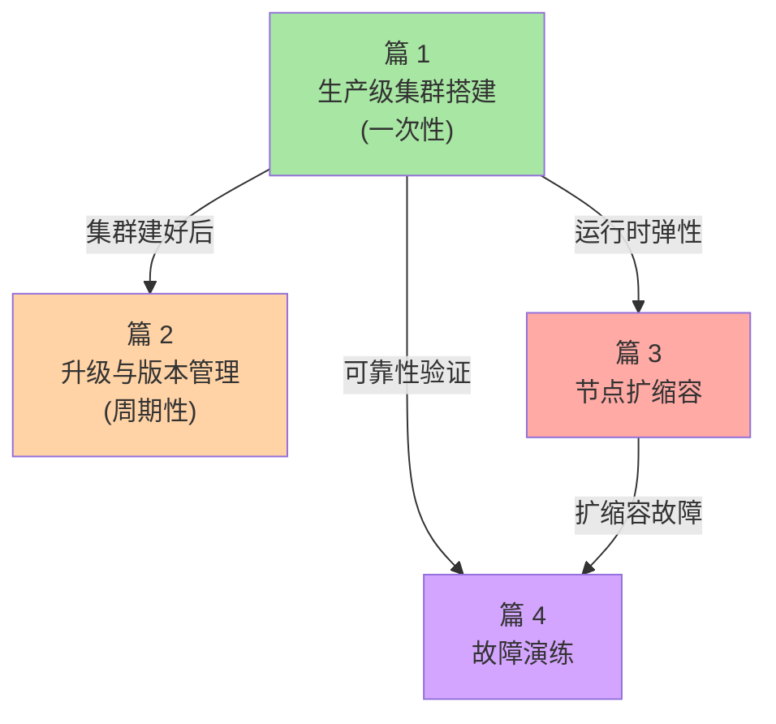

# K8s 生产化深度专题导读：从入门到生产的鸿沟

> L3 专题层子系列 A 导读。讲清专题定位、4 篇之间的逻辑、与 L1/L2/L4 的边界。**不重复入门层定义**。

## 一、这个专题讲什么

L1 入门层讲「K8s 是什么」、L2 特性层讲「K8s 怎么工作」——但「把 K8s 用在生产环境」是另一套问题：

- 怎么搭一个**生产级集群**（不是 minikube）
- 怎么**升级**不挂（滚动升级 + etcd 备份）
- 怎么**弹性扩缩**节点（CA + Spot 实例）
- 怎么**容灾演练**（Chaos Engineering + 故障注入）

本专题聚焦「生产化」这一鸿沟的 4 个核心问题：

```
篇 1  生产级集群搭建（HA / 多 AZ / 网络规划）
篇 2  升级与版本管理（1.x → 1.30+ 演进）
篇 3  节点扩缩容与集群弹性
篇 4  故障演练与容灾（Chaos Engineering）
```

## 二、4 篇之间的逻辑关系



读路径：
- **新接手集群**：篇 1 → 2 → 3 → 4
- **生产事故后复盘**：篇 4 → 1（看架构弱点）

## 三、与 L1/L2/L4 的关系

| L1 入门层 | L2 特性层 | L3 本专题 | L4 整合层 |
|---|---|---|---|
| 篇 1 K8s 是什么 | — | → 篇 1 生产级集群搭建（深挖「怎么搭」） | — |
| — | 篇 1 Scheduler | → 篇 3 节点扩缩容（CA 调用 scheduler） | — |
| — | — | — | → 篇 1 K8s 架构全景 |

## 四、与相邻专题的关系

| 专题（生产化） | 专题（可观测性） | 专题（安全） | 专题（多集群） |
|---|---|---|---|
| 篇 1 集群搭建 | — | → 篇 1 Pod Security Standards | → 篇 1 多集群架构 |
| 篇 2 升级 | → 篇 1 Prometheus | — | — |
| 篇 4 故障演练 | → 篇 3 全链路追踪 | → 篇 2 Network Policy 实战 | — |

## 五、读完后你能做什么

- ✅ 设计生产级 K8s 集群架构（HA / 多 AZ / etcd 备份策略）
- ✅ 制定版本升级计划 + 风险预案
- ✅ 配置 Cluster Autoscaler + Spot 实例降本
- ✅ 用 Chaos Engineering 验证生产环境韧性

## 六、与相邻分类的关系

- **architecture/system-design/**：分布式系统设计的「高可用/高扩展」概念在 `distributed-system-design/` 系列；本专题是 K8s 实现（不复写）
- **devops/docker/**：容器底座——生产集群需要考虑 containerd vs Docker Engine 选型（见 L1 篇 2）
- **middleware/**：RocketMQ 等中间件在 K8s 上的部署属于「生产化」的一部分，但中间件细节在 middleware 分类

## 📌 数据与事实声明

- 写于 2026-09-07，针对 K8s 1.30+
- K8s n-2 版本支持：官方每个版本支持 ~14 个月，n-2 是最低支持线
- 行业认知：80%+ 生产集群采用云厂商托管（EKS/GKE/AKS），自建比例下降（公开统计）
- 免责：云厂商 SLA 各异，本专题以通用机制为主

## 📚 参考资料

| 类型 | 标题 | 来源 |
|---|---|---|
| 官方文档 | Production Environment | kubernetes.io/docs/setup/production-environment/ |
| 官方文档 | High Availability | kubernetes.io/docs/setup/production-environment/tools/kubeadm/high-availability/ |
| 系列 index | `docs/devops/kubernetes/专题层/K8s生产化深度/` | 本仓库 |
