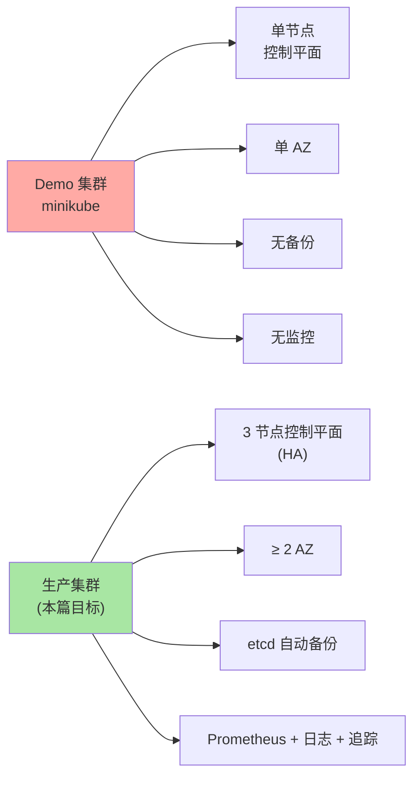
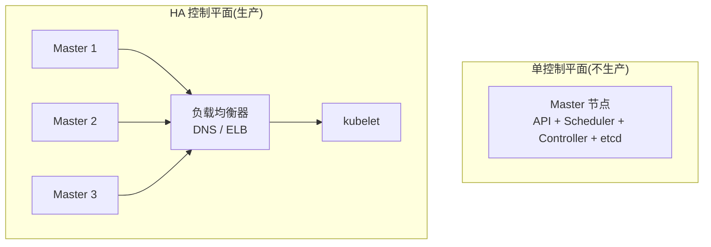
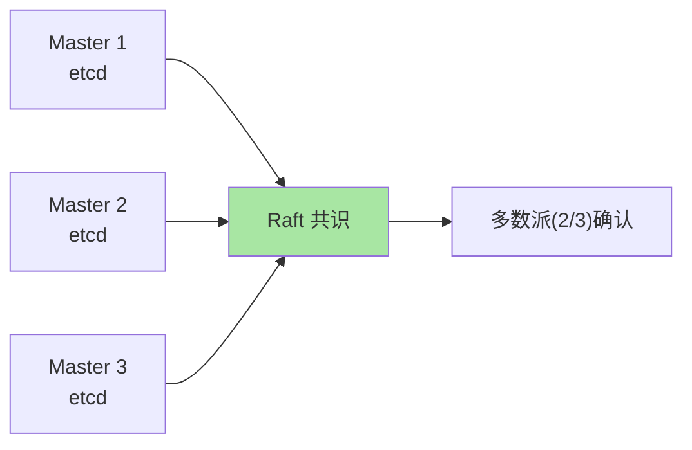
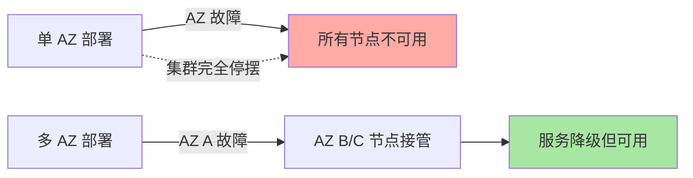
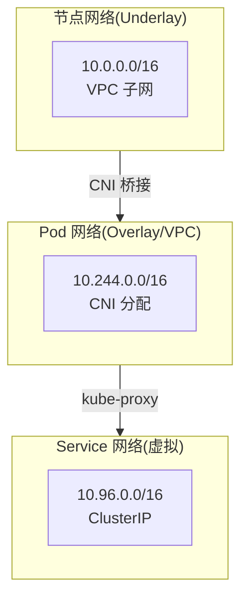
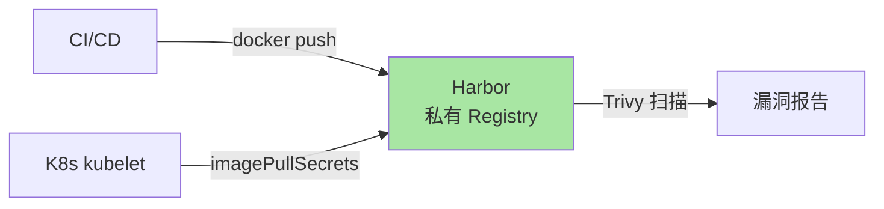
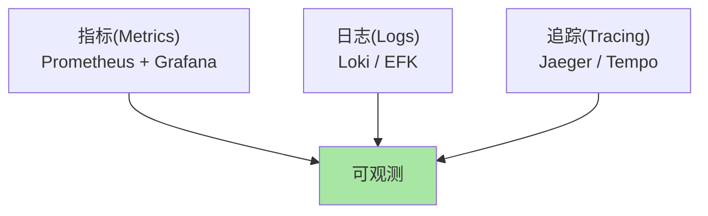
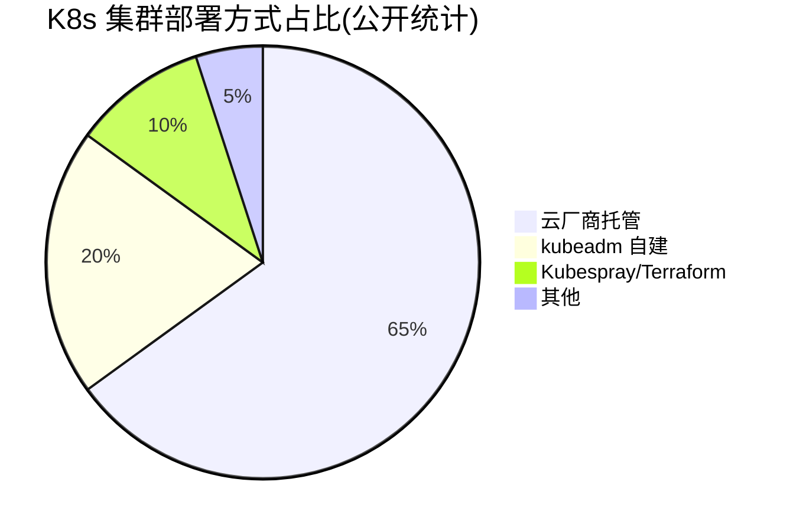

# 生产级 K8s 集群搭建：HA / 多 AZ / 网络规划

> minikube 跑 demo 5 分钟搞定，但生产集群要考虑高可用控制平面、多可用区节点分布、etcd 备份、网络规划、CNI 选型——本文拆解每个生产化决策点。

## 一句话摘要

生产级 K8s 集群的关键决策：3 节点控制平面（HA）+ 多 AZ 节点分布（≥ 2 AZ）+ etcd 自动备份 + 私有 Registry（Harbor）+ 独立 CNI 规划（Calico/Cilium）+ 节点预留资源（kube/system/eviction）；自建 vs 托管（EKS/GKE/AKS）选型决定运维成本。

## 一、生产集群 vs Demo 集群：核心差异



## 二、控制平面 HA

### 2.1 单控制平面 vs HA 控制平面



### 2.2 HA 拓扑

```yaml
# 3 Master + N Worker
控制平面：
  - 3 节点（master-1 / master-2 / master-3）
  - 每节点跑：kube-apiserver + kube-scheduler + kube-controller-manager + etcd
  - 前置负载均衡器（LB）做 API Server 入口

Worker：
  - N 节点（按业务规模）
  - 分布在 ≥ 2 个 AZ
```

### 2.3 etcd 高可用



**关键认知**：
- 3 节点 etcd 容忍 1 节点故障
- 5 节点 etcd 容忍 2 节点故障
- 推荐奇数节点（详见 L2 子系列 B 篇 1）

### 2.4 API Server LB 选型

| 选型 | 适用 |
|---|---|
| **云厂商 LB** | AWS NLB / GCP TCP LB / 阿里云 SLB |
| **HAProxy + Keepalived** | 自建环境 |
| **MetalLB** | 私有环境（裸金属） |

## 三、节点多 AZ 分布

### 3.1 为什么必须多 AZ



### 3.2 多 AZ 实践

```bash
# 创建节点组时指定多个 AZ
eksctl create cluster \
  --node-zones us-east-1a,us-east-1b,us-east-1c \
  --nodes 3 \
  --nodes-min 3 \
  --nodes-max 10
```

### 3.3 Pod 反亲和性

```yaml
# 同一应用副本必须分散到不同 AZ
spec:
  topologySpreadConstraints:
  - maxSkew: 1
    topologyKey: topology.kubernetes.io/zone
    whenUnsatisfiable: DoNotSchedule
    labelSelector:
      matchLabels: { app: web }
```

## 四、网络规划

### 4.1 K8s 网络三平面



### 4.2 CNI 选型

| CNI | 模型 | 适用 |
|---|---|---|
| **Calico** | BGP / Overlay | 大集群 + NetworkPolicy |
| **Cilium** | eBPF | 高性能 + 可观测 |
| **Flannel** | VXLAN | 小集群 + 无 NetworkPolicy |
| **AWS VPC CNI** | 真实 VPC IP | AWS 原生体验 |
| **Azure CNI** | 真实 VNet IP | Azure 原生体验 |

**关键决策**：
- 上云 → 用云厂商 CNI（性能最好）
- 自建 + 需要 NetworkPolicy → Calico 或 Cilium
- 自建 + 简单场景 → Flannel（但不生产）

### 4.3 Service CIDR 与 Pod CIDR

```bash
# kubeadm init 时指定
--service-cidr=10.96.0.0/16
--pod-network-cidr=10.244.0.0/16
```

**规划原则**：
- Pod CIDR 不能与 VPC 冲突
- Service CIDR 与 Pod CIDR 不能重叠
- 预留未来扩展空间（16 位 /16 足够）

## 五、etcd 自动备份

### 5.1 为什么必须备份

etcd 是 K8s 状态源——etcd 灾难 = 集群灾难。

### 5.2 Velero vs etcdctl

| 方案 | 备份内容 | 适用 |
|---|---|---|
| **etcdctl snapshot** | etcd 全量快照 | 简单，但需停 API Server 恢复 |
| **Velero** | K8s 资源 + PV 数据 | 完整灾备（推荐） |

### 5.3 Velero 备份策略

```bash
# 每天凌晨备份，保留 7 天
velero install \
  --provider aws \
  --bucket k8s-backup \
  --backup-location-config region=us-east-1

velero schedule create daily-backup \
  --schedule "0 2 * * *" \
  --include-namespaces "*" \
  --ttl 168h
```

### 5.4 etcd 备份脚本

```bash
#!/bin/bash
# /etc/cron.daily/etcd-backup.sh
ETCDCTL_API=3 etcdctl snapshot save /backup/snap-$(date +%Y%m%d).db
aws s3 cp /backup/snap-$(date +%Y%m%d).db s3://k8s-backup/etcd/
find /backup -name "snap-*.db" -mtime +7 -delete
```

## 六、节点资源预留

### 6.1 三层预留

```yaml
# kubelet flags
--kube-reserved=cpu=500m,memory=1Gi     # K8s 系统（kubelet/容器运行时）
--system-reserved=cpu=500m,memory=1Gi   # 系统进程（sshd/journald）
--eviction-hard=memory.available<500Mi  # 驱逐阈值
```

**为什么预留**：
- 不预留 → 系统进程被 OOM 杀
- 不预留 → kubelet 自身资源耗尽导致节点失联

### 6.2 节点 Pod 数上限

```yaml
# kubelet
--max-pods=110    # 默认 110（IP 段规划）

# 网络：每个 Pod 一个 IP（AWS VPC CNI）
# 节点 IP 耗尽 → 新 Pod 调度失败
```

## 七、镜像仓库

### 7.1 自建 Harbor



**生产推荐**：自建 Harbor（详见 L2 子系列 C 篇 5）

## 八、监控与日志

### 8.1 三层可观测



详见 L3 子专题 B「可观测性专题」。

## 九、自建 vs 托管

### 9.1 决策矩阵

| 维度 | 自建（kubeadm） | 云厂商托管（EKS/GKE/AKS） |
|---|---|---|
| **控制平面运维** | 你负责 | 云厂商负责 |
| **升级成本** | 高（手动） | 低（一键） |
| **成本** | 节点成本 | 节点 + 控制平面费 |
| **控制力** | 高 | 中 |
| **学习价值** | 高 | 低 |
| **适用** | 大集群 / 金融 / 强合规 | 中小团队 / 创业公司 |

### 9.2 行业认知



**趋势**：托管比例持续上升，自建比例下降（公开报道 2024）。

## 十、典型搭建清单

### 10.1 生产集群搭建 12 步

```markdown
□ 1. 选 CNI（Calico/Cilium/云厂商 CNI）
□ 2. 选 Service Mesh（Istio/Linkerd/无）
□ 3. 选容器运行时（containerd/CRI-O）
□ 4. 设计网络（Pod CIDR / Service CIDR / VPC 子网）
□ 5. 准备镜像仓库（Harbor）
□ 6. 部署负载均衡器（API Server 入口）
□ 7. 部署 3 节点控制平面（kubeadm init/join）
□ 8. 部署 Worker 节点（多 AZ）
□ 9. 部署网络插件（CNI）
□ 10. 部署监控告警（Prometheus）
□ 11. 配置 etcd 自动备份
□ 12. 配置证书管理（cert-manager）
```

## 十一、自测三问

1. **为什么必须 3 节点控制平面？**
   - API Server 无状态但 etcd 是 Raft——3 节点容忍 1 故障（2/3 多数派）。1 节点 = 单点故障。

2. **多 AZ 的最低要求是什么？**
   - ≥ 2 AZ 才能容灾——1 个 AZ 故障时另一个能接管。生产推荐 3 AZ。

3. **自建 vs 托管怎么选？**
   - 看团队规模 + 合规要求——小团队/创业选托管（省运维）；金融/强合规/已有运维团队选自建（控制力强）。

## 📌 数据与事实声明

- 写于 2026-09-07，针对 K8s 1.30+
- 云厂商托管 SLA：通常 99.95%（控制平面）
- K8s 版本支持窗口：~14 个月（官方）
- 行业认知：2024 年云厂商托管占新增集群 ~65%（公开统计）
- 免责：具体 SLA 因云厂商/版本而异

## 📚 参考资料

| 类型 | 标题 | 来源 |
|---|---|---|
| 官方文档 | Production Environment | kubernetes.io/docs/setup/production-environment/ |
| 官方文档 | High Availability | kubernetes.io/docs/setup/production-environment/tools/kubeadm/high-availability/ |
| 官方文档 | etcd Backup | kubernetes.io/docs/tasks/administer-cluster/configure-upgrade-etcd/#backing-up-an-etcd-cluster |
| 实战 | Velero | velero.io |
| 实战 | Cluster API | cluster-api.sigs.k8s.io |
