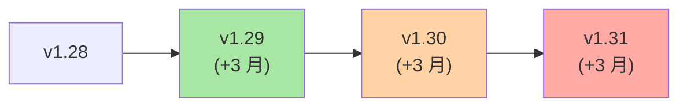
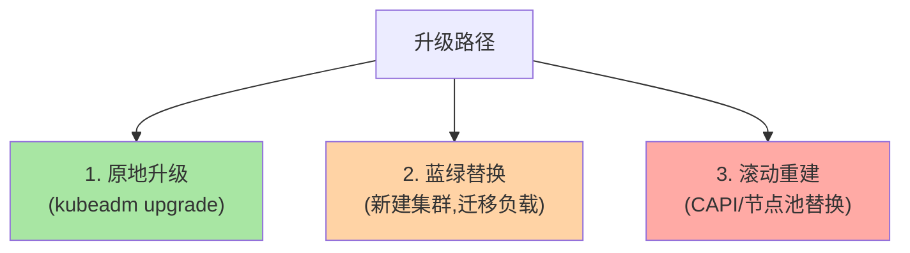
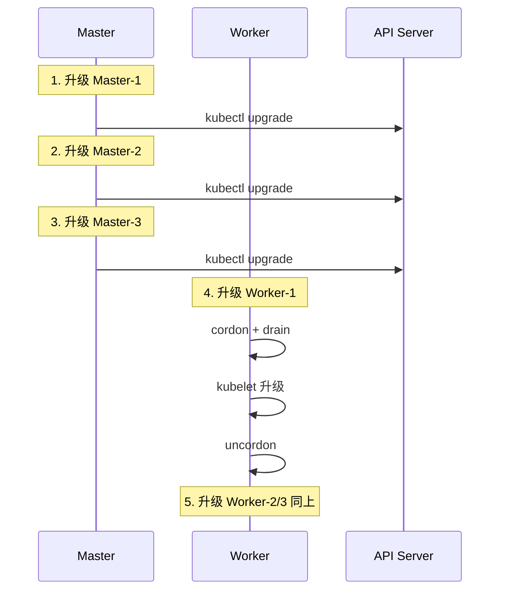
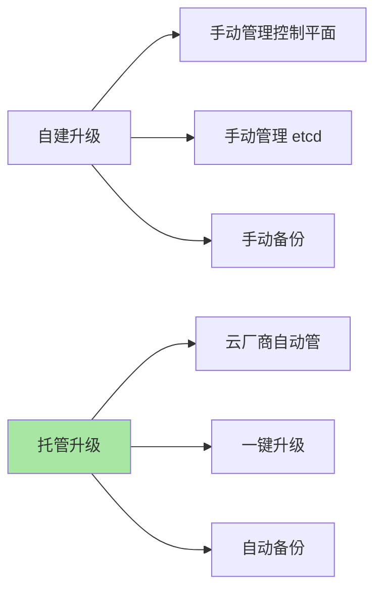
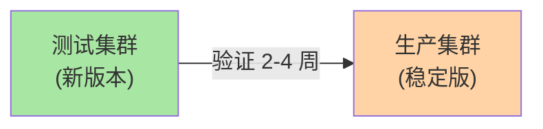
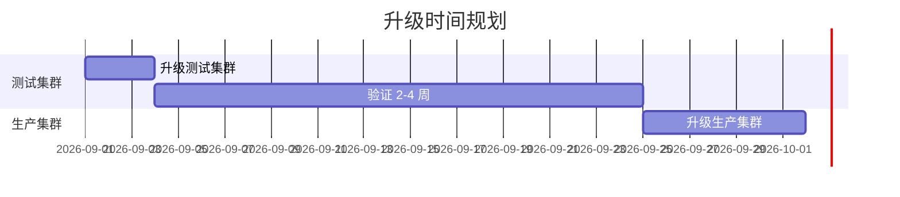

# K8s 升级与版本管理：从 1.x 到 1.30+ 的演进

> K8s 每年发 3 个版本——支持窗口只有 ~14 个月。生产集群不升级 = 安全风险 + API 失效。本篇讲清升级策略、版本兼容、风险预案、回滚机制。

## 一句话摘要

K8s 升级策略 = 版本支持矩阵（n-1/n-2）+ 控制平面滚动升级 + Worker 节点 drain/cordon/uncordon + etcd 备份前置 + API 兼容性检查；推荐「小版本逐升 + 控制平面先升 + Worker 滚动升」的渐进式策略。

## 一、K8s 版本支持机制

### 1.1 版本节奏



**关键认知**：
- K8s 每 4 个月发一个版本（每年 3 个）
- 每个版本支持 ~14 个月（前 9 个月活跃，后 5 个月维护）
- 推荐始终运行在 **n-1 或 n-2** 版本

### 1.2 支持矩阵

| 阶段 | 时间窗 | 安全更新 |
|---|---|---|
| **活跃支持** | 版本发布后 0-9 个月 | ✅ |
| **维护支持** | 版本发布后 9-14 个月 | ✅ 严重安全问题 |
| **终止支持** | > 14 个月 | ❌ |

**推荐**：永远运行在 n-1 或 n-2 版本（既有新特性又有安全更新窗口）。

## 二、升级策略全景

### 2.1 三种升级路径



### 2.2 选型决策

| 路径 | 适用 | 风险 | 成本 |
|---|---|---|---|
| **原地升级** | 中小集群 / 自建 | 中（控制平面短暂中断） | 低 |
| **蓝绿替换** | 大集群 / 关键业务 | 低（无中断） | 高 |
| **滚动重建** | 云厂商托管 / 节点池 | 低 | 中 |

## 三、原地升级详细流程

### 3.1 升级前必做

```bash
# 1. etcd 备份（最重要！）
ETCDCTL_API=3 etcdctl snapshot save /backup/snap-pre-upgrade.db

# 2. 查看当前版本
kubectl version --short

# 3. 查看可用升级版本
kubeadm upgrade plan

# 4. 升级前预检
# - 所有节点 Ready
# - etcd 健康
# - API Server 可达
```

### 3.2 控制平面升级（逐节点）

```bash
# 在 master-1 上：
# 1. 升级 kubeadm 二进制
yum install -y kubeadm-1.30.x

# 2. 升级计划
kubeadm upgrade plan

# 3. 应用升级
kubeadm upgrade apply v1.30.x

# 4. 升级 kubelet 和 kubectl
yum install -y kubelet-1.30.x kubectl-1.30.x
systemctl restart kubelet

# 5. 验证
kubectl get nodes
# master-1 应显示 v1.30.x

# 6. 同样的步骤在 master-2 / master-3 重复
```

**关键认知**：控制平面必须**逐节点**升级——不能同时升级 3 节点（HA 失效）。

### 3.3 Worker 节点升级

```bash
# Worker 节点逐个升级（每节点一次只能升级一个）
for node in worker-1 worker-2 worker-3; do
  # 1. cordon：标记不可调度
  kubectl cordon $node

  # 2. drain：驱逐 Pod（保留 DaemonSet）
  kubectl drain $node --ignore-daemonsets --delete-emptydir-data

  # 3. SSH 到节点升级
  ssh $node "yum install -y kubelet-1.30.x kubeadm-1.30.x"
  ssh $node "systemctl restart kubelet"

  # 4. uncordon：重新调度
  kubectl uncordon $node

  # 5. 等待节点 Ready
  kubectl wait --for=condition=Ready node/$node --timeout=300s
done
```

### 3.4 升级时序



## 四、API 兼容性

### 4.1 三类 API 变更

| 类型 | 兼容性 | 应对 |
|---|---|---|
| **向后兼容** | ✅ 旧 API 仍可用 | 无需操作 |
| **API 弃用** | ⚠️ 旧 API 仍可用但告警 | 改用新 API |
| **API 移除** | ❌ 旧 API 不再可用 | 升级前必须迁移 |

### 4.2 弃用 API 检测

```bash
# 升级前检测哪些 manifest 使用了弃用 API
kubectl deprecations
# 或用 pluto 工具
pluto detect-files --target-versions=k8s=v1.30.0
```

### 4.3 常见弃用 API

| 旧 API | 新 API | 移除版本 |
|---|---|---|
| `extensions/v1beta1` | `apps/v1` | 1.16 |
| `rbac.authorization.k8s.io/v1beta1` | `rbac.authorization.k8s.io/v1` | 1.22 |
| `policy/v1beta1` | `policy/v1` | 1.25 |
| `admissionregistration.k8s.io/v1beta1` | `admissionregistration.k8s.io/v1` | 1.22 |

## 五、生产升级实践

### 5.1 升级检查清单

```markdown
□ 1. etcd 已备份
□ 2. 所有节点 Ready
□ 3. 所有 Pod Running
□ 4. 弃用 API 检测通过（pluto）
□ 5. 维护窗口已通知
□ 6. 回滚方案已确认
□ 7. 监控告警已就位（升级过程异常能立刻通知）
□ 8. 测试环境已先升级（验证兼容性）
```

### 5.2 风险预案

| 风险 | 应对 |
|---|---|
| API 不兼容 | 测试环境先升 + pluto 检测 |
| 节点失联 | 保留旧 kubelet 二进制，紧急回退 |
| 应用启动失败 | Pod readiness 失败自动回滚（K8s 1.x+ 部分支持） |
| etcd 损坏 | 备份恢复 |

### 5.3 回滚机制

```bash
# 1. 回退 kubeadm 二进制到旧版本
yum downgrade kubeadm-1.29.x

# 2. 回退 control plane
kubeadm upgrade apply v1.29.x --force

# 3. 验证
kubectl version
```

**注意**：**只能回退一个小版本**（如 1.30 → 1.29，不能 1.30 → 1.28）。

## 六、托管集群升级（EKS/GKE/AKS）

### 6.1 云厂商托管

```bash
# EKS
aws eks update-cluster-version \
  --name my-cluster \
  --kubernetes-version 1.30

# GKE
gcloud container clusters upgrade my-cluster --master --cluster-version=1.30.0

# AKS
az aks upgrade \
  --resource-group myResourceGroup \
  --name myCluster \
  --kubernetes-version 1.30.0
```

### 6.2 托管优势



## 七、版本管理最佳实践

### 7.1 锁版本策略

```yaml
# 使用 kubeadm 配置固定版本
apiVersion: kubeadm.k8s.io/v1beta3
kind: ClusterConfiguration
kubernetesVersion: v1.30.0
```

### 7.2 测试集群 + 生产集群



### 7.3 升级窗口



## 八、自测三问

1. **为什么不能跨版本升级？**
   - K8s 升级有「小版本逐升」限制——必须 1.29 → 1.30 → 1.31（不能跳）。跨版本可能因数据库 schema 不兼容失败。

2. **升级前为什么必须 etcd 备份？**
   - 升级可能因 bug 失败，etcd 损坏需要回滚；备份是最后一道防线。

3. **托管 vs 自建升级的本质差异？**
   - 托管：控制平面由云厂商维护，升级对用户透明；自建：所有升级操作需手动执行（控制平面 etcd kubelet 三件套）。

## 📌 数据与事实声明

- 写于 2026-09-07，针对 K8s 1.30+
- 版本支持窗口：14 个月（前 9 月活跃 + 后 5 月维护）
- 版本节奏：每年 3 个版本（约每 4 月一个）
- 推荐运行版本：n-1 或 n-2
- 行业认知：生产集群 90% 每年升级至少 1 次（公开统计）
- 免责：具体升级步骤因部署方式而异

## 📚 参考资料

| 类型 | 标题 | 来源 |
|---|---|---|
| 官方文档 | kubeadm upgrade | kubernetes.io/docs/tasks/administer-cluster/kubeadm/kubeadm-upgrade/ |
| 官方文档 | Version Skew Policy | kubernetes.io/releases/version-skew-policy/ |
| 官方文档 | Deprecated APIs | kubernetes.io/docs/reference/using-api/deprecation-guide/ |
| 工具 | Pluto（弃用 API 检测） | github.com/FairwindsOps/pluto |
| 实战 | Cluster API | cluster-api.sigs.k8s.io |
