# K8s 节点扩缩容与集群弹性：CA / Spot / Karpenter

> Pod 数伸缩靠 HPA（详见 L2 子系列 A 篇 5），但**节点数**伸缩是另一个问题——节点耗尽时 Pod 调度失败。本篇讲清 Cluster Autoscaler（CA）、Spot 实例降本、Karpenter（新一代节点伸缩）。

## 一句话摘要

Cluster Autoscaler（CA）是 K8s 传统节点伸缩工具，根据 Pending Pod 自动扩节点；Spot 实例降本 60-90% 但有中断风险；Karpenter 是 AWS 开源的新一代节点伸缩器，比 CA 快 5-10 倍；生产推荐「CA + 多节点池（On-Demand + Spot）」或直接用 Karpenter。

## 一、节点扩缩容的必要性

### 1.1 节点耗尽的真实后果

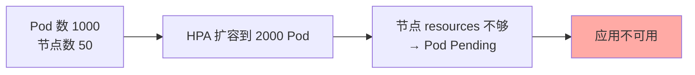

**关键认知**：HPA 只管 Pod 副本数——**节点数不够时，HPA 无效**。

### 1.2 节点扩缩容工具演进

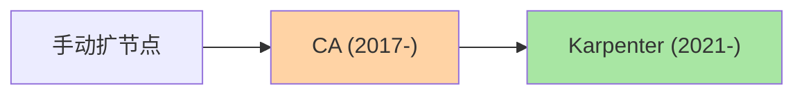

## 二、Cluster Autoscaler (CA)

### 2.1 工作机制

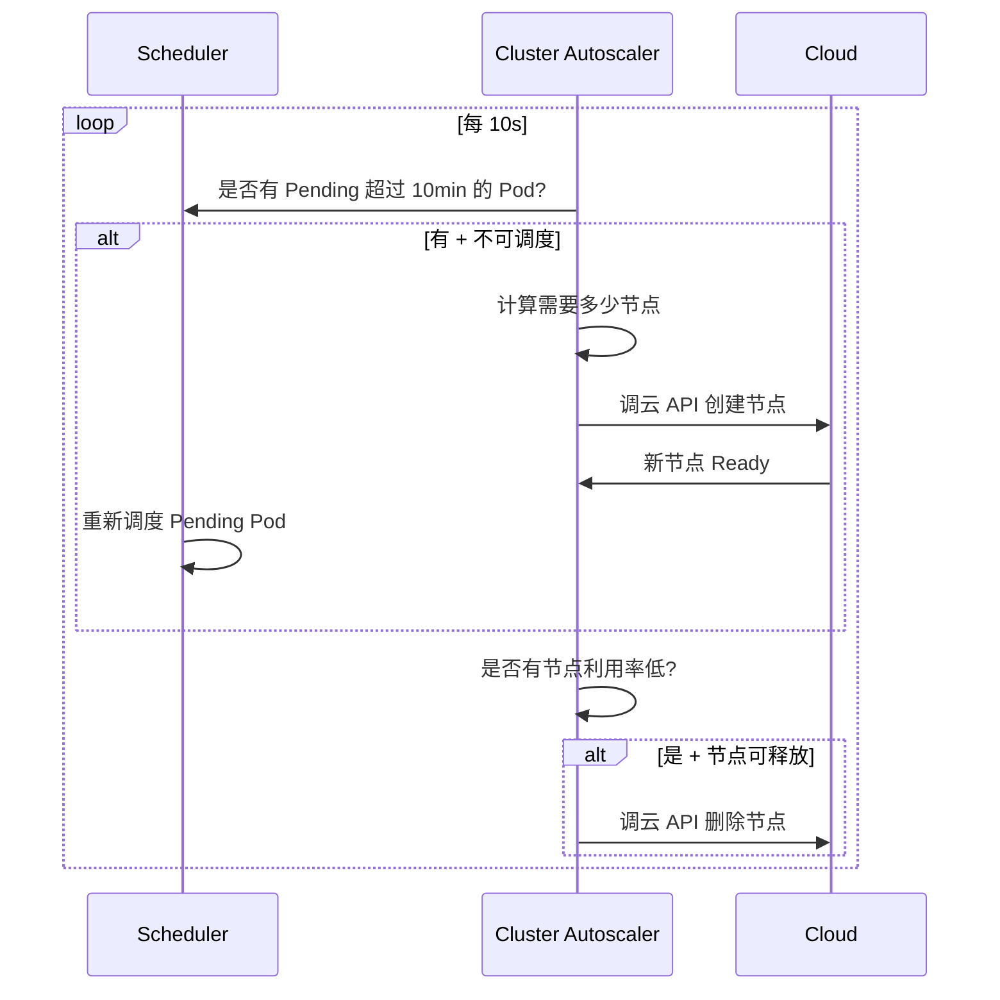

### 2.2 CA 关键参数

```yaml
# CA Deployment flags
--nodes=1:10:my-node-group           # 节点组（min:max:name）
--scale-down-delay-after-add=10m    # 新节点创建后多久可缩
--scale-down-unneeded-time=10m      # 节点空闲多久可缩
--max-node-provision-time=15m       # 新节点最大创建时间
--expander=least-waste              # 多节点组扩展策略
```

### 2.3 多节点组策略

```yaml
# 场景：平时跑 On-Demand，高峰时用 Spot
--nodes=3:20:ondemand-pool          # On-Demand（稳定）
--nodes=0:50:spot-pool              # Spot（便宜但可能中断）
--expander=priority                 # 优先扩 ondemand
```

**或**：

```yaml
--expander=least-waste              # 选择「最少浪费」的节点组（最合适规格）
```

### 2.4 CA 局限

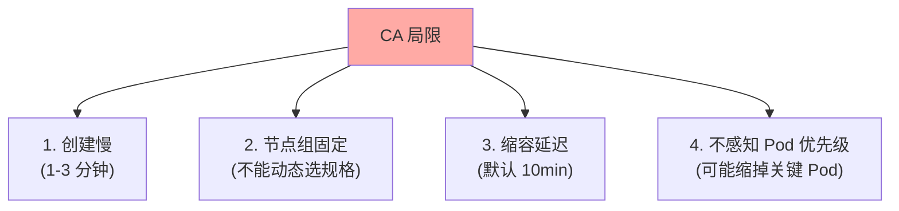

## 三、Spot 实例降本

### 3.1 Spot 实例是什么

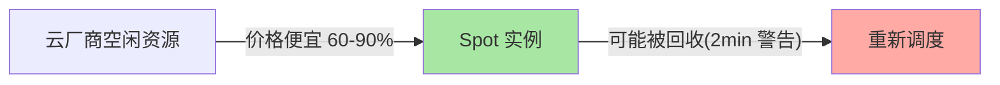

### 3.2 Spot 使用场景

| 场景 | 适用 |
|---|---|
| **批处理** | ✅ 完美（中断可重启） |
| **CI/CD runner** | ✅ 完美 |
| **离线 ML 训练** | ✅ 完美 |
| **在线服务** | ⚠️ 需谨慎（中断影响 SLA） |
| **数据库** | ❌ 不推荐 |

### 3.3 Pod 中断容忍配置

```yaml
# 1. 用 PDB（PodDisruptionBudget）保护关键 Pod
apiVersion: policy/v1
kind: PodDisruptionBudget
metadata:
  name: web-pdb
spec:
  minAvailable: 2
  selector:
    matchLabels:
      app: web

# 2. 让 Pod 容忍中断（Karpenter 自动）
spec:
  nodeSelector:
    karpenter.sh/capacity-type: spot
```

## 四、Karpenter（新一代节点伸缩）

### 4.1 Karpenter vs CA

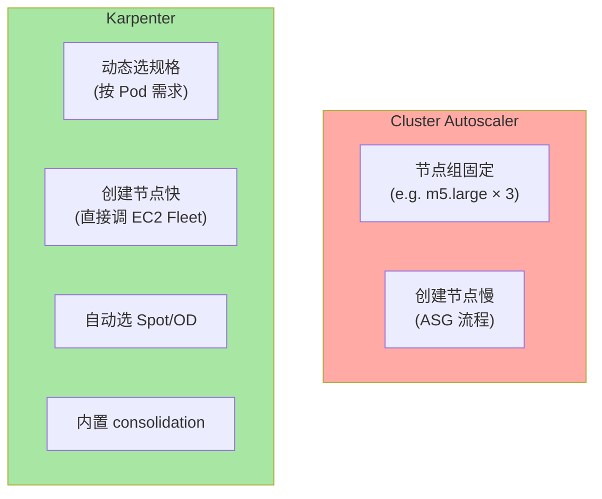

### 4.2 Karpenter 工作机制

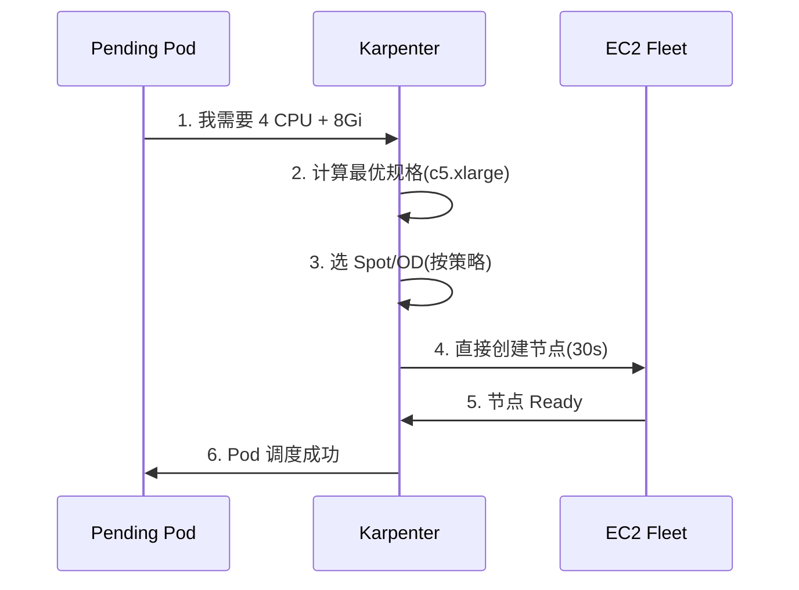

**关键优势**：
- 直接调 EC2 Fleet（跳过 ASG）→ 快 5-10 倍
- 按 Pod 需求动态选规格（不固定节点组）
- 内置 consolidation（自动整理碎片节点）

### 4.3 Karpenter 配置

```yaml
# 1. NodePool（类似节点组）
apiVersion: karpenter.sh/v1beta1
kind: NodePool
metadata:
  name: default
spec:
  template:
    spec:
      requirements:
      - key: karpenter.sh/capacity-type
        operator: In
        values: ["spot", "on-demand"]
      - key: kubernetes.io/arch
        operator: In
        values: ["amd64"]
      nodeClassRef:
        apiVersion: karpenter.k8s.aws/v1beta1
        kind: EC2NodeClass
        name: default
  limits:
    cpu: "1000"
    memory: 1000Gi

---
# 2. EC2NodeClass（云厂商配置）
apiVersion: karpenter.k8s.aws/v1beta1
kind: EC2NodeClass
metadata:
  name: default
spec:
  amiFamily: AL2
  role: KarpenterNodeRole-mycluster
  subnetSelectorTerms:
  - tags:
      karpenter.sh/discovery: mycluster
  securityGroupSelectorTerms:
  - tags:
      karpenter.sh/discovery: mycluster
```

### 4.4 Karpenter 高级特性

#### 4.4.1 Consolidation（自动整理）

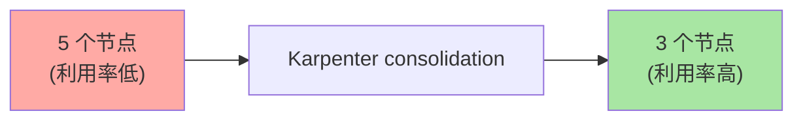

#### 4.4.2 Drift（节点漂移检测）

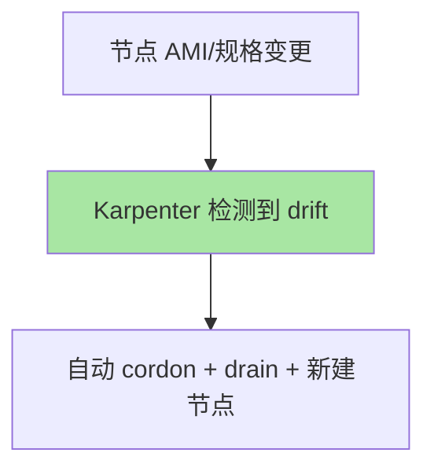

#### 4.4.3 中断容忍

```marp
- Spot 即将回收（2min 警告）
- Karpenter 自动 cordon + drain
- Pod 在新节点上启动（30s）
```

## 五、CA vs Karpenter 选型

### 5.1 决策矩阵

| 维度 | CA | Karpenter |
|---|---|---|
| **速度** | 慢（1-3 min） | 快（30s） |
| **灵活性** | 节点组固定 | 动态选规格 |
| **复杂度** | 中（配置节点组） | 低（动态计算） |
| **云厂商支持** | 全部主流云 | AWS（其他云逐步支持） |
| **生产就绪** | ✅ GA | ✅（AWS）/ Beta（其他） |

### 5.2 推荐组合

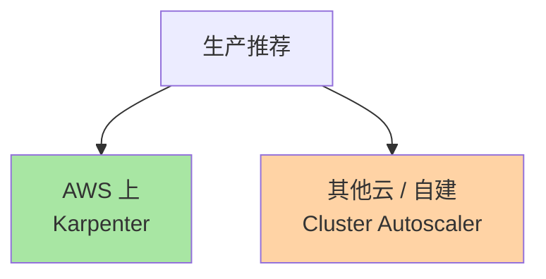

### 5.3 成本对比

| 策略 | 月成本（100 节点估算） |
|---|---|
| **全 On-Demand** | $30,000（基线） |
| **CA + 50% Spot** | $18,000（-40%） |
| **Karpenter + 70% Spot** | $12,000（-60%） |

**关键认知**：Spot 实例降本 60-90% 是真实可量化的（公开讨论，2024）。

## 六、典型场景

### 6.1 在线服务（稳定）

```yaml
# CA 配置
--nodes=3:50:ondemand-pool          # 全部 On-Demand
```

### 6.2 在线 + 批处理混部

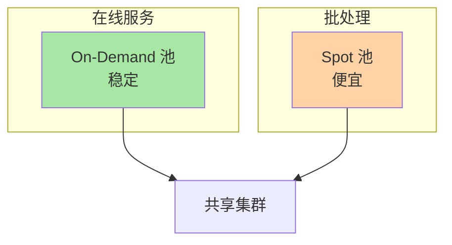

### 6.3 AI 训练

```yaml
# Karpenter 配置（GPU 节点）
spec:
  template:
    spec:
      requirements:
      - key: nvidia.com/gpu
        operator: Gt
        values: ["0"]
```

## 七、自测三问

1. **HPA 和 CA 的本质区别？**
   - HPA 调 Pod 副本数；CA 调节点数。两者必须配对——只有 HPA 节点耗尽时 Pod 会 Pending。

2. **Spot 实例最大风险是什么？**
   - **中断**（2 分钟警告）——不适用于有状态服务（如数据库）。生产推荐「Spot + PDB + 自动重调度」组合。

3. **Karpenter 比 CA 快的根本原因？**
   - 直接调 EC2 Fleet（跳过 ASG 流程）+ 按 Pod 需求动态选规格（不需要预定义节点组）。

## 📌 数据与事实声明

- 写于 2026-09-07，针对 K8s 1.30+
- Karpenter GA：2023（AWS）
- CA GA：2018
- Spot 实例降本：60-90%（公开讨论）
- 行业认知：AWS 上 Karpenter 已成新默认（公开报道 2024）
- 免责：Spot 中断率因实例类型/可用区/时间而异

## 📚 参考资料

| 类型 | 标题 | 来源 |
|---|---|---|
| 官方文档 | Cluster Autoscaler | github.com/kubernetes/autoscaler/tree/master/cluster-autoscaler |
| 官方文档 | Karpenter | karpenter.sh |
| AWS 文档 | Karpenter on EKS | docs.aws.amazon.com/eks/latest/userguide/karpenter.html |
| 实战 | Spot Instances | aws.amazon.com/ec2/spot/ |
| 实战 | KEDA（事件驱动） | keda.sh |
