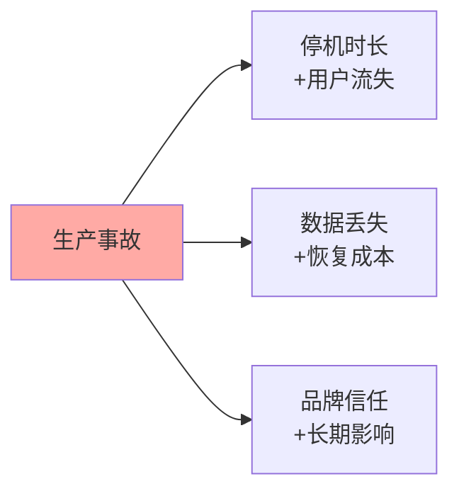
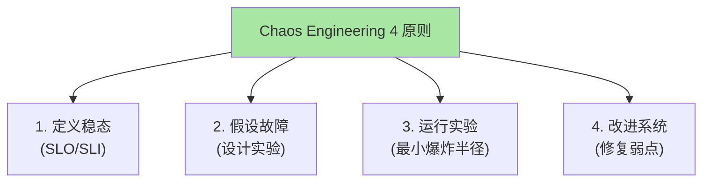
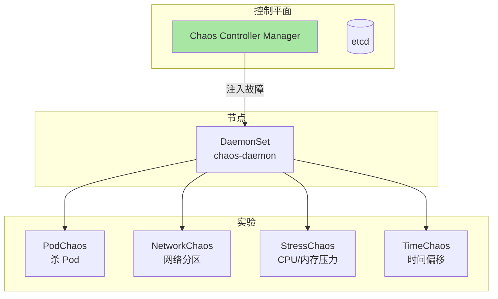
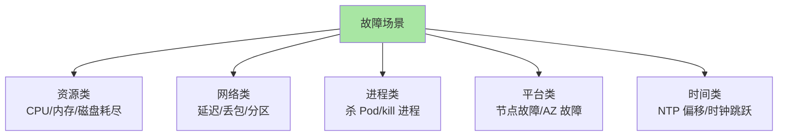
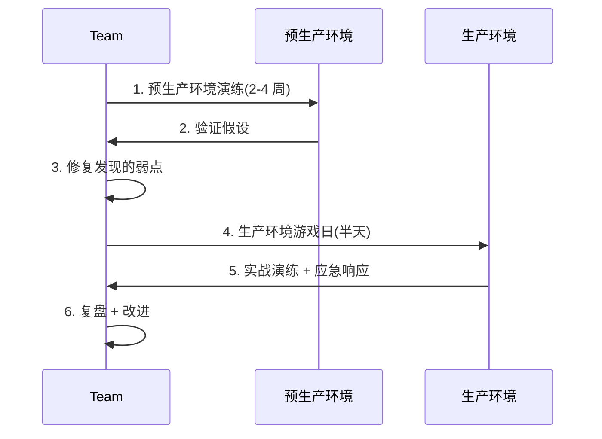
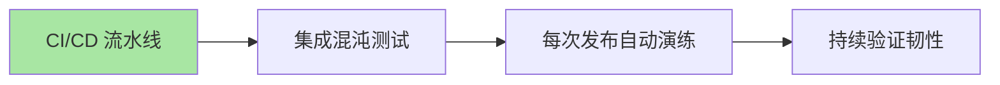
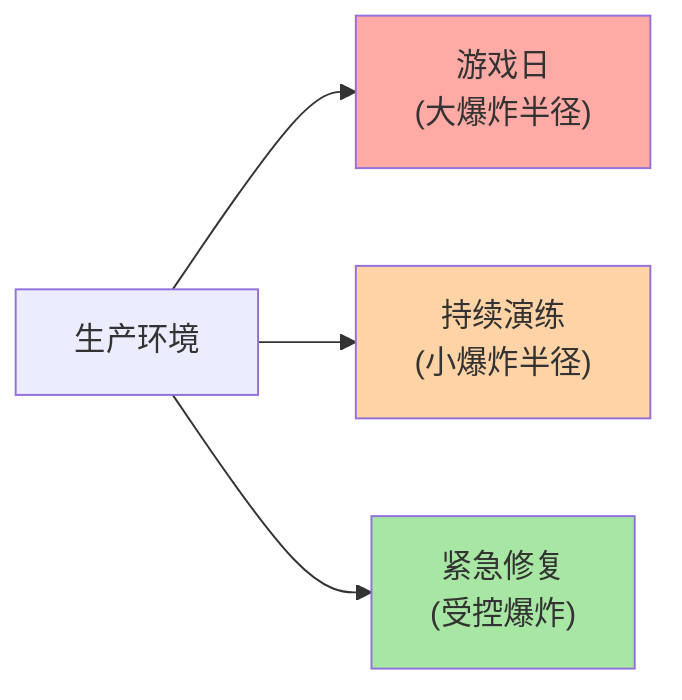

# K8s 故障演练与容灾：Chaos Engineering 实践

> 生产集群不演练 = 不知道哪里会挂。本篇讲清 Chaos Engineering 原则、K8s 故障演练工具（Chaos Mesh / Litmus / AWS FIS）、典型故障场景、演练流程。

## 一句话摘要

Chaos Engineering 通过受控实验验证系统韧性；K8s 主流工具（Chaos Mesh / LitmusChaos / AWS FIS）支持 Pod 杀、网络分区、资源耗尽等故障注入；生产推荐「预生产环境先演练 + 游戏日实战 + 自动化持续验证」三阶段。

## 一、为什么需要 Chaos Engineering

### 1.1 生产事故的真实代价



**行业认知**（公开报道）：
- 大型停机事故成本：$10,000-$1,000,000 / 小时（按公司规模）
- 80%+ 事故是「已知未知」（未演练过的故障场景）

### 1.2 Chaos Engineering 起源

```
2010  Netflix 创造 Chaos Monkey（随机杀 EC2 实例）
2012  Netflix 公开原则
2014  Netflix 提出 Chaos Engineering 完整理论
2016- 工具爆发（Chaos Monkey、Gremlin、Chaos Mesh 等）
2020+ K8s 原生工具成熟（Chaos Mesh / LitmusChaos）
```

## 二、Chaos Engineering 原则

### 2.1 四原则



### 2.2 稳态定义

```yaml
# 例：定义订单服务的稳态
稳态指标：
  - 错误率 < 0.1%
  - 99% 延迟 < 500ms
  - 订单吞吐量 > 1000 TPS

实验假设：
  - 假设杀掉 1 个订单 Pod → 错误率不应上升到 1%+
  - 假设 Pod 重启 → 99% 延迟不应超过 1s
```

## 三、Chaos Mesh（K8s 原生工具）

### 3.1 架构



### 3.2 安装

```bash
# helm install
helm repo add chaos-mesh https://charts.chaos-mesh.org
helm install chaos-mesh chaos-mesh/chaos-mesh \
  --namespace chaos-mesh \
  --create-namespace \
  --set chaosDaemon.runtime=containerd \
  --set chaosDaemon.socketPath=/run/containerd/containerd.sock
```

### 3.3 杀 Pod 实验

```yaml
apiVersion: chaos-mesh.org/v1alpha1
kind: PodChaos
metadata:
  name: pod-kill-experiment
  namespace: chaos-mesh
spec:
  action: pod-kill               # 杀 Pod
  mode: one                      # 一次杀一个
  selector:
    namespaces: [production]
    labelSelectors:
      app: web
  duration: "30s"                # 实验持续 30s
  scheduler:
    cron: "@every 60s"           # 每 60s 触发一次
```

### 3.4 网络分区实验

```yaml
apiVersion: chaos-mesh.org/v1alpha1
kind: NetworkChaos
metadata:
  name: network-partition
spec:
  action: partition              # 网络分区
  mode: all
  selector:
    namespaces: [production]
    labelSelectors:
      app: db
  direction: to                  # 方向：to Pod
  target:
    selector:
      namespaces: [production]
      labelSelectors:
        app: web
  duration: "5m"
```

### 3.5 资源压力实验

```yaml
apiVersion: chaos-mesh.org/v1alpha1
kind: StressChaos
metadata:
  name: cpu-stress
spec:
  mode: one
  selector:
    namespaces: [production]
    labelSelectors:
      app: web
  stressors:
    cpu:
      workers: 2
      load: 80                   # 80% CPU
    memory:
      workers: 1
      size: "500Mi"
  duration: "5m"
```

## 四、典型故障场景

### 4.1 故障分类



### 4.2 实战场景清单

```markdown
□ 1. 杀 Pod（验证 HPA/副本恢复）
□ 2. 杀节点（验证节点恢复时间）
□ 3. 杀 AZ（验证多 AZ 部署）
□ 4. 网络分区（验证服务发现）
□ 5. 网络延迟 1s（验证超时配置）
□ 6. CPU 80%（验证资源 limits）
□ 7. 内存 500Mi（验证 OOM 行为）
□ 8. 磁盘满（验证驱逐阈值）
□ 9. DNS 不可达（验证外部依赖）
□ 10. 时钟偏移（验证证书过期）
```

## 五、演练流程

### 5.1 游戏日（Game Day）



### 5.2 持续验证



```yaml
# GitHub Actions 示例
- name: Chaos Test
  run: |
    kubectl apply -f chaos-experiments/
    sleep 300                  # 跑 5 分钟实验
    kubectl get pods -n production -o json | jq '.items[]|select(.status.phase=="Running")|.metadata.name' | wc -l
```

## 六、工具对比

| 工具 | 优点 | 缺点 | 适用 |
|---|---|---|---|
| **Chaos Mesh** | K8s 原生 + 多故障类型 | 仅 K8s | K8s 集群 |
| **LitmusChaos** | 生态丰富 + Portal UI | 配置复杂 | 多环境 |
| **Gremlin** | 商业支持 + 多场景 | 收费 | 企业 |
| **AWS FIS** | 与 AWS 深度集成 | 仅 AWS | AWS 上 |
| **Chaos Monkey** | 简单 | 老旧 | 简单场景 |

## 七、安全边界

### 7.1 最小爆炸半径



### 7.2 安全机制

| 机制 | 实现 |
|---|---|
| **白名单** | 只对特定 namespace/label 注入 |
| **时间窗** | 实验只在低峰期运行 |
| **停止开关** | 一键停止所有实验 |
| **回滚** | 实验结束后自动恢复 |
| **审计** | 所有实验记录可追溯 |

### 7.3 风险缓解

```yaml
# Chaos Mesh 安全配置
spec:
  duration: "30s"                # 严格时长
  scheduler:
    cron: "0 3 * * 1"           # 周一凌晨 3 点
  selector:
    namespaces: [staging]        # 只在 staging 跑
```

## 八、自测三问

1. **Chaos Engineering 的核心原则是什么？**
   - 4 原则：定义稳态 → 假设故障 → 运行实验（最小爆炸半径）→ 改进系统。

2. **为什么先在预生产环境演练？**
   - 预生产环境「真生产数据 + 假生产流量」——故障影响业务小，但能暴露系统弱点。

3. **Chaos Mesh 和 Chaos Monkey 的本质区别？**
   - Chaos Mesh 是 K8s 原生 + 故障类型丰富（Pod/网络/资源/时间）；Chaos Monkey 只杀实例（老旧，VM 时代）。

## 📌 数据与事实声明

- 写于 2026-09-07，针对 K8s 1.30+
- Chaos Mesh 当前版本：v2.7+
- LitmusChaos 当前版本：v3.x
- 行业认知：Netflix / LinkedIn / 美团 / 字节等大厂均有 Chaos Engineering 团队（公开报道）
- 免责：演练可能引发真实事故，需要充分预案

## 📚 参考资料

| 类型 | 标题 | 来源 |
|---|---|---|
| 官方文档 | Chaos Mesh | chaos-mesh.org |
| 官方文档 | LitmusChaos | litmuschaos.io |
| 理论 | Principles of Chaos | principlesofchaos.org |
| 实战 | Netflix Chaos Monkey | github.com/Netflix/chaosmonkey |
| 实战 | AWS FIS | aws.amazon.com/fis/ |
