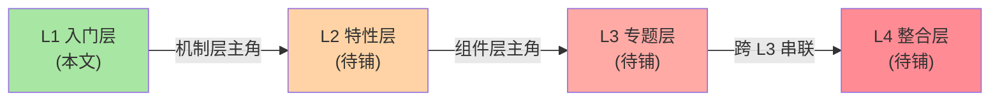

# K8s 生态系列导读：从机制到组件的 4 层学习路径

> 入门层 10 篇导读。讲清系列定位、4 层关系、阅读路径、与相邻分类的关系——**不重复入门层定义**。

## 一、这个系列讲什么

云原生时代的「事实标准」是 Kubernetes（K8s）。但「学 K8s」≠「会用 kubectl」——

- 读完 200+ CRD 文档，不知道「为什么先有 Pod 再有 Deployment」
- 能跑 yaml，排障时看不懂 kubelet 日志、scheduler 决策、etcd 行为
- 懂 K8s 但不懂 Istio/Argo/Prometheus 这些周边为什么要独立、边界在哪

本系列按 4 层架构组织：**先建机制层心智模型，再深挖组件层能力**。

## 二、4 层关系

```
L1 入门层（本文）        ← 概念入门：是什么 + 为什么 + 怎么用
  ↓ 机制层（机制是主角，K8s 作为例子）
L2 特性层                ← 核心机制深挖：Scheduler / API Server / etcd / Operator
  ↓ 组件层（K8s 是主角）
L3 专题层                ← 跨特性专题：生产化 / 可观测性 / 安全 / 多集群治理
  ↓ 跨 L3 串联
L4 整合层                ← 全景 + 选型决策 + 从零搭 demo
```

每层独立可读、并列不依赖——你可以在任何一层开始，按需深入。

## 三、子主题地图

入门层 10 篇分三组：

**A 组 · 核心抽象（1-7 篇）**：从「K8s 是什么」到「核心资源对象」，建立心智模型
- 篇 1 K8s 是什么 → 篇 2 容器关系 → 篇 3 Pod → 篇 4 Deployment → 篇 5 Service → 篇 6 Ingress → 篇 7 配置与存储

**B 组 · 生态分层（篇 8）**：理解 K8s 为何要拆出 CNI/CSI/CRI/Operator
- 篇 8 K8s 生态分层

**C 组 · 横向对比（篇 9）**：跳出 K8s 看容器编排选型
- 篇 9 K8s vs Nomad vs Swarm

**收官（篇 10）**：学习路径与下一步

## 四、阅读路径

| 读者类型 | 推荐路径 |
|---|---|
| **入门读者** | 篇 1 → 2 → 3 → 4 → 5 → 6 → 7 → 8 → 9 → 10 |
| **已有 K8s 经验想补机制** | 篇 1 → 3 → 4 → 5 → 8 → 9 → 10 |
| **运维视角关心生产** | 篇 1 → 2 → 7 → 8 → 9 → 10 |
| **架构师关心选型** | 篇 1 → 8 → 9 → 10 |

## 五、与相邻层的关系



- **L1 入门层**（本层）：概念入门，建立「K8s 是什么」的心智模型
- **L2 特性层**（待铺）：深挖每个核心组件——读 L1 后再读 L2，理解成本最低
- **L3 专题层**（待铺）：跨 L2 特性的实战专题（生产化/可观测/安全/多集群）
- **L4 整合层**（待铺）：跨 L3 的全景 + 从零搭 demo

## 六、与相邻分类的关系

- **architecture/system-design/**：K8s 是「分布式系统的部署/调度/运维实现」，上游引用 `distributed-system-design` 系列的「分布式系统设计」篇，不复写
- **devops/docker/**：Docker 是 K8s 的容器底座（CRI 实现之一），L1 篇 2 会引用
- **middleware/**：消息中间件、缓存等在 K8s 上部署时与网络/存储产生交集，L3 专题会引用

## 📌 数据与事实声明

- 写于 2026-09-07，针对 K8s 1.30+ 版本生态
- 时效性已验证：gh CLI + ddgs + browser 三件套
- 免责：K8s 版本演进快，文中 API/默认值以官方文档为准

## 📚 参考资料

| 类型 | 标题 | 来源 |
|---|---|---|
| 官方文档 | Kubernetes Documentation | kubernetes.io/docs |
| 生态 | CNCF Landscape | landscape.cncf.io |
| 仓库本系列 index | `docs/devops/kubernetes/index.md` | 本仓库 |

> 注：本仓库 GitHub 路径使用公开用户名作为 owner（公开仓库，非隐私标识）。
