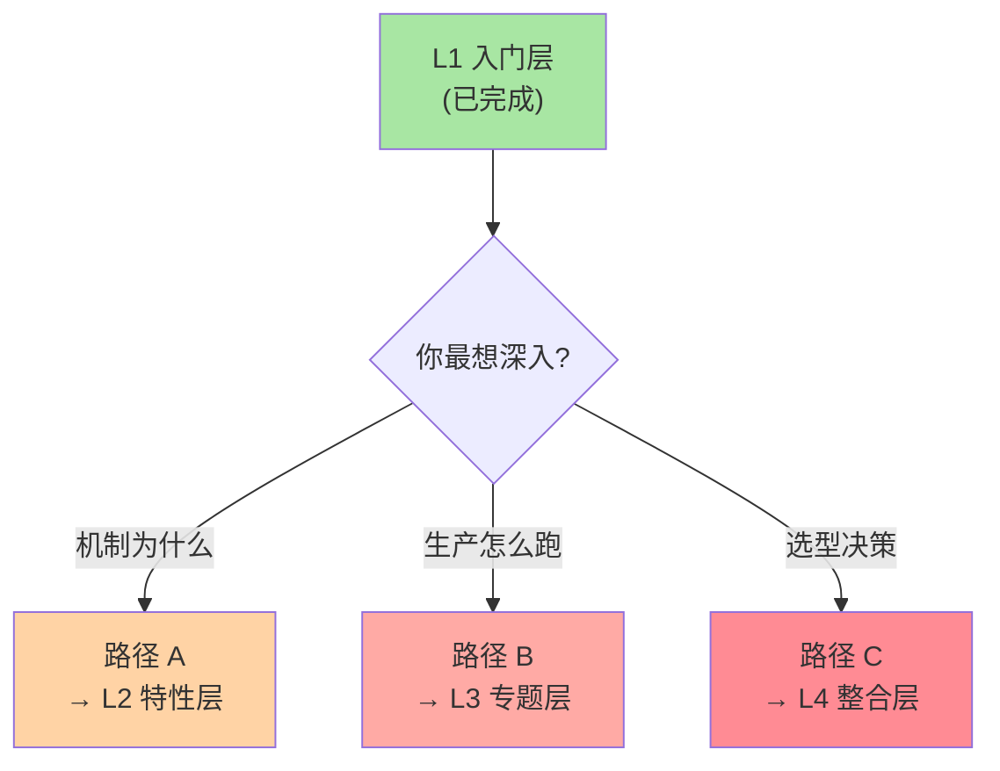

# K8s 学习路径与下一步：从入门到生产的演进地图

> L1 入门层收官。把 10 篇串成「从认知到上手」的一条路径，告诉你读完该往哪里走——是特性层深挖，还是专题层实战。

## 一句话摘要

入门层读完，你应该建立了「K8s 是什么 + 为什么 + 核心抽象 + 周边生态」的全局心智模型；下一步可选三条路径——特性层（机制深挖）、专题层（生产实战）、整合层（选型 + 从零 demo）。

## 一、L1 入门层全景回顾

| # | 题目 | 核心认知 |
|:--:|------|------|
| 0 | 系列导读 | 4 层架构总览 |
| 1 | K8s 是什么 | 容器编排 → 事实标准 |
| 2 | 容器与 K8s 关系 | CRI + 运行时边界 |
| 3 | Pod 是最小调度单位 | 共享网络/存储/生命周期的容器组 |
| 4 | Deployment 与声明式 API | 控制循环思想 |
| 5 | Service 与 ClusterIP | 稳定虚拟 IP + 负载均衡 |
| 6 | Ingress 与 Gateway API | 南北流量入口的演进 |
| 7 | ConfigMap/Secret/PV | 配置/密钥/存储三件套 |
| 8 | 生态分层（CNI/CSI/CRI/Operator） | 核心最小化 + 接口标准化 |
| 9 | 编排选型（K8s vs Nomad vs Swarm） | 横向视野 + 决策树 |

## 二、你能得到什么

读完 L1 后你应该能：

1. ✅ 用 K8s 术语和工程师对话（Pod/Deployment/Service/CRD/CNI）
2. ✅ 看懂简单的 K8s yaml，知道每个字段的作用
3. ✅ 用 kubectl 跑基础命令（apply/get/describe/logs/exec）
4. ✅ 理解 K8s 与周边生态的关系（为什么有 CRI/CNI/CSI）
5. ✅ 在 K8s/Nomad/Swarm 之间做基本选型判断
6. ✅ 看懂 K8s 官方文档的核心概念章节

## 三、你**不能**做什么（诚实边界）

- ❌ 集群搭建（HA 控制平面、网络规划、etcd 备份）—— L3 专题层覆盖
- ❌ 排障（kubelet 日志分析、scheduler 决策、网络问题定位）—— L2 特性层覆盖
- ❌ 生产化（监控/告警/日志/链路追踪）—— L3 专题层覆盖
- ❌ 安全（RBAC/Network Policy/镜像安全）—— L3 专题层覆盖
- ❌ 多集群治理（GitOps/联邦/跨集群调度）—— L3 专题层覆盖

## 四、下一步三条路径



### 路径 A：机制深挖派（向 L2 走）

适合：想知道 K8s 「为什么这么工作」的人

```
入门层（已完成）
   ↓
特性层 L2（计划中，待铺）：
├── 核心调度机制子系列（6 篇）
├── 核心抽象机制子系列（6 篇）
└── 核心运行机制子系列（5 篇）
```

读完 L2 你将能：
- 排障：看懂 scheduler 决策、API Server 请求链路、etcd 行为
- 调优：理解资源调度原理、HPA/VPA 机制、Operator 模式
- 二次开发：写自己的 Controller / Operator

### 路径 B：生产实战派（向 L3 走）

适合：想让 K8s 在生产环境稳跑的人

```
入门层（已完成）
   ↓
专题层 L3（计划中，待铺）：
├── K8s 生产化深度（5 篇）
├── 可观测性专题（4 篇）
├── 安全与多租户专题（4 篇）
└── 多集群治理专题（4 篇）
```

读完 L3 你将能：
- 搭生产级 K8s 集群（HA / 多 AZ / 灾备）
- 接入完整可观测体系（Prometheus + Grafana + 日志 + 追踪）
- 做安全加固（RBAC + Network Policy + 镜像签名）
- 治理多集群（GitOps / 联邦 / 跨集群调度）

### 路径 C：选型决策派（向 L4 走）

适合：要做技术选型、写架构方案的人

```
入门层（已完成）
   ↓
整合层 L4（计划中，待铺）：
├── K8s 架构全景：从入门到生产
├── 选型决策树：K8s / Nomad / Swarm / Mesos
├── 跨周期视角：K8s 5 年演进与未来
└── agent：从零搭一个最小可运行 K8s demo
```

读完 L4 你将能：
- 横向对比容器编排方案（含历史/未来）
- 理解 K8s 在云原生生态的位置（CNCF Landscape 全景）
- 从零搭一个最小可运行 K8s，验证机制

## 五、推荐的实战起点

读完 L1 后，建议立刻动手的 3 件事：

### 5.1 跑一个 minikube

```bash
# 5 分钟起一个本地 K8s
minikube start
kubectl create deployment hello --image=nginx
kubectl expose deployment hello --port=80 --type=NodePort
minikube service hello
```

### 5.2 跑一个 Lens（K8s IDE）

```bash
# 下载 Lens（免费 K8s 图形化 IDE）
# https://lens.app/
# 直观看到 Pod/Service/Deployment 状态
```

### 5.3 跑一个 K8s 游乐场

- **killercoda.com**：免费 K8s 场景实验
- **labs.play-with-k8s.com**：在线多节点 K8s 实验
- **Katacoda Kubernetes**：互动教程（已并入 killercoda）

## 六、自测三问（总收官）

1. **L1 读完你最大收获是什么？**
   - 应该是「K8s 是机制不是黑盒」——Pod/Deployment/Service/CNI/CSI 都是「为解决问题而存在的设计」，而非「K8s 自创的概念」。

2. **你接下来最想深入的方向是什么？**
   - 机制（想知道为什么）→ 走路径 A
   - 生产（想稳跑）→ 走路径 B
   - 选型（要做决策）→ 走路径 C

3. **L1 哪一篇最让你「啊哈」了？**
   - 篇 8 生态分层（理解 K8s 为何拆出 CNI/CSI/CRI）通常是最大认知刷新点
   - 篇 3 Pod 的共享命名空间（理解 K8s 与 Docker 的根本差异）次之

## 📌 数据与事实声明

- 写于 2026-09-07
- K8s 版本基线：1.30+
- L2/L3/L4 系列规划：详见 `docs/devops/kubernetes/index.md`（已铺规划）
- 免责：L2-L4 仍在规划中，时间表未定

## 📚 参考资料

| 类型 | 标题 | 来源 |
|---|---|---|
| 系列导航 | K8s 生态总目录 | `docs/devops/kubernetes/index.md` |
| 入门层全部 10 篇 | `入门层/从零开始认识K8s生态系列/` | 本仓库 |
| 实战 | minikube | minikube.sigs.k8s.io |
| 实战 | Lens | lens.app |
| 实战 | Killercoda | killercoda.com |
| 官方文档 | Kubernetes Tutorials | kubernetes.io/docs/tutorials/ |
