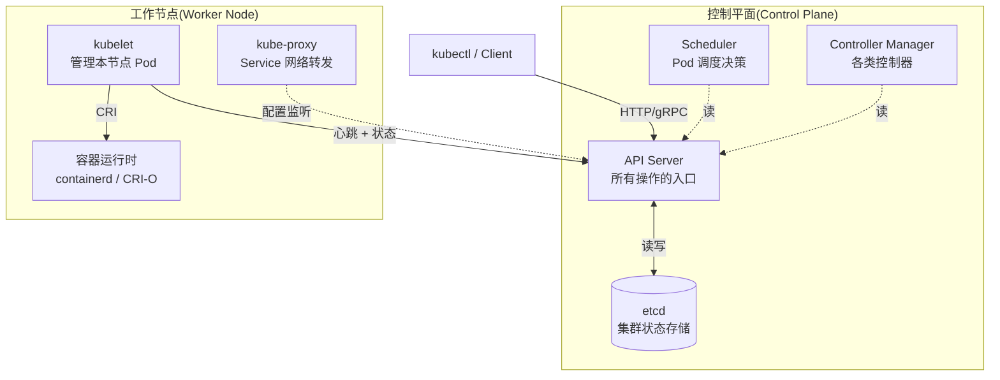
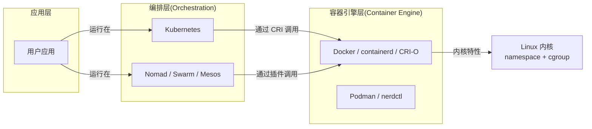

# K8s 是什么：从容器编排到事实标准的演进

> 容器解决了「打包一致」，K8s 解决了「大规模编排一致」。理解 K8s 不是学 200+ CRD，而是理解「为什么容器之后必须有编排、为什么编排之后必须是 K8s」。

## 一句话摘要

K8s（Kubernetes）是 Google 开源的容器编排平台，提供**声明式 API + 控制循环 + 可扩展架构**，让大规模容器集群的部署/调度/自愈/滚动成为标准化操作——它不是「Docker 的替代品」，而是「Docker 的操作系统」。

## 一、为什么需要容器编排

### 1.1 容器解决了一致性，没解决大规模

Docker 在 2013 年解决了「开发环境=生产环境」的打包问题——但单机跑容器很快遇到三件事：

| 问题 | 单机容器解决 | 多机场景需要 |
|---|---|---|
| 应用打包 | ✅ Dockerfile + 镜像 | — |
| 进程隔离 | ✅ namespace + cgroup | — |
| **跨机器调度** | ❌ | 谁决定容器跑哪台机器 |
| **故障自愈** | ❌ | 机器挂了容器怎么办 |
| **滚动升级** | ❌ | 100 个实例如何逐批替换 |
| **服务发现** | ❌ | 容器 IP 变了客户端怎么连 |
| **配置管理** | ❌ | 不同环境配置怎么分发 |

2014-2015 年，业界尝试了多种编排方案：Mesos（Twitter）、Swarm（Docker）、Borg（Google 内部）。2014 年 Google 开源 Borg 的继任者——**Kubernetes**。

### 1.2 K8s 不是凭空出现的

K8s 的设计直接继承 Google 内部运行 10+ 年的 Borg 系统：

```
Borg（Google 内部 2003-）
    ↓ 设计思想 + 经验教训
Omega（Google 内部 2013-，Borg 的反思）
    ↓ 开源
Kubernetes（2014 开源，2015 v1.0，2018 CNCF 毕业）
```

> **关键认知**：K8s 不是「又一个新的容器工具」，而是「Google 15 年大规模集群运维经验的开源版本」。这是它胜出的根本原因——**机制层正确**。

## 5W 速记卡

| 5W | 答案 |
|---|---|
| **What** | Google 开源的容器编排平台，声明式 API + 控制循环 |
| **Why** | 单机容器无法解决跨机器调度/自愈/滚动/服务发现 |
| **Who** | CNCF（云原生计算基金会）维护，2014 Google 开源 |
| **When** | 2015 v1.0，2018 CNCF 毕业，2024+ 占据 90% 容器编排市场 |
| **How** | API Server + Scheduler + Controller Manager + kubelet + kube-proxy 五大组件 |

## 二、K8s 的三大核心抽象

### 2.1 声明式 API（Declarative API）

传统运维是**命令式**：

```bash
# 命令式：告诉机器「做什么、怎么做」
docker run -d nginx
systemctl start nginx
```

K8s 是**声明式**：

```yaml
# 声明式：告诉机器「我要什么状态」，由 K8s 决定怎么做
apiVersion: apps/v1
kind: Deployment
metadata:
  name: nginx
spec:
  replicas: 3   # 我要 3 个副本
  ...
```

**声明式的价值**：
- 幂等性：执行 100 次结果一样
- 自愈：当前状态偏离期望状态 → K8s 自动修正
- 可审计：所有期望状态都在 etcd 里，可 diff/rollback

### 2.2 控制循环（Control Loop）

K8s 的核心机制是「持续观测 → 对比期望 → 修正偏差」的循环：

```
┌──────────────────────────────────────────┐
│            Control Loop                   │
│                                           │
│   期望状态 ──→ 对比 ──→ 偏差 ──→ 执行     │
│   (etcd)              ↑          ↓        │
│                        └─── 观测 ────┘    │
│                            (watch)         │
└──────────────────────────────────────────┘
```

每个 K8s 控制器都是这个循环的实例：
- Deployment Controller：观测 ReplicaSet 副本数 vs 期望副本数
- Node Controller：观测节点心跳 vs 期望活跃
- Service Controller：观测 Service vs Endpoints

### 2.3 可扩展架构（CRD + Operator）

K8s 自身只内置了 30+ 内置资源（Pod/Service/Deployment 等）。要加新资源怎么办？

- **CRD（Custom Resource Definition）**：定义新的资源类型
- **Operator**：用 K8s 自己的模式管理这个新资源的生命周期

```yaml
# CRD 示例：定义一个叫「MyApp」的全新资源
apiVersion: apiextensions.k8s.io/v1
kind: CustomResourceDefinition
metadata:
  name: myapps.example.com
spec:
  group: example.com
  versions:
    - name: v1
      served: true
      storage: true
```

**这是 K8s 生态爆炸的根源**——任何领域（数据库/消息队列/网络）都能用 CRD + Operator 模式扩展 K8s。

## 三、K8s 集群架构全景



**控制平面（Control Plane）**：大脑，决策「该做什么」
**工作节点（Worker Node）**：手脚，执行「运行容器」
**kubectl**：客户端，发号施令

## 四、与 Docker / Podman / Nomad 的关系



**关键边界**：
- **Docker / Podman**：容器引擎（Container Engine），解决「单个容器怎么跑」
- **K8s / Nomad**：容器编排（Orchestration），解决「1000 个容器怎么协同」
- **它们是互补关系，不是替代关系**——K8s 用 containerd 跑容器，不是用「K8s 容器」

## 五、典型场景

### 5.1 微服务部署

100 个微服务 × 3 个副本 = 300 个 Pod。手动管理不现实，K8s 的滚动升级 + 自动扩缩容 + 健康检查是必备。

### 5.2 批处理任务

机器学习训练、数据处理、定时任务——K8s 的 Job / CronJob 资源 + 资源调度（GPU/内存）天然适配。

### 5.3 多环境一致性

开发/测试/预发/生产用同一份 yaml，差异只在 namespace 和 ConfigMap。

## 六、K8s vs 其他编排方案

| 维度 | K8s | Nomad | Swarm | Mesos |
|---|---|---|---|---|
| **生态** | 极丰富（CNCF） | 一般（HashiCorp） | 弱（Docker 边缘化） | 弱（Apache 衰退） |
| **可扩展性** | CRD + Operator | 插件 | 弱 | 框架（复杂） |
| **学习曲线** | 陡 | 平缓 | 平缓 | 陡 |
| **适用规模** | 10-10000 节点 | 10-5000 节点 | 10-100 节点 | 1000+ 节点 |
| **市场份额** | ~90% | ~5% | ~2% | ~3% |

> 行业认知（公开报道）：2024 年 K8s 在容器编排市场份额超过 90%（CNCF 年度调查）。

## 七、自测三问

1. **K8s 是 Docker 的替代品吗？**
   - 不是。K8s 是编排层，Docker/containerd 是容器引擎层，K8s 调用容器引擎跑容器。

2. **为什么 K8s 用「声明式 API」而不是「命令式 API」？**
   - 声明式天然支持幂等/自愈/可审计，命令式需要客户端自己处理「失败重试/部分成功」等复杂场景。

3. **K8s 的「控制循环」思想在哪些组件里有体现？**
   - Deployment Controller（副本数对齐）、Node Controller（节点心跳）、Endpoint Controller（Service 后端更新）等都是控制循环实例。

## 📌 数据与事实声明

- 写于 2026-09-07，针对 K8s 1.30+ 版本
- K8s 市场份额数据来源：CNCF 2024 年度调查（公开报道）
- 内部组件版本基线：etcd 3.5+ / containerd 1.7+ / kubelet 1.30+
- 免责：K8s 演进快，具体 API/默认值以官方文档为准

## 📚 参考资料

| 类型 | 标题 | 来源 |
|---|---|---|
| 官方文档 | What is Kubernetes? | kubernetes.io/docs/concepts/overview/ |
| 官方文档 | Kubernetes Components | kubernetes.io/docs/concepts/overview/components/ |
| 历史资料 | Borg, Omega, and Kubernetes | kubernetes.io/blog/2016/ |
| 生态 | CNCF Annual Survey 2024 | cncf.io/reports |
| 论文 | Large-scale cluster management at Google with Borg | academic.research.google |
