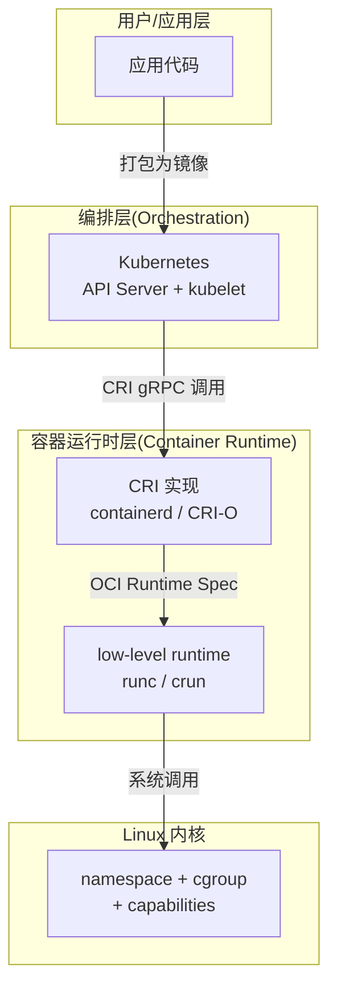
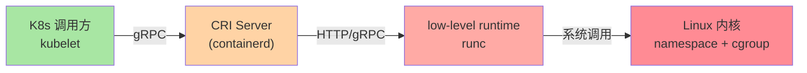

# 容器与 K8s 关系全景：CRI、镜像、运行时三层边界

> K8s 不「跑容器」——它通过 CRI（Container Runtime Interface）调用容器运行时跑容器。理解 CRI 是理解 K8s 边界、CRI-O/containerd/Docker 选型、Pod Sandboxing 等后续概念的前提。

## 一句话摘要

K8s 通过标准化的 CRI 接口对接容器运行时（containerd/CRI-O），运行时通过 OCI 规范拉取镜像并启动容器；Docker 在 K8s 1.24+ 已被 kubelet 移除直接支持，需要通过 containerd 间接对接。

## 一、容器运行时是什么

容器运行时（Container Runtime）是真正「启动容器进程」的软件——它负责：
1. 拉取镜像（OCI Image Spec）
2. 解压镜像层（OCI Runtime Spec）
3. 创建 namespace + cgroup（Linux 内核特性）
4. 启动容器进程



### 1.2 三层职责一览

| 层 | 谁负责 | 核心职责 | 典型技术 |
|---|---|---|---|
| 编排层 | K8s | Pod 调度/编排/自愈 | kube-scheduler, kubelet |
| 运行时层 | CRI 实现 | 拉镜像/启容器/资源隔离 | containerd, runc |
| 内核层 | Linux | 进程隔离/资源限制 | namespace, cgroup |



## 二、CRI：K8s 与运行时的标准接口

### 2.1 CRI 是什么

CRI（Container Runtime Interface）是 K8s 定义的 gRPC 接口，规定 kubelet 如何与容器运行时通信：

```
kubelet → CRI gRPC → 容器运行时 → 启动容器
```

CRI 定义了 4 类操作：

| 操作 | 作用 |
|---|---|
| **RunPodSandbox** | 创建 Pod 沙箱（网络/存储命名空间） |
| **CreateContainer** | 在沙箱内创建容器 |
| **StartContainer** | 启动容器进程 |
| **StopPodSandbox** | 销毁 Pod 沙箱 |

### 2.2 为什么 K8s 要抽象 CRI

直接对接 Docker 会导致：
- K8s 与 Docker 强耦合（K8s 1.24 移除 docker shim 就是为此）
- 想换其他运行时（如 KataContainers 跑虚拟机级隔离）需要改 K8s 源码

CRI 抽象后：
- K8s 只关心「Pod 生命周期」
- 运行时只关心「按 CRI 启动容器」
- 新运行时（gVisor/Kata）通过实现 CRI 接入

## 5W 速记卡

| 5W | 答案 |
|---|---|
| **What** | CRI 是 K8s 与容器运行时之间的 gRPC 接口规范 |
| **Why** | 解耦编排层与运行时层，支持多种运行时 |
| **Who** | K8s SIG-Node 维护 |
| **When** | K8s 1.5 引入 CRI，1.24 移除内置 dockershim |
| **How** | kubelet 通过 CRI gRPC 调用运行时，运行时实现 CRI Server |

## 三、主流 CRI 实现对比

| CRI 实现 | 项目 | 特点 | 适用场景 |
|---|---|---|---|
| **containerd** | CNCF 毕业 | Docker 捐出，业界主流 | 默认选择 |
| **CRI-O** | Red Hat 维护 | 专为 K8s 设计，轻量 | OpenShift / OKD |
| **Docker Engine** | Docker 公司 | 通过 dockershim 对接 | K8s 1.23 及之前（已废弃） |
| **gVisor** | Google | 用户态内核，强隔离 | 多租户/沙箱 |
| **Kata Containers** | OpenInfra | 虚拟机级隔离 | 安全敏感场景 |

> 行业认知：当前生产环境 ~80% 用 containerd（公开报道，2024）。

### 3.1 containerd 为什么胜出

- **成熟稳定**：Docker 捐出后由 CNCF 维护，迭代稳定
- **轻量**：只做容器运行时，不包含 Docker CLI/buildx/compose 等
- **生态丰富**：主流镜像仓库、CNCF 项目都对接 containerd
- **CNCF 毕业项目**：治理成熟

### 3.2 K8s 移除 Docker 的真相

K8s 1.24 移除 `dockershim`（内置 Docker 适配层），不等于「K8s 不能跑 Docker 镜像」——

```bash
# 真相链路：
K8s → CRI → containerd → runc → 容器
                    ↑
            （containerd 能跑任何 OCI 镜像，包括 docker build 出来的）
```

**用户无感**：docker build/push 出的镜像仍然是 OCI 标准镜像，containerd 能直接跑。

## 四、OCI 规范：镜像与运行时的标准

OCI（Open Container Initiative）定义了两套核心规范：

### 4.1 OCI Image Spec

定义「镜像是什么」：
- 文件系统层（layers）
- 清单文件（manifest）
- 配置（config）

```bash
# 查看镜像的 OCI 结构
docker manifest inspect nginx:latest
```

### 4.2 OCI Runtime Spec

定义「容器怎么跑」：
- 命名空间配置
- cgroup 限制
- 挂载点
- 环境变量

```json
// OCI Runtime Spec 示例
{
  "ociVersion": "1.0.2",
  "process": {
    "args": ["/nginx"],
    "env": ["PATH=/usr/local/sbin:/usr/local/bin:/usr/sbin:/usr/bin"]
  },
  "linux": {
    "namespaces": [
      {"type": "pid"},
      {"type": "network"}
    ]
  }
}
```

**为什么 OCI 重要**：Docker、containerd、Podman、CRI-O 都遵循 OCI 规范——**镜像可移植、运行时可替换**。

## 五、典型场景：选择哪个 CRI

### 5.1 普通生产集群

```bash
# 默认：containerd（kubeadm 1.24+ 自动选）
kubectl get nodes -o wide | grep containerRuntimeVersion
# 输出：containerRuntimeVersion: containerd://1.7.x
```

### 5.2 OpenShift / OKD

```bash
# 默认：CRI-O（Red Hat 全栈优化）
oc get nodes -o wide
```

### 5.3 安全敏感场景

```yaml
# Kata Containers（虚拟机级隔离）
apiVersion: node.k8s.io/v1
kind: RuntimeClass
metadata:
  name: kata
handler: kata
```

```yaml
# Pod 申请使用 kata
spec:
  runtimeClassName: kata
```

## 六、自测三问

1. **K8s 直接调用 Docker 跑容器吗？**
   - K8s 1.24+ 不直接调用。kubelet 通过 CRI 调用 containerd/CRI-O，containerd 调用 runc 启动容器进程。

2. **Docker 镜像能在 K8s 上跑吗？**
   - 可以。Docker 镜像是 OCI 标准镜像，containerd 能直接拉取并运行。

3. **为什么需要 gVisor / Kata Containers？**
   - runc 是「共享内核」，容器逃逸会危及宿主机。gVisor 用户态内核 + Kata 虚拟机隔离提供更强安全边界。

## 📌 数据与事实声明

- 写于 2026-09-07，针对 K8s 1.30+ / containerd 1.7+
- dockershim 移除节点：K8s 1.24（2022 年 5 月）
- OCI 规范当前版本：Image Spec 1.1 / Runtime Spec 1.2
- 行业认知：containerd 在生产 K8s 中占比 ~80%（2024 公开报道）
- 免责：CRI/OCI 规范演进中，具体版本以官方为准

## 📚 参考资料

| 类型 | 标题 | 来源 |
|---|---|---|
| 官方文档 | Container Runtimes | kubernetes.io/docs/setup/production-environment/container-runtimes/ |
| 官方文档 | CRI Specification | github.com/kubernetes/cri |
| OCI 规范 | OCI Image Spec | github.com/opencontainers/image-spec |
| OCI 规范 | OCI Runtime Spec | github.com/opencontainers/runtime-spec |
| 生态 | containerd | containerd.io |
| 生态 | CRI-O | cri-o.io |
