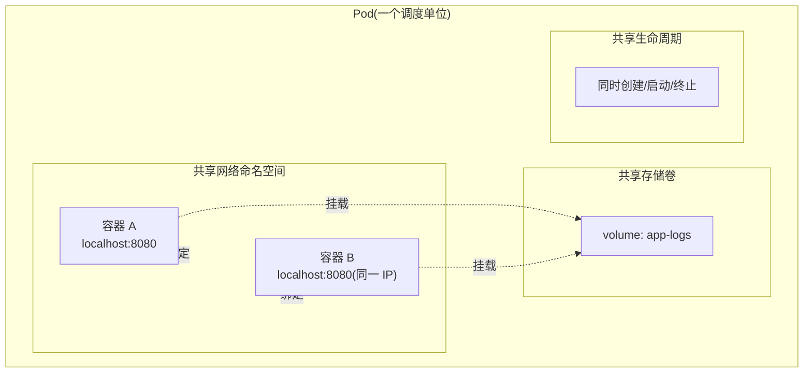
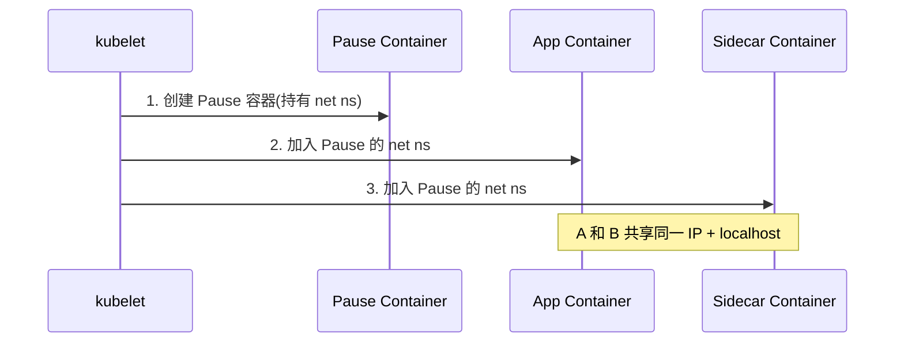
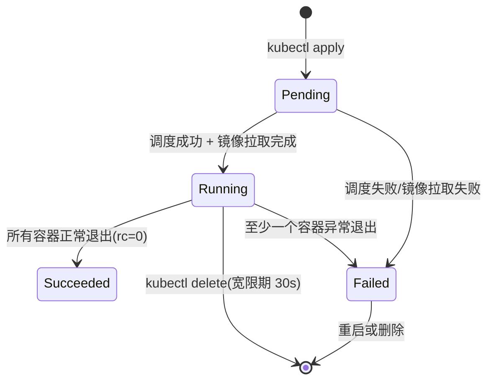

# Pod 是 K8s 最小调度单位：从容器到 Pod 的设计意图

> Pod 是 K8s 发明的概念，不是 Docker 自带的。Pod 的存在是为了解决「共享网络/存储/生命周期的紧密协作容器组」——理解 Pod 就理解了 K8s 与 Docker 的根本差异。

## 一句话摘要

Pod 是 K8s 的最小调度单位，包含一个或多个共享网络命名空间、存储卷、生命周期的容器；Pod 存在的根本原因是「有些容器必须紧密协作（共享 localhost/共享 volume），调度层面把它们视为一个原子单位」。

## 一、为什么 K8s 不直接调度容器

直觉上，K8s 应该像 Docker Swarm 一样直接调度容器——但 K8s 选择了「Pod 作为最小单位」。这是为什么？

### 1.1 一个真实场景：Sidecar 模式

应用容器需要日志收集器（Filebeat）采集 stdout，两个容器必须：
- **共享网络**：Filebeat 通过 localhost 访问应用容器
- **共享存储**：日志写到同一 volume
- **生命周期一致**：应用容器启停时日志采集器同步启停

如果按容器独立调度：
- 应用跑在 Node A，Filebeat 跑在 Node B → localhost 失效
- 网络/存储协调复杂
- 故障恢复时两个容器可能被调度到不同节点

**Pod 的解决方案**：把这两个容器打包为一个 Pod，K8s 保证它们：
- 共享网络命名空间（同一个 localhost）
- 共享 volume
- 总在同一节点
- 同步生命周期

### 1.2 Pod 的三大共享



| 共享维度 | 作用 | 典型用途 |
|---|---|---|
| **网络命名空间** | 容器间通过 localhost 通信 | Sidecar（日志/代理/配置热加载） |
| **存储卷** | 容器间共享文件系统 | 日志采集、配置缓存 |
| **生命周期** | 容器同步启停 | Init Container 等待依赖服务就绪 |

## 二、Pod 的工作机制

### 2.1 Pause 容器：Pod 的「网络地基」

每个 Pod 启动时，K8s 先创建一个 **Pause 容器**（无业务逻辑），它持有 Pod 的网络命名空间。其他容器加入 Pause 容器的命名空间——这就是「共享 localhost」的实现。



**为什么需要 Pause 容器**：容器加入已有命名空间比「多容器竞争创建命名空间」简单得多——Pause 容器作为「锚点」，其他容器加入它。

### 2.2 Init Container：依赖等待机制

Pod 启动时按顺序运行 Init Container，全部成功后才启动主容器：

```yaml
apiVersion: v1
kind: Pod
metadata:
  name: app-with-init
spec:
  initContainers:
    - name: wait-db
      image: busybox
      command: ['sh', '-c', 'until nc -z db-service 5432; do sleep 1; done']
  containers:
    - name: app
      image: myapp:1.0
```

**Init Container 解决**：应用启动前必须等数据库就绪、网络就绪、配置就绪——这些准备工作与主容器隔离。

## 5W 速记卡

| 5W | 答案 |
|---|---|
| **What** | Pod 是 K8s 最小调度单位，包含 1+ 共享网络/存储/生命周期的容器 |
| **Why** | 紧密协作的容器组需原子调度（Sidecar 模式） |
| **Who** | K8s 核心概念，所有控制器围绕 Pod 协作 |
| **When** | K8s 1.0 即有，1.27+ 引入 Sidecar Containers 简化 |
| **How** | Pause 容器持有 net ns，其他容器加入；Init Container 串行启动 |

## 三、Pod 的生命周期



### 3.1 重启策略

| 策略 | 行为 | 适用 |
|---|---|---|
| **Always** | 容器退出就重启 | 长服务（Deployment 默认） |
| **OnFailure** | 失败才重启 | 批处理（Job 可选） |
| **Never** | 不重启 | 单次任务 |

### 3.2 健康检查三件套

```yaml
spec:
  containers:
    - name: app
      image: myapp:1.0
      livenessProbe:    # 存活探针：失败则重启容器
        httpGet:
          path: /healthz
          port: 8080
      readinessProbe:   # 就绪探针：失败则从 Service Endpoints 摘除
        httpGet:
          path: /ready
          port: 8080
      startupProbe:     # 启动探针：慢启动应用专用
        httpGet:
          path: /startup
          port: 8080
        failureThreshold: 30
        periodSeconds: 10
```

**三探针的角色分工**：
- **startupProbe**：应用启动慢，给定宽限窗口
- **livenessProbe**：运行时是否还活着（卡死/死锁）
- **readinessProbe**：能否接流量（启动慢/依赖未就绪时摘除）

## 四、Pod 的局限与 Workload 抽象

直接创建 Pod 的问题：
- 节点挂了 → Pod 消失，无人重建
- 流量增长 → 不会自动扩容
- 滚动升级 → 需手动管理多版本 Pod

K8s 提供更高级的 Workload 抽象：

| 资源 | 解决 | 关系 |
|---|---|---|
| **ReplicaSet** | 维持 N 个副本 Pod | 管 Pod |
| **Deployment** | 管理 ReplicaSet，支持滚动升级/回滚 | 管 ReplicaSet → Pod |
| **StatefulSet** | 有状态应用（稳定网络标识/存储） | 管有状态 Pod |
| **DaemonSet** | 每节点跑一个（如日志采集） | 管节点级 Pod |
| **Job / CronJob** | 一次性/定时任务 | 管批处理 Pod |

> **关键认知**：用户通常不直接写 Pod，而是写 Deployment → ReplicaSet → Pod。Pod 是「物理」层，Deployment 是「逻辑」层。

## 五、典型场景

### 5.1 Sidecar 模式（最常见）

```yaml
apiVersion: v1
kind: Pod
metadata:
  name: app-with-sidecar
spec:
  containers:
    - name: app
      image: myapp:1.0
    - name: log-shipper
      image: filebeat:8.0    # 共享 localhost + volume
```

### 5.2 Init Container 等待依赖

```yaml
spec:
  initContainers:
    - name: migrate-db
      image: migrate:1.0
      command: ['migrate', '-path=/migrations', '-database=...']
  containers:
    - name: app
      image: myapp:1.0
```

### 5.3 单容器 Pod（也常见）

大部分应用是单容器 Pod——Pod 只是「调度单位」，单容器 Pod 同样有意义（统一调度/网络/IP 管理）。

## 六、自测三问

1. **Pod 里的容器为什么能通过 localhost 通信？**
   - 所有容器共享 Pause 容器的网络命名空间，因此共享同一 IP + localhost。

2. **为什么需要 Init Container 而不是直接用容器启动脚本？**
   - Init Container 与主容器解耦（独立镜像/资源），适合做「环境准备」（等数据库/拉配置/初始化存储），主容器只关心业务逻辑。

3. **livenessProbe 和 readinessProbe 的区别是什么？**
   - livenessProbe 失败 → kubelet 重启容器；readinessProbe 失败 → Pod 从 Service Endpoints 摘除（不重启）。

## 📌 数据与事实声明

- 写于 2026-09-07，针对 K8s 1.30+
- Sidecar Containers（简化 sidecar 字段）在 K8s 1.28 GA，1.29 进一步稳定
- Pod 默认宽限期（terminationGracePeriodSeconds）：30 秒
- 免责：Pod Spec 字段较多，具体以官方文档为准

## 📚 参考资料

| 类型 | 标题 | 来源 |
|---|---|---|
| 官方文档 | Pod Lifecycle | kubernetes.io/docs/concepts/workloads/pods/pod-lifecycle/ |
| 官方文档 | Init Containers | kubernetes.io/docs/concepts/workloads/pods/init-containers/ |
| 官方文档 | Sidecar Containers | kubernetes.io/docs/concepts/workloads/pods/sidecar-containers/ |
| 官方文档 | Pod Lifecycle probes | kubernetes.io/docs/concepts/workloads/pods/pod-lifecycle/#probes |
| 设计文档 | The Distributed System Toolkit's Pod | kubernetes.io/blog/2015/ |
