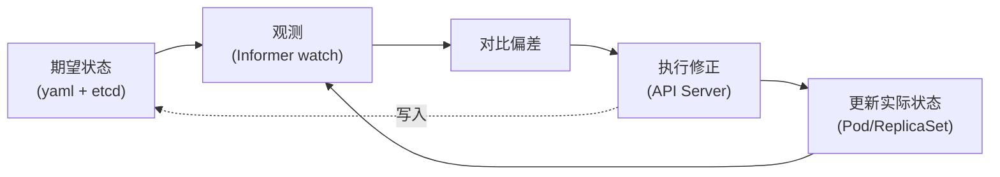
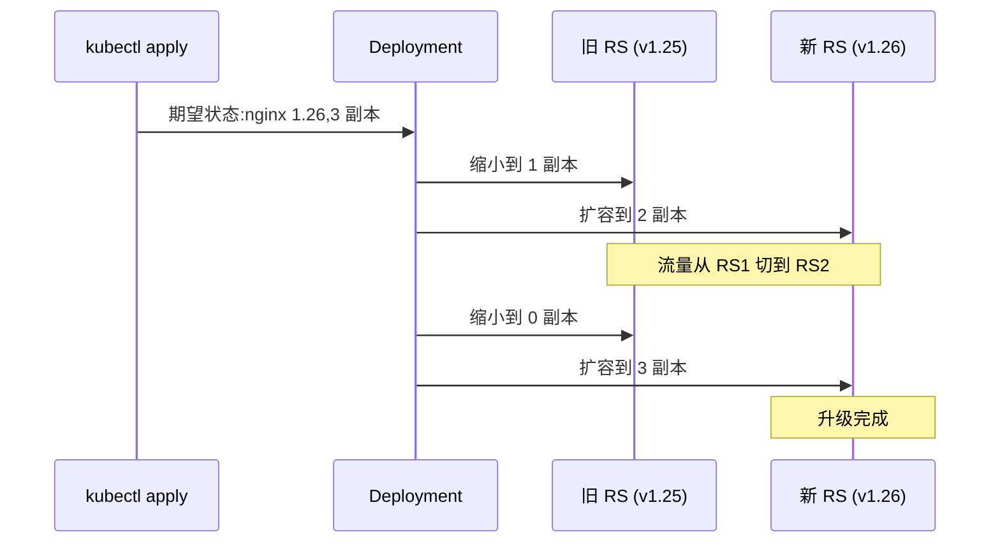

# Deployment 与声明式 API：从命令运维到期望状态

> K8s 的核心革命不是「Pod」，而是「声明式 API」——告诉 K8s「我要什么」而不是「做什么」。Deployment 是声明式 API 的最佳范本：3 个 yaml 字段，K8s 自动处理副本数/滚动升级/回滚。

## 一句话摘要

Deployment 是管理 ReplicaSet 的控制器，提供声明式 Pod 副本管理 + 滚动升级 + 历史回滚；其设计哲学是「期望状态 vs 实际状态」的持续调和（控制循环），而非一次性命令执行。

## 一、命令式 vs 声明式

### 1.1 命令式运维（传统）

```bash
# 创建 3 个 nginx 容器（命令式：做什么、怎么做）
docker run -d --name nginx1 -p 80:80 nginx
docker run -d --name nginx2 -p 80:80 nginx
docker run -d --name nginx3 -p 80:80 nginx

# 升级到 nginx 1.25（命令式：逐个替换）
docker stop nginx1 && docker run -d --name nginx1 -p 80:80 nginx:1.25
docker stop nginx2 && docker run -d --name nginx2 -p 80:80 nginx:1.25
docker stop nginx3 && docker run -d --name nginx3 -p 80:80 nginx:1.25
```

**问题**：
- 步骤多，易遗漏（漏停一个导致端口冲突）
- 失败难回滚（升级后才发现问题，怎么回滚？）
- 状态不可审计（不知道「3 个容器是否真的在跑」）

### 1.2 声明式运维（K8s）

```yaml
# 声明式：我要「3 个 nginx 1.25 副本」，由 K8s 决定怎么做
apiVersion: apps/v1
kind: Deployment
metadata:
  name: nginx
spec:
  replicas: 3
  selector:
    matchLabels:
      app: nginx
  template:
    metadata:
      labels:
        app: nginx
    spec:
      containers:
        - name: nginx
          image: nginx:1.25
```

```bash
# 升级：只改 yaml 里 image 字段
kubectl set image deployment/nginx nginx=nginx:1.26 --record
# K8s 自动：滚动替换 3 个副本，保留可回滚历史
```

**好处**：
- 幂等：执行 N 次结果一样
- 自愈：实际状态偏离期望 → 自动修正
- 可审计：所有期望状态都在 etcd，可 diff/rollback

## 二、控制循环：声明式 API 的执行机制



**每个控制器都是这个循环的实例**：
- Deployment Controller → 观测 ReplicaSet 副本数
- ReplicaSet Controller → 观测 Pod 副本数
- Node Controller → 观测节点心跳

## 5W 速记卡

| 5W | 答案 |
|---|---|
| **What** | Deployment 是声明式管理 ReplicaSet 的资源对象 |
| **Why** | 提供副本数管理 + 滚动升级 + 历史回滚 |
| **Who** | K8s apps/v1 API，所有 Pod 部署的标准入口 |
| **When** | K8s 1.1 引入（替换旧的 ReplicationController） |
| **How** | 控制循环 + 版本化 ReplicaSet（每个版本一个 RS） |

## 三、Deployment 的核心字段

### 3.1 最小可用 Deployment

```yaml
apiVersion: apps/v1       # API 组 + 版本
kind: Deployment          # 资源类型
metadata:                 # 元数据
  name: nginx             # 名称
  labels:
    app: nginx
spec:                     # 期望状态
  replicas: 3             # 副本数
  selector:               # 选择器（必须匹配 template.labels）
    matchLabels:
      app: nginx
  template:               # Pod 模板
    metadata:
      labels:
        app: nginx        # 必须与 selector.matchLabels 一致
    spec:
      containers:
        - name: nginx
          image: nginx:1.25
```

### 3.2 关键字段详解

| 字段 | 作用 | 必填 |
|---|---|---|
| `replicas` | 期望副本数 | 否（默认 1） |
| `selector` | 选择器，匹配 template.labels | ✅ |
| `template` | Pod 模板 | ✅ |
| `strategy` | 升级策略 | 否 |
| `revisionHistoryLimit` | 保留历史版本数 | 否（默认 10） |
| `paused` | 暂停部署 | 否（默认 false） |

## 四、滚动升级与回滚

### 4.1 升级策略

```yaml
spec:
  strategy:
    type: RollingUpdate      # 默认
    rollingUpdate:
      maxUnavailable: 25%    # 升级期间最多 25% 副本不可用
      maxSurge: 25%          # 升级期间最多超额 25% 副本
```



### 4.2 历史回滚

```bash
# 查看历史
kubectl rollout history deployment/nginx

# 回滚到上一版本
kubectl rollout undo deployment/nginx

# 回滚到指定版本
kubectl rollout undo deployment/nginx --to-revision=2
```

**回滚原理**：Deployment 为每次升级创建新 ReplicaSet（旧 RS 保留 N 个历史版本），回滚 = 切换 selector 到旧 RS。

### 4.3 暂停与恢复

```bash
# 升级前暂停（先看新版本是否健康）
kubectl rollout pause deployment/nginx

# 修改 image 后不会立即升级
kubectl set image deployment/nginx nginx=nginx:1.27

# 确认无误后恢复
kubectl rollout resume deployment/nginx
```

## 五、典型场景

### 5.1 标准 Web 服务

```yaml
apiVersion: apps/v1
kind: Deployment
metadata:
  name: web
spec:
  replicas: 3
  selector:
    matchLabels:
      app: web
  template:
    metadata:
      labels:
        app: web
    spec:
      containers:
        - name: web
          image: myweb:1.0
          ports:
            - containerPort: 8080
          resources:
            requests:
              cpu: 100m
              memory: 128Mi
            limits:
              cpu: 500m
              memory: 512Mi
```

### 5.2 蓝绿部署（用 selector 切换）

蓝绿不是 Deployment 原生能力，但可通过两个 Deployment + Service selector 切换实现：

```bash
# 蓝（v1）服务中
kubectl apply -f deployment-blue.yaml

# 部署绿（v2）
kubectl apply -f deployment-green.yaml

# 一键切流量：改 Service selector
kubectl patch service web -p '{"spec":{"selector":{"version":"v2"}}}'
```

### 5.3 金丝雀（用两个 Deployment 调比例）

```bash
# 99% 流量在 v1，1% 在 v2
kubectl scale deployment/web-v1 --replicas=99
kubectl scale deployment/web-v2 --replicas=1
```

## 六、常见误区

### 6.1 改了 yaml 但没 apply

```bash
# 改了 nginx-deployment.yaml 文件
# 但没执行 kubectl apply -f nginx-deployment.yaml
# K8s 完全不知道你的改动
```

### 6.2 selector 不匹配

```yaml
# selector.matchLabels 必须包含 template.metadata.labels
# 否则 Deployment 创建后 ReplicaSet 找不到 Pod
```

### 6.3 直接改 Pod 不生效

Deployment 创建的 Pod 由 ReplicaSet 管——直接 `kubectl edit pod xxx` 修改字段会被 ReplicaSet 自动重置。**改 Pod = 改 template**。

## 七、自测三问

1. **Deployment 和 ReplicaSet 的区别是什么？**
   - ReplicaSet 管副本数；Deployment 管 ReplicaSet（升级/回滚）。用户通常写 Deployment，几乎不直接写 ReplicaSet。

2. **「声明式 API」和「命令式 API」的本质区别是什么？**
   - 命令式：告诉 K8s「做什么」（创建 Pod/替换 Pod），需自己处理幂等；声明式：告诉 K8s「要什么状态」（3 副本 + image 版本），K8s 自己持续调和。

3. **滚动升级期间，旧 RS 为什么不立即删除？**
   - 保留 N 个历史版本用于回滚；删除策略由 `revisionHistoryLimit` 控制（默认 10）。

## 📌 数据与事实声明

- 写于 2026-09-07，针对 K8s 1.30+
- 滚动升级默认值：maxUnavailable 25% / maxSurge 25%
- revisionHistoryLimit 默认值：10
- 免责：Deployment spec 字段较多，演进中，具体以官方文档为准

## 📚 参考资料

| 类型 | 标题 | 来源 |
|---|---|---|
| 官方文档 | Deployments | kubernetes.io/docs/concepts/workloads/controllers/deployment/ |
| 官方文档 | Rolling Update Deployment | kubernetes.io/docs/tutorials/kubernetes-basics/update/ |
| 设计文档 | Declarative Application Management | kubernetes.io/blog/2019/ |
| 实战 | Blue-Green Deployment | kubernetes.io/docs/concepts/cluster-administration/ |
