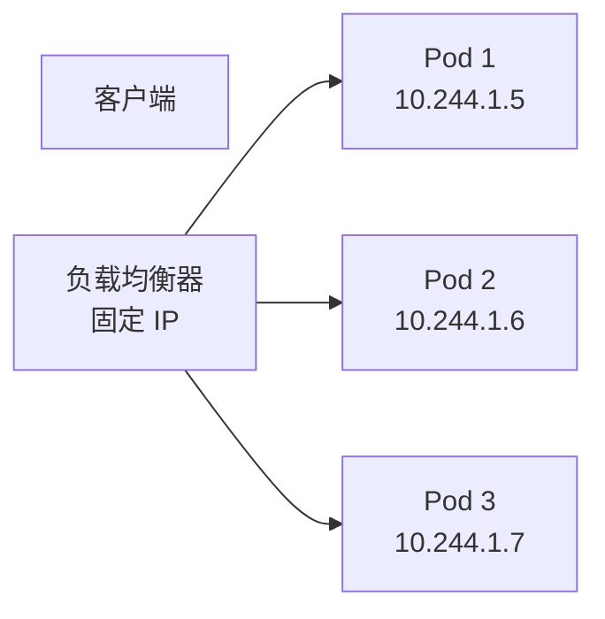
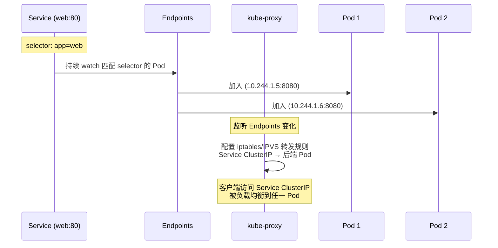
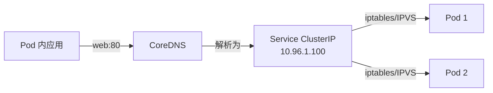

# Service 与 ClusterIP：K8s 的服务发现机制

> Pod 的 IP 不是稳定的（重启就变），客户端不能写死 IP。Service 通过「稳定的虚拟 IP + 标签选择器」抽象 Pod 集合，让客户端访问「服务」而非「Pod」。

## 一句话摘要

Service 是 K8s 的服务发现抽象，通过 label selector 选中一组 Pod，分配稳定的虚拟 IP（ClusterIP），由 kube-proxy 在节点上配置转发规则实现流量分发——解决 Pod IP 不稳定 + 多副本负载均衡问题。

## 一、为什么需要 Service

### 1.1 Pod IP 不稳定的真相

```bash
# 创建 Pod
kubectl run nginx --image=nginx
# Pod 获得 IP：10.244.1.5

# 删除重建（哪怕 image 一样）
kubectl delete pod nginx
kubectl run nginx --image=nginx
# Pod 获得 IP：10.244.1.12  ← 完全不同的 IP！
```

**Pod IP 不稳定的原因**：
- Pod 是「临时资源」，随时可能被驱逐/重启/迁移
- 调度到不同节点，IP 段不同
- 即使是 StatefulSet 提供的稳定标识，也不是真 IP

### 1.2 客户端如何访问多副本

Web 应用跑 3 个副本，客户端怎么知道连哪个？



**Service 的角色**：充当这个「负载均衡器」+ 「固定 IP」。

## 二、Service 的工作原理

### 2.1 三件套：Service + Endpoints + kube-proxy



### 2.2 三个核心组件的分工

| 组件 | 角色 | 实现 |
|---|---|---|
| **Service** | 定义「这个服务的虚拟 IP + 端口」 | API 对象（spec.selector） |
| **Endpoints**（自动维护） | 记录「这个服务当前的后端 Pod 列表」 | API 对象（自动 + Controller 维护） |
| **kube-proxy** | 把「虚拟 IP 转发到后端 Pod」落到节点 | 节点进程（iptables/IPVS 规则） |

## 5W 速记卡

| 5W | 答案 |
|---|---|
| **What** | K8s 服务发现抽象，提供稳定虚拟 IP + 负载均衡 |
| **Why** | Pod IP 不稳定 + 多副本需负载均衡 |
| **Who** | API Server + Endpoints Controller + kube-proxy 协作 |
| **When** | K8s 1.0 即有，1.20+ 默认 IPVS 代理 |
| **How** | label selector → Endpoints 列表 → kube-proxy 配置转发规则 |

## 三、Service 的四种类型

| 类型 | ClusterIP | 适用场景 |
|---|---|---|
| **ClusterIP**（默认） | 集群内部虚拟 IP | 内部服务互联 |
| **NodePort** | 每节点开固定端口（30000-32767） | 外部访问（开发/小规模） |
| **LoadBalancer** | 调云厂商 LB | 生产环境外部访问 |
| **ExternalName** | CNAME 映射到外部域名 | 访问外部服务（如数据库） |

### 3.1 ClusterIP 示例

```yaml
apiVersion: v1
kind: Service
metadata:
  name: web
spec:
  type: ClusterIP        # 默认
  selector:
    app: web             # 匹配 Pod 标签
  ports:
    - port: 80           # Service 端口
      targetPort: 8080   # Pod 端口
```

```bash
# 集群内访问：curl web:80 或 curl web.default.svc.cluster.local:80
# Service ClusterIP 由 K8s 自动分配（虚拟，不实际占用）
```

### 3.2 NodePort 示例

```yaml
spec:
  type: NodePort
  ports:
    - port: 80
      targetPort: 8080
      nodePort: 30080    # 每节点监听 30080
```

```bash
# 外部访问：http://<任意节点IP>:30080
# K8s 自动从 30000-32767 分配可用端口
```

### 3.3 LoadBalancer 示例

```yaml
spec:
  type: LoadBalancer
  ports:
    - port: 80
      targetPort: 8080
```

```bash
# 云厂商（AWS ELB / GCP LB / 阿里云 SLB）自动创建 LB
# EXTERNAL-IP 由云厂商分配
kubectl get svc web
# NAME   TYPE           CLUSTER-IP    EXTERNAL-IP     PORT(S)
# web    LoadBalancer   10.96.1.100   <pending>→<AWS ELB>  80:30080/TCP
```

## 四、Service 与 DNS

K8s 自动为 Service 创建 DNS 记录：

```bash
# Service 名：web, 命名空间：default
# 自动 DNS 记录：
web.default.svc.cluster.local  → ClusterIP

# 同命名空间访问：web
# 跨命名空间访问：web.other-namespace.svc.cluster.local
```



**Headless Service**：无 ClusterIP 的 Service（`clusterIP: None`），DNS 直接返回 Pod IP——用于 StatefulSet 等需要稳定 Pod 标识的场景。

```yaml
spec:
  clusterIP: None
  selector:
    app: db
```

## 五、负载均衡策略

### 5.1 kube-proxy 的两种实现

| 实现 | 原理 | 性能 | 适用 |
|---|---|---|---|
| **iptables**（默认） | iptables 规则链 | 万级连接 OK，万级规则时性能下降 | 小集群 |
| **IPVS** | 内核 LVS | 哈希表查找，10 万级规则仍快 | 大集群 |

### 5.2 sessionAffinity

```yaml
spec:
  sessionAffinity: ClientIP    # 同 IP 客户端始终访问同一 Pod
  sessionAffinityConfig:
    clientIP:
      timeoutSeconds: 10800    # 3 小时
```

**典型用途**：需要本地缓存的应用（如会话缓存）——避免缓存命中率因负载均衡抖动而下降。

## 六、典型场景

### 6.1 微服务互联

```yaml
# order-service 调 payment-service
spec:
  containers:
    - name: order
      env:
        - name: PAYMENT_URL
          value: "http://payment-service:8080"   # 用 Service 名
```

### 6.2 蓝绿部署

两个 Deployment（蓝 v1 / 绿 v2）+ 切换 Service selector：

```yaml
# 蓝绿 Service
spec:
  selector:
    app: web
    version: v1    # 切到 v2 = 改 selector
```

### 6.3 多端口 Service

```yaml
spec:
  ports:
    - name: http
      port: 80
      targetPort: 8080
    - name: metrics
      port: 9090
      targetPort: 9090
```

## 七、自测三问

1. **Service 的 ClusterIP 是真实 IP 吗？**
   - 不是。是虚拟 IP（不绑定任何网卡），由 kube-proxy 在节点上通过 iptables/IPVS 规则转发到后端 Pod。

2. **Service 如何知道后端 Pod 列表变了？**
   - Endpoints Controller 持续 watch Service selector 匹配的 Pod，变化时自动更新 Endpoints 对象；kube-proxy watch Endpoints 并更新转发规则。

3. **NodePort 和 LoadBalancer 的关系是什么？**
   - LoadBalancer 在 NodePort 基础上自动创建云厂商负载均衡器；NodePort 是 ClusterIP + 每节点固定端口的组合。

## 📌 数据与事实声明

- 写于 2026-09-07，针对 K8s 1.30+
- kube-proxy 默认模式：iptables（`proxy-mode: iptables`）
- IPVS 模式启用：`proxy-mode: ipvs`
- NodePort 默认端口范围：30000-32767
- 免责：Service 类型与具体实现以云厂商/集群配置为准

## 📚 参考资料

| 类型 | 标题 | 来源 |
|---|---|---|
| 官方文档 | Service | kubernetes.io/docs/concepts/services-networking/service/ |
| 官方文档 | kube-proxy | kubernetes.io/docs/concepts/overview/components/#kube-proxy |
| 官方文档 | DNS for Services and Pods | kubernetes.io/docs/concepts/services-networking/dns-pod-service/ |
| 实战 | Connecting Applications with Services | kubernetes.io/docs/tutorials/connecting-applications/ |
