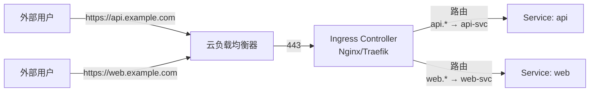
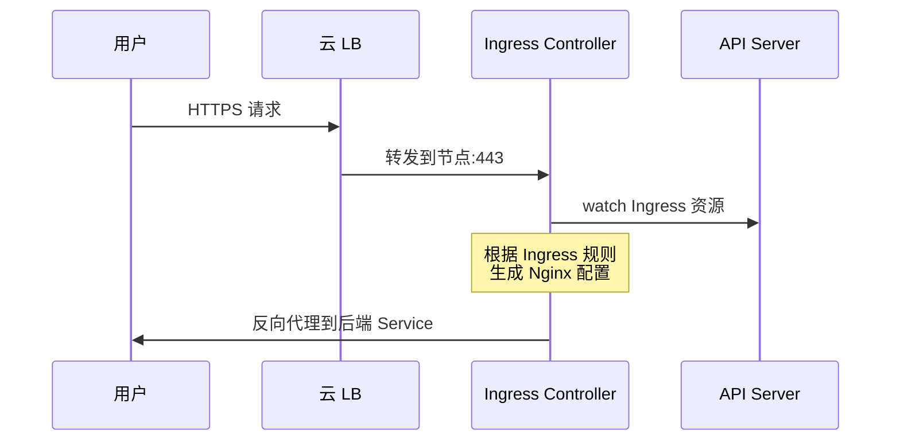
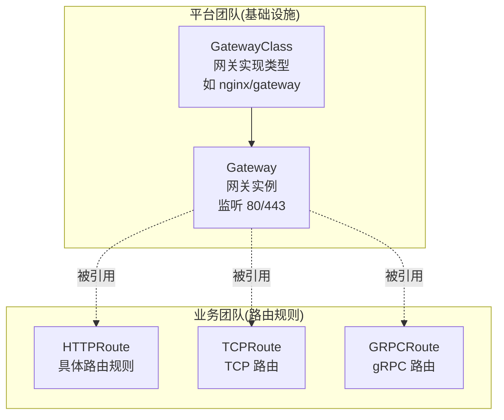

# Ingress 与 Gateway API：南北流量入口的演进

> Service 是集群内部服务发现，Ingress/Gateway 是「集群外部到内部」的入口。Ingress 已统治 8 年（2015-2023），但其角色模糊（路由+TLS+限流都在一个对象）——Gateway API 正在逐步取代它。

## 一句话摘要

Ingress 是 K8s 的 HTTP/HTTPS 路由抽象（7 层负载均衡），由 Ingress Controller（Nginx Ingress/Traefik 等）实现；Gateway API 是新一代演进，分离「网关基础设施」（Gateway）与「路由规则」（HTTPRoute），更易多团队协作。

## 一、为什么需要 Ingress

### 1.1 Service 的局限

Service 是「集群内虚拟 IP」，外部流量无法直接访问。早期方案：

| 方案 | 问题 |
|---|---|
| NodePort | 端口范围有限（30000-32767），需在 LB 上配端口转发 |
| LoadBalancer | 每个 Service 一个 LB，贵、慢、不灵活 |
| 直接用云 LB | K8s 内部 Pod 变化时 LB 配置不自动更新 |

### 1.2 Ingress 的解决方案

Ingress = **「集群外部 HTTP 入口 + 路由规则」**：



**一个 LB + 一个 Ingress Controller** 处理所有外部 HTTP 流量 → 大幅降低成本和管理复杂度。

## 二、Ingress 的工作机制

### 2.1 Ingress 资源（路由规则）

```yaml
apiVersion: networking.k8s.io/v1
kind: Ingress
metadata:
  name: web-ingress
spec:
  ingressClassName: nginx     # 用哪个 Controller
  rules:
    - host: api.example.com
      http:
        paths:
          - path: /
            pathType: Prefix
            backend:
              service:
                name: api-svc
                port:
                  number: 8080
    - host: web.example.com
      http:
        paths:
          - path: /
            pathType: Prefix
            backend:
              service:
                name: web-svc
                port:
                  number: 80
  tls:                         # HTTPS
    - hosts:
        - api.example.com
        - web.example.com
      secretName: example-tls
```

### 2.2 Ingress Controller（执行器）

Ingress 资源本身不工作——它需要 Ingress Controller 监听并执行：

| Controller | 项目 | 特点 |
|---|---|---|
| **Nginx Ingress** | kubernetes/ingress-nginx | 最常用，CNCF 维护 |
| **Traefik** | traefik/traefik | 配置自动发现，UI 友好 |
| **HAProxy Ingress** | jcmoraisjr/haproxy-ingress | 高性能，HAProxy 内核 |
| **Contour** | projectcontour/contour | Envoy 数据面 |
| **Istio Ingress** | istio/istio | 服务网格自带 |



## 5W 速记卡

| 5W | 答案 |
|---|---|
| **What** | K8s 的 HTTP/HTTPS 路由抽象（7 层 LB） |
| **Why** | 替代 NodePort/LoadBalancer 的高成本方案 |
| **Who** | networking.k8s.io/v1 API，由 Ingress Controller 实现 |
| **When** | K8s 1.0 即有 Ingress（beta），1.19 GA networking.k8s.io/v1 |
| **How** | Ingress Controller watch Ingress 资源 + 生成反向代理配置 |

## 三、Ingress 的局限 → Gateway API 的诞生

### 3.1 Ingress 的三大问题

**问题 1：角色模糊**——一个对象既要管「路由规则」，又要管「TLS 证书」，还要管「流量切分」，扩展性差。

**问题 2：多团队协作难**——平台团队和业务团队都在改同一个 Ingress 对象，容易冲突。

**问题 3：协议支持有限**——主要面向 HTTP/HTTPS，TCP/UDP/gRPC 支持不统一。

### 3.2 Gateway API 的设计哲学

Gateway API 把职责拆成三个角色：



| 角色 | 谁管 | 例子 |
|---|---|---|
| **GatewayClass** | 集群管理员 | `nginx` / `istio-waypoint` |
| **Gateway** | 平台团队 | `prod-gateway`（监听 80/443） |
| **HTTPRoute / TCPRoute** | 业务团队 | `web-route`（路由规则） |

**好处**：业务团队改路由不影响网关基础设施；多协议统一模型；跨厂商可移植。

### 3.3 Gateway API 示例

```yaml
# 平台团队：Gateway
apiVersion: gateway.networking.k8s.io/v1
kind: Gateway
metadata:
  name: prod-gateway
  namespace: infra
spec:
  gatewayClassName: nginx
  listeners:
    - name: http
      protocol: HTTP
      port: 80
    - name: https
      protocol: HTTPS
      port: 443
      tls:
        certificateRefs:
          - name: prod-tls
---
# 业务团队：HTTPRoute
apiVersion: gateway.networking.k8s.io/v1
kind: HTTPRoute
metadata:
  name: web-route
spec:
  parentRefs:
    - name: prod-gateway    # 引用 Gateway
  hostnames:
    - web.example.com
  rules:
    - matches:
        - path: { type: PathPrefix, value: / }
      backendRefs:
        - name: web-svc
          port: 80
```

## 四、Ingress vs Gateway API 对比

| 维度 | Ingress | Gateway API |
|---|---|---|
| **成熟度** | 稳定（2015-） | 演进中（2023+ GA，部分功能 beta） |
| **角色拆分** | 单对象 | Gateway / HTTPRoute 拆分 |
| **多团队** | 难 | 易（角色化设计） |
| **协议** | HTTP/HTTPS 为主 | HTTP / TCP / UDP / gRPC / TLS |
| **跨厂商** | 部分（各有 annotation） | 高（标准 API + 实现） |
| **流量切分** | annotation 扩展 | 原生 HTTPRouteRule |
| **迁移路径** | — | 多 Controller 支持双协议 |

**迁移建议**（行业认知）：
- 新集群：直接用 Gateway API
- 存量 Ingress：保持运行，渐进迁移（按团队/服务拆分）

## 五、典型场景

### 5.1 多域名路由

```yaml
spec:
  rules:
    - host: api.example.com
      http:
        paths:
          - path: /v1
            backend: { service: { name: api-v1, port: 8080 } }
          - path: /v2
            backend: { service: { name: api-v2, port: 8080 } }
    - host: admin.example.com
      http:
        paths:
          - path: /
            backend: { service: { name: admin, port: 80 } }
```

### 5.2 TLS 终止

```yaml
spec:
  tls:
    - hosts:
        - api.example.com
      secretName: api-tls    # 包含 tls.crt + tls.key
```

### 5.3 灰度发布（按 Header）

```yaml
# Nginx Ingress annotation
metadata:
  annotations:
    nginx.ingress.kubernetes.io/canary: "true"
    nginx.ingress.kubernetes.io/canary-by-header: "X-Canary"
    nginx.ingress.kubernetes.io/canary-by-header-value: "true"
```

## 六、自测三问

1. **Ingress 和 Service 的区别是什么？**
   - Service 是 4 层（TCP/UDP）服务发现抽象；Ingress 是 7 层（HTTP/HTTPS）路由抽象，支持基于 host/path/header 的路由。

2. **Ingress Controller 是 K8s 内置的吗？**
   - 不是。K8s 只定义 Ingress API，真正执行路由的是 Ingress Controller（需单独部署，如 Nginx Ingress）。

3. **Gateway API 比 Ingress 强在哪？**
   - 角色拆分（Gateway/HTTPRoute）+ 多协议支持 + 跨厂商标准 + 多团队协作友好。但生态成熟度仍在演进。

## 📌 数据与事实声明

- 写于 2026-09-07，针对 K8s 1.30+
- Ingress GA 版本：networking.k8s.io/v1（K8s 1.19 起 GA）
- Gateway API GA 版本：v1.0（2023-10），部分高级特性（TCPRoute/TLSRoute 等）仍 beta
- Nginx Ingress 当前主流版本：v1.10+
- 行业认知：Ingress 仍是主流（存量 ~80%+），新集群逐步切 Gateway API（公开报道 2024）
- 免责：Gateway API 仍在演进，具体实现支持度以各 Controller 文档为准

## 📚 参考资料

| 类型 | 标题 | 来源 |
|---|---|---|
| 官方文档 | Ingress | kubernetes.io/docs/concepts/services-networking/ingress/ |
| 官方文档 | Gateway API | gateway-api.sigs.k8s.io |
| 实战 | Nginx Ingress | kubernetes.github.io/ingress-nginx |
| 实战 | Traefik | doc.traefik.io/traefik |
| 设计文档 | Gateway API Motivation | gateway-api.sigs.k8s.io/concepts/ |
