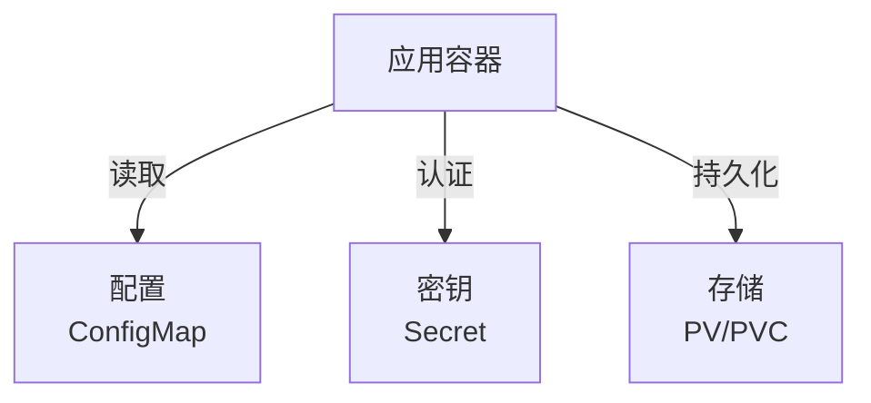
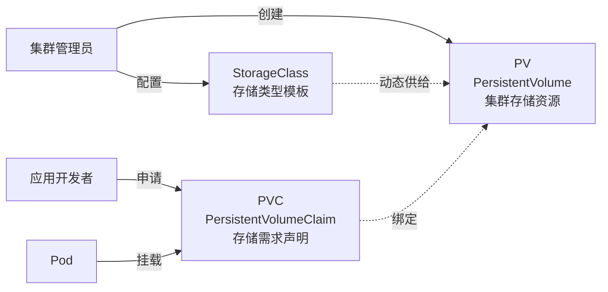

# ConfigMap / Secret / PV：K8s 的配置与存储抽象

> 应用代码与「环境配置 / 敏感数据 / 持久化存储」解耦，是云原生的基本要求。ConfigMap 管配置，Secret 管密钥，PV/PVC 管持久存储——三者构成 K8s 应用「数据三件套」。

## 一句话摘要

ConfigMap 存非敏感配置（环境变量/配置文件），Secret 存敏感数据（密码/token，base64 编码），PV/PVC 提供 Pod 生命周期外的持久化存储（外挂卷）；三者共同实现「配置与代码分离、敏感数据隔离、状态可持久化」。

## 一、为什么需要这三件套

### 1.1 容器应用的「数据三性」

应用部署需要解决三个独立但相关的需求：



| 需求 | 资源 | 典型场景 |
|---|---|---|
| 不同环境用不同配置 | **ConfigMap** | dev/test/prod 不同数据库 URL |
| 不同环境用不同密钥 | **Secret** | 数据库密码、API Token |
| Pod 重启数据不丢 | **PV/PVC** | 数据库文件、日志归档 |

## 二、ConfigMap：非敏感配置

### 2.1 两种用法

```yaml
# ConfigMap 定义
apiVersion: v1
kind: ConfigMap
metadata:
  name: app-config
data:
  # 1. key-value（环境变量）
  DATABASE_URL: "postgres://db:5432/mydb"
  LOG_LEVEL: "info"
  # 2. 完整配置文件（用 | 保留换行）
  application.properties: |
    server.port=8080
    spring.datasource.url=jdbc:postgresql://db:5432/mydb
    logging.level.root=INFO
```

**用法 A：环境变量**
```yaml
spec:
  containers:
    - name: app
      envFrom:
        - configMapRef:
            name: app-config    # 全部 key 注入环境变量
```

**用法 B：挂载为文件**
```yaml
spec:
  containers:
    - name: app
      volumeMounts:
        - name: config
          mountPath: /etc/config
  volumes:
    - name: config
      configMap:
        name: app-config        # /etc/config/application.properties
```

### 2.2 热更新

ConfigMap 更新后：
- **环境变量**：不会自动更新（Pod 启动时一次性注入）
- **挂载文件**：默认会在 30-60s 内更新（kubelet 周期性 sync）

**强制刷新挂载**：
```yaml
volumes:
  - name: config
    configMap:
      name: app-config
      items:
        - key: application.properties
          path: application.properties
```

```bash
# 手动触发：删除 Pod 让 Deployment 重建
kubectl rollout restart deployment/app
```

## 三、Secret：敏感数据

### 3.1 与 ConfigMap 的关键差异

| 维度 | ConfigMap | Secret |
|---|---|---|
| 数据内容 | 非敏感 | 敏感（密码/Token/证书） |
| 存储编码 | 明文 | base64（注意：base64 ≠ 加密！） |
| 加密存储 | 默认否 | 默认否（需启用 EncryptionConfiguration） |
| 访问控制 | RBAC | RBAC + 更严格的策略 |

**base64 ≠ 加密**：Secret 只是「避免明文写在 yaml 里」，任何人能 `kubectl get secret -o yaml` 解码。**真正加密需启用 K8s EncryptionConfiguration** 或外部方案（Vault）。

### 3.2 三种 Secret 类型

| 类型 | data 字段 | 用途 |
|---|---|---|
| **Opaque**（默认） | base64 字符串 | 通用敏感数据 |
| **kubernetes.io/dockerconfigjson** | docker registry 认证 | 拉私有镜像 |
| **kubernetes.io/tls** | tls.crt + tls.key | Ingress TLS |
| **kubernetes.io/service-account-token** | — | ServiceAccount 挂载 token（1.24+ 自动创建） |

### 3.3 Secret 用法

```yaml
# 定义 Secret
apiVersion: v1
kind: Secret
metadata:
  name: db-credentials
type: Opaque
stringData:        # stringData 自动 base64
  username: app
  password: "S3cr3tP@ss"
---
# Pod 引用
spec:
  containers:
    - name: app
      env:
        - name: DB_USER
          valueFrom:
            secretKeyRef:
              name: db-credentials
              key: username
        - name: DB_PASS
          valueFrom:
            secretKeyRef:
              name: db-credentials
              key: password
```

### 3.4 Secret 的安全最佳实践

- ✅ 启用 EncryptionConfiguration（K8s 1.27+ 推荐）
- ✅ 用 external Secret Operator（Vault/AWS Secrets Manager）
- ✅ 限制 Secret 的 RBAC 访问
- ❌ 不要把 Secret 提交到 Git
- ❌ 不要依赖 base64 视为「加密」

## 5W 速记卡

| 5W | 答案 |
|---|---|
| **What** | ConfigMap（配置）+ Secret（密钥）+ PV/PVC（存储）三件套 |
| **Why** | 实现代码与配置/密钥/状态解耦 |
| **Who** | API Server + 各 Controller（Endpoints/Volume 等） |
| **When** | ConfigMap K8s 1.2+、Secret K8s 1.0+、PV/PVC K8s 1.0+ |
| **How** | 数据注入 env / 挂载 volume / 绑定到节点存储 |

## 四、PV/PVC：持久化存储

### 4.1 三层抽象



### 4.2 三种供给模式

| 模式 | 流程 | 适用 |
|---|---|---|
| **静态供给** | 管理员先创建 PV，PVC 绑定 | 固定容量存储 |
| **动态供给** | PVC 触发 StorageClass 自动创建 PV | 云存储（AWS EBS / GCP PD） |
| **临时卷（emptyDir）** | Pod 内共享临时存储 | 缓存/中间数据 |

### 4.3 完整示例（动态供给）

```yaml
# 1. StorageClass（云厂商默认已存在，如 gp2 on AWS）
apiVersion: storage.k8s.io/v1
kind: StorageClass
metadata:
  name: gp3
provisioner: ebs.csi.aws.com    # AWS EBS CSI
parameters:
  type: gp3
  fsType: ext4
---
# 2. PVC（开发者声明需求）
apiVersion: v1
kind: PersistentVolumeClaim
metadata:
  name: app-data
spec:
  storageClassName: gp3
  accessModes:
    - ReadWriteOnce    # 单节点读写
  resources:
    requests:
      storage: 10Gi
---
# 3. Pod 使用
spec:
  containers:
    - name: app
      volumeMounts:
        - name: data
          mountPath: /var/lib/app
  volumes:
    - name: data
      persistentVolumeClaim:
        claimName: app-data
```

### 4.4 accessModes 详解

| 模式 | 缩写 | 含义 |
|---|---|---|
| **ReadWriteOnce** | RWO | 单节点读写（块存储） |
| **ReadOnlyMany** | ROX | 多节点只读 |
| **ReadWriteMany** | RWX | 多节点读写（文件存储如 NFS） |
| **ReadWriteOncePod** | RWOP | 单 Pod 读写（K8s 1.22+，更严格） |

## 五、ConfigMap / Secret / PV 对比

| 维度 | ConfigMap | Secret | PV |
|---|---|---|---|
| 数据编码 | 明文 | base64 | 二进制/文件系统 |
| 加密存储 | 否 | 可选 | 由存储后端决定 |
| 生命周期 | 同 namespace | 同 namespace | 集群级 |
| 热更新 | 是（挂载） | 是（挂载） | 否（PVC 绑定后） |
| 典型用途 | 应用配置 | 密钥/证书 | 数据库/缓存 |

## 六、典型场景

### 6.1 多环境配置

```bash
# dev 环境
kubectl create configmap app-config --from-env-file=config.dev

# prod 环境
kubectl create configmap app-config --from-env-file=config.prod -n prod
```

### 6.2 数据库凭据管理

```bash
# Vault Operator 创建 ExternalSecret，自动同步到 K8s Secret
kubectl apply -f external-secret.yaml
```

### 6.3 有状态应用（StatefulSet）

```yaml
apiVersion: apps/v1
kind: StatefulSet
metadata:
  name: postgres
spec:
  serviceName: postgres
  replicas: 3
  template:
    spec:
      containers:
        - name: postgres
          volumeMounts:
            - name: data
              mountPath: /var/lib/postgresql/data
  volumeClaimTemplates:    # 自动为每个 Pod 创建 PVC
    - metadata:
        name: data
      spec:
        accessModes: ["ReadWriteOnce"]
        storageClassName: gp3
        resources:
          requests:
            storage: 100Gi
```

## 七、自测三问

1. **ConfigMap 更新后，Pod 内的环境变量会自动更新吗？**
   - 不会。环境变量在 Pod 启动时注入，运行时不更新。挂载为文件默认会更新（kubelet 周期性 sync，30-60s）。

2. **Secret 是加密存储吗？**
   - 默认不是。Secret 只是 base64 编码（任何人都能解码），K8s 1.27+ 推荐启用 EncryptionConfiguration 真正加密。

3. **PV 和 PVC 谁先创建？**
   - 动态供给：PVC 先创建，StorageClass 触发 PV 自动创建。静态供给：PV 先由管理员创建，PVC 再绑定。

## 📌 数据与事实声明

- 写于 2026-09-07，针对 K8s 1.30+
- ConfigMap/Secret 更新延迟：30-60s（默认 kubelet sync 周期）
- 默认 StorageClass：多数云厂商 K8s 默认已创建（如 AWS gp2/gp3）
- K8s 1.24+：Secret 自动创建 token 改为按需创建（不再自动挂载 SA token）
- 免责：CSI 驱动支持度因云厂商/版本而异

## 📚 参考资料

| 类型 | 标题 | 来源 |
|---|---|---|
| 官方文档 | ConfigMap | kubernetes.io/docs/concepts/configuration/configmap/ |
| 官方文档 | Secret | kubernetes.io/docs/concepts/configuration/secret/ |
| 官方文档 | Persistent Volumes | kubernetes.io/docs/concepts/storage/persistent-volumes/ |
| 官方文档 | Storage Classes | kubernetes.io/docs/concepts/storage/storage-classes/ |
| 实战 | Secrets Management Best Practices | kubernetes.io/docs/concepts/configuration/secret/#best-practices |
