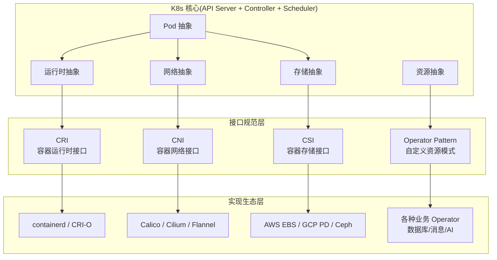
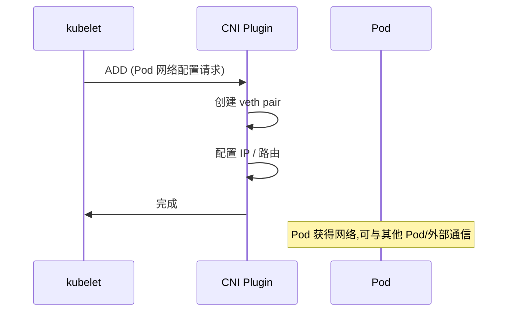
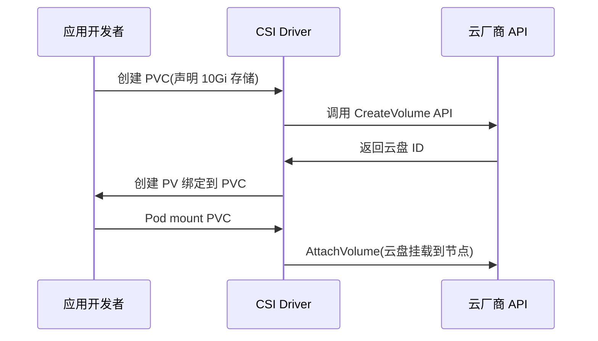

# K8s 生态分层：CNI / CSI / CRI / Operator 四件套

> K8s 核心只内置 Pod/Service/Deployment 三件事——其他全部交给接口规范：网络给 CNI，存储给 CSI，容器运行时给 CRI，自定义资源给 Operator。理解这四个接口就理解 K8s 生态爆炸的根源。

## 一句话摘要

K8s 通过 CRI（容器运行时）、CNI（网络）、CSI（存储）、Operator（自定义资源）四大接口规范，把运行时/网络/存储/业务逻辑全部「外包」给独立生态——这是 K8s 不需要内置所有功能却能统治容器编排的根本原因。

## 一、K8s 为何要拆出接口

### 1.1 反例：Docker Swarm 的「大一统」

Docker Swarm 把所有功能（编排/网络/存储）内置在 Docker Engine 里——结果是：
- 任何网络/存储方案想接入 Swarm 都必须改 Docker 源码
- 集群规模受限（官方推荐 ≤ 1000 节点）
- 生态封闭，难以扩展

### 1.2 K8s 的「核心最小化 + 接口标准化」

K8s 核心只管 Pod/Service/Deployment 等「抽象资源」，具体实现：



**好处**：K8s 核心保持精简；任何领域都可独立扩展；多实现并存竞争——这是 K8s 生态爆炸的根源。

## 5W 速记卡

| 5W | 答案 |
|---|---|
| **What** | CRI（运行时）+ CNI（网络）+ CSI（存储）+ Operator（自定义）四大接口 |
| **Why** | 核心最小化 + 接口标准化，让生态可独立扩展 |
| **Who** | K8s SIG-Node / SIG-Network / SIG-Storage + CNCF 各项目 |
| **When** | CRI 2016+ / CNI 2015+ / CSI 2018+ / Operator 2016+ |
| **How** | K8s 核心定义接口规范，实现方按规范开发独立项目 |

## 二、CRI：容器运行时接口

### 2.1 作用

K8s 不直接调用 Docker/containerd——通过 CRI gRPC 接口：

| 操作 | 作用 |
|---|---|
| **RunPodSandbox** | 创建 Pod 沙箱（网络/存储命名空间） |
| **CreateContainer** | 在沙箱内创建容器 |
| **StartContainer** | 启动容器进程 |
| **StopPodSandbox** | 销毁沙箱 |

### 2.2 主流实现

| 实现 | 特点 |
|---|---|
| **containerd** | Docker 捐出，CNCF 毕业，业界主流 |
| **CRI-O** | Red Hat 维护，专为 K8s 设计 |
| **gVisor** | Google 用户态内核，强隔离 |
| **Kata Containers** | 虚拟机级隔离，安全场景 |

### 2.3 真相：Docker 在 K8s 中已不直接支持

K8s 1.24（2022-05）移除内置 dockershim。但 docker build/push 的镜像仍是 OCI 标准镜像，containerd 照样能跑——**用户无感**。

## 三、CNI：容器网络接口

### 3.1 作用

CNI 规定「Pod 启动时如何配置网络」：



### 3.2 主流实现对比

| CNI Plugin | 模型 | 特点 |
|---|---|---|
| **Flannel** | Overlay（VXLAN） | 简单，适合小集群 |
| **Calico** | BGP / Overlay | 高性能 + Network Policy |
| **Cilium** | eBPF | 高性能 + 可观测性 + 安全 |
| **Weave Net** | Overlay | 易用，自动发现 |

### 3.3 CNI 的关键问题

- **Pod 间通信**：同节点 / 跨节点如何打通？
- **Service ClusterIP**：如何实现虚拟 IP → Pod？
- **Network Policy**：如何隔离租户网络？
- **外部访问**：NodePort / LoadBalancer / Ingress 如何落地？

不同 CNI 实现策略差异巨大——选型决定网络性能上限。

## 四、CSI：容器存储接口

### 4.1 作用

CSI 规定「Pod 如何挂载持久化存储」：



### 4.2 主流 CSI Driver

| CSI Driver | 存储类型 | 特点 |
|---|---|---|
| **aws-ebs-csi-driver** | AWS EBS | 块存储，RWO |
| **gcp-pd-csi-driver** | GCP Persistent Disk | 块存储 |
| **azure-disk-csi-driver** | Azure Disk | 块存储 |
| **ceph-csi** | Ceph RBD / CephFS | 自建，块/文件 |
| **nfs-csi** | NFS | 文件存储，RWX |

### 4.3 CSI 与 in-tree 的演进

K8s 1.13+ 起，CSI 取代了内置的「in-tree」volume 插件：
- in-tree：AWS EBS / GCP PD 写死在 K8s 源码中
- CSI：独立项目，可独立版本升级，独立部署

**当前状态**：所有主流 in-tree 插件已迁移到 CSI（K8s 1.26 移除 azure-file/azure-disk in-tree）。

## 五、Operator 模式：自定义资源

### 5.1 为什么需要 Operator

K8s 内置资源（Pod/Service/Deployment）只覆盖通用场景。专业领域（数据库/消息队列/AI 平台）需要：
- 复杂状态管理（如数据库主从切换）
- 自动化运维（如 Prometheus 联邦）
- 领域知识封装（如 Kafka Topic 配置）

**Operator = CRD（自定义资源）+ Controller（自定义控制器）**：

```yaml
# CRD 示例：定义一个叫 KafkaCluster 的资源
apiVersion: apiextensions.k8s.io/v1
kind: CustomResourceDefinition
metadata:
  name: kafkaclusters.kafka.example.com
spec:
  group: kafka.example.com
  versions:
    - name: v1
      served: true
      storage: true
      schema:
        openAPIV3Schema:
          properties:
            spec:
              properties:
                brokers:
                  type: integer
                storageSize:
                  type: string
---
# 用户使用：创建 KafkaCluster
apiVersion: kafka.example.com/v1
kind: KafkaCluster
metadata:
  name: my-kafka
spec:
  brokers: 3
  storageSize: 100Gi
```

### 5.2 主流 Operator 生态

| 领域 | 代表 Operator |
|---|---|
| **数据库** | postgres-operator / mysql-operator / mongodb-operator |
| **消息** | strimzi-kafka-operator / rabbitmq-operator |
| **可观测** | prometheus-operator / grafana-operator |
| **证书** | cert-manager |
| **GitOps** | argocd-operator / fluxcd-operator |
| **AI** | kubeflow / ray-operator |

### 5.3 Operator Framework（开发工具）

| 工具 | 用途 |
|---|---|
| **Operator SDK** | 用 Go/Ansible/Helm 开发 Operator |
| **Kubebuilder** | Go 原生开发框架 |
| **OLM（Operator Lifecycle Manager）** | Operator 的生命周期管理 |

## 六、四件套对比

| 接口 | 解决 | 主流实现 | 演进状态 |
|---|---|---|---|
| **CRI** | 容器运行时 | containerd / CRI-O | 成熟（K8s 1.0+） |
| **CNI** | Pod 网络 | Calico / Cilium / Flannel | 成熟 |
| **CSI** | 持久存储 | aws-ebs-csi / ceph-csi | 成熟（in-tree 已迁移） |
| **Operator** | 自定义资源 | 各领域 Operator | 活跃演进 |

## 七、典型场景

### 7.1 自建 K8s 集群的接口选型

| 维度 | 推荐 |
|---|---|
| CRI | containerd（CNCF 主流） |
| CNI | Cilium（eBPF 高性能）或 Calico（BGP 成熟） |
| CSI | 云厂商默认 CSI（AWS EBS / GCP PD） |
| Operator | cert-manager + Prometheus + 业务 Operator |

### 7.2 多租户集群的安全分层

```
┌─────────────────────────────────────┐
│  Operator 层：业务封装（数据库/中间件）│
├─────────────────────────────────────┤
│  CSI 层：存储配额 + 加密             │
├─────────────────────────────────────┤
│  CNI 层：Network Policy 隔离租户网络 │
├─────────────────────────────────────┤
│  CRI 层：gVisor/Kata 强化容器隔离     │
├─────────────────────────────────────┤
│  K8s 核心：RBAC 权限隔离             │
└─────────────────────────────────────┘
```

### 7.3 边缘场景：轻量化

边缘 K8s（K3s / KubeEdge）对四件套做了精简：
- 内置 Flannel（替代 CNI 选型）
- 默认 containerd 或 K3s 自带的运行时
- local-path-provisioner（替代 CSI）

## 八、自测三问

1. **为什么 K8s 不内置所有功能？**
   - 核心最小化 + 接口标准化。任何领域（网络/存储/业务）都可独立扩展，避免 K8s 源码膨胀，多实现并存竞争。

2. **CNI 和 kube-proxy 的区别？**
   - CNI 负责「Pod 之间的网络打通」（东西流量）；kube-proxy 负责「Service ClusterIP 到 Pod 的转发」（服务发现）。两者配合工作。

3. **Operator 和 Helm Chart 的区别？**
   - Helm Chart 是「静态模板 + 参数化部署」；Operator 是「自定义资源 + 智能控制器」，能持续调和状态（如主从切换、滚动升级）。

## 📌 数据与事实声明

- 写于 2026-09-07，针对 K8s 1.30+
- K8s 移除 in-tree volume 时间：azure-disk/azure-file 1.26、vsphere 1.26、gce-pd 1.28
- 主流 CNI 趋势：Cilium（eBPF 性能优势）增长快速，Calico 仍是默认主流
- 行业认知：CNCF 毕业 Operator 项目 ~30+，活跃项目 ~100+（公开统计 2024）
- 免责：CSI Driver 支持度因云厂商/版本而异，选型前必查官方支持矩阵

## 📚 参考资料

| 类型 | 标题 | 来源 |
|---|---|---|
| 官方文档 | CRI Specification | github.com/kubernetes/cri |
| 官方文档 | CNI Specification | github.com/containernetworking/cni |
| 官方文档 | CSI Specification | github.com/container-storage-interface/spec |
| 官方文档 | Operator Pattern | kubernetes.io/docs/concepts/extend-kubernetes/operator/ |
| 生态 | CNCF Landscape | landscape.cncf.io |
| 实战 | Cilium 官方文档 | docs.cilium.io |
