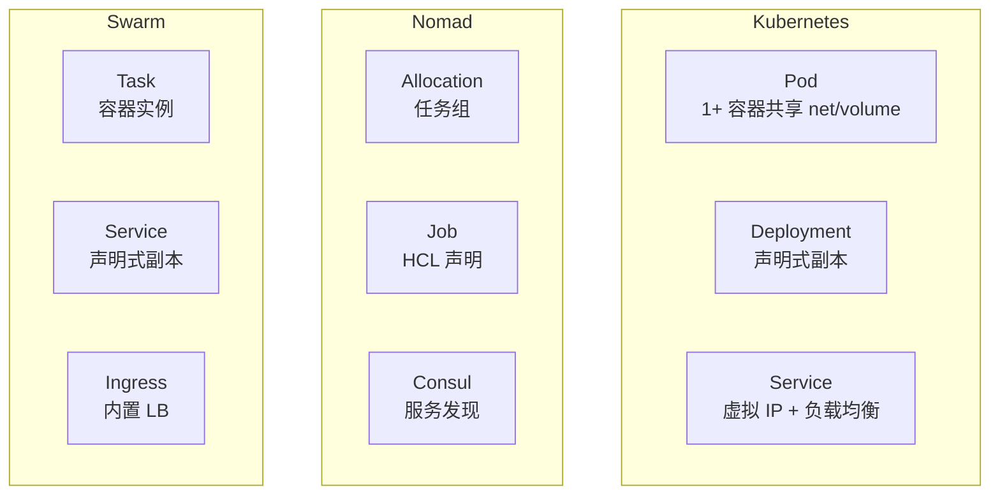
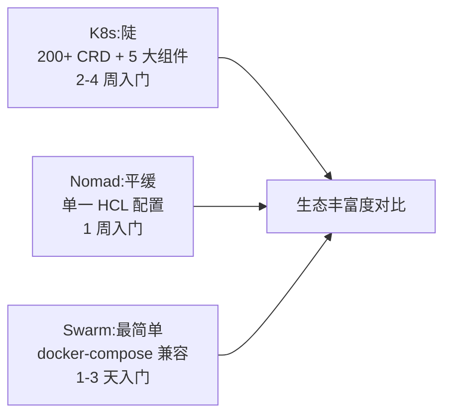
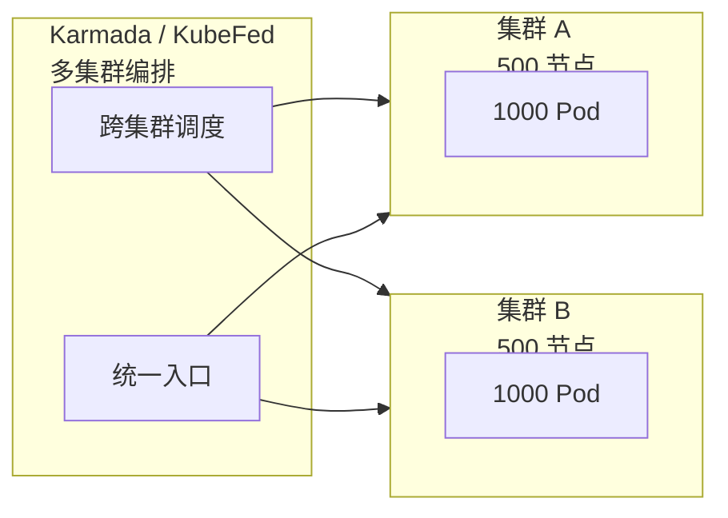
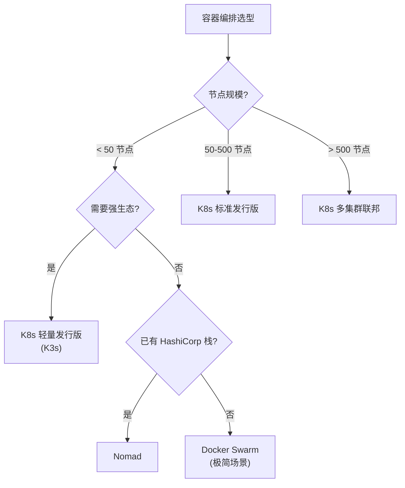

# 容器编排选型：K8s vs Nomad vs Swarm 横向对比

> K8s 是事实标准（90%+ 份额），但不是唯一选项。理解 Nomad/Swarm/Mesos 的差异，能在 K8s 不适合的场景（边缘/小集群/已有 VM 基础设施）做出更好选择——这是架构师的横向视野。

## 一句话摘要

容器编排选型核心看三点——规模（10/100/1000 节点）、生态（CRD 扩展能力）、学习曲线；K8s 适合「中等以上规模 + 强生态需求」场景；Nomad 适合「已有 HashiCorp 栈或 VM 编排」；Swarm 已边缘化；Mesos 在大数据场景仍有价值。

## 一、四大编排方案全景

| 维度 | K8s | Nomad | Swarm | Mesos |
|---|---|---|---|---|
| **厂商** | CNCF（Google 起） | HashiCorp | Docker（已边缘化） | Apache（Mesosphere） |
| **首发** | 2014 | 2015 | 2014 | 2009 |
| **市场占比** | ~90% | ~5% | ~2% | ~3% |
| **核心定位** | 容器编排 + 生态平台 | 通用工作负载编排 | 简单 Docker 编排 | 大数据 + 容器 |
| **核心抽象** | Pod/Deployment/Service | Job/Allocation | Service/Task | Framework + Task |
| **状态存储** | etcd | Raft（内置） | Raft（内置） | ZooKeeper |
| **扩展机制** | CRD + Operator | Job Driver | — | Framework |

## 二、横向对比（架构维度）

### 2.1 核心抽象对比



**关键差异**：
- **Pod vs Allocation vs Task**：K8s Pod 是「紧密协作容器组」（共享命名空间），Nomad Allocation 是「任务组」（共享网络但不共享 PID），Swarm Task 是「单个容器」
- **声明式**：三者都是声明式 API
- **服务发现**：K8s 用 ClusterIP+DNS、Nomad 用 Consul、Swarm 用内置 Ingress

### 2.2 扩展能力对比

| 能力 | K8s | Nomad | Swarm |
|---|---|---|---|
| **自定义资源** | CRD + Operator | Job Driver | ❌ |
| **网络插件** | CNI 标准 | Consul Connect + CNI | VXLAN 内置 |
| **存储插件** | CSI 标准 | CSI 支持（较新） | Volume Driver |
| **Operator 生态** | 极丰富 | Consul + Vault 为主 | 弱 |

**K8s 胜出点**：CRD + Operator 让 K8s 生态「无限扩展」——任何业务（数据库/消息/AI）都能写成 Operator。

### 2.3 学习曲线对比



## 5W 速记卡

| 5W | 答案 |
|---|---|
| **What** | 容器编排四大方案：K8s / Nomad / Swarm / Mesos |
| **Why** | 不同场景对规模/生态/学习成本有不同需求 |
| **Who** | CNCF / HashiCorp / Docker / Apache |
| **When** | 2014-2015 集中出现，2018+ K8s 占据绝对主流 |
| **How** | 横向对比 + 选型决策树 |

## 三、规模适配

| 节点规模 | 推荐 | 理由 |
|---|---|---|
| **< 50 节点** | K8s（轻量发行版）/ Nomad / Swarm | K8s 完整发行版运维成本高 |
| **50-500 节点** | K8s（标准发行版） | K8s 在这个规模最成熟 |
| **500-5000 节点** | K8s（生产化 + 多集群） | K8s 的核心优势区 |
| **> 5000 节点** | K8s 多集群联邦 / Mesos | 需特殊架构 |

### 3.1 K8s 的规模优势



K8s 的多集群联邦（Karmada/KubeFed）让单集群 5000 节点的瓶颈被突破。

### 3.2 Nomad 的规模优势

Nomad 单集群可管理 10K+ 任务——**对 VM/容器混合工作负载有优势**（K8s 主要管容器，VM 通过 KubeVirt 间接支持）。

## 四、典型场景选型

### 4.1 中小团队 + 微服务（默认选 K8s）

```yaml
# K8s 优势：CRD 让业务扩展无限可能
# + 生态丰富（监控/日志/服务网格开箱即用）
apiVersion: apps/v1
kind: Deployment
```

### 4.2 已有 HashiCorp 技术栈 → Nomad

```hcl
# Nomad HCL 配置（更简洁）
job "web" {
  group "app" {
    task "server" {
      driver = "docker"
      config {
        image = "nginx:1.25"
      }
    }
  }
}
```

**典型用户**：已经用 Terraform/Vault/Consul 的团队——Nomad 无缝整合。

### 4.3 边缘计算 + 资源受限 → K3s/KubeEdge

K3s 是 K8s 轻量发行版（< 100MB 二进制），适合边缘：
- IoT 网关
- 边缘节点（无固定 IP）
- 开发测试

### 4.4 大数据 + 工作负载混合 → Mesos

Mesos 是「大数据 + 容器」的老牌编排：
- Marathon（容器编排）
- Spark/Flink/HDFS on Mesos
- 适合已有大数据栈的团队

### 4.5 Docker Compose 简单部署 → Swarm

Swarm 适合「Docker Compose 升集群」——配置几乎不变。

## 五、横向对比决策树



## 六、跨公司视角（业内惯例）

### 6.1 大厂普遍用 K8s

- **互联网**：阿里/字节/美团/Netflix 全面 K8s
- **金融**：银行核心系统逐步迁移到 K8s（多集群 + 多活）
- **运营商**：边缘云场景 K3s 较多

### 6.2 中型公司选 K8s 托管版

- AWS EKS / GCP GKE / Azure AKS / 阿里云 ACK
- 避免自建控制平面

### 6.3 小公司/边缘用 Nomad 或 K3s

- 运维人手不足 → Nomad（学习曲线低）
- 边缘场景 → K3s

## 七、迁移路径

### 7.1 从 Swarm 迁移到 K8s

```bash
# 1. kompose 转换 docker-compose.yaml
kompose convert -f docker-compose.yml

# 2. 应用到 K8s
kubectl apply -f .

# 3. 流量切换（双跑阶段）
# Service selector 切换
```

### 7.2 从 Nomad 迁移到 K8s

Nomad Job → K8s Deployment/StatefulSet 的概念映射：

| Nomad | K8s |
|---|---|
| Job | Deployment / StatefulSet |
| Group | Pod template |
| Task | Container |
| Service (Consul) | Service + Ingress |

## 八、自测三问

1. **为什么 K8s 占据了 90%+ 市场份额？**
   - CRD + Operator 让生态「无限扩展」+ CNCF 治理 + Google 经验背书 + 厂商全面支持 + 工具链成熟（监控/日志/服务网格/可观测）。

2. **Nomad 比 K8s 强在哪？**
   - 学习曲线低 + 单一 HCL 配置 + VM/容器统一编排 + 与 HashiCorp 栈无缝整合。在 HashiCorp 技术栈已有投入的团队更省事。

3. **小集群该选 K8s 还是 Swarm？**
   - 看生态需求——需要监控/日志/服务网格等丰富生态选 K3s（K8s 轻量版）；纯 Docker Compose 升集群选 Swarm。

## 📌 数据与事实声明

- 写于 2026-09-07，针对 K8s 1.30+
- 市场占比来源：CNCF Annual Survey 2024（公开报道，K8s ~90%）
- K3s 当前版本：v1.30.x（与 K8s 版本对齐）
- Nomad 当前版本：1.8.x
- Docker Swarm 当前状态：维护模式（Docker 公司聚焦其他产品）
- 免责：份额数据为行业认知，不同调研口径有差异

## 📚 参考资料

| 类型 | 标题 | 来源 |
|---|---|---|
| 官方文档 | Kubernetes | kubernetes.io/docs |
| 官方文档 | Nomad | developer.hashicorp.com/nomad |
| 官方文档 | Docker Swarm | docs.docker.com/engine/swarm/ |
| 官方文档 | Apache Mesos | mesos.apache.org |
| 生态 | CNCF Landscape | landscape.cncf.io |
| 调研 | Datadog Container Report | datadoghq.com/container-report/ |
| 调研 | CNCF Annual Survey 2024 | cncf.io/reports |
