# K8s 架构全景：从入门到生产的演进地图

> L1 → L2 → L3 三层看完，你应该对 K8s 有完整理解。本篇（整合层 L4 核心篇）把所有内容串成一张图——从「1 Pod 怎么跑」到「10000 Pod 多集群治理」的完整演进。

## 一句话摘要

K8s 架构演进五阶段：单容器（Docker）→ Pod + Deployment（基础编排）→ 多副本 + 服务发现（生产可用）→ 多 AZ + 监控告警（生产稳定）→ 多集群 + 联邦（大规模企业）；每阶段都伴随「工具 + 流程 + 团队能力」三层建设。

## 二、跨 L3 串联

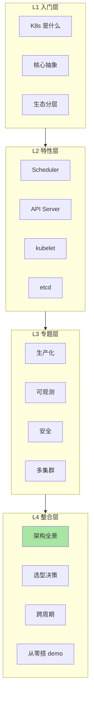

## 三、五阶段演进全景

### 3.1 阶段 1：单容器（Docker 时代）

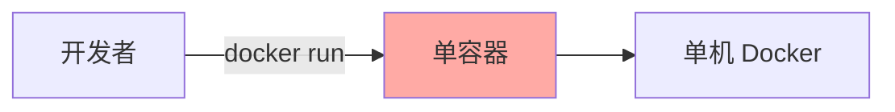

**问题**：单机容器无法解决跨机器调度/自愈/滚动。

### 3.2 阶段 2：Pod + Deployment（基础编排）

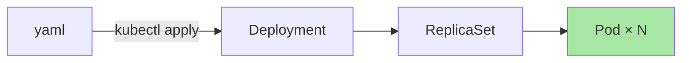

**关键工具**：
- kubectl（CLI）
- yaml（声明式配置）
- Namespace（资源隔离）

### 3.3 阶段 3：多副本 + 服务发现（生产可用）

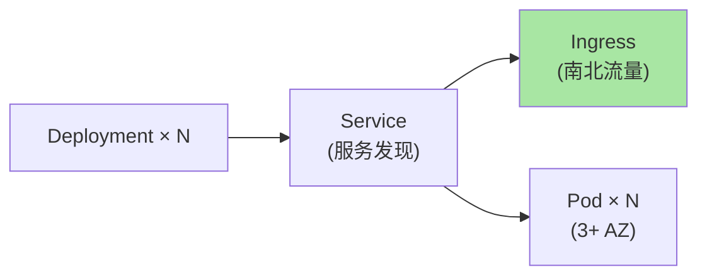

**关键工具**：
- Service（ClusterIP）
- Ingress / Gateway API
- ConfigMap / Secret
- PV / PVC

### 3.4 阶段 4：多 AZ + 监控告警（生产稳定）

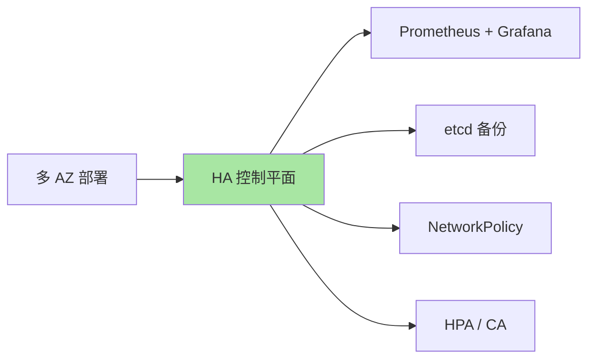

**关键工具**：
- HA 控制平面（3 节点）
- Prometheus + Grafana + Alertmanager
- etcd 自动备份（Velero）
- Pod Security Standards
- HPA + Cluster Autoscaler

### 3.5 阶段 5：多集群 + 联邦（大规模企业）

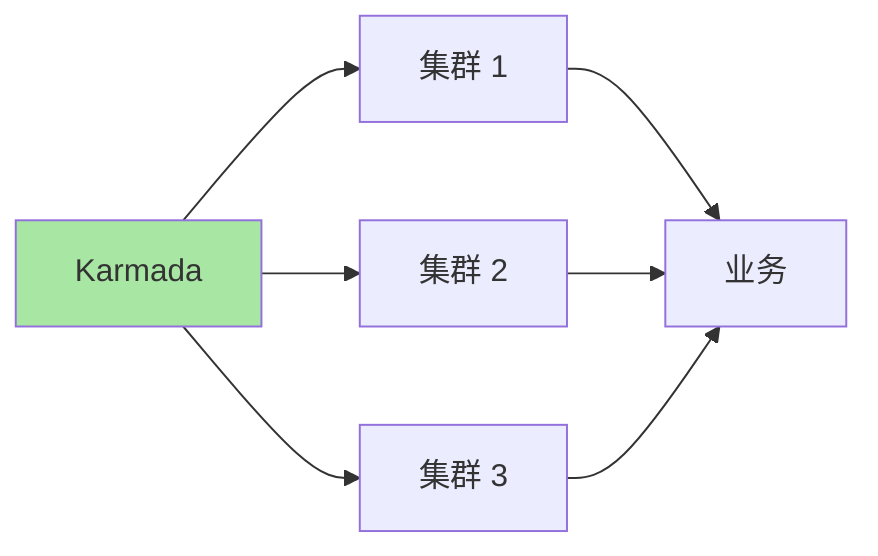

**关键工具**：
- Karmada / Cluster API
- Argo CD / Flux（GitOps）
- 服务网格（Istio）
- 多云存储

## 四、跨角色视角

### 4.1 SRE 视角

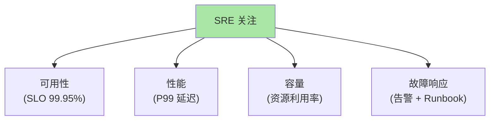

### 4.2 业务负责人视角

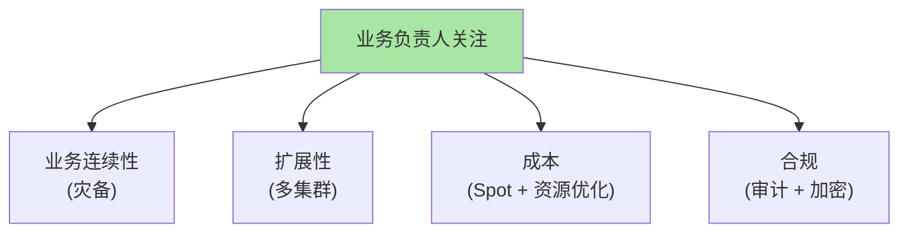

### 4.3 安全工程师视角

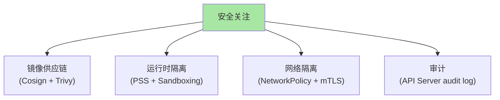

## 五、跨公司 SOP 对比

### 5.1 互联网大厂（阿里/字节/美团）

| 维度 | 实践 |
|---|---|
| **规模** | 10000+ 节点 / 集群 |
| **多集群** | 10+ 集群 |
| **工具链** | 自研 Operator + Argo CD |
| **可观测** | 自研监控系统 + Prometheus |
| **服务网格** | 自研 + Istio |

### 5.2 中型互联网

| 维度 | 实践 |
|---|---|
| **规模** | 100-1000 节点 / 集群 |
| **集群数** | 3-5 集群（多 AZ） |
| **工具链** | Argo CD + 标准 Operator |
| **可观测** | Prometheus + Grafana |
| **服务网格** | Istio |

### 5.3 小公司/创业

| 维度 | 实践 |
|---|---|
| **规模** | 10-100 节点 |
| **集群数** | 1-2 集群 |
| **工具链** | 托管 EKS/GKE + Helm |
| **可观测** | 云厂商监控 + Grafana |
| **服务网格** | 不需要 |

## 六、跨周期视角

### 6.1 K8s 5 年演进

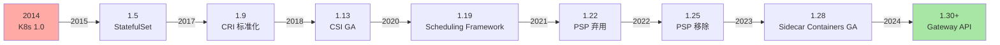

### 6.2 未来 3 年趋势

| 趋势 | 原因 |
|---|---|
| **Gateway API 取代 Ingress** | 多协议 + 多团队 |
| **Cilium 取代 Calico** | eBPF 性能优势 |
| **Karpenter 取代 CA** | 更快 + 更灵活 |
| **Pod Sandboxing 普及** | 安全需求 |
| **AI/ML 工作负载激增** | K8s 成为 ML 平台 |

## 七、决策树

### 7.1 K8s 是否适合你？

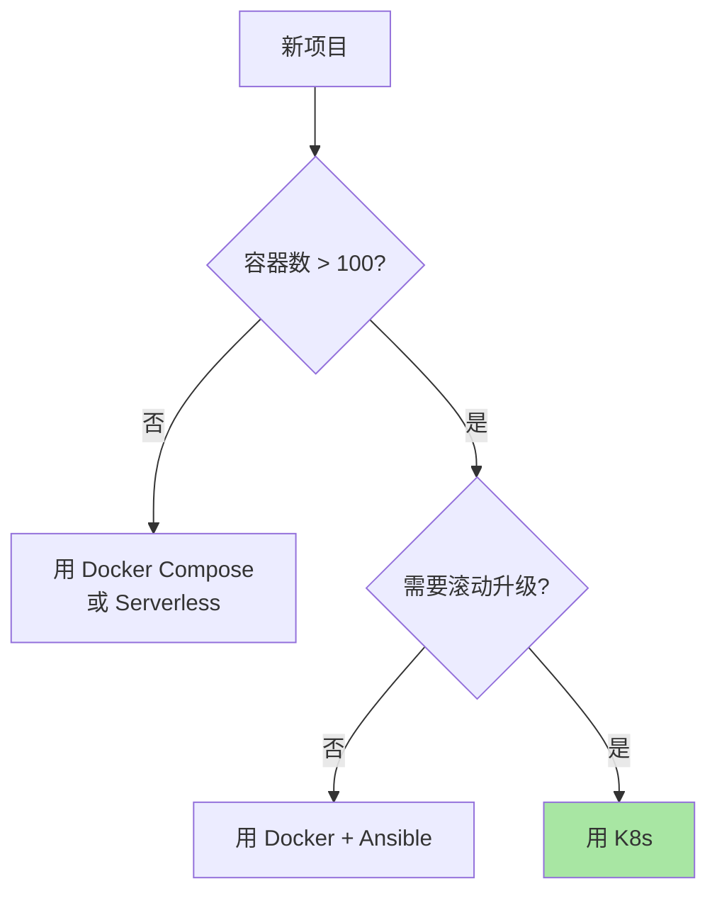

### 7.2 自建 vs 托管

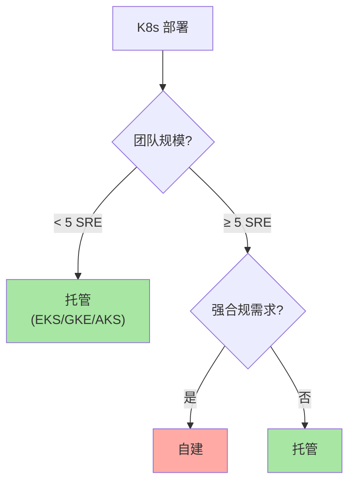

### 7.3 CNI 选型

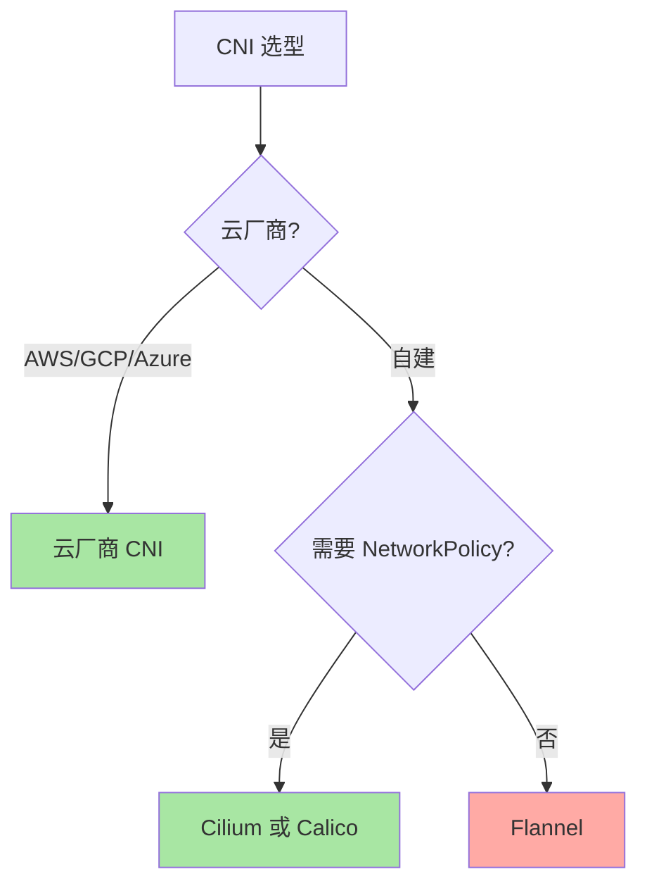

### 7.4 服务网格选型

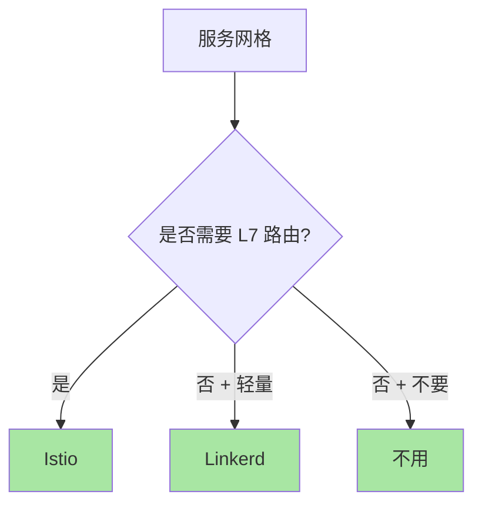

## 八、从零搭建决策清单

```markdown
□ 1. 云厂商 / 自建？
□ 2. 集群规模（节点数）？
□ 3. 多 AZ / 多 Region？
□ 4. CNI 选型（云厂商 CNI / Cilium / Calico）
□ 5. 容器运行时（containerd）
□ 6. 网络方案（Service + Ingress / Gateway API）
□ 7. 存储方案（云厂商 CSI / Rook Ceph）
□ 8. 镜像仓库（Harbor）
□ 9. 可观测（Prometheus + Loki + Tempo）
□ 10. GitOps（Argo CD / Flux）
□ 11. 多集群治理（Karmada / Cluster API）
□ 12. 服务网格（Istio / Linkerd / 无）
```

## 九、自测三问

1. **K8s 的「核心最小化」设计哲学如何体现？**
   - K8s 核心只管 Pod/Service/Deployment 等通用抽象；CRI/CNI/CSI 把运行时/网络/存储外包给独立生态——让 K8s 保持精简的同时生态爆炸。

2. **多集群治理的核心难点是什么？**
   - 集群生命周期管理（创建/升级/删除）+ 资源分发策略 + 跨集群网络 + 统一可观测。任何一环断都会导致多集群失控。

3. **未来 3 年 K8s 最大的变化是什么？**
   - Gateway API 取代 Ingress、Cilium 取代 Calico、Karpenter 取代 CA、Pod Sandboxing 普及、AI 工作负载成主流。

## 📌 数据与事实声明

- 写于 2026-09-07，针对 K8s 1.30+
- K8s 1.0 发布：2015-07
- 行业认知：K8s 在容器编排市场份额 > 90%（公开统计 2024）
- 未来趋势基于公开报道 + 个人判断
- 免责：技术演进快，预测可能变化

## 📚 参考资料

| 类型 | 标题 | 来源 |
|---|---|---|
| 官方文档 | Kubernetes Documentation | kubernetes.io/docs |
| 官方文档 | CNCF Landscape | landscape.cncf.io |
| 调研 | Datadog Container Report | datadoghq.com/container-report/ |
| 系列总目录 | `docs/devops/kubernetes/` | 本仓库 |
