# 容器编排选型决策树：K8s / Nomad / Swarm / Mesos 全对比

> L1 篇 9 讲过编排选型基础。本篇作为整合层核心篇，提供完整决策树——按规模/生态/学习曲线/已有栈/合规 五维度做精细化决策。

## 一句话摘要

编排选型决策树：< 100 节点用 K3s/Nomad/Swarm；100-5000 节点用 K8s；5000+ 节点用 K8s 多集群联邦；强合规用 K8s + 托管；已有 HashiCorp 栈用 Nomad；边缘场景用 K3s/KubeEdge；批处理优先用 Mesos + Marathon。

## 二、四方案全景对比

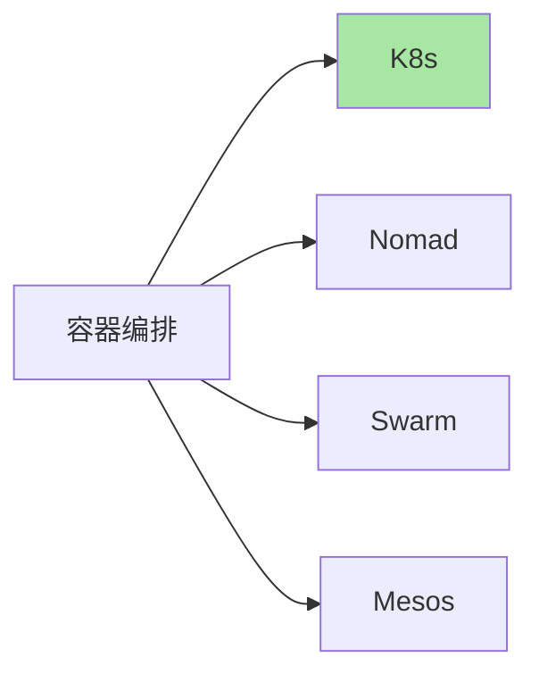

## 三、决策维度

### 3.1 五大维度

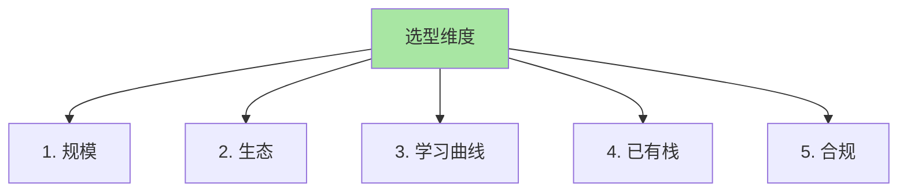

### 3.2 维度矩阵

| 维度 | K8s | Nomad | Swarm | Mesos |
|---|---|---|---|---|
| **规模** | 100-10000 | 10-5000 | 10-100 | 1000+ |
| **生态** | 极丰富 | HashiCorp 栈 | 弱 | 弱 |
| **学习曲线** | 陡 | 平缓 | 最简单 | 陡 |
| **多语言** | ✅ | ✅ | ✅ | ✅ |
| **多协议** | ✅ | ✅ | ✅ | ✅ |
| **混合负载** | 容器优先 | 容器+VM+批 | 仅容器 | 容器+大数据 |

## 四、决策树

### 4.1 总决策

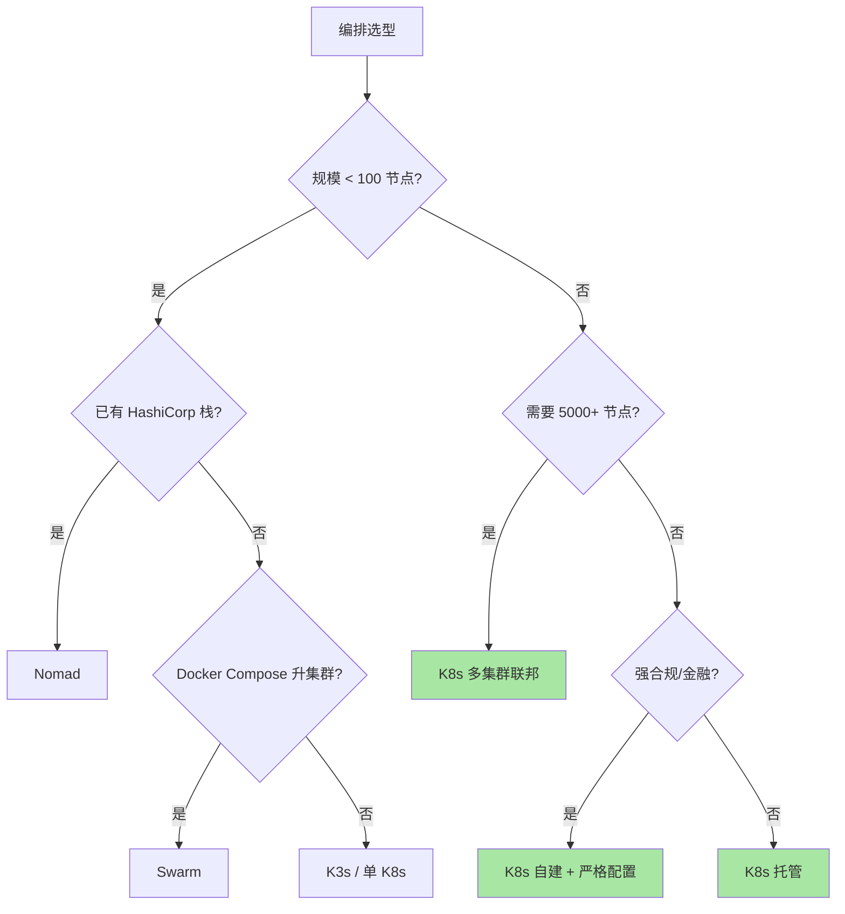

### 4.2 场景化决策

| 场景 | 推荐 | 理由 |
|---|---|---|
| **< 100 节点，无复杂需求** | K3s | 轻量 + K8s 兼容 |
| **已有 Terraform/Vault** | Nomad | HashiCorp 栈整合 |
| **小团队 + Docker 经验** | Swarm | 学习曲线最低 |
| **100-1000 节点，互联网业务** | K8s（托管） | 生态成熟 |
| **金融/医疗/强合规** | K8s（自建） | 控制力强 |
| **5000+ 节点** | K8s（多集群） | 唯一选择 |
| **混合云** | K8s + Karmada | 多云分发 |
| **边缘** | K3s / KubeEdge | 资源占用低 |
| **批处理 + 容器** | Mesos + Marathon | 大数据整合 |

## 五、横向对比详细

### 5.1 K8s

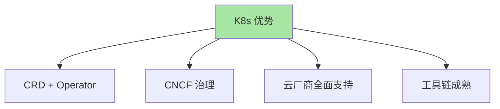

**优势**：
- ✅ 生态极丰富（CNCF Landscape 数百项目）
- ✅ CRD + Operator 让任何业务可扩展
- ✅ 多云支持（EKS/GKE/AKS）
- ✅ 工具链成熟（监控/日志/服务网格）

**劣势**：
- ❌ 学习曲线陡
- ❌ 运维复杂度高
- ❌ 资源占用较重

### 5.2 Nomad

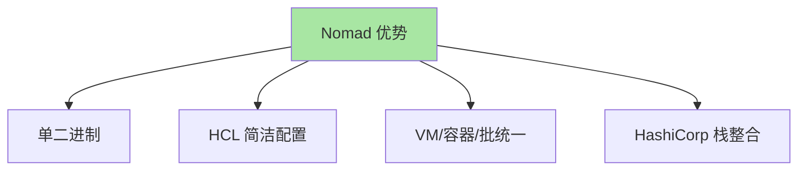

**优势**：
- ✅ 学习曲线平缓
- ✅ 配置简洁（HCL）
- ✅ HashiCorp 栈整合（Consul/Vault/Terraform）
- ✅ 混合负载（容器/VM/批处理）

**劣势**：
- ❌ 生态较 K8s 弱
- ❌ 服务网格/L7 路由较弱
- ❌ 市场份额小（< 10%）

### 5.3 Swarm

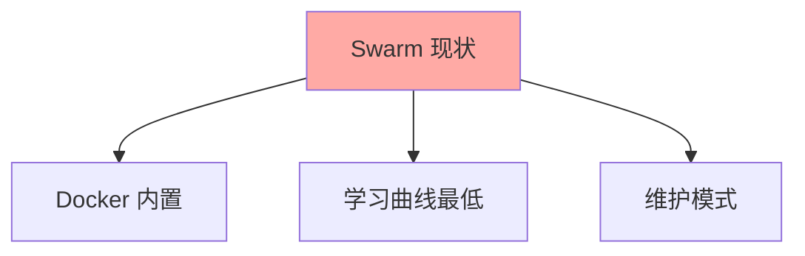

**优势**：
- ✅ Docker 内置（无需额外安装）
- ✅ 配置简单（docker-compose 兼容）

**劣势**：
- ❌ Docker 公司战略转移
- ❌ 生态停滞
- ❌ 仅适合小规模

### 5.4 Mesos

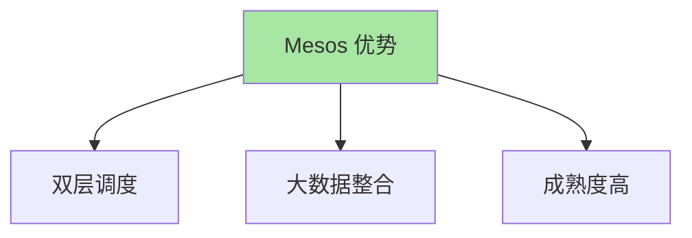

**优势**：
- ✅ 双层调度（Mesos + Framework）
- ✅ 大数据整合（Spark/Flink/HDFS）
- ✅ 成熟度高（2009-）

**劣势**：
- ❌ 学习曲线陡
- ❌ 生态相对封闭
- ❌ 社区活跃度下降

## 六、跨公司选型案例

### 6.1 互联网大厂

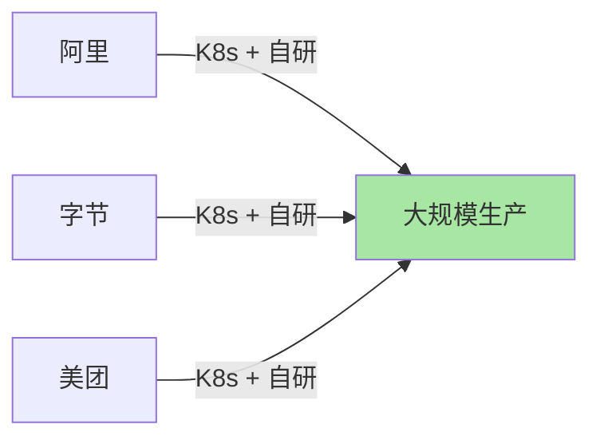

### 6.2 海外大厂

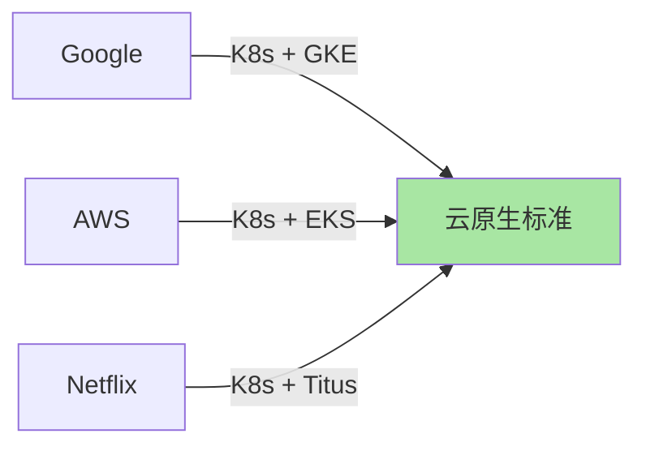

### 6.3 传统企业

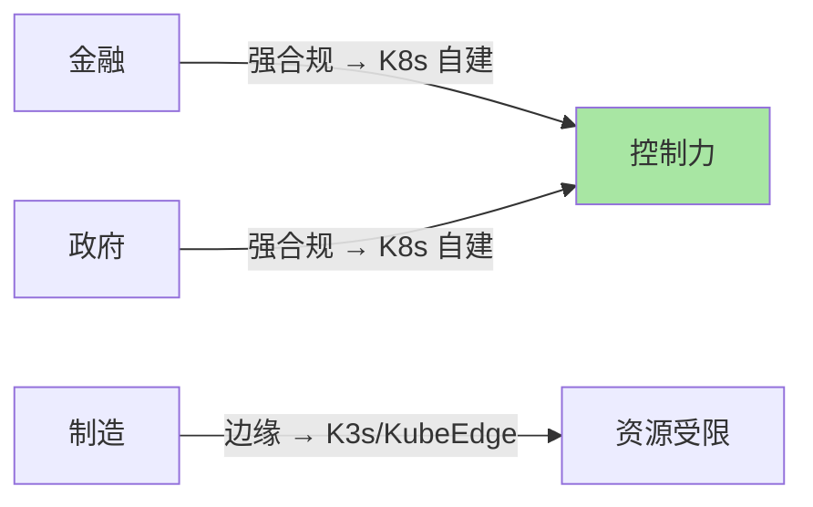

## 七、迁移路径

### 7.1 从 Swarm 迁移到 K8s

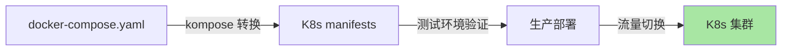

```bash
# kompose 转换
kompose convert -f docker-compose.yml
kubectl apply -f .

# 验证
kubectl get all
```

### 7.2 从 Nomad 迁移到 K8s

| Nomad | K8s |
|---|---|
| Job | Deployment / StatefulSet |
| Group | Pod template |
| Task | Container |
| Service（Consul） | Service + Ingress |

## 八、决策检查清单

```markdown
□ 1. 规模？(< 100 / 100-5000 / 5000+)
□ 2. 团队规模？(< 5 SRE / 5-20 / 20+)
□ 3. 已有栈？(<容器化 / HashiCorp / Mesos)
□ 4. 合规要求？(无 / 中 / 强)
□ 5. 业务类型？(Web / 批处理 / 大数据 / 边缘)
□ 6. 多云需求？(单一云 / 多云 / 混合云)
□ 7. 预算？(低 / 中 / 高)
□ 8. 学习曲线承受度？(平缓 / 中 / 陡)
```

## 九、自测三问

1. **K8s 唯一无法替代的场景是什么？**
   - 强合规 + 自建控制平面（如金融/政府/医疗）——需要完全控制 K8s 内部。但 K8s 仍是底层引擎。

2. **Nomad 何时比 K8s 更适合？**
   - 已有 HashiCorp 栈 + 需要混合负载（容器 + VM + 批处理）+ 学习曲线敏感。Nomad 在这些场景下运维成本低于 K8s。

3. **Mesos 何时还有价值？**
   - 已有大数据栈（Spark/Flink/HDFS）+ 需要统一编排 + 集群规模超大（> 1000 节点）。否则推荐 K8s。

## 📌 数据与事实声明

- 写于 2026-09-07
- K8s 市场份额：~90%（CNCF 2024 公开统计）
- Nomad 市场份额：~5%（公开估计）
- Swarm 市场份额：~2%（公开估计）
- Mesos 市场份额：~3%（公开估计）
- 行业认知：大厂基本全 K8s（公开报道）
- 免责：市场份额因调研口径而异

## 📚 参考资料

| 类型 | 标题 | 来源 |
|---|---|---|
| 调研 | CNCF Annual Survey 2024 | cncf.io/reports |
| 调研 | Datadog Container Report | datadoghq.com/container-report/ |
| 官方文档 | Nomad | developer.hashicorp.com/nomad |
| 官方文档 | Mesos | mesos.apache.org |
| 实战 | kompose | kompose.io |
