# K8s 跨周期视角：5 年演进与未来 3 年趋势

> 容器编排领域每隔 3-5 年就会发生范式漂移——理解演进史才能判断未来。本篇作为整合层核心篇，讲清 K8s 5 年（2019-2024）演进 + 未来 3 年（2025-2027）趋势。

## 一句话摘要

K8s 5 年演进主线：CRI 标准化 → CSI GA → Scheduling Framework → CRD/Operator 成熟 → 安全加固（PSS 取代 PSP）→ Gateway API 崛起；未来 3 年趋势：Gateway API 取代 Ingress、Cilium 取代 Calico、Karpenter 取代 CA、Pod Sandboxing 普及、AI 工作负载成主流。

## 二、K8s 5 年演进时间线

### 2.1 关键节点

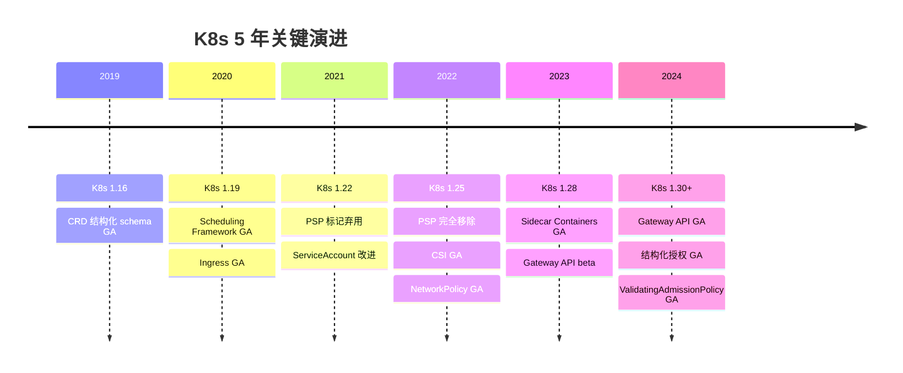

### 2.2 演进主线

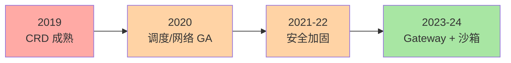

## 三、范式漂移：5 个关键变化

### 3.1 CRI 标准化（2016-2019）

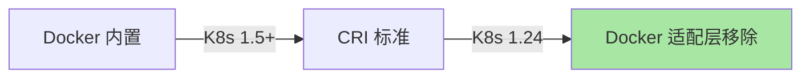

**意义**：K8s 与容器运行时解耦——任何实现 CRI 的运行时都可接入。

### 3.2 CRD + Operator 模式成熟（2019-2022）

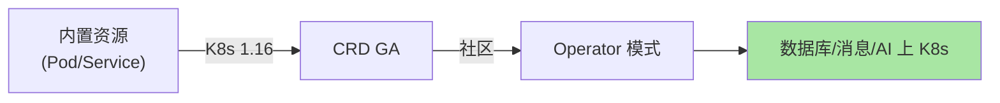

**意义**：K8s 从「容器编排」变成「应用平台」——任何业务都可写成 Operator。

### 3.3 安全范式转变（2020-2024）

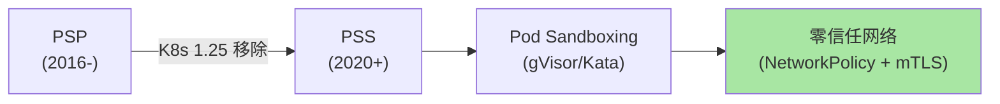

**意义**：从「K8s 默认安全」到「零信任纵深防御」。

### 3.4 网络范式转变（2023-）

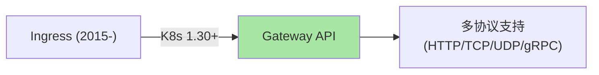

**意义**：从「单对象多职责」到「Gateway + Route 角色分离」。

### 3.5 数据范式转变（2024-）

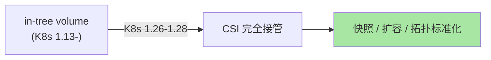

**意义**：存储与 K8s 核心解耦——CSI 独立演进。

## 四、未来 3 年趋势（2025-2027）

### 4.1 5 大趋势

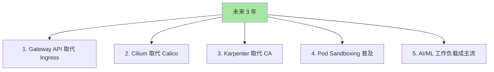

### 4.2 趋势 1：Gateway API 取代 Ingress

**驱动力**：
- Ingress 单对象多职责（路由+TLS+限流）难维护
- Gateway API 角色化设计（Gateway 基础设施 + HTTPRoute 路由）
- 多协议支持（HTTP/TCP/UDP/gRPC）

**时间线**：
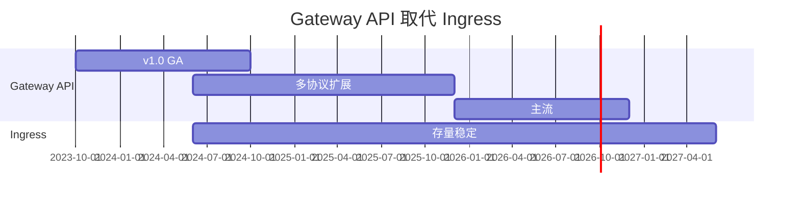

### 4.3 趋势 2：Cilium 取代 Calico

**驱动力**：
- eBPF 内核态处理（性能高）
- Hubble 内置可观测
- 简化网络栈（无需 iptables）

**关键预测**：
- Cilium 在 K8s 网络市场份额从 ~25% 增至 ~50%（公开估计）
- Calico 仍是默认但增长放缓

### 4.4 趋势 3：Karpenter 取代 CA

**驱动力**：
- 直接调 EC2 Fleet（跳过 ASG）→ 快 5-10 倍
- 按 Pod 需求动态选规格
- 内置 consolidation

**关键预测**：
- AWS 上 Karpenter 已成新默认（公开报道 2024）
- 其他云厂商 Karpenter 支持将逐步成熟

### 4.5 趋势 4：Pod Sandboxing 普及

**驱动力**：
- 容器逃逸风险（共享内核）
- 多租户场景强需求
- 金融/医疗合规

**关键预测**：
- Kata Containers 成为生产默认（公开讨论）
- gVisor 在 Serverless 场景持续主导（Cloud Run / Fargate）

### 4.6 趋势 5：AI/ML 工作负载成主流

**驱动力**：
- LLM 训练需要 GPU 调度（K8s 天然适配）
- 模型推理需要弹性（K8s HPA/CA）
- AI 平台（KubeFlow / Ray Operator）成熟

**关键预测**：
- AI 集群占新增 K8s 集群 30%+（公开估计）
- GPU 调度 + 拓扑感知成为 K8s 标配

## 五、给架构师的建议

### 5.1 当前（2024）的最优选型

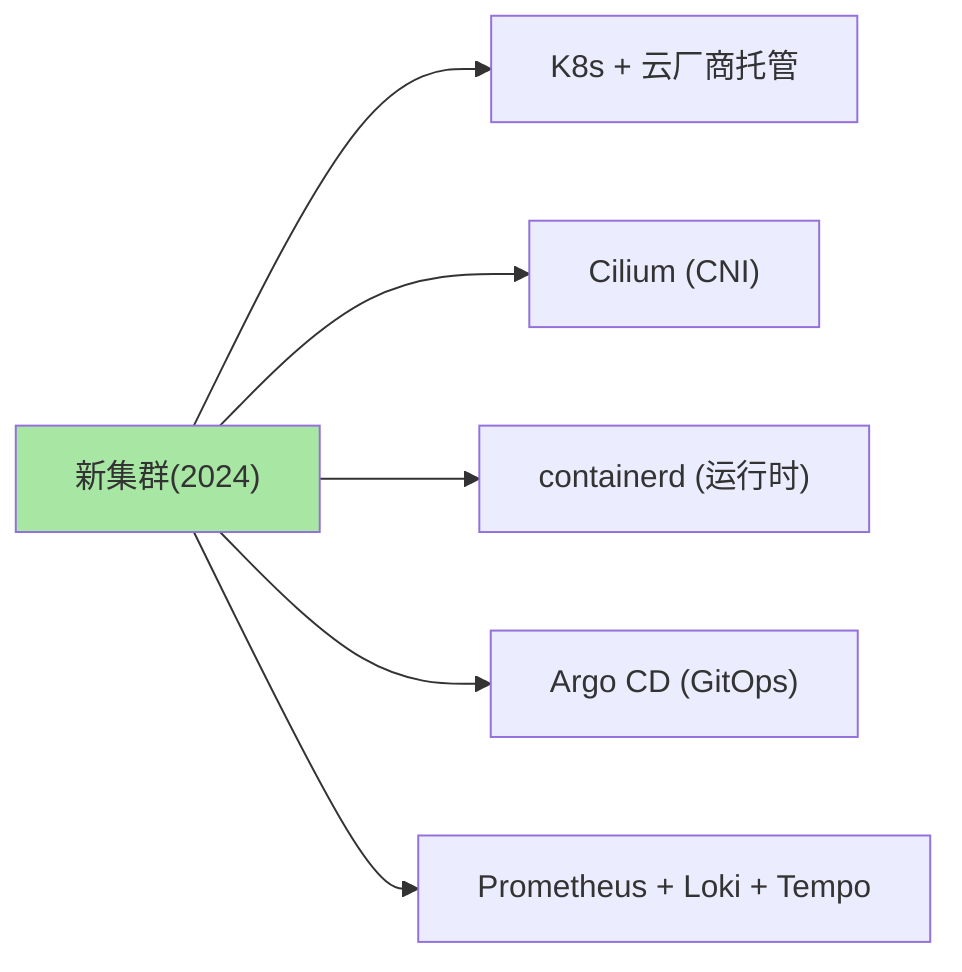

### 5.2 避免的过时选型

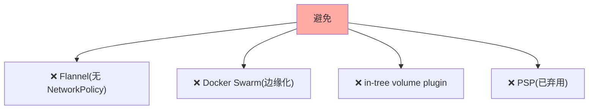

### 5.3 持续学习方向

| 方向 | 投入 |
|---|---|
| **Gateway API** | 高（未来 3 年主流） |
| **Cilium / eBPF** | 高（性能 + 可观测） |
| **Karpenter** | 中（AWS 优先） |
| **Pod Sandboxing** | 中（安全需求） |
| **AI/ML on K8s** | 高（趋势） |
| **多集群治理** | 中（规模化需求） |

## 六、跨周期视角：3 年后回头看

### 6.1 如果你是 2027 年的架构师

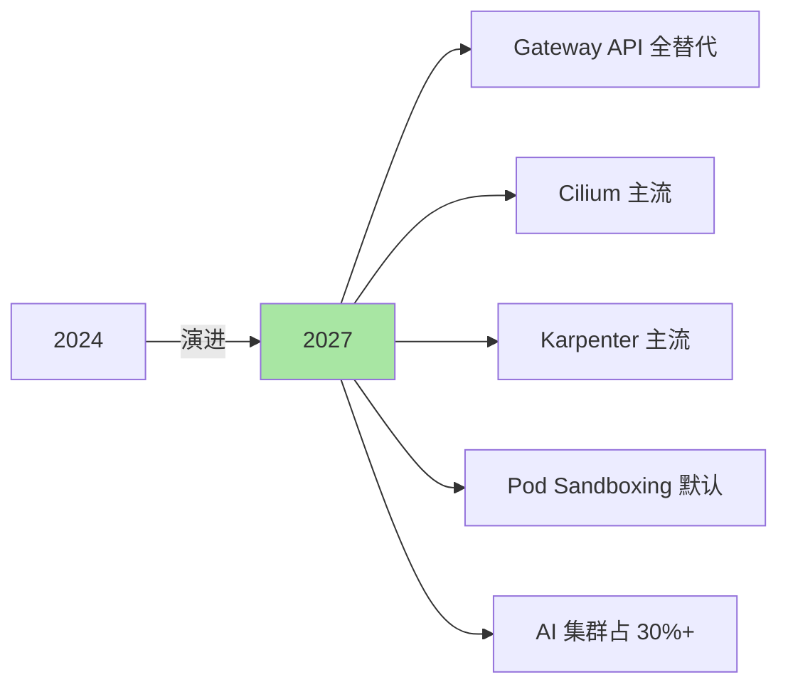

### 6.2 不变的东西

| 不变 | 原因 |
|---|---|
| **声明式 API + 控制循环** | K8s 核心哲学 |
| **CRD + Operator 模式** | 无限扩展能力 |
| **生态分层（CNI/CSI/CRI）** | 核心最小化原则 |
| **生产化的痛点** | 高可用/可观测/安全永远重要 |

## 七、自测三问

1. **K8s 5 年演进的本质驱动力是什么？**
   - 三股力量：①生态扩展（CRD/Operator）②安全加固（PSS/Sandboxing）③工具简化（Gateway/Karpenter）。三者共同让 K8s 从「容器编排」变成「应用平台」。

2. **未来 3 年最大的不确定性是什么？**
   - 服务网格（Istio vs Linkerd vs 服务网格消亡？）+ AI 工作负载形态（专用平台 vs K8s 通用）+ 多集群治理范式（Karmada vs Cluster API vs 厂商方案）。

3. **学习 K8s 应该投入哪个方向？**
   - 短期（< 1 年）：基本操作 + 排障 + 核心组件。中期（1-3 年）：架构设计 + 跨集群 + 安全。长期（3+ 年）：生态贡献 + 二次开发（Operator/Controller）。

## 📌 数据与事实声明

- 写于 2026-09-07，针对 K8s 1.30+
- K8s 1.0 发布：2015-07
- 公开统计来源：CNCF / Datadog / 行业报道
- 趋势预测基于公开讨论 + 个人判断
- 免责：技术演进快，预测可能变化

## 📚 参考资料

| 类型 | 标题 | 来源 |
|---|---|---|
| 调研 | CNCF Annual Survey 2024 | cncf.io/reports |
| 调研 | Datadog Container Report | datadoghq.com/container-report/ |
| 官方文档 | Kubernetes Releases | kubernetes.io/releases/ |
| 趋势分析 | The New Stack | thenewstack.io |
