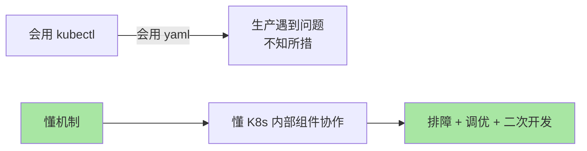
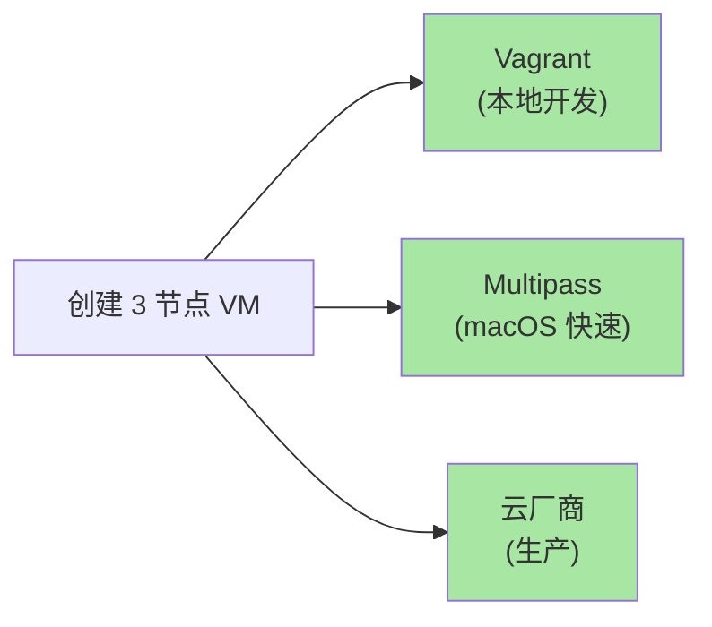
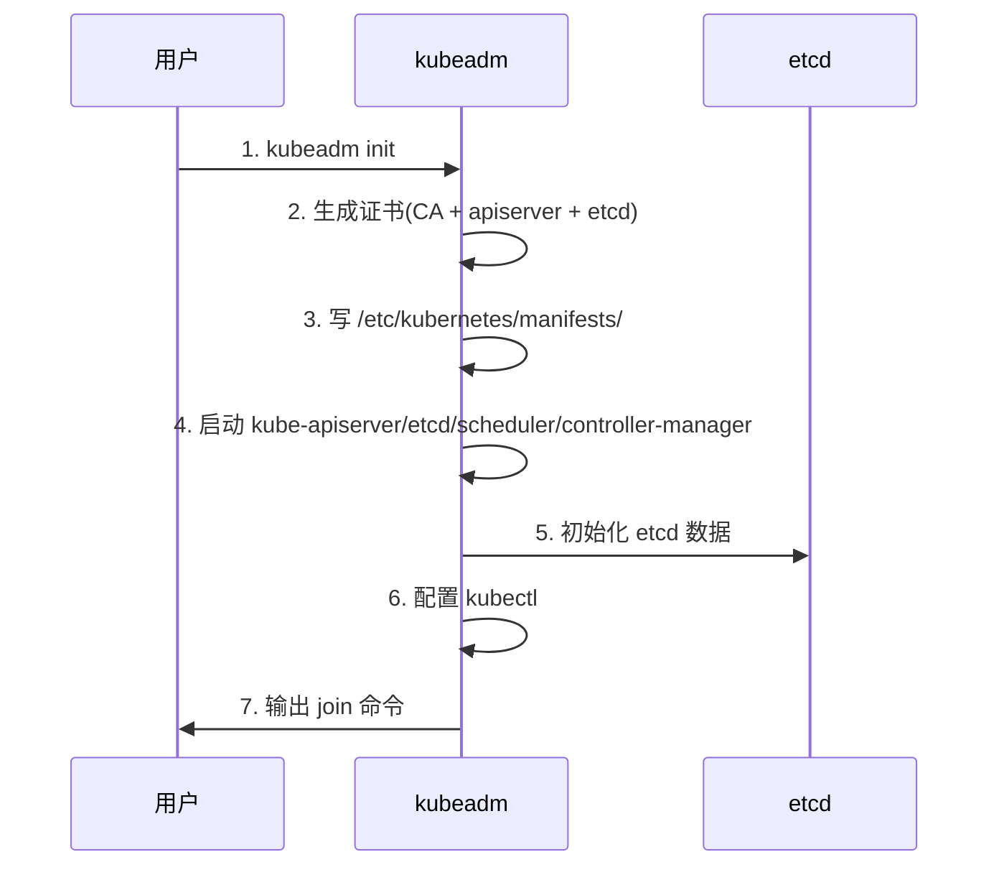
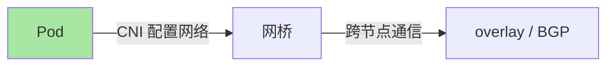
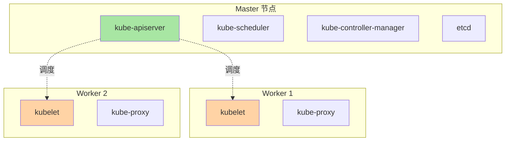
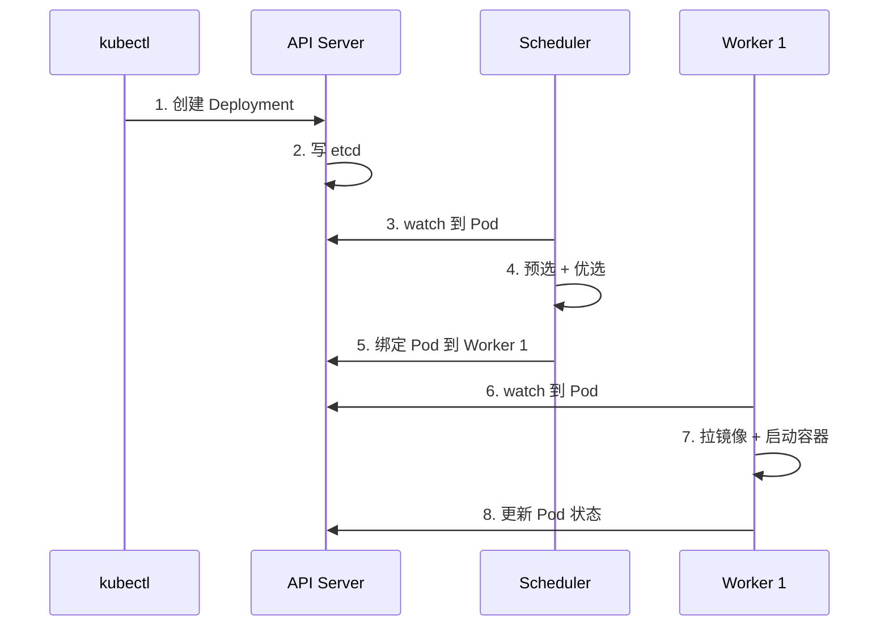
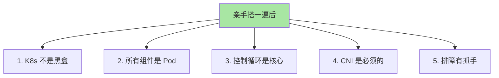

# 从零搭一个最小 K8s 集群：理解机制胜过会用 kubectl

> 按总规划 §六「机制层 L4 = 从零实现最小 demo，用亲手做一遍理解机制」。本文带你用 kubeadm 从零搭一个 3 节点 K8s 集群——理解 K8s 内部组件如何协作、为什么生产需要这么多层。

## 一句话摘要

从零搭 K8s 集群三阶段：①准备节点（2-4 核 4-8Gi）②初始化控制平面（kubeadm init）③加入 Worker 节点（kubeadm join）+ 部署 CNI（Cilium）；亲手做一遍后，所有「调度」「控制循环」「声明式 API」都不再是黑盒。

## 二、为什么需要从零搭

### 2.1 「会用」 vs 「懂机制」



### 2.2 L4 整合层「机制层」的价值

按总规划 §六：机制层 L4 = **从零实现一个最小 demo**——亲手做一遍理解机制。

**本文目标**：用 kubeadm 搭一个 3 节点集群（约 30-60 分钟），理解：
- 控制平面组件如何协作
- Worker 节点如何注册
- CNI 如何打通网络
- Pod 怎么被调度到节点

## 三、环境准备

### 3.1 推荐配置

| 角色 | 数量 | CPU | 内存 | 磁盘 |
|---|---|---|---|---|
| **Master** | 1 (HA 时 3) | 2 核 | 4 Gi | 50 Gi |
| **Worker** | 2+ | 2 核 | 4 Gi | 50 Gi |

**最低**：1 Master + 1 Worker + 2 核 2Gi（开发够用）
**推荐**：3 Master + 2 Worker（生产可用）

### 3.2 创建虚拟机（3 种方式）



**Multipass 方案（最快）**：

```bash
# macOS 安装 Multipass
brew install multipass

# 创建 3 个节点
multipass launch --name k8s-master --cpus 2 --mem 4g --disk 20g
multipass launch --name k8s-worker1 --cpus 2 --mem 4g --disk 20g
multipass launch --name k8s-worker2 --cpus 2 --mem 4g --disk 20g

# 进入 master
multipass shell k8s-master
```

## 四、K8s 组件安装

### 4.1 所有节点通用步骤

```bash
# 1. 禁用 swap（K8s 要求）
sudo swapoff -a
sudo sed -i '/ swap / s/^\(.*\)$/#\1/' /etc/fstab

# 2. 加载内核模块
cat <<EOF | sudo tee /etc/modules-load.d/k8s.conf
overlay
br_netfilter
EOF
sudo modprobe overlay
sudo modprobe br_netfilter

# 3. 网络配置
cat <<EOF | sudo tee /etc/sysctl.d/99-kubernetes-cri.conf
net.bridge.bridge-nf-call-iptables  = 1
net.bridge.bridge-nf-call-ip6tables = 1
net.ipv4.ip_forward                 = 1
EOF
sudo sysctl --system

# 4. 安装 containerd
sudo apt-get update
sudo apt-get install -y containerd
sudo mkdir -p /etc/containerd
containerd config default | sudo tee /etc/containerd/config.toml
sudo sed -i 's/SystemdCgroup = false/SystemdCgroup = true/' /etc/containerd/config.toml
sudo systemctl restart containerd

# 5. 安装 kubeadm/kubelet/kubectl
sudo apt-get install -y apt-transport-https ca-certificates curl
sudo curl -fsSLo /etc/apt/keyrings/kubernetes-archive-keyring.gpg \
  https://packages.cloud.google.com/apt/doc/apt-key.gpg
echo "deb [signed-by=/etc/apt/keyrings/kubernetes-archive-keyring.gpg] https://apt.kubernetes.io/ kubernetes-xenial main" \
  | sudo tee /etc/apt/sources.list.d/kubernetes.list
sudo apt-get update
sudo apt-get install -y kubelet kubeadm kubectl
sudo apt-mark hold kubelet kubeadm kubectl
```

### 4.2 关键步骤解析

| 步骤 | 作用 |
|---|---|
| 禁用 swap | K8s 不支持 swap（性能不可预测） |
| 加载内核模块 | overlay（镜像层）+ br_netfilter（网桥） |
| containerd 配置 | 配置 systemd cgroup 驱动（与 K8s 一致） |
| 安装 kubeadm | K8s 集群引导工具 |

## 五、控制平面初始化

### 5.1 kubeadm init

```bash
# 在 master 节点
sudo kubeadm init \
  --kubernetes-version=v1.30.0 \
  --pod-network-cidr=10.244.0.0/16 \
  --service-cidr=10.96.0.0/16 \
  --apiserver-advertise-address=<MASTER_IP>
```

**输出关键信息**：

```bash
# 1. 配置 kubectl
mkdir -p $HOME/.kube
sudo cp -f /etc/kubernetes/admin.conf $HOME/.kube/config
sudo chown $(id -u):$(id -g) $HOME/.kube/config

# 2. 看 join 命令（Worker 加入用）
kubeadm token create --print-join-command
# 输出类似：
# kubeadm join <MASTER_IP>:6443 --token xxx --discovery-token-ca-cert-hash sha256:xxx

# 3. 保存这个 join 命令！Worker 节点需要
```

### 5.2 kubeadm init 内部做了什么



**关键认知**：`/etc/kubernetes/manifests/` 下的 yaml 是 K8s 的「种子」——apiserver/etcd 等本身就是 Pod！

## 六、部署 CNI（Cilium）

### 6.1 为什么需要 CNI



**关键认知**：kubeadm init 后集群**还不能跑 Pod**——必须先装 CNI！

### 6.2 安装 Cilium

```bash
# 安装 Helm（如未安装）
curl https://raw.githubusercontent.com/helm/helm/main/scripts/get-helm-3 | bash

# 添加 Cilium repo
helm repo add cilium https://helm.cilium.io/
helm repo update

# 安装 Cilium（eBPF 模式）
helm install cilium cilium/cilium --namespace kube-system
```

### 6.3 验证 CNI

```bash
# 看 CNI Pod 是否 Running
kubectl get pods -n kube-system | grep cilium

# 看节点是否 Ready
kubectl get nodes
# NAME          STATUS   ROLES           AGE   VERSION
# k8s-master    Ready    control-plane   5m    v1.30.0
```

## 七、加入 Worker 节点

### 7.1 kubeadm join

```bash
# 在每个 Worker 节点上
# （用 master 输出的 join 命令）
sudo kubeadm join <MASTER_IP>:6443 \
  --token xxx \
  --discovery-token-ca-cert-hash sha256:xxx
```

### 7.2 验证集群

```bash
# 在 master 上
kubectl get nodes
# NAME          STATUS   ROLES           AGE     VERSION
# k8s-master    Ready    control-plane   10m     v1.30.0
# k8s-worker1   Ready    <none>          2m      v1.30.0
# k8s-worker2   Ready    <none>          2m      v1.30.0
```

### 7.3 节点组件



## 八、跑第一个应用

### 8.1 部署 nginx

```bash
# 创建 deployment
kubectl create deployment nginx --image=nginx:1.25

# 暴露服务
kubectl expose deployment nginx --port=80 --type=NodePort

# 看 Pod 调度到哪个节点
kubectl get pods -o wide
# NAME                     READY   STATUS    NODE
# nginx-6c5d9b7d9d-abcde   1/1     Running   k8s-worker1

# 看 Service 端口
kubectl get svc nginx
# NAME    TYPE       CLUSTER-IP     PORT(S)
# nginx   NodePort   10.96.1.100    80:31234/TCP

# 访问（任意节点 IP + NodePort）
curl http://k8s-worker1:31234
```

### 8.2 调度过程可视化



**关键认知**：每一步都是「声明式 + 控制循环」——没有命令式的「命令执行」。

## 九、亲手搭一遍后的理解

### 9.1 5 个核心认知



### 9.2 对比「会用」和「懂机制」

| 维度 | 只会用 kubectl | 亲手搭一遍 |
|---|---|---|
| **Pod Pending** | 不知道怎么查 | 知道查 kubelet/etcd/apiserver 日志 |
| **节点失联** | 不知道为什么 | 知道 kubelet 心跳 + Node Controller 驱逐机制 |
| **网络不通** | 不知道查哪里 | 知道查 CNI 配置 + cilium agent |
| **调度失败** | 不知道为什么 | 知道 kube-scheduler 的预选优选逻辑 |

## 十、生产化 checklist（搭完后）

### 10.1 安全加固

```bash
# 1. Pod Security Standards
kubectl label namespace default pod-security.kubernetes.io/enforce=restricted

# 2. 网络策略
kubectl apply -f network-policies/

# 3. etcd 备份
ETCDCTL_API=3 etcdctl snapshot save /backup/snap.db
```

### 10.2 可观测

```bash
# 1. Metrics Server
kubectl apply -f https://github.com/kubernetes-sigs/metrics-server/releases/latest/download/components.yaml

# 2. Prometheus + Grafana
helm install prometheus prometheus-community/kube-prometheus-stack -n monitoring --create-namespace
```

### 10.3 多节点扩展

```bash
# 添加更多 Worker
sudo kubeadm join <MASTER_IP>:6443 --token xxx --discovery-token-ca-cert-hash sha256:xxx
```

## 十一、清理

```bash
# 重置集群（从零开始）
sudo kubeadm reset

# 删除 .kube 配置
rm -rf $HOME/.kube
```

## 十二、自测三问

1. **kubeadm init 内部做了什么？**
   - 生成证书 + 启动控制平面组件（apiserver/etcd/scheduler/controller-manager 都是 Pod）+ 初始化 etcd + 输出 join 命令。

2. **为什么必须先装 CNI 才能跑 Pod？**
   - Pod 间通信需要网络（网桥/路由/overlay），kubelet 不直接管网络——通过 CNI 插件配置。kubeadm init 后默认无 CNI，Pod 会卡在 ContainerCreating。

3. **亲手搭一遍后最大收获是什么？**
   - K8s 内部组件都是 Pod（控制平面也跑在 K8s 上）+ 所有「神奇」都是「声明式 + 控制循环」+ 排障有清晰路径（API Server / kubelet / etcd 日志）。

## 📌 数据与事实声明

- 写于 2026-09-07，针对 K8s 1.30+
- 本文用 kubeadm + Cilium + containerd（生产主流组合）
- 最小集群：1 Master + 2 Worker（HA 建议 3 Master）
- 搭建时间：30-60 分钟（取决于网络）
- 免责：本文用于从零搭集群验证机制；生产推荐云厂商托管

## 📚 参考资料

| 类型 | 标题 | 来源 |
|---|---|---|
| 官方文档 | kubeadm | kubernetes.io/docs/setup/production-environment/tools/kubeadm/ |
| 官方文档 | Creating a cluster | kubernetes.io/docs/setup/ |
| 官方文档 | Cilium | docs.cilium.io |
| 实战 | kind（本地 K8s） | kind.sigs.k8s.io |
| 实战 | Multipass | canonical.com/multipass |
| 系列 index | `docs/devops/kubernetes/` | 本仓库 |
