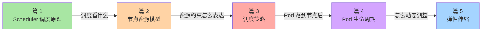

# 核心调度机制子系列导读：从 kube-scheduler 到控制循环

> L2 特性层子系列 A 导读。讲清子系列定位、5 篇之间的逻辑关系、与入门层/相邻子系列的关系——**不重复入门层定义**。

## 一、这个子系列讲什么

入门层篇 4 讲了 Deployment 与声明式 API、篇 3 讲了 Pod——但「Pod 是怎么被调度到节点上」「为什么这个 Pod 跑在 Node A 而不是 Node B」「Pod 启动慢在哪里卡住了」这些**机制层问题**，入门层不展开。

本子系列聚焦 K8s **调度子系统**的 5 个核心机制：

```
篇 1  Scheduler 调度原理     ← 调度决策从哪来
篇 2  节点资源模型            ← 调度决策看什么
篇 3  调度策略（亲和/污点）   ← 调度决策的规则
篇 4  Pod 生命周期深度        ← Pod 启动每个阶段在做什么
篇 5  HPA/VPA/CA 弹性伸缩     ← 调度决策的动态调整
```

## 二、5 篇之间的逻辑关系



读路径建议：按 1→2→3→4→5 顺序；或先看与排障/性能相关的篇。

## 三、与 L1 入门层的关系

| L1 入门层（已读） | L2 子系列 A（本系列） |
|---|---|
| 篇 3 Pod | → 篇 4 Pod 生命周期（深挖每个阶段） |
| 篇 4 Deployment 声明式 API | → 篇 1 Scheduler（深挖「期望状态→实际状态」的决策过程） |
| — | → 篇 2/3/5 都是 L1 未覆盖的机制层 |

## 四、与相邻子系列的关系

- **子系列 B（核心抽象机制）**：讲 etcd/API Server/CRD 等「K8s 通用抽象层」，与本系列「调度」互补——调度子系统是这些抽象的具体应用
- **子系列 C（核心运行机制）**：讲 kubelet/kube-proxy/DNS/存储等「节点侧运行时」，与本系列互补——调度决策落地到节点后由 C 系列接管

## 五、读完后你能做什么

- ✅ 看懂 `kubectl describe pod` 输出里的调度决策
- ✅ 排查「Pod Pending 状态」类问题
- ✅ 配置亲和性/反亲和性/污点容忍满足业务诉求
- ✅ 配置 HPA/VPA/CA 让应用自动弹性
- ✅ 看懂 kube-scheduler 调度框架源码路径

## 六、与相邻分类的关系

- **architecture/system-design/**：分布式系统设计的「调度」是抽象层概念；本系列是 K8s 组件实现（见 `architecture/system-design/distributed-system-design/` 高并发/异步削峰等篇，不复写）
- **middleware/**：RocketMQ 等消息中间件有自己的调度机制，**不与 K8s 调度重叠**——K8s 调度的是「Pod 落到哪个节点」，RocketMQ 调度的是「消息落到哪个 Queue」

## 📌 数据与事实声明

- 写于 2026-09-07，针对 K8s 1.30+
- kube-scheduler 当前主流版本：v1.30.x
- Scheduling Framework v1 GA：K8s 1.19
- 免责：scheduler 内部 plugin 演进快，具体以官方源码为准

## 📚 参考资料

| 类型 | 标题 | 来源 |
|---|---|---|
| 官方文档 | kube-scheduler | kubernetes.io/docs/concepts/scheduling-eviction/ |
| 官方源码 | kubernetes/kubernetes/pkg/scheduler | github.com/kubernetes/kubernetes |
| 设计文档 | Scheduling Framework | kubernetes.io/docs/concepts/scheduling-eviction/scheduling-framework/ |
| 系列 index | `docs/devops/kubernetes/特性层/深入理解K8s核心特性系列/` | 本仓库 |
