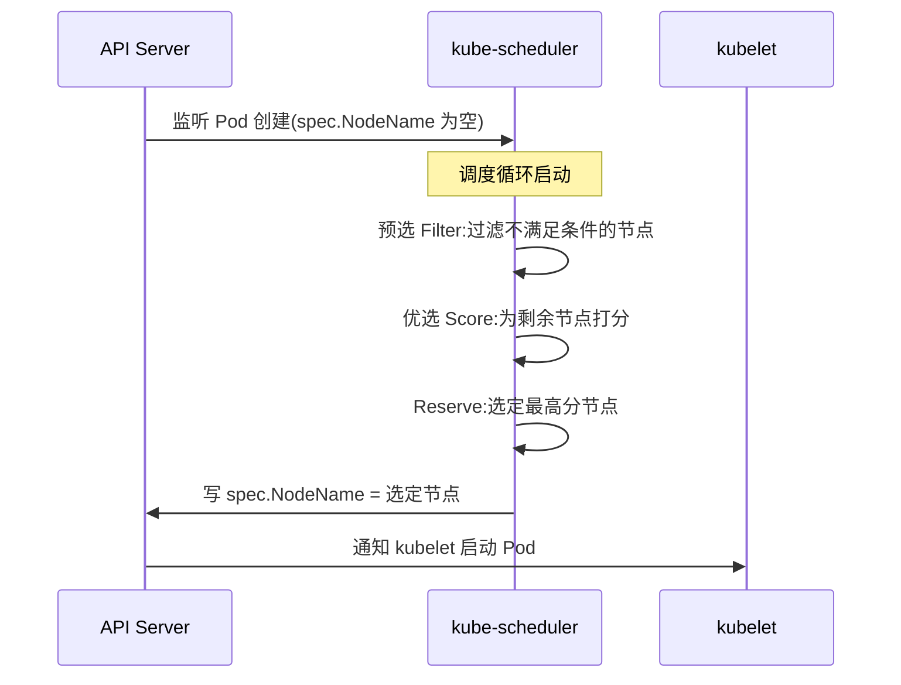
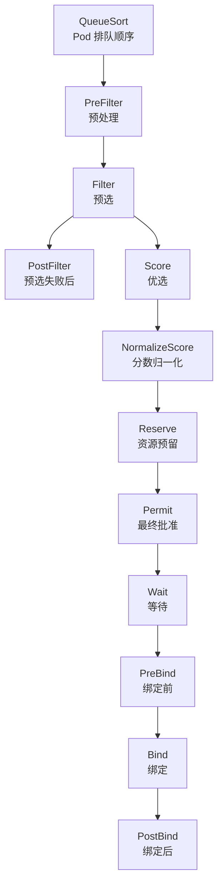

# Scheduler 调度原理：从 kube-scheduler 到 Scheduling Framework

> Pod 是怎么被调度到节点上的？kube-scheduler 内部走了哪两步（预选+优选）？Scheduling Framework 1.19 GA 后又发生了什么变化？这篇讲清楚机制层逻辑，不只是 API 用法。

## 一句话摘要

kube-scheduler 通过「预选（Filter）+ 优选（Score）+ 绑定（Reserve）」三步为 Pod 选节点；Scheduling Framework 1.19 GA 后，预选/优选阶段被插件化，支持自定义扩展点——这是 K8s 调度从「内置算法」到「可插拔框架」的演进。理解这条链路，排障时你看到的是原因而不是现象，调优时你动的是杠杆而不是旋钮。

## 一、为什么需要理解 scheduler 内部机制

### 1.1 排障必备

```bash
# Pod 长时间 Pending，怎么查？
kubectl describe pod my-pod | grep Events -A 10
# 输出常见：
# Warning  FailedScheduling  default-scheduler  0/5 nodes are available: ...
# 提示：3 nodes had untolerated taint, 2 nodes insufficient cpu
```

不读 scheduler 源码看不懂这个输出。

这句 Events 其实是预选链路的「出口」：每个节点被拒的原因会被聚合计数（`3 Insufficient cpu` 就是计数结果），最后由 `FailedScheduling` 消息统一输出——**这条消息里的每个数字，都对应源码里一个 Filter 插件的判定**。

会读和不会读这条消息，排障效率差一个量级。`0/5 nodes are available` 的后半句就是「过滤原因排行榜」：`untolerated taint` 排第一，说明节点被打上了污点，你要查的是谁打的（往往是磁盘压力、内存压力等自动打标）；`insufficient cpu` 排第一，说明约束真实存在，要么降低 Pod 请求、要么加节点。**不看内部机制的人把这条消息当报错，看懂机制的人把它当诊断书。**

### 1.2 调优必备

调度决策影响集群效率，而且每一条都是「全局性」的——

- **预选过严 → Pod 长期 Pending**：约束是乘法效应，每多一条硬约束，可行节点集缩小一次。5 个节点各剩 30% 资源时，一个要 50% 资源的 Pod 会被全部拒绝
- **优选权重失衡 → 节点负载不均**：打分权重决定装箱形状，权重失衡的长期后果是「有的节点爆满、有的节点空转」，资源利用率上不去
- **Reserve 失败 → Pod 调度成功却跑不起来**：调度和绑定是两个阶段，中间有失败窗口——不理解这个就会把「调度器 Bug」挂在嘴边，其实根因在存储

这三个问题有一个共同点：从外面看都是「Pod 没起来」，从里面看是完全不同的三条故障路径。**机制穿透的意义就在这里：同一现象，三种根因。**

### 1.3 二次开发必备

CRD + Scheduling Framework 可让自定义资源参与调度。最典型的是 GPU 拓扑调度：默认调度器只认「节点上有几张 GPU 卡」，不认识卡之间的 NVLink 拓扑——训练任务要多卡互联带宽高，这需要自定义 Score 插件读取硬件拓扑参与打分。不懂 Framework，这类需求只能靠「给节点打标签 + 硬亲和」绕，绕出来的方案在节点故障时全部失效。

## 二、调度核心流程：三阶段

先看全景，再逐步展开：



**用一个具体的 Pod 走一遍全流程**：假设它声明 `requests: cpu=2, memory=4Gi`、`nodeSelector: disk=ssd`。预选阶段，50 个节点的集群里——NodeResourcesFit 检查每个节点「剩余 CPU ≥ 2 且剩余内存 ≥ 4Gi」，砍掉一半；NodeName 无要求跳过；NodeAffinity 检查 `disk=ssd` 标签，又砍掉 60%；TaintToleration 把有未容忍污点的节点剔掉。50 → 剩 8 个可行节点。优选阶段给这 8 个节点逐个打分：资源空闲度、均衡性、镜像本地命中率各按权重加权，最后 node-3 以 87 分胜出。Reserve 阶段把 node-3 写入 `spec.NodeName`，绑定完成，kubelet 接手。

**这条流水线的两个设计要点**：预选是「硬淘汰」——被拒的节点毫无翻身机会，所以约束要少而准；优选是「软排序」——分数只决定谁先被选，落选节点毫无损失。把业务约束放进预选还是优选，是调度策略设计的第一个取舍：放预选是「一票否决」，放优选是「倾向但不强制」。

### 2.1 预选（Filter）：从所有节点筛出可行节点

**输入**：所有节点（集群规模 N）
**输出**：可行节点集合（规模 M，M ≤ N）
**算法**：每个预选插件过滤一遍，节点不满足任何一条 → 剔除。


预选插件的数量要克制。每一条预选规则都是硬约束，而**硬约束的可行集是乘法缩小的**：节点对每条规则各有 80% 通过率，五条规则下来可行集只剩 0.8⁵ ≈ 33%。生产事故里常见的「大批 Pod 突然 Pending」，根因往往是有人加了一条自以为无害的标签约束，乘法效应下可行节点清零。

> 💡 实战提示：给集群加新约束前，先跑一遍「约束对可行节点数的影响」——`kubectl get nodes -l <新标签>` 看剩余节点数，乘以现有通过率，低于 3 个节点的约束在 50 节点集群里就该警惕。

### 2.2 优选（Score）：从可行节点选最优

**输入**：可行节点集合（规模 M）
**输出**：最优节点（单一）
**算法**：每个优选插件打 0-100 分，加权求和。


打分策略背后是装箱哲学的分歧。**LeastAllocated（打散）**：优先选空闲多的节点，让负载摊开——好处是单节点故障波及面小、突发流量有缓冲；代价是碎片化，大规格 Pod 可能找不到连续资源。**BinPack（堆满）**：优先选已用率高的节点，把负载堆紧——利用率好看，但故障爆炸半径大。K8s 默认前者，因为「抗故障」在共享集群里优先级高于「利用率极致」。而 **BalancedAllocation** 插件是防畸形的：CPU 空闲 90% 但内存只剩 5% 的节点不能算好节点，它惩罚资源比例失衡的节点，避免「下一个要内存的 Pod 无处可放」。

### 2.3 Reserve（绑定）：写 API Server

```bash
# 实际就是改 Pod spec 的 NodeName 字段
spec:
  nodeName: node-3   # scheduler 选定后填入
```

看似只是写一个字段，中间有个关键设计：**Assume 语义**。调度器选中节点后，先在**本地缓存**里 Assume 这个 Pod 已占用 node-3 的资源（不等 API Server 确认），然后异步发起 Bind。这样下一个 Pod 调度时看到的是「node-3 已扣减」的视图，避免连续调度把同一节点的资源超卖。代价是存在「已 Assume 但 Bind 失败」的窗口——失败时调度器要回滚缓存并让 Pod 重新入队。这就是 §6.2「调度了不一定跑得起来」的机制根源。

## 三、Scheduling Framework 1.19 GA

这套可扩展性架构的演进有一个更早的源头。**抢占（Preemption）的设计直接继承自 Borg 的教训**（Borg 是谷歌内部的集群管理系统，K8s 的精神前身）：Borg 早期没有抢占机制，高优先级任务被低优任务长期占着资源、活活饿死，后来才补上 priority 抢占。这个教训让 K8s 从第一天就把「谁更重要」做成**显式声明**——你必须先创建 PriorityClass 对象再引用（QueueSort 的 `PrioritySort` 插件按它排队），而不是让调度器从 Pod 特征隐式推断，为的是让优先级成为可审计的运维决策，而不是算法的猜测。

### 3.1 旧架构的问题

K8s 1.18 之前 scheduler 是「内置算法 + 扩展点有限」：
- 想加新的预选规则？改 scheduler 源码
- 想替换打分策略？没接口

当时唯一的官方扩展方式是 **Scheduler Extender**（HTTP 外挂）：调度器把候选节点发给外部 HTTP 服务，让它参与过滤打分。这个设计能跑，但代价赤裸裸——每个 Pod 的每个候选节点都要走一次 HTTP 往返，外部服务一抖动整个调度链路就挂；而且 Extender 只能「附和」主调度器，拿不到调度器的内部状态。**正是因为 Extender 的性能和耦合问题无解，社区才下决心做进程内插件化**——这是 Framework 不是「锦上添花」而是「刚需」的原因。

### 3.2 新架构：插件化

Scheduling Framework 把调度过程拆成 **12 个扩展点**：



**插件类型**（每个扩展点可注册多个插件）：
- **PreFilter / Filter**：预选规则
- **Score**：优选打分
- **Reserve / Unreserve**：资源预留与释放（用于 VolumeBinding）
- **Permit**：等待外部批准（如「等所有 Pod 都 Ready 才启动」）
- **Bind**：真正写 API Server

三个值得驻足的设计：

- **PreFilter 与 Filter 分离**：有些计算不必每节点做一次。比如 Pod 间亲和性要先算「这个 Pod 的亲和标签在整个集群的分布」，算一次全集群可用——这就是 PreFilter 的职责，把 O(N) 的重复计算降为 O(1) 预处理加查表
- **Reserve/Unreserve 是成对的**：调度器视角的「事务」——Reserve 相当于事务提交前的锁定，后续 Bind 失败就调 Unreserve 回滚。VolumeBinding 插件靠这一对实现「先锁存储再挂卷」
- **Permit/Wait 是外部协调的门**：插件可以在 Permit 阶段说「这个 Pod 先别走，等信号」——这就是 Gang Scheduling（一组 Pod 要么全起要么全不起）的实现锚点。默认调度器对 Gang 无能为力，但门已经留好了

### 3.3 内置插件示例

| 扩展点 | 内置插件 | 作用 |
|---|---|---|
| QueueSort | `PrioritySort` | 按 PriorityClass 排序 |
| PreFilter | `NodeResourcesFit` | 提前算资源可行性 |
| Filter | `NodeName`, `NodeAffinity`, `TaintToleration` | 各种预选规则 |
| Score | `LeastAllocated`, `BalancedAllocation` | 资源空闲度打分 |
| Bind | `DefaultBinder` | 默认绑定器 |

## 四、源码关键路径

```
k8s.io/kubernetes/pkg/scheduler/
├── framework/
│   ├── interface.go        # Handle/PluginInterface 定义
│   ├── runtime_registry.go # 插件注册
│   └── plugins/
│       ├── noderesources/  # NodeResourcesFit 实现
│       ├── nodeaffinity/   # NodeAffinity 实现
│       └── ...
├── algorithmprovider/      # 默认插件集合
└── core/
    └── scheduling_queue.go # 待调度 Pod 队列
```

**最关键的调用栈**（从 Pod 创建到绑定节点）：

```
API Server watch → SchedulingQueue.Add → scheduleOne() →
  SchedulingCycle.Run → PreFilter → Filter → Score → Reserve → Permit → Bind
```

**两个容易被忽略的源码细节**：

- **预选是并行执行的**：`findNodesThatFitPod` 用固定数量的 worker 并发跑各节点的 Filter 插件——大规模集群上串行过滤是「单节点耗时 × N」的灾难，并行才压得进单次调度的时延预算。
- **失败原因是聚合而非即时的**：Filter 拒绝节点时不立刻报错，只往 fitError 的 diagnosis 里累计原因计数，全部节点跑完才汇总成一条 `FailedScheduling` 事件——这就是 §1.1 里「3 insufficient cpu + 2 untolerated taint」汇总格式的来源。

**待调度队列也不只是一个队列**：`scheduling_queue.go` 里实际维护着三个池——**activeQ**（正在调度的）、**backoffQ**（调度失败后退避重试的，退避时间随失败次数指数增长）、**unschedulableQ**（被判定「暂时不可能调度成功」的 Pod 池）。Pending 的 Pod 不是傻等：集群有节点变动时，unschedulableQ 会整体 flush 重新尝试——这就是「新节点加入后 Pending 的 Pod 突然自己跑了」的机制解释。理解三队列，你才能解释为什么有的 Pod 秒级重试、有的要等几分钟。

## 五、典型场景

### 5.1 排障：Pod 一直 Pending

一次典型的完整排查（场景 → 冲突 → 结果）：

```bash
# 1. 看 Events
kubectl describe pod my-pod | grep -A 5 Events

# 2. 看 scheduler 日志（控制平面节点）
journalctl -u kubelet | grep -i scheduler

# 3. 开 scheduler 调试日志
# /etc/kubernetes/manifests/kube-scheduler.yaml
spec:
  containers:
  - command:
    - kube-scheduler
    - --v=4    # 0-10，4 是调度决策级别
```

真实排查往往不是一条命令到答案。某次凌晨告警：一个业务 10 个副本集体 Pending。describe 显示「0/50 nodes available: 30 insufficient cpu, 20 node(s) had untolerated taint {node.kubernetes.io/disk-pressure}」。两条线索指向不同方向——30 个节点「资源不足」很可疑（昨天利用率才 40%），20 个 taint 更可疑（谁打的 disk-pressure？）。追下去：disk-pressure 是 kubelet 检测到磁盘使用率超阈值**自动打的污点**——根因是某个日志采集 DaemonSet 失控把磁盘写满。清理日志 + 修复采集器，污点自动消失，Pending 全部恢复。**如果只盯着「insufficient cpu」去扩容，等于花钱掩盖真问题**——读懂过滤原因排行的价值：它告诉你该去问哪个问题。

> 💡 实战提示：`--v=4` 调试日志量极大，只在排障时开、开完就关——常驻会拖慢调度器本身。

### 5.2 调优：修改打分权重

```yaml
# /etc/kubernetes/scheduler-config.yaml
apiVersion: kubescheduler.config.k8s.io/v1beta3
kind: KubeSchedulerConfiguration
profiles:
- pluginConfig:
  - name: NodeResourcesFit
    args:
      scoringStrategy:
        type: LeastAllocated    # 改打分策略
        resources:
        - name: cpu
          weight: 2             # CPU 权重高
        - name: memory
          weight: 1
```

改权重的正确姿势是一个纪律三步：**先定义问题**（装箱率低就偏向 BinPack，打散不够就偏向 LeastAllocated——没有问题就别动）→ **单变量修改**（一次只改一个权重，同时改两个出了问题无法归因）→ **基准对比**（改前后各测一周装箱率和负载方差，数字说话）。行业里大多数「调优」失败在第一步：没定义问题就动了手。

### 5.3 自定义：CRD + Scheduler Extender

```yaml
# 调用外部 HTTP 服务参与打分
apiVersion: kubescheduler.config.k8s.io/v1beta3
kind: KubeSchedulerConfiguration
extenders:
- urlPrefix: "http://my-scheduler-extender:8080"
  filterVerb: "filter"
  scoreVerb: "score"
  prioritizerVerb: "prioritize"
  bindVerb: "bind"
  weight: 10
  enableHTTPS: false
```

Extender 今天的位置是「快速验证想法」：HTTP 性能天花板低，但胜在独立进程、语言不限。原型验证通过后再移植成 Framework 进程内插件——这就是 §3.1 说的演进路径的今天用法。

### 5.4 量级：吞吐数字与瓶颈迁移

- 默认调度吞吐约 **100 pods/s**（万级节点规模的公开基准口径），单次调度时延毫秒级
- **扩到几千节点后，瓶颈先不在调度算法**——在 etcd 写入与 API Server 往返。大规模调优的顺序：① API/etcd 层效率（合并写、watch 缓存）② 调度器并行度与 profile 裁剪（关掉用不到的 Score 插件）③ 最后才是自定义调度器
- 反过来，百节点以下的小集群做这些调优基本无感——**量级决定一项优化值不值得做**

> 💡 实战提示：Pending 扩容前先判型——`kubectl describe` 看拒绝原因，若「每个节点都 insufficient 但集群总量充足」是碎片型，先试 descheduler 重调度，别急着加节点。

## 六、常见误区

### 6.1 scheduler 选「资源最空闲」的节点？

不对。**默认是「LeastAllocated」——空闲多的得分高**，但有多个 Score 插件叠加。CPU 空闲 90% 的节点，可能因为内存不均衡被扣分。选中的是「加权总分最高」，不是任何单一维度的最优。

### 6.2 Pod 调度后一定能跑起来？

不对。**Reserve 成功但 Bind 阶段失败**（如 Volume 动态供给超时）→ Pod 会回到待调度队列重试。§2.3 的 Assume 机制决定了「本地缓存已占用」和「API Server 已确认」之间存在窗口——这是「scheduling != binding success」的根本原因。

### 6.3 多个 scheduler 实例能并行调度？

对，但**不会冲突**——Scheduler 通过乐观锁（AssumePod cache）保证同一 Pod 只被一个 scheduler 处理。多个 scheduler 的常见用法是「不同业务用不同策略」：默认 scheduler 管在线业务，Volcano/batch-scheduler 管离线任务，按 schedulerName 字段分流。

### 6.4 Pending = 资源不足，扩容就行？

不一定。先分清两种 Pending：**短缺型**（全集群总量不够，扩容有效）和**碎片型**（总量够，但每个单节点都差一口气——比如剩 200Mi 的节点有 10 个，Pod 要 500Mi）。碎片型扩容是治标，根因是装箱产生的资源碎片，解法是重调度（descheduler）或改装箱策略（BinPack 而非 Spread）。判别方法：`kubectl describe` 里**每个节点都 insufficient 但总量充足** = 典型碎片。

### 6.5 nodeAffinity 硬亲和更精确，可以多用？

恰恰相反——**硬亲和（required）的隐性代价是锁死弹性**：required 只允许「满足标签的节点」，若满足条件的节点只有一两个，节点故障时 Pod 无法漂移，副本数再多也起不来。取舍很清楚：生产默认软亲和（preferred）+ 反亲和做打散，硬亲和只留给真正的硬约束（GPU 型号、本地 SSD 这类「去别的节点就是跑不了」的场景）。每加一条 required，都是在用可用性换确定性。

## 七、与相邻机制的关系

- **API Server**：scheduler 对它是「watch + write」的客户端关系——watch Pod 创建事件获得调度对象，写 NodeName 完成绑定，所有持久化都经它手，scheduler 自己不碰存储（详见子系列 B 篇 1/2）
- **kubelet**：绑定完成后 kubelet 才登场——它 watch 到 `spec.NodeName` 指向自己节点的 Pod，开始拉镜像、建容器。调度器的产出就是 kubelet 的输入，衔接点是 NodeName 字段（详见子系列 C 篇 1）
- **etcd**：所有调度决策最终持久化在 etcd。§5.4 的吞吐瓶颈、§2.3 的 Assume 缓存，本质都是在和 etcd 的写入延迟博弈——越理解 etcd 的成本模型，越理解调度器的设计取舍（详见子系列 B 篇 1）

## 你们可能会问

**Q1：为什么我的 Pod 调度要等 10 秒以上，不是毫秒级吗？**
单次调度是毫秒级，但你可能撞上了队列机制：Pod 之前调度失败进了 backoffQ（指数退避），或者正等 unschedulableQ 的周期性 flush。集群刚发生过节点变动时 flush 频繁，排队的 Pod 多，等待就是分钟级——查 `--v=4` 日志里的 Pod 出队时间戳可以确认。

**Q2：节点被打污点后，上面已运行的 Pod 会立刻搬走吗？**
不会。taint 影响的是「新调度」——只挡后来者。已运行的 Pod 只有在污点是 `NoExecute` 效果时才会被驱逐，`NoSchedule` 只挡不赶。这也是为什么 §5.1 案例里清掉 disk-pressure 污点后 Pod 就恢复调度了——它们一直没被赶走，只是新副本进不来。

**Q3：为什么不干脆用一台大机器，省掉调度这件事？**
调度解决的是资源池化后的三件事：故障域切分（一台大机器挂了全没）、异构匹配（GPU 机型和存储机型没法互相替代）、弹性伸缩（按需加节点比提前买大机器便宜）。单机的确没有调度问题，但那是对这三个问题的放弃。

## 业内惯例

- **打分权重很少人改**：多数生产集群用默认 Profile 跑——改权重前先想清楚要解决什么负载问题，改完必须做装箱率基准对比，否则「调优」只是心理安慰
- **GPU 集群普遍不走默认调度**：业界常见两条路——Framework 自定义插件（拓扑感知/GPU 拓扑打分）或批量调度器（如 Volcano），默认调度器对 Gang Scheduling 无能为力
- **PriorityClass 上线前先演练抢占**：高优任务一旦触发抢占，被驱逐的低优工作负载是「计划内损失」——生产惯例是先在测试集群跑一遍抢占路径，确认驱逐顺序符合预期

## 八、自测三问

1. **预选（Filter）和优选（Score）的本质区别是什么？**
   - 预选是「二值过滤」（满足/不满足），剔除不满足条件的节点；优选是「连续打分」（0-100 分），从可行节点选最优。约束放预选是一票否决，放优选是倾向不强制——这是调度策略设计的第一个取舍。

2. **Scheduling Framework 1.19 之前的 scheduler 为什么不能扩展？**
   - 旧 scheduler 把预选/优选逻辑硬编码；唯一的 Extender 外挂有 HTTP 性能天花板且拿不到调度器内部状态。Framework 把每一步变成「扩展点 + 插件」，进程内调用、状态共享。

3. **scheduler 选完节点后，会不会「Pod 实际跑不起来」？**
   - 会。Assume 缓存占用与 Bind 确认之间有失败窗口（Volume 供给慢、网络问题），失败即 Unreserve 回滚 + 重新入队。「调度成功」和「跑得起来」之间隔着一个绑定阶段。

## 开放问题

- **多调度器并存的全局最优**：默认 scheduler 管在线、Volcano 管离线各自为政时，同一集群的资源竞争没有全局裁判——在线/离线混部的资源冲突目前靠优先级和配额硬隔离，是否会出现统一的「跨调度器协商层」，社区还没有定论。
- **AI 负载会重塑调度器吗**：GPU 拓扑亲和 + 训练任务 Gang 语义 + 弹性伸缩三重需求叠在一起，默认 Framework 的扩展点是否够用，还是催生「AI 原生调度器」独立演进——值得持续观察。

## 📌 数据与事实声明

- 写于 2026-09-07，2026-09-09 增补五钻深挖（源码细节/量级/边界/代价/历史），针对 K8s 1.30+
- Scheduling Framework GA：K8s 1.19（2020-08）
- kube-scheduler 默认 Profile：包括 20+ 内置插件
- 行业认知：scheduler 性能瓶颈通常不在算法，在 API Server watch 延迟（公开讨论）；默认吞吐约 100 pods/s 为公开基准口径
- 免责：scheduler 配置项演进中，具体版本支持以官方为准

## 📚 参考资料

| 类型 | 标题 | 来源 |
|---|---|---|
| 官方文档 | Scheduling Framework | kubernetes.io/docs/concepts/scheduling-eviction/scheduling-framework/ |
| 官方文档 | Scheduler Configuration | kubernetes.io/docs/reference/scheduling/config/ |
| 官方源码 | kube-scheduler | github.com/kubernetes/kubernetes/tree/master/pkg/scheduler |
| 设计文档 | Scheduler Extender | kubernetes.io/docs/concepts/scheduling-eviction/scheduling-framework/#extenders |
| 实战 | Troubleshooting Pod Scheduling | kubernetes.io/docs/tasks/configure-pod-container/troubleshooting/ |
