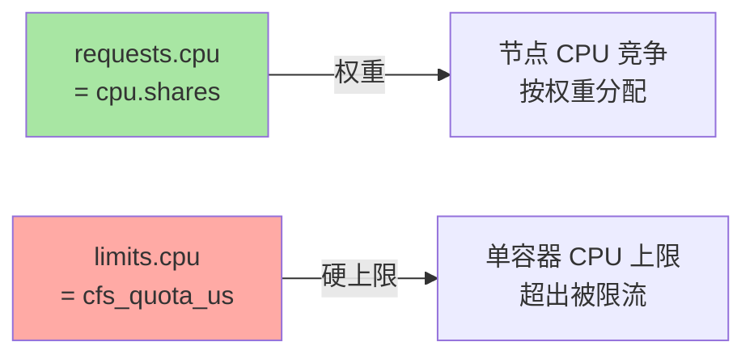
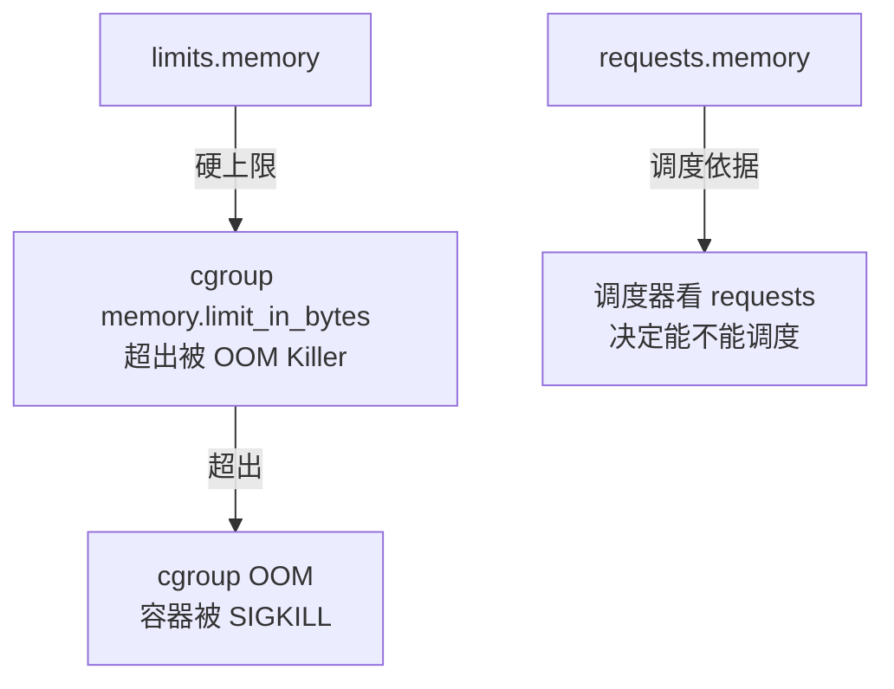
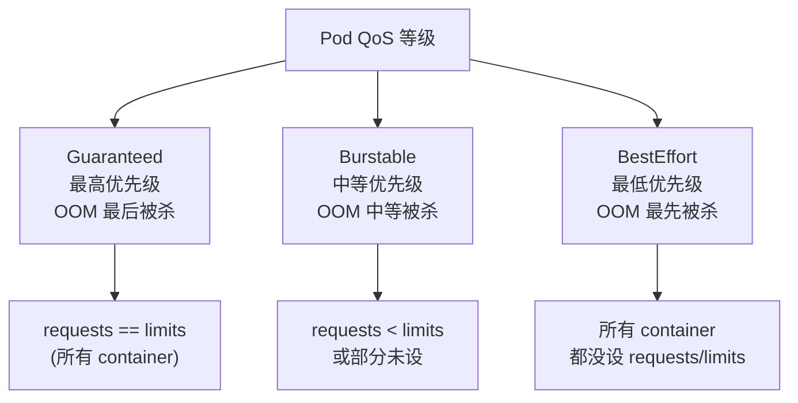

# 节点资源模型：CPU / Memory / Extended Resources 的真相

> K8s 资源模型不止是「requests + limits」——CPU/Memory 的底层是 cgroup + namespace、Extended Resources 用于 GPU/磁盘等扩展、QoS 等级决定 OOM 优先级。本篇讲透三件事：资源怎么度量、怎么限制、怎么被调度器使用。

## 一句话摘要

K8s 节点资源模型基于 cgroup（Linux 内核），CPU 用 millicpu（千分之一核）+ shares/quota 双重控制，Memory 用字节 + OOM Killer；Extended Resources（GPU/磁盘等）走同样的调度框架但需注册；QoS 等级（Guaranteed/Burstable/BestEffort）决定 OOM 时被杀的优先级。

## 一、为什么资源模型这么复杂

Pod 启动时 K8s 要回答三个问题：

1. **能不能调度到这个节点？** → 看 requests
2. **运行后能占多少资源？** → 看 limits
3. **节点资源耗尽时，先杀谁？** → 看 QoS

资源模型要同时回答这三个问题——这就是「requests + limits + QoS」三件套的来源。

## 二、CPU 资源模型

### 2.1 CPU 单位：millicpu

```yaml
spec:
  containers:
  - name: app
    resources:
      requests:
        cpu: 100m        # 100 millicpu = 0.1 核
        memory: 128Mi
      limits:
        cpu: 500m        # 0.5 核上限
        memory: 256Mi
```

**为什么是 millicpu 而不是核数**：

- 1 millicpu = 1/1000 核 = 1m
- 1 核 CPU = 1000m
- 优势：精细控制（0.1 核 vs 0.5 核 vs 1 核）

### 2.2 CPU 双重控制：shares + quota

K8s 通过 cgroup 的两套机制控制 CPU：

| 机制 | cgroup 文件 | 作用 | 对应 K8s |
|---|---|---|---|
| **CPU shares** | `cpu.shares` | 权重，节点竞争时按权重分配 | `requests.cpu` |
| **CPU quota** | `cpu.cfs_quota_us` | 硬上限，超出被限流 | `limits.cpu` |



**关键认知**：
- `requests` 不是「保证一定能用」，是「权重」——节点空闲时大家都用得上
- `limits` 才是「硬上限」——超出 100ms 内被 cgroup 限流

### 2.3 limits 不设等于无上限

```yaml
# 不设 limits.cpu 的容器
# → cfs_quota_us = -1（无上限）
# → 节点只有 1 核时，容器可以吃掉全部 CPU
# → 其他容器饿死
```

## 三、Memory 资源模型

### 3.1 Memory 单位

| 单位 | 含义 |
|---|---|
| `Ki` / `Mi` / `Gi` | 二进制（1024 进制） |
| `K` / `M` / `G` | 十进制（1000 进制） |
| `128Mi` | 128 × 1024 × 1024 = 134,217,728 bytes |
| `128M` | 128 × 1000 × 1000 = 128,000,000 bytes |

**推荐用二进制**（Mi/Gi），避免「1000 vs 1024」争议。

### 3.2 Memory 双重控制：limits + OOM



**Memory vs CPU 的关键差异**：
- CPU 超限 → 限流（容器变慢，但不重启）
- Memory 超限 → **OOM Kill（容器被杀掉）**

### 3.3 node-level memory pressure

节点内存压力大时：

```
可用内存 < 阈值1（默认 100Mi）
  → 系统开始回收 cache（page cache）
可用内存 < 阈值2（默认 50Mi）
  → 触发 cgroup-level OOM（按 QoS 杀容器）
```

## 四、QoS 等级

### 4.1 三档 QoS



### 4.2 OOM 优先级实战

```yaml
# Guaranteed（最高优先级）
spec:
  containers:
  - name: app
    resources:
      requests: { cpu: 100m, memory: 128Mi }
      limits:   { cpu: 100m, memory: 128Mi }
---
# BestEffort（最低优先级）
spec:
  containers:
  - name: app
  # 没有 resources 字段
```

**节点 OOM 时的杀顺序**：
1. 先杀 BestEffort
2. 再杀 Burstable（按内存超限比例）
3. 最后杀 Guaranteed

### 4.3 系统级内存保留

`--system-reserved` 和 `--kube-reserved` 给系统和 K8s 自身保留内存——这些内存 **不计入可调度资源**。

## 五、Extended Resources

### 5.1 什么是 Extended Resources

节点上的「非标准资源」——

| 资源 | 例子 |
|---|---|
| GPU | `nvidia.com/gpu` |
| RDMA | `rdma/rdma_hca` |
| 自定义设备 | `example.com/foo` |
| 节点 IP | `kubernetes.io/hostname` |

### 5.2 注册 Extended Resource

```bash
# 1. 节点上「暴露」GPU（NVIDIA Device Plugin 负责）
# Device Plugin 会通过 kubelet 注册资源

# 2. Pod 使用
spec:
  containers:
  - name: gpu-app
    resources:
      requests:
        nvidia.com/gpu: 1
      limits:
        nvidia.com/gpu: 1
```

### 5.3 Extended Resource 的特殊性

- **整数单位**：GPU 是整数（1/2/4），不能 0.5
- **节点级**：必须在每个节点注册才能被该节点调度使用
- **零默认**：未注册资源的节点 `nvidia.com/gpu = 0`

## 六、资源模型常见误区

### 6.1 「requests 是保证能用的」

不对。requests 是「权重 + 调度决策依据」，节点空闲时都够用，节点竞争时按比例分配。

### 6.2 「limits 设了就一定能跑」

不对。limits 设太低 → 容器被限流；limits 设太高 → OOM 风险。

### 6.3 「OOM 时所有容器公平被杀」

不对。**OOM 按 QoS 杀**——Guaranteed 最后被杀，BestEffort 最先被杀。

### 6.4 「节点资源 = 物理资源」

不对。节点资源需要扣除 `--kube-reserved`（K8s 系统）+ `--system-reserved`（系统）+ `--eviction-hard`（驱逐阈值）。

## 七、典型场景

### 7.1 在线服务

```yaml
# Guaranteed 级别，保证服务质量
spec:
  containers:
  - name: web
    resources:
      requests: { cpu: 500m, memory: 512Mi }
      limits:   { cpu: 500m, memory: 512Mi }
```

### 7.2 批处理任务

```yaml
# BestEffort，用空闲资源跑
spec:
  containers:
  - name: batch
  # 不设 resources
```

### 7.3 AI 训练

```yaml
spec:
  containers:
  - name: training
    resources:
      requests:
        cpu: 4
        memory: 16Gi
        nvidia.com/gpu: 8    # 8 卡 GPU
      limits:
        cpu: 4
        memory: 16Gi
        nvidia.com/gpu: 8
```

## 八、自测三问

1. **CPU 超 limits 和 Memory 超 limits 的后果有什么不同？**
   - CPU 超限：cgroup 限流，容器变慢但不重启。Memory 超限：cgroup OOM Killer 杀容器，**Pod 重启**。

2. **Guaranteed QoS 等级必须满足什么条件？**
   - 所有容器 `requests == limits`（CPU 和 Memory 都要设，且相等）。

3. **节点 OOM 时，先杀 Guaranteed 还是 BestEffort？**
   - 先杀 BestEffort，最后杀 Guaranteed。Guaranteed 是「资源保证」级别的优先级。

## 📌 数据与事实声明

- 写于 2026-09-07，针对 K8s 1.30+
- cgroup v1 vs v2：K8s 1.25+ 默认 cgroup v2
- `--kube-reserved` 默认值因版本而异（云厂商一般预设 4Gi 内存）
- 行业认知：生产环境推荐 Guaranteed + Burstable，慎用 BestEffort（公开讨论）
- 免责：具体 QoS 行为受 kubelet flags 影响（`--qos-reserved`）

## 📚 参考资料

| 类型 | 标题 | 来源 |
|---|---|---|
| 官方文档 | Resource Management | kubernetes.io/docs/concepts/configuration/manage-resources-containers/ |
| 官方文档 | Quality of Service | kubernetes.io/docs/tasks/configure-pod-container/quality-service-pod/ |
| 官方文档 | Extended Resources | kubernetes.io/docs/concepts/extend-kubernetes/compute-storage-net/device-plugins/ |
| 内核文档 | cgroup v1/v2 | kernel.org/doc/Documentation/cgroup-v1/ |
| 实战 | NVIDIA Device Plugin | github.com/NVIDIA/k8s-device-plugin |
