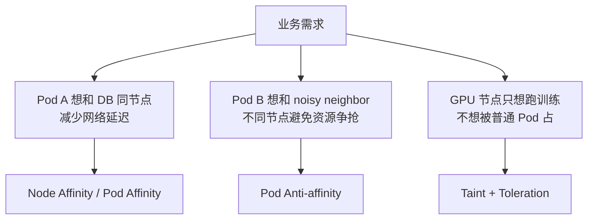
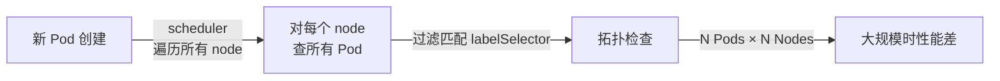
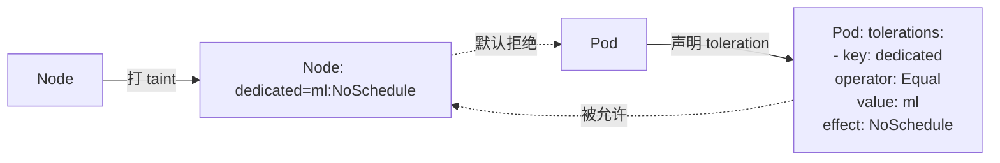

# 调度策略：亲和性 / 反亲和性 / 污点容忍

> 调度器默认是「随机选节点」，但生产环境需要「这个 Pod 必须和 DB Pod 在同节点」「这个 Pod 不能和 noisy neighbor 在同节点」「GPU 节点只跑训练任务」——这些都靠三个机制：Node Affinity / Pod Affinity / Taint + Toleration。

## 一句话摘要

Node Affinity 让 Pod「想」跑在特定节点（软约束）；Pod Affinity/Anti-affinity 让 Pod「想」与特定 Pod 同/不同节点；Taint + Toleration 让节点「排斥」特定 Pod（硬约束）。三个机制组合实现生产级调度策略。

## 一、为什么需要调度策略



默认调度器看 resources + selectors，但**不知道「业务拓扑」**——这是调度策略要补的。

## 二、Node Affinity：Pod 想跑在特定节点

### 2.1 required（硬约束）

```yaml
spec:
  affinity:
    nodeAffinity:
      requiredDuringSchedulingIgnoredDuringExecution:
        nodeSelectorTerms:
        - matchExpressions:
          - key: kubernetes.io/os
            operator: In
            values: ["linux"]
          - key: topology.kubernetes.io/zone
            operator: In
            values: ["us-east-1a", "us-east-1b"]
```

**语义**：必须满足所有条件，否则 Pod 一直 Pending。

### 2.2 preferred（软约束）

```yaml
spec:
  affinity:
    nodeAffinity:
      preferredDuringSchedulingIgnoredDuringExecution:
      - weight: 100
        preference:
          matchExpressions:
          - key: node.kubernetes.io/instance-type
            operator: In
            values: ["m5.2xlarge"]
```

**语义**：能匹配最好（按 weight 排序），不能匹配也能调度。

### 2.3 5 种 operator

| operator | 含义 | 示例 |
|---|---|---|
| `In` | label value 在列表中 | `In [us-east-1a]` |
| `NotIn` | label value 不在列表中 | `NotIn [archived]` |
| `Exists` | label 存在 | `Exists dedicated` |
| `DoesNotExist` | label 不存在 | `DoesNotExist beta.kubernetes.io/arch` |
| `Gt` / `Lt` | label value 比较（数字） | `Gt 16`（CPU > 16 核） |

## 三、Pod Affinity / Anti-affinity：Pod 想与 Pod 同/不同节点

### 3.1 Pod Affinity（想同节点）

```yaml
# Cache Pod 想和 App Pod 在同节点（减少网络）
spec:
  affinity:
    podAffinity:
      requiredDuringSchedulingIgnoredDuringExecution:
      - labelSelector:
          matchLabels:
            app: web
        topologyKey: kubernetes.io/hostname    # 同主机
```

**核心字段 `topologyKey`**：
- `kubernetes.io/hostname` — 同节点
- `topology.kubernetes.io/zone` — 同可用区
- `topology.kubernetes.io/region` — 同区域
- 自定义 label（如 rack-id）— 同机架

### 3.2 Pod Anti-affinity（想不同节点）

```yaml
# 两个 Web Pod 想在不同节点（HA）
spec:
  affinity:
    podAntiAffinity:
      requiredDuringSchedulingIgnoredDuringExecution:
      - labelSelector:
          matchLabels:
            app: web
        topologyKey: kubernetes.io/hostname
```

**典型用途**：HA 场景——同一应用的多个副本必须分散在不同节点。

### 3.3 Pod Affinity 的代价

**性能问题**：



**生产经验**：
- 集群 > 1000 节点时 Pod Affinity 可能让 scheduler 卡顿
- 解决方案：用 `preferred` 而非 `required`，或用 topology spread constraints（K8s 1.18+，见后）

## 四、Taint + Toleration：节点主动排斥 Pod

### 4.1 机制



**关键认知**：Taint 是**节点主动排斥**，Toleration 是 **Pod 主动接受**。两者必须配对。

### 4.2 三种 effect

| effect | 行为 | 典型用途 |
|---|---|---|
| `NoSchedule` | 不容忍的 Pod 不会被调度上来（但已运行的不受影响） | 节点专用 |
| `PreferNoSchedule` | 软排斥，尽量不调度，但实在不行也调 | 软性专用 |
| `NoExecute` | 不容忍的 Pod 会被驱逐（已运行的也会被踢走） | 节点维护/隔离 |

### 4.3 典型用法：GPU 节点专用

```bash
# 1. 节点打 taint
kubectl taint nodes node-gpu-1 dedicated=ml:NoSchedule

# 2. 训练 Pod 加 toleration
spec:
  tolerations:
  - key: dedicated
    operator: Equal
    value: ml
    effect: NoSchedule
```

### 4.4 NoExecute 的实战用法：节点维护

```bash
# 1. 标记节点不可调度 + 驱逐现有 Pod
kubectl taint nodes node-1 maintenance=true:NoExecute

# 2. 业务 Pod 加 toleration 60s（容忍时间）
spec:
  tolerations:
  - key: maintenance
    operator: Exists
    effect: NoExecute
    tolerationSeconds: 60   # 60s 后才被驱逐
```

## 五、Topology Spread Constraints（K8s 1.18+，推荐替代 Pod Anti-affinity）

### 5.1 为什么出现

Pod Anti-affinity 的问题：
- 只能「强制不同节点」，不能「尽量均匀分布」
- 100 个节点 + 5 副本 → 可能 5 副本挤在 1 个区域

### 5.2 解法：spread constraints

```yaml
spec:
  topologySpreadConstraints:
  - maxSkew: 1                     # 最大偏差
    topologyKey: kubernetes.io/hostname
    whenUnsatisfiable: ScheduleAnyway
    labelSelector:
      matchLabels:
        app: web
```

**含义**：app=web 的 Pod 尽量均匀分布到每个 hostname，**最大偏差 1**。

| 字段 | 含义 |
|---|---|
| `maxSkew` | 最大允许偏差（如 1 表示每节点最多差 1 个） |
| `topologyKey` | 拓扑维度（hostname/zone/region） |
| `whenUnsatisfiable` | 不满足时怎么办：`DoNotSchedule`（硬）/ `ScheduleAnyway`（软） |

### 5.3 与 Pod Anti-affinity 对比

| 场景 | Pod Anti-affinity | Topology Spread |
|---|---|---|
| 2 副本必须不同节点 | ✅ 简单 | ✅ 可表达 |
| 5 副本尽量均匀分布 | ❌ 复杂 | ✅ 原生支持 |
| 100 节点 + 5 副本（不要挤一起） | ❌ | ✅ 表达力强 |

## 六、三个机制对比

| 机制 | 方向 | 硬/软 | 典型用途 |
|---|---|---|---|
| **Node Affinity** | Pod → 节点 | required / preferred | 指定节点类型（OS/zone/instance-type） |
| **Pod Affinity/Anti** | Pod → Pod | required / preferred | Pod 同/不同节点（同 DB / HA 分散） |
| **Taint + Toleration** | 节点 → Pod | NoSchedule / PreferNoSchedule / NoExecute | 节点专用（GPU/维护/隔离） |
| **Topology Spread** | Pod 均匀分布 | DoNotSchedule / ScheduleAnyway | HA 均匀分散 |

## 七、典型场景

### 7.1 多可用区 HA

```yaml
spec:
  affinity:
    podAntiAffinity:
      preferredDuringSchedulingIgnoredDuringExecution:
      - weight: 100
        podAffinityTerm:
          labelSelector:
            matchLabels: { app: order }
          topologyKey: topology.kubernetes.io/zone
    nodeAffinity:
      requiredDuringSchedulingIgnoredDuringExecution:
        nodeSelectorTerms:
        - matchExpressions:
          - key: topology.kubernetes.io/zone
            operator: In
            values: ["us-east-1a", "us-east-1b", "us-east-1c"]
```

### 7.2 在线 / 离线混部

```yaml
# 在线服务（prefer 在线节点）
affinity:
  nodeAffinity:
    preferredDuringSchedulingIgnoredDuringExecution:
    - weight: 100
      preference:
        matchExpressions:
        - key: workload-type
          operator: In
          values: ["online"]

---
# 离线任务（prefer 离线节点 + toleration）
tolerations:
- key: workload-type
  operator: Equal
  value: offline
  effect: PreferNoSchedule
affinity:
  nodeAffinity:
    preferredDuringSchedulingIgnoredDuringExecution:
    - weight: 100
      preference:
        matchExpressions:
        - key: workload-type
          operator: In
          values: ["offline"]
```

### 7.3 节点维护

```bash
# 1. cordon 节点（不让新 Pod 调度）
kubectl cordon node-1

# 2. 标记维护（驱逐现有 Pod）
kubectl drain node-1 --ignore-daemonsets --delete-emptydir-data
```

## 八、常见误区

### 8.1 「required 一定能调度上」

不对。required 不满足 → Pod **一直 Pending**（不会降级到 preferred）。

### 8.2 「toleration 就能跑在 taint 节点」

不对。Toleration 是「允许」，但**是否真的能跑还要看 resources、affinity 等**——toleration 只是「不被 taint 排斥」。

### 8.3 「Pod Affinity = HA」

不对。Pod Affinity 让 Pod 同节点（用于缓存/低延迟）；**HA 要的是 Pod Anti-affinity**（让 Pod 分散）。

## 九、自测三问

1. **Node Affinity required 和 preferred 的区别？**
   - required：不满足则 Pending；preferred：尽力满足，不满足也能调。

2. **Taint 和 Node Affinity 的区别？**
   - Taint 是节点主动排斥（要 Toleration 才能接受）；Node Affinity 是 Pod 主动选择（不需要 Toleration）。

3. **Pod Anti-affinity 和 Topology Spread Constraints 的区别？**
   - Pod Anti-affinity 是「强制不同节点」；Topology Spread 是「尽量均匀分布」——后者表达力更强。

## 📌 数据与事实声明

- 写于 2026-09-07，针对 K8s 1.30+
- Topology Spread Constraints GA：K8s 1.19（2020-08）
- Pod Affinity 性能：> 1000 节点 + Pod Affinity required 可能让 scheduler 卡顿（公开讨论）
- 行业认知：生产环境推荐「Topology Spread + Node Affinity preferred」组合（公开讨论）
- 免责：TolerationSeconds 默认值演进中（K8s 1.25 后部分默认 300s）

## 📚 参考资料

| 类型 | 标题 | 来源 |
|---|---|---|
| 官方文档 | Affinity and Anti-affinity | kubernetes.io/docs/concepts/scheduling-eviction/assign-pod-node/ |
| 官方文档 | Taints and Tolerations | kubernetes.io/docs/concepts/scheduling-eviction/taint-toleration-dedication/ |
| 官方文档 | Topology Spread Constraints | kubernetes.io/docs/concepts/scheduling-eviction/topology-spread-constraints/ |
| 实战 | Pod Scheduling Readiness | kubernetes.io/docs/concepts/scheduling-eviction/pod-scheduling-readiness/ |
