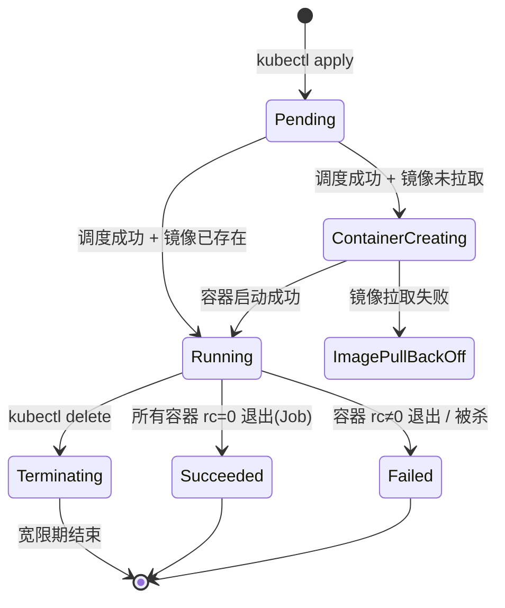
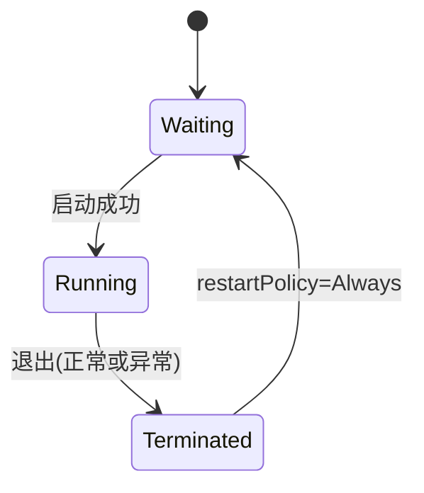
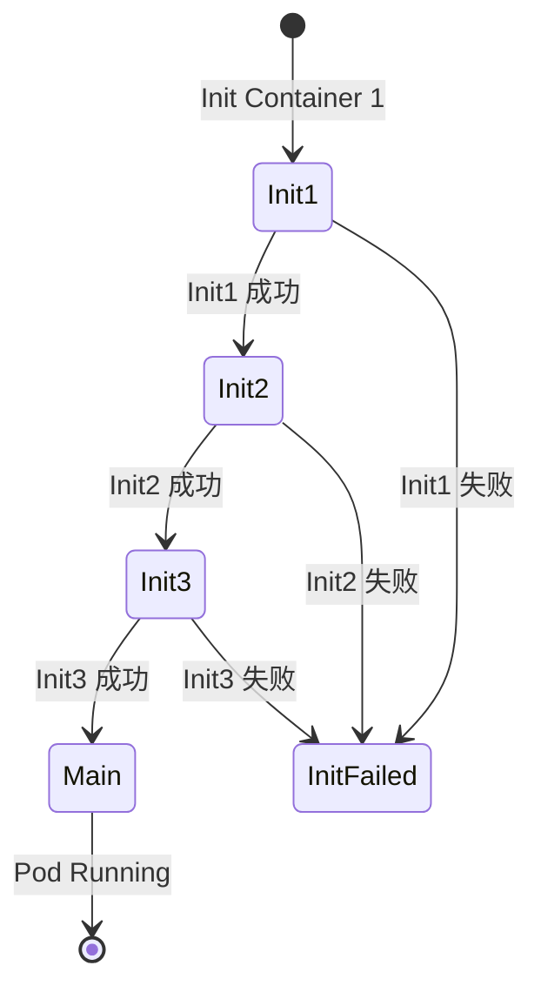
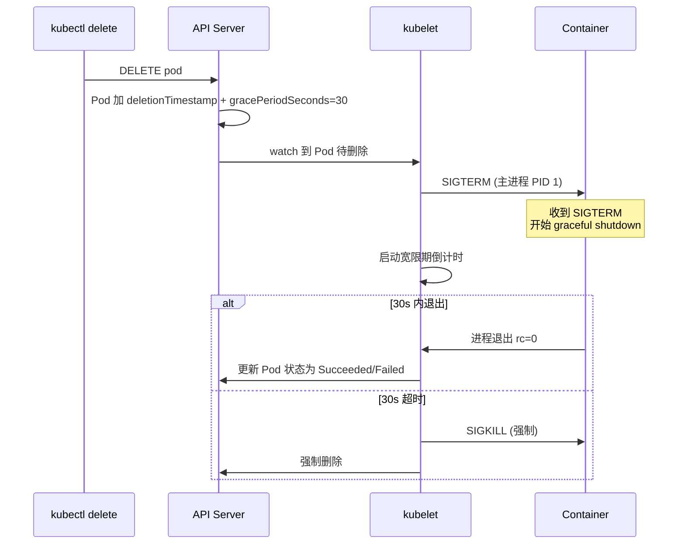

# Pod 生命周期：从 Pending 到 Terminated 的每个阶段

> Pod 的状态机看起来简单（Pending → Running → Succeeded/Failed），但每个状态背后都有「谁在做什么」。理解 lifecycle 才能看懂 `kubectl describe pod` 输出的每一行，也才能排查 Pod 卡在哪个阶段。

## 一句话摘要

Pod 生命周期由 5 个阶段组成（Pending/ContainerCreating/Running/Succeeded/Failed）+ 5 个核心事件触发（SchedulingDecision/ImagePulling/ContainerStarting/ReadinessProbeFailed/TerminationGracePeriod），每个阶段都有明确的「责任主体」——API Server、Scheduler、kubelet、容器运行时。

## 一、为什么需要深入生命周期

`kubectl describe pod` 输出密密麻麻——

```
Events:
  Type    Reason     Age   From               Message
  ----    ------     ----  ----               -------
  Normal  Scheduled  4s    default-scheduler  Successfully assigned default/web to node-1
  Normal  Pulling    3s    kubelet            Pulling image "nginx:1.25"
  Normal  Pulled     1s    kubelet            Successfully pulled image
  Normal  Created    1s    kubelet            Created container web
  Normal  Started    1s    kubelet            Started container web
```

每行都对应生命周期的一个阶段。**不懂生命周期就看不懂输出**。

## 二、Pod 5 个阶段



### 2.1 Pending

**责任主体**：API Server + Scheduler

**可能卡住的子状态**：

| 卡住原因 | 查看方式 |
|---|---|
| 镜像拉取失败 | `Events: Failed to pull image` |
| 资源不足 | `Events: 0/5 nodes are available: insufficient cpu` |
| 节点亲和性不满足 | `Events: 0/5 nodes are available: 3 node(s) didn't match affinity` |
| 污点不容忍 | `Events: 0/5 nodes are available: 3 node(s) had untolerated taint` |
| PVC 未绑定 | `Events: waiting for volume` |

### 2.2 ContainerCreating

**责任主体**：kubelet + 容器运行时

**可能卡住的子状态**：

| 卡住原因 | 排查命令 |
|---|---|
| 镜像拉取慢/失败 | `kubectl describe pod` 看 `Events` |
| Init Container 卡住 | `kubectl logs <pod> -c <init-container>` |
| Volume 挂载失败 | 看节点 `/var/log/kubelet.log` |
| Secret/ConfigMap 不存在 | `kubectl get secret/cm` |

### 2.3 Running

**责任主体**：kubelet + 容器运行时

**可能异常的子状态**：

| 异常 | 排查命令 |
|---|---|
| livenessProbe 失败 → 重启 | `kubectl describe pod` 看 `Restart Count` |
| readinessProbe 失败 → 摘流量 | `kubectl get pod` 看 `READY` 列 |
| 容器进程退出 | `kubectl logs <pod> -c <container> --previous` |
| OOM Killed | `kubectl describe pod` 看 `Last State: Terminated, Reason: OOMKilled` |

### 2.4 Succeeded

**责任主体**：Job Controller

**语义**：所有容器正常退出（rc=0），通常用于 Job/CronJob。

### 2.5 Failed

**责任主体**：kubelet + 容器运行时

**触发场景**：
- 容器 rc≠0
- livenessProbe 失败超过 restartPolicy 限制
- 被 OOM Killed
- 被 SIGTERM（kubectl delete）

## 三、Pod 内部 Container 生命周期

每个 Container 还有自己的状态机：



### 3.1 Waiting 阶段

```yaml
# 容器在 Waiting 阶段，describe 输出类似：
State:          Waiting
Reason:         CrashLoopBackOff
Message:        back-off restarting failed container
Last State:     Terminated
Reason:         Error
Exit Code:      1
Started:        Mon, 01 Jan 2026 10:00:00 +0800
Finished:       Mon, 01 Jan 2026 10:00:30 +0800
```

**常见 Waiting 原因**：

| Reason | 含义 |
|---|---|
| `ContainerCreating` | 容器正在创建（拉镜像、挂卷） |
| `CrashLoopBackOff` | 容器反复崩溃（指数退避重启中） |
| `ErrImagePull` / `ImagePullBackOff` | 镜像拉取失败 |
| `CreateContainerConfigError` | 配置错误（如 Secret 不存在） |

### 3.2 restartPolicy 三档

| restartPolicy | 行为 | 适用 |
|---|---|---|
| `Always`（Deployment 默认） | 容器退出就重启 | 长服务 |
| `OnFailure`（Job 默认） | 失败才重启 | 批处理 |
| `Never` | 不重启 | 单次任务 |

### 3.3 Restart Count 与退避

**指数退避算法**：

```
第一次失败 → 立即重启
第二次失败 → 10s 后重启
第三次失败 → 20s 后重启
第四次失败 → 40s 后重启
... 最大 5 分钟
```

10 次重启后变成 `CrashLoopBackOff`——容器以指数退避方式反复重启。

## 四、Init Container 生命周期

### 4.1 Init Container 串行执行



**特性**：
- Init Container 按顺序执行
- 任一 Init 失败 → Pod 不会启动主容器
- Init Container 可以使用与应用不同的镜像（如 busybox）

### 4.2 Init Container vs Sidecar

| 维度 | Init Container | Sidecar |
|---|---|---|
| 执行时机 | 主容器启动**前** | 主容器启动**后**（并行） |
| 资源隔离 | 独立 limits | 共享 resources |
| 镜像 | 通常小工具（busybox） | 通常业务镜像（filebeat 等） |
| 典型用途 | 等 DB 就绪 / 迁移 schema | 日志采集 / 代理 |

## 五、终止流程：宽限期 30 秒

### 5.1 删除 Pod 的完整流程



### 5.2 preStop Hook

```yaml
spec:
  containers:
  - name: app
    lifecycle:
      preStop:
        exec:
          command: ["sh", "-c", "sleep 10 && /cleanup.sh"]
```

**preStop 与 SIGTERM 的关系**：
- kubelet 同步触发：preStop Hook + SIGTERM
- preStop 完成后才发 SIGTERM
- preStop 不计入宽限期？**计入**——preStop 本身有 timeout（默认 30s，可通过 `terminationGracePeriodSeconds` 调整）

### 5.3 典型应用优雅退出

```python
# Python 应用优雅退出
import signal, sys

def shutdown(signum, frame):
    print("收到 SIGTERM，开始清理")
    # 1. 停止接受新请求
    # 2. 等待进行中请求完成
    # 3. 关闭数据库连接
    sys.exit(0)

signal.signal(signal.SIGTERM, shutdown)
```

## 六、源码关键路径

```
Pod 创建 → API Server (etcd) → Scheduler watch → 绑定 NodeName →
  kubelet watch → 创建 Pod Sandbox → 拉镜像 → 启动 Container →
  readinessProbe 通过 → 加入 Service Endpoints
```

**关键文件**：

| 组件 | 路径 | 关键函数 |
|---|---|---|
| kubelet | `pkg/kubelet/pod_workers.go` | `syncPod` |
| kubelet | `pkg/kubelet/kuberuntime/` | `startContainer` |
| API Server | `pkg/registry/core/pod/` | `PodStorage.Delete` |

## 七、典型场景

### 7.1 排查 Pending

```bash
# 1. 看 Events
kubectl describe pod my-pod | grep -A 10 Events

# 2. 看集群资源
kubectl describe nodes | grep -A 5 "Allocated resources"

# 3. 看调度器日志（控制平面节点）
journalctl -u kubelet | grep scheduler
```

### 7.2 排查 CrashLoopBackOff

```bash
# 1. 看上次退出原因
kubectl describe pod my-pod | grep -A 5 "Last State"

# 2. 看上次日志
kubectl logs my-pod --previous

# 3. 看镜像是否可拉
docker pull <image>
```

### 7.3 优雅退出应用

```yaml
spec:
  terminationGracePeriodSeconds: 60   # 给 60s 退出时间
  containers:
  - name: app
    lifecycle:
      preStop:
        httpGet:
          path: /shutdown
          port: 8080
```

## 八、自测三问

1. **Pod 卡在 Pending 最常见的原因是什么？**
   - 资源不足（insufficient cpu/memory）/亲和性不满足/污点不容忍/PVC 未绑定——用 `kubectl describe pod` 看 Events。

2. **CrashLoopBackOff 的「指数退避」具体表现是什么？**
   - 第一次失败立即重启；之后每次失败间隔翻倍（10s → 20s → 40s...），最大 5 分钟。10 次连续失败后报 CrashLoopBackOff。

3. **preStop Hook 与 SIGTERM 的关系？**
   - kubelet 删除 Pod 时**并行触发**：preStop Hook + SIGTERM。preStop 完成后再发 SIGTERM，整个过程计入 `terminationGracePeriodSeconds`（默认 30s）。

## 📌 数据与事实声明

- 写于 2026-09-07，针对 K8s 1.30+
- terminationGracePeriodSeconds 默认：30s
- Restart 指数退避：10s → 20s → 40s → 80s → 160s → 300s（最大）
- Pod Phase 5 个：Pending / Running / Succeeded / Failed / Unknown（Unknown 表示 kubelet 失联）
- 免责：Container States 演进中（K8s 1.28+ 增加 `Started` 字段用于 startup probe）

## 📚 参考资料

| 类型 | 标题 | 来源 |
|---|---|---|
| 官方文档 | Pod Lifecycle | kubernetes.io/docs/concepts/workloads/pods/pod-lifecycle/ |
| 官方文档 | Container States | kubernetes.io/docs/concepts/workloads/pods/pod-lifecycle/#container-states |
| 官方源码 | kubelet pod_workers | github.com/kubernetes/kubernetes/tree/master/pkg/kubelet/pod_workers.go |
| 实战 | Debug Running Pods | kubernetes.io/docs/tasks/debug/debug-application/debug-running-pod/ |
| 实战 | Init Containers | kubernetes.io/docs/concepts/workloads/pods/init-containers/ |
