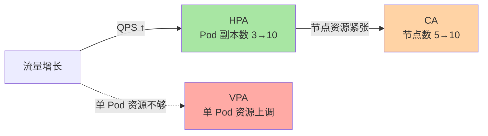
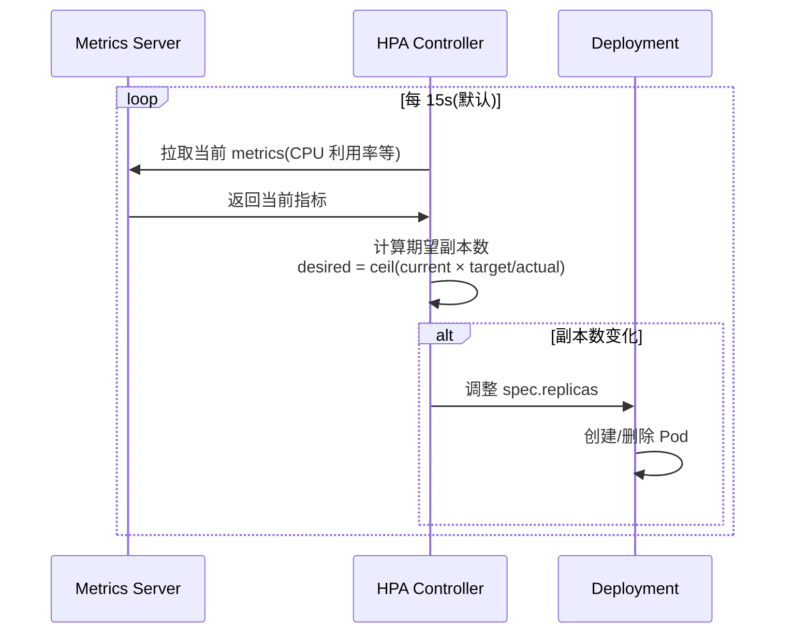
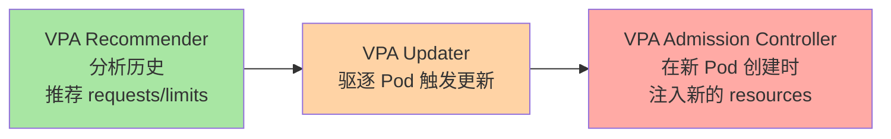
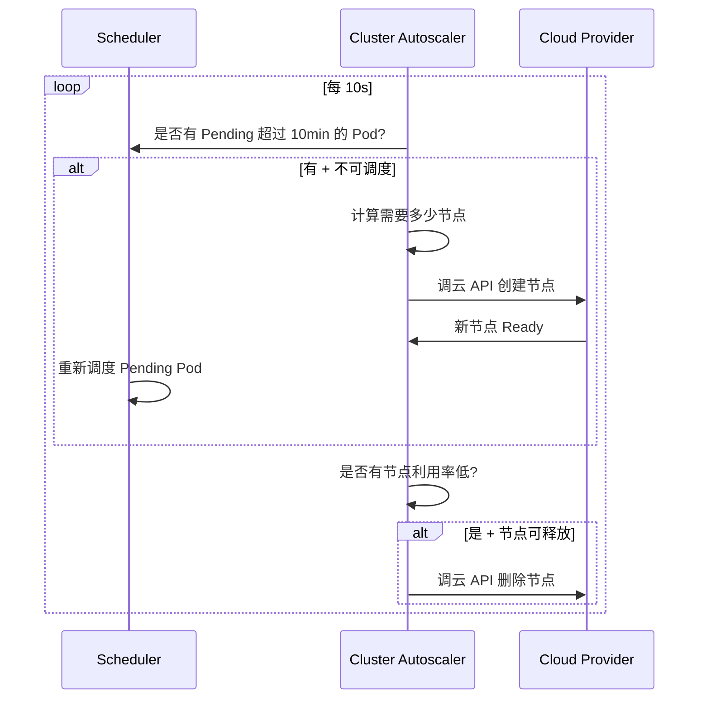
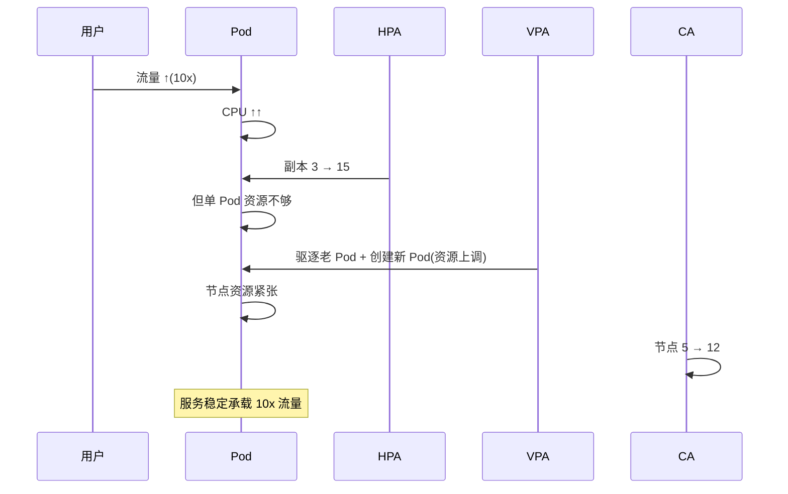
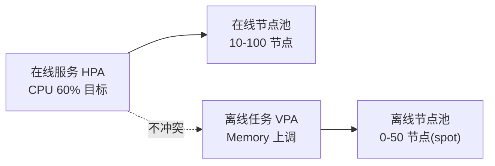

# 弹性伸缩：HPA / VPA / CA 的机制与选型

> K8s 有三种「弹性」——Pod 数伸缩（HPA）、Pod 资源调整（VPA）、节点数伸缩（CA）。它们各管一段、互相协同，但很多人搞混。本篇讲清三者的机制、边界、组合用法。

## 一句话摘要

HPA（Horizontal Pod Autoscaler）调 Pod 副本数；VPA（Vertical Pod Autoscaler）调单个 Pod 的 resources；CA（Cluster Autoscaler）调节点数。三者协同实现「流量增长 → Pod 副本增加 → 单 Pod 资源够用 → 节点不足时扩容节点」的完整闭环。

## 一、三种弹性的层次



| 弹性 | 调节对象 | 调节粒度 | 触发信号 |
|---|---|---|---|
| **HPA** | Pod 副本数 | Deployment/StatefulSet 副本数 | CPU / Memory / 自定义指标 |
| **VPA** | 单 Pod resources | requests/limits 数值 | 历史资源使用率 |
| **CA** | 节点数 | Node 数量 | Pending Pod / 节点利用率低 |

## 二、HPA（Horizontal Pod Autoscaler）

### 2.1 工作机制



**核心公式**：

```
期望副本数 = ceil(当前副本数 × 当前指标 / 目标指标)
```

例：3 副本，目标 CPU 50%，当前 CPU 80% → 期望 = ceil(3 × 80/50) = 5

### 2.2 HPA 三档指标源

| 指标类型 | 数据源 | 典型用途 |
|---|---|---|
| **Resource** | Metrics Server | CPU / Memory 利用率 |
| **Custom** | Prometheus Adapter | QPS / 队列长度 / 业务指标 |
| **External** | External Metrics API | 外部服务指标（如云厂商 LB） |

### 2.3 完整配置示例

```yaml
apiVersion: autoscaling/v2
kind: HorizontalPodAutoscaler
metadata:
  name: web-hpa
spec:
  scaleTargetRef:
    apiVersion: apps/v1
    kind: Deployment
    name: web
  minReplicas: 2
  maxReplicas: 10
  metrics:
  - type: Resource
    resource:
      name: cpu
      target:
        type: Utilization
        averageUtilization: 60        # 目标 CPU 利用率 60%
  - type: Pods
    pods:
      metric:
        name: http_requests_per_second   # 自定义指标
      target:
        type: AverageValue
        averageValue: "1000"             # 每 Pod 1000 QPS
  behavior:                              # 1.18+ 精细化控制
    scaleUp:
      stabilizationWindowSeconds: 30
      policies:
      - type: Percent
        value: 100
        periodSeconds: 30
    scaleDown:
      stabilizationWindowSeconds: 300
      policies:
      - type: Percent
        value: 10
        periodSeconds: 60
```

### 2.4 behavior（K8s 1.18+）

控制 HPA 的「扩缩容节奏」——避免抖动。

| 场景 | 推荐配置 |
|---|---|
| 快速响应（秒杀场景） | scaleUp 快（30s 窗口，100% 一步扩） |
| 防抖（夜间流量低谷） | scaleDown 慢（300s 窗口，10% 每 60s 缩） |

## 三、VPA（Vertical Pod Autoscaler）

### 3.1 与 HPA 的本质区别

**HPA**：副本数不变，单 Pod 资源不变——加副本分担流量
**VPA**：副本数不变，单 Pod 资源变——单 Pod 扛更多流量

### 3.2 VPA 三个组件



**关键流程**：
1. Recommender 跑离线分析（看过去 N 天资源使用率）
2. 给出 recommendations（requests/limits 数值）
3. Updater 驱逐不满足 recommendations 的 Pod
4. 新 Pod 创建时，Admission Controller 注入新 resources

### 3.3 VPA 配置示例

```yaml
apiVersion: autoscaling.k8s.io/v1
kind: VerticalPodAutoscaler
metadata:
  name: web-vpa
spec:
  targetRef:
    apiVersion: apps/v1
    kind: Deployment
    name: web
  updatePolicy:
    updateMode: "Auto"       # Auto / Initial / Off
  resourcePolicy:
    containerPolicies:
    - containerName: '*'
      minAllowed:
        cpu: 100m
        memory: 128Mi
      maxAllowed:
        cpu: 2
        memory: 4Gi
```

### 3.4 VPA 的关键限制

**VPA 与 HPA 在同一个 resource 上不兼容**：

```yaml
# 不能这样：
# HPA 监控 CPU utilization + VPA 调整 CPU requests
# 两者互相干扰，可能死循环
```

**正确组合**：
- HPA 监控 CPU + VPA 监控 Memory
- 或者 HPA 监控自定义指标 + VPA 监控 CPU/Memory

## 四、CA（Cluster Autoscaler）

### 4.1 工作机制



### 4.2 关键参数

```yaml
# cluster-autoscaler Deployment flags
--nodes=1:10:my-node-group       # 节点组范围（最小:最大:节点组名）
--scale-down-delay-after-add=10m # 新节点创建后多久才能被缩
--scale-down-unneeded-time=10m   # 节点空闲多久才被缩
--max-node-provision-time=15m    # 新节点最大创建时间
```

### 4.3 云厂商集成

| 云厂商 | CA 实现 |
|---|---|
| AWS | `k8s.io/aws-cloud-provider` + ASG |
| GCP | `k8s.io/gcp-cloud-provider` + MIG |
| Azure | `k8s.io/azure-cloud-provider` + VMSS |
| 阿里云 | Cluster Autoscaler + ESS |
| 自建 | KubeVirt / 裸金属管理 |

## 五、三者协同

### 5.1 完整闭环



### 5.2 协同配置原则

| 组件 | 调整维度 | 推荐组合 |
|---|---|---|
| **HPA** | 副本数 | 监控 CPU 或 QPS |
| **VPA** | 单 Pod 资源 | 监控 Memory（不与 HPA 冲突） |
| **CA** | 节点数 | 节点组配 min/max |

## 六、典型场景

### 6.1 电商秒杀

```yaml
# HPA：分钟级快速扩容
spec:
  minReplicas: 10
  maxReplicas: 200
  metrics:
  - type: Pods
    pods:
      metric: { name: queue_depth }
      target: { type: AverageValue, averageValue: "10" }
  behavior:
    scaleUp:
      stabilizationWindowSeconds: 15    # 快速扩
      policies:
      - type: Percent
        value: 200                     # 一步扩 200%
        periodSeconds: 15
---
# CA：节点组预留大量缓冲
spec:
  nodes: 10:500:spot-pool             # 10 节点起，500 节点封顶
```

### 6.2 离线批处理

```yaml
# VPA：让单任务用更多资源
spec:
  updatePolicy: { updateMode: Auto }
  resourcePolicy:
    containerPolicies:
    - containerName: '*'
      minAllowed: { cpu: 500m, memory: 1Gi }
      maxAllowed: { cpu: 16, memory: 64Gi }
---
# CA：节点组按需扩
spec:
  nodes: 0:100:batch-pool              # 0 节点起步，按需
```

### 6.3 混合：在线 + 离线



## 七、常见误区

### 7.1 「HPA 一定能扩容」

不对。HPA 要看 metrics 是否可用——CPU 利用率需要 Metrics Server；自定义指标需要 Prometheus Adapter。

### 7.2 「VPA 实时调整」

不对。VPA 是**离线分析**——历史 8 天的 metrics 训练出的 recommendations，调整有延迟。

### 7.3 「CA 扩容快」

不对。CA 扩容依赖云厂商——AWS 通常 1-3 分钟，阿里云 30 秒-2 分钟，**不是秒级**。秒杀场景需要预留 buffer。

### 7.4 「HPA + VPA 一起用最好」

不对。同一个 resource 上不能同时用——会互相干扰。组合方式见 5.2。

## 八、自测三问

1. **HPA 扩容的计算公式是什么？**
   - `期望副本数 = ceil(当前副本数 × 当前指标 / 目标指标)`。

2. **VPA 和 HPA 在 CPU 上的冲突是什么？**
   - VPA 调高 CPU requests → HPA 看到 CPU 利用率变低 → HPA 不扩容 → 流量分担失败。

3. **CA 扩容依赖什么？**
   - 云厂商 API（AWS ASG / GCP MIG / 阿里云 ESS），扩容时间通常 1-3 分钟。**秒杀场景不能依赖 CA 秒级扩容**——需要预留 buffer。

## 📌 数据与事实声明

- 写于 2026-09-07，针对 K8s 1.30+
- HPA 默认同步周期：15s
- CA 默认同步周期：10s
- HPA 公式更新：K8s 1.18+ 引入 tolerance 字段（防抖）
- VPA 当前成熟度：1.0+ GA（部分高级功能 beta）
- 行业认知：HPA + VPA + CA 三件套是大厂标配，但小集群可能只需要 HPA（公开讨论）
- 免责：VPA 与 HPA 兼容性仍在演进

## 📚 参考资料

| 类型 | 标题 | 来源 |
|---|---|---|
| 官方文档 | HPA | kubernetes.io/docs/tasks/run-application/horizontal-pod-autoscale/ |
| 官方文档 | VPA | github.com/kubernetes/autoscaler/tree/master/vertical-pod-autoscaler |
| 官方文档 | CA | github.com/kubernetes/autoscaler/tree/master/cluster-autoscaler |
| 实战 | HPA Walkthrough | kubernetes.io/docs/tasks/run-application/horizontal-pod-autoscale-walkthrough/ |
| 实战 | KEDA（事件驱动） | keda.sh |
