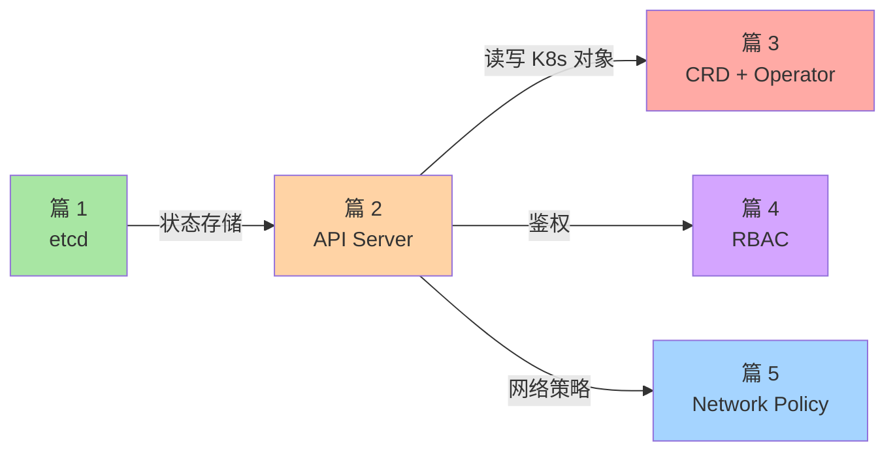

# 核心抽象机制子系列导读：etcd / API Server / CRD 等通用层

> L2 特性层子系列 B 导读。讲清 5 篇核心抽象层之间的关系、与子系列 A 调度的差异、与 K8s 生态扩展的关联。

## 一、这个子系列讲什么

调度子系统是「K8s 怎么把 Pod 放到节点上」，本系列讲的是「K8s 整个系统怎么运作」——通用抽象层：

```
篇 1  etcd 与 K8s 数据一致性         ← K8s 状态怎么存
篇 2  API Server 请求链路深度         ← K8s 所有操作的入口
篇 3  CRD 与 Operator 模式原理       ← K8s 如何无限扩展
篇 4  RBAC 与多租户隔离               ← K8s 权限怎么管
篇 5  Network Policy 与零信任网络     ← K8s 网络怎么隔离
```

## 二、5 篇逻辑关系



读路径：建议先读篇 2（API Server 是入口），其余按需读。

## 三、与子系列 A 的关系

| 子系列 A（调度） | 子系列 B（本系列） |
|---|---|
| 篇 1 Scheduler | → 篇 2 API Server（scheduler 通过 API Server 读写 Pod） |
| 篇 4 Pod 生命周期 | → 篇 1 etcd（Pod 状态存 etcd） |
| — | → 篇 3/4/5 都是 A 未覆盖的 |

## 四、与 L1 入门层的关系

- L1 篇 1 K8s 是什么 → 篇 2 API Server 深挖（深挖「所有操作入口」）
- L1 篇 8 生态分层 → 篇 3 CRD + Operator 深挖（深挖「K8s 为何能无限扩展」）
- L1 篇 5 Service → 篇 5 Network Policy（深挖「服务发现 + 网络隔离」）

## 五、读完后你能做什么

- ✅ 排障 API Server 性能问题（请求堆积、watch 过载）
- ✅ 调优 etcd 性能（存储、压缩、快照）
- ✅ 设计自定义资源（CRD Schema / Operator 模式）
- ✅ 设计多租户 RBAC 权限模型
- ✅ 用 Network Policy 实现网络零信任

## 📌 数据与事实声明

- 写于 2026-09-07，针对 K8s 1.30+
- API Server 当前主流版本：v1.30.x
- etcd 当前主流版本：v3.5.x（K8s 1.30+ 要求 etcd 3.5.4+）
- 免责：CRD/OpenAPI Schema 演进中，具体支持以官方为准

## 📚 参考资料

| 类型 | 标题 | 来源 |
|---|---|---|
| 官方文档 | API Server | kubernetes.io/docs/reference/command-line-tools-reference/kube-apiserver/ |
| 官方文档 | etcd | kubernetes.io/docs/tasks/administer-cluster/configure-upgrade-etcd/ |
| 系列 index | `docs/devops/kubernetes/特性层/深入理解K8s核心特性系列/` | 本仓库 |
