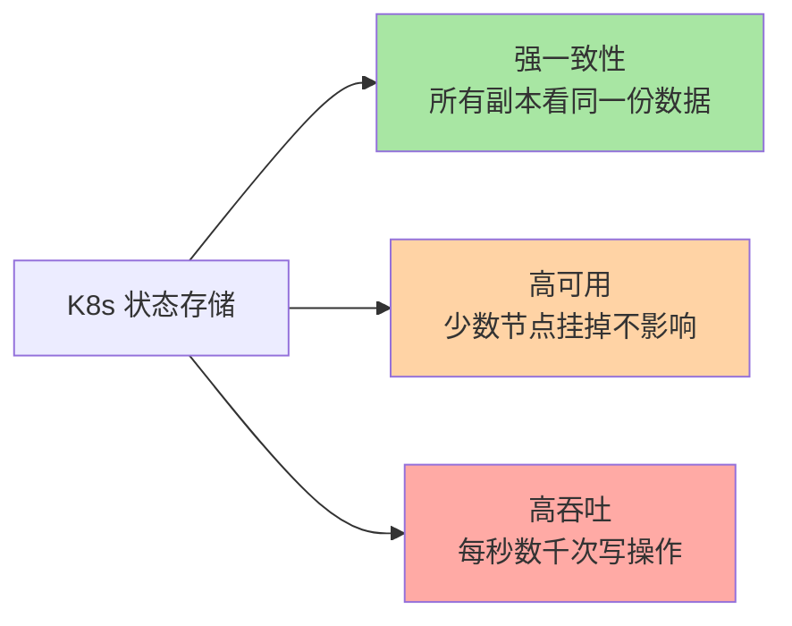
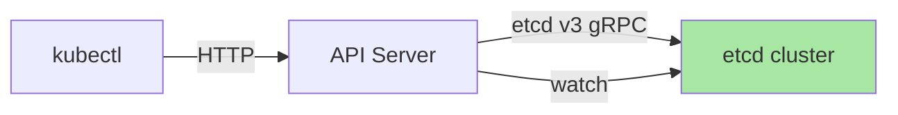
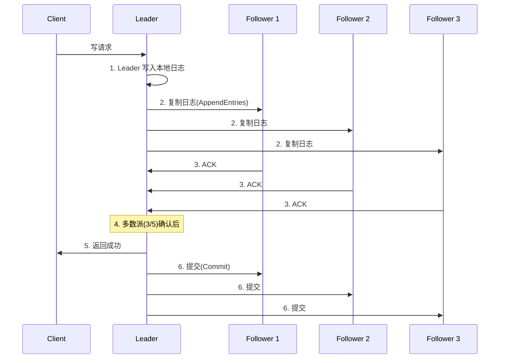
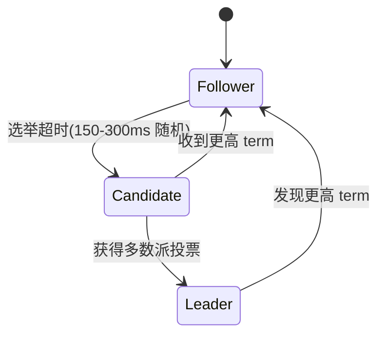
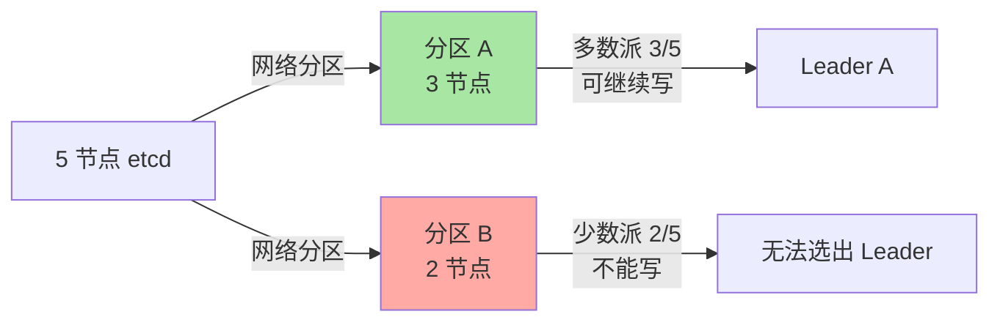
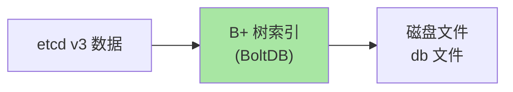
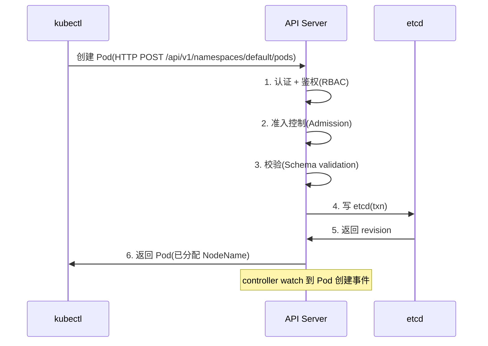
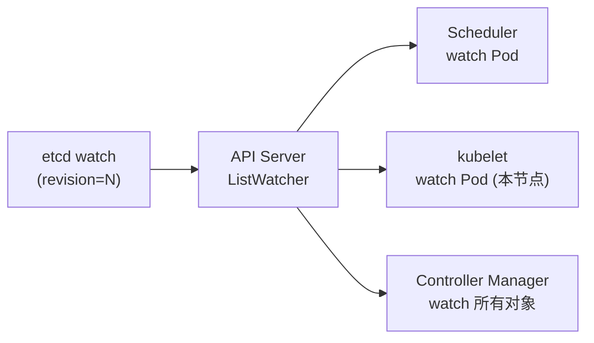
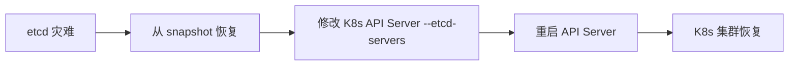

# etcd 与 K8s 数据一致性：Raft 协议与存储真相

> K8s 所有状态都存在 etcd——Pod/Service/Deployment/ConfigMap/一切。本篇讲清三个事：etcd 是什么、为什么选 Raft、K8s 怎么用它。理解 etcd 是理解 K8s 数据一致性和排障「apiserver 不可用」类问题的基础。

## 一句话摘要

etcd 是基于 Raft 共识算法的分布式 KV 存储，K8s 用它做唯一状态存储；所有 K8s 对象通过 API Server 写入 etcd，多副本 etcd 通过 Raft 保证数据一致性；etcd 性能是 K8s 集群性能上限。

## 一、为什么 K8s 选 etcd

### 1.1 K8s 状态存储的三个要求



etcd 是同时满足这三个要求的少数选择：

| 存储 | 强一致性 | 高可用 | K8s 适用 |
|---|---|---|---|
| **etcd** | ✅ Raft | ✅ 多副本 | ✅ 默认选择 |
| **Consul** | ✅ Raft | ✅ 多副本 | 可选 |
| **ZooKeeper** | ✅ ZAB | ✅ 多副本 | 弃用（K8s 1.10+ 不再支持） |
| **MySQL 主从** | 异步复制 | ✅ | ❌ 一致性不满足 |

### 1.2 etcd 在 K8s 架构中的位置



**关键认知**：API Server 是 K8s 的大脑，**etcd 是 K8s 的记忆**。API Server 本身是无状态的，所有状态都在 etcd。

## 二、Raft 共识算法

### 2.1 Raft 是什么

Raft 是一种「分布式一致性算法」——保证多个节点上的数据完全一致。

```
5 节点 etcd 集群
  - 任意时刻有 1 个 Leader（处理写）
  - 其他 4 个 Follower（同步数据）
  - Leader 挂了 → 自动选新 Leader
```

### 2.2 Raft 三阶段



**关键认知**：写操作需要「多数派确认」（3/5、4/7 等）。这就是为什么 etcd 集群推荐 3/5/7 节点（奇数）。

### 2.3 Leader 选举



**选举超时**：每个 Follower 随机设置 150-300ms 超时。第一个超时的 Follower 变 Candidate，发起投票；获得多数派投票的变 Leader。

### 2.4 脑裂与多数派



**关键认知**：网络分区后，少数派节点拒绝写——这是「一致性 vs 可用性」中 K8s 选**一致性**的体现。

## 三、etcd 存储原理

### 3.1 存储引擎：BoltDB

etcd v3 用 BoltDB（基于 mmap 的 B+ 树）存储数据：



**性能特点**：
- 写：fsync 一次磁盘（默认）
- 读：内存缓存 + B+ 树查找
- 典型性能：1000-10000 次写/秒（取决于硬件）

### 3.2 序列化：Protocol Buffers

```bash
# etcd v3 用 protobuf 编码（不是 JSON）
# 优势：二进制更紧凑 + 强类型

etcdctl put /registry/pods/default/web '{"apiVersion":"v1",...}'
# 实际存储是 protobuf 编码的二进制
```

### 3.3 修订版本（revision）

etcd 每次写操作都递增一个全局 revision：

```bash
# 看 etcd 当前 revision
etcdctl endpoint status --write-out=table

# output:
# +------------+------------------+---------+
# | ENDPOINT   |       ID         |  REV    |
# +------------+------------------+---------+
# | 127.0.0.1  | 8211f1d518d3cbe5 | 1234567 |
# +------------+------------------+---------+
```

K8s watch 就是基于 revision 实现「增量事件流」。

## 四、K8s 怎么用 etcd

### 4.1 数据布局

```bash
# etcd 中所有 K8s 对象的 key 格式
/registry/<资源类型>/<namespace>/<name>

# 例子：
/registry/pods/default/web
/registry/services/default/web
/registry/deployments/default/web
/registry/configmaps/default/app-config
```

### 4.2 API Server 的读写路径



### 4.3 Watch 机制

API Server 持续 watch etcd，把 etcd 事件流转换为 K8s 事件流：



**关键认知**：API Server 是**唯一的 etcd 客户端**——所有 K8s 组件不直接连 etcd。

## 五、etcd 运维关键点

### 5.1 推荐集群规模

| 集群规模 | etcd 节点数 | 理由 |
|---|---|---|
| < 100 节点 K8s | 3 节点 | 容忍 1 节点故障 |
| 100-500 节点 | 5 节点 | 容忍 2 节点故障 |
| > 500 节点 | 5-7 节点 | 更高可用 |

**为什么是奇数**：3 节点容忍 1 故障（剩余 2/3 是多数派）；4 节点容忍 1 故障（剩余 3/4 也是多数派，但成本更高）。**奇数节点 = 同样的可用性 + 更低成本**。

### 5.2 性能调优

```bash
# 1. 磁盘：必须用 SSD（HDD 性能差 10 倍）
# 2. IO 调度器：noop / deadline（不要 cfq）
# 3. fsync：默认 fsync=1（每次写都落盘）
# 4. compact：定期压缩历史 revision
etcdctl compact <revision>

# 5. defrag：碎片整理
etcdctl defrag
```

### 5.3 备份与恢复

```bash
# 备份
ETCDCTL_API=3 etcdctl snapshot save /backup/snap.db

# 恢复
ETCDCTL_API=3 etcdctl snapshot restore /backup/snap.db \
  --data-dir=/var/lib/etcd-restore
```

**注意**：恢复需要停 K8s 控制平面，因为 etcd 是 K8s 状态源。

## 六、典型场景

### 6.1 排障「API Server 不可用」

```bash
# 1. 检查 etcd 健康
etcdctl endpoint health
etcdctl endpoint status --write-out=table

# 2. 检查磁盘空间
df -h /var/lib/etcd

# 3. 检查 fsync 延迟（如果 > 10ms 就要警惕）
etcdctl endpoint status --write-out=json | grep latency
```

### 6.2 升级 etcd

```bash
# 1. 备份
ETCDCTL_API=3 etcdctl snapshot save snap.db

# 2. 升级 etcd 二进制（逐节点滚动升级）

# 3. 验证
etcdctl endpoint health
```

### 6.3 灾难恢复



## 七、自测三问

1. **etcd 为什么必须用奇数节点？**
   - Raft 多数派要求：3 节点容忍 1 故障，5 节点容忍 2 故障——奇数节点 = 同样的可用性 + 更低成本。

2. **API Server 和 etcd 的关系是什么？**
   - API Server 是 etcd 的**唯一客户端**；所有 K8s 组件不直接连 etcd；K8s 所有状态都由 API Server 写 eted。

3. **K8s 集群性能瓶颈通常在哪？**
   - etcd——所有 K8s 操作都要走 etcd；etcd 的 fsync 延迟、磁盘 IO 是集群性能上限。

## 📌 数据与事实声明

- 写于 2026-09-07，针对 K8s 1.30+ / etcd 3.5+
- K8s 1.30 要求 etcd ≥ 3.5.4
- etcd 典型性能：1000-10000 写/秒
- 行业认知：etcd 是 K8s 集群最关键的组件（公开讨论）
- 免责：etcd 版本演进中，具体兼容性看官方支持矩阵

## 📚 参考资料

| 类型 | 标题 | 来源 |
|---|---|---|
| 官方文档 | etcd | etcd.io/docs |
| 官方文档 | Operating etcd | kubernetes.io/docs/tasks/administer-cluster/configure-upgrade-etcd/ |
| 论文 | In Search of an Understandable Consensus Algorithm (Raft) | raft.github.io/raft.pdf |
| 实战 | etcd Backup & Restore | kubernetes.io/docs/tasks/administer-cluster/configure-upgrade-etcd/#backing-up-an-etcd-cluster |
