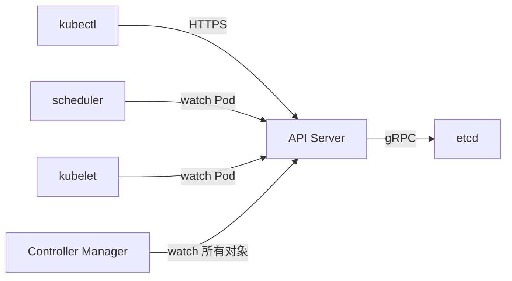
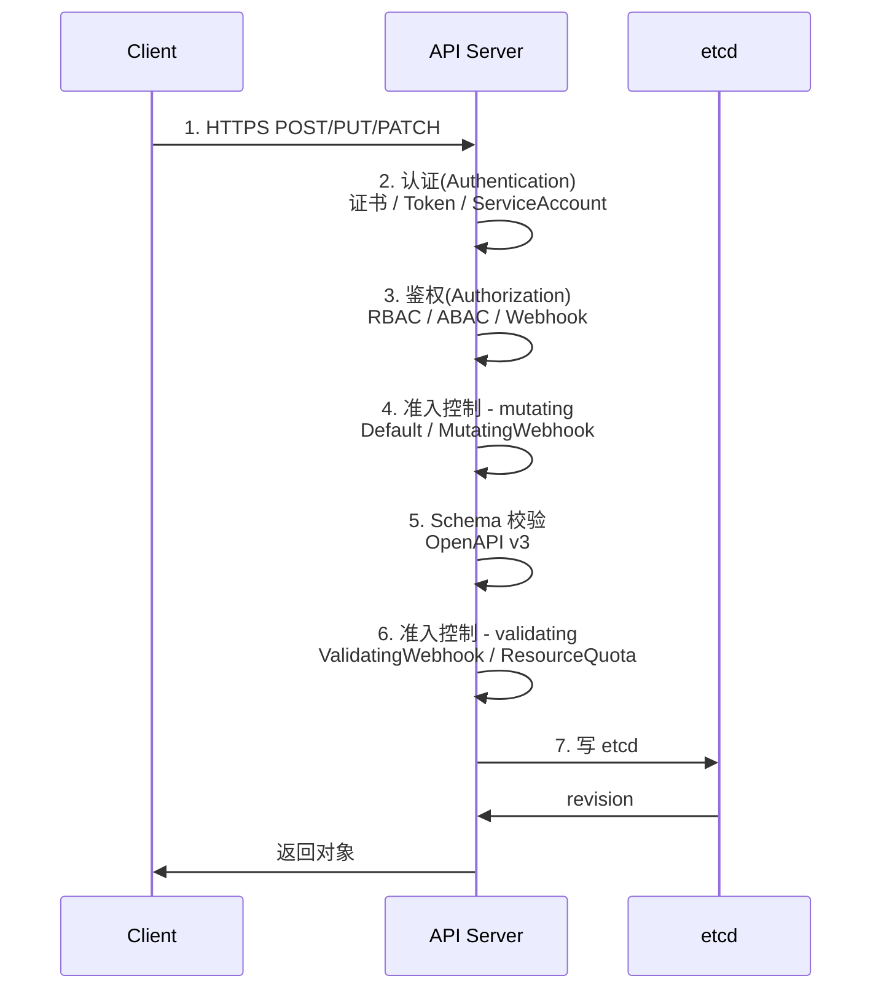
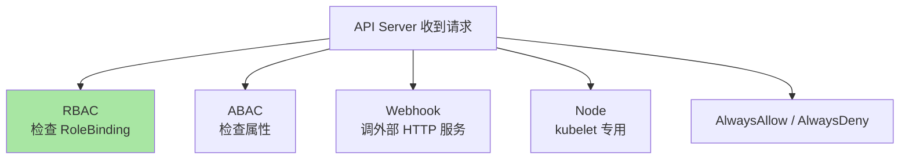
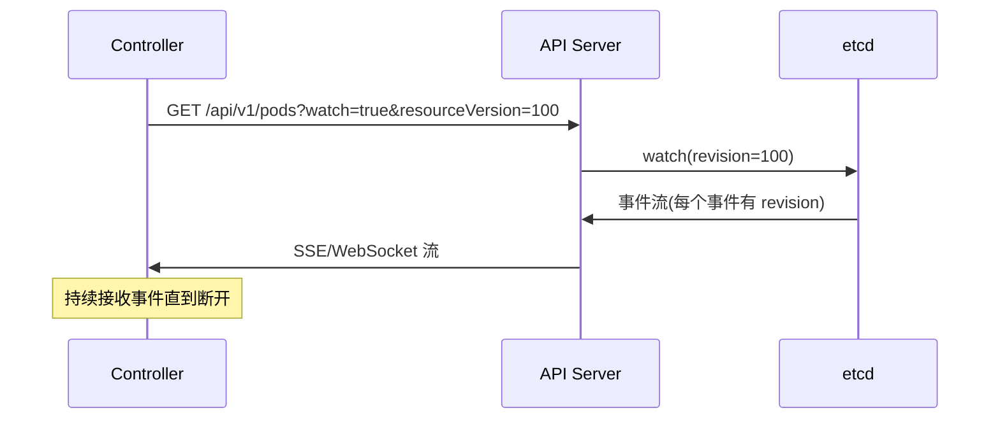
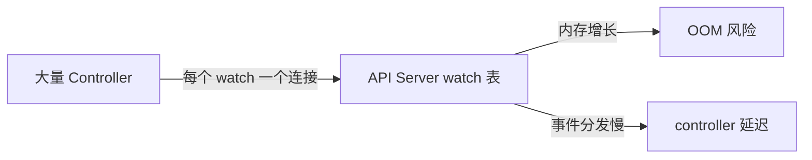

# API Server 请求链路深度：从 HTTP 到 etcd 的 7 个阶段

> API Server 是 K8s 所有操作的唯一入口——kubectl/Controller/scheduler/watch 都通过它。本篇拆解一个 HTTP 请求到 etcd 写入的完整 7 阶段链路，理解后能排障「API Server 卡顿」「准入控制失败」「watch 延迟」等问题。

## 一句话摘要

API Server 处理每个请求走 7 个阶段：认证 → 鉴权 → 准入控制（mutating） → Schema 校验 → 准入控制（validating） → 写 etcd → 返回；任何一个阶段失败都拒绝请求；性能瓶颈通常在准入控制和 watch 流。

## 一、为什么需要深入 API Server

### 1.1 API Server 是 K8s 唯一入口



**关键认知**：所有 K8s 组件都通过 API Server；**没有任何组件直接连 etcd**。

### 1.2 常见 API Server 问题

| 症状 | 根因 |
|---|---|
| kubectl 命令卡顿 | 准入控制慢 / watch 流堆积 |
| Pod 创建失败 | 准入控制拒绝 / Schema 不合法 |
| controller 频繁 reconcile | watch 事件丢失 / etcd revision 不连续 |
| API Server OOM | watch 数过多 / 内存泄漏 |

## 二、请求链路 7 个阶段



### 2.1 认证（Authentication）

回答：**你是谁？**

```bash
# K8s 支持的认证方式
1. X.509 客户端证书（最常用）
2. Bearer Token（ServiceAccount / 手动 Token）
3. OpenID Connect（OIDC）
4. Webhook Token Authentication
5. Anonymous（默认禁用）
```

**机制**：
- 客户端发送请求时带证书或 Token
- API Server 用配置的 Authn Provider 验证
- 验证成功 → 把 `system:authenticated` 等 group 关联到请求 context

### 2.2 鉴权（Authorization）

回答：**你能做什么？**



**RBAC 是默认**——Role + RoleBinding（namespace 内）或 ClusterRole + ClusterRoleBinding（集群级）。

### 2.3 准入控制 - Mutating

回答：**在保存前修改对象**

```yaml
# K8s 内置的 Mutating 准入控制
- NamespaceLifecycle
- LimitRanger
- ServiceAccount
- DefaultStorageClass
- DefaultTolerationSeconds
- MutatingAdmissionWebhook    # 调用外部 webhook
```

**典型用途**：自动注入 sidecar、自动添加 annotations、修改 resources 默认值。

### 2.4 Schema 校验

回答：**对象是否符合 API 定义**

```yaml
# OpenAPI v3 schema 定义（从 CRD spec 生成）
# 例如 Deployment 的 schema 要求 spec.replicas 是 integer
# 传 "abc" 会被拒
```

### 2.5 准入控制 - Validating

回答：**最终业务规则校验**

```yaml
# K8s 内置的 Validating 准入控制
- ResourceQuota         # 检查 namespace 资源配额
- LimitRanger           # 检查 LimitRange 约束
- PodSecurityPolicy     # PSP（已弃用，被 PSS 取代）
- ValidatingAdmissionWebhook  # 调用外部 webhook
```

### 2.6 写 etcd

```go
// 简化版核心调用
func (a *API Server) writePod(obj *Pod) error {
    key := "/registry/pods/" + obj.Namespace + "/" + obj.Name
    value := marshal(obj)
    return a.etcd.Txn().Then(
        clientv3.OpPut(key, value),
    ).Commit()
}
```

**关键认知**：所有写都是 etcd transaction；API Server 是**唯一**能写 etcd 的组件。

### 2.7 返回对象

API Server 返回的对象包含：
- `metadata.resourceVersion`（etcd revision）
- `metadata.uid`（K8s 内部 UID）

Client 可用 `resourceVersion` 做乐观锁：
```bash
# 乐观锁更新（避免冲突）
kubectl replace -f pod.yaml \
  --server-dry-run \
  --validate=true
```

## 三、Watch 机制深度

### 3.1 Watch 是什么



### 3.2 Watch 三种场景

| 场景 | 行为 |
|---|---|
| `?watch=true&resourceVersion=0` | 从最新事件开始（丢弃历史） |
| `?watch=true&resourceVersion=N` | 从指定 revision 开始（N 太旧会报错） |
| `?watch=true`（无 resourceVersion） | 同 resourceVersion=0 |

### 3.3 Watch 性能问题



**关键参数**：

```yaml
# kube-apiserver flags
--max-requests-inflight=400         # 总请求数（含读/写）
--max-mutating-requests-inflight=200 # 写请求数
--watch-cache-sizes=pod#1000        # 每种对象的 watch 缓存大小
```

## 四、性能调优

### 4.1 请求优先级与公平性

```yaml
# kube-apiserver flags
--enable-priority-fairness=true
```

K8s 1.22+ 默认启用 Priority & Fairness——不同请求有不同优先级，避免单个客户端占用过多带宽。

### 4.2 常见性能陷阱

| 陷阱 | 表现 | 解决 |
|---|---|---|
| watch 数过多 | API Server 内存增长 | 减少 controller 数 / 合并 watch |
| 准入控制 webhook 慢 | 所有写请求延迟 | webhook 必须快（< 1s） |
| ResourceQuota 多 | 写入路径长 | 用 LimitRange 替代 |
| 大对象（CRD 嵌套深） | 反序列化慢 | 拆分 CRD / 减少嵌套 |

### 4.3 监控指标

```promql
# API Server QPS
apiserver_request_total

# 99% 延迟
histogram_quantile(0.99, apiserver_request_duration_seconds_bucket)

# watch 数
apiserver_registered_watchers

# etcd 写入延迟
etcd_disk_wal_fsync_duration_seconds
```

## 五、源码关键路径

```
k8s.io/kubernetes/pkg/registry/core/pod/storage/
├── storage.go                    # PodStorage.Create / Update / Delete
├── rest.go                       # REST handler 注册
└── ...
k8s.io/kubernetes/pkg/kubeapiserver/
├── server.go                     # API Server 启动
└── filters/                      # 认证 / 鉴权 / 准入 chain
```

**核心调用栈**：

```
HTTP request →
  Authentication filter →
  Authorization filter →
  Admission chain (mutating) →
  Object validation →
  Admission chain (validating) →
  Storage.Create/Update →
  etcd txn
```

## 六、典型场景

### 6.1 排障「kubectl apply 卡住」

```bash
# 1. 看 API Server 日志
kubectl logs -n kube-system kube-apiserver-master | tail -50

# 2. 看 watch 数
curl -k https://localhost:6443/metrics | grep apiserver_registered_watchers

# 3. 看准入控制延迟
curl -k https://localhost:6443/metrics | grep admission
```

### 6.2 排障「准入控制拒绝」

```bash
# 输出常见：
Error from server (Forbidden): ... admission webhook "my-webhook" denied the request

# 解决：
# 1. 检查 webhook 是否可达
# 2. 检查 webhook 响应时间
# 3. 检查 webhook 失败策略（Fail vs Ignore）
```

### 6.3 调优 watch 性能

```bash
# 减少 watch 数：
# - 不要每个 controller 都 watch 所有 Pod
# - 用 labelSelector 缩小 watch 范围
# - 用 SharedInformer 共享 watch
```

## 七、自测三问

1. **认证和鉴权的区别？**
   - 认证（Authentication）回答「你是谁」——证书/Token 验证；鉴权（Authorization）回答「你能做什么」——RBAC 权限检查。

2. **Mutating 和 Validating 准入控制的区别？**
   - Mutating 在保存前**修改**对象（如注入 sidecar）；Validating 只**校验**是否合法（不修改）。两者都要执行。

3. **API Server 性能瓶颈通常在哪？**
   - watch 表（大量 controller）+ 准入控制 webhook + etcd 写延迟——监控看 `apiserver_request_duration_seconds` 与 `etcd_disk_wal_fsync_duration_seconds`。

## 📌 数据与事实声明

- 写于 2026-09-07，针对 K8s 1.30+
- Priority & Fairness GA：K8s 1.22（2021-08）
- API Server 默认最大并发读：400 请求；写：200 请求
- 行业认知：API Server 是 K8s 集群的「中央调度」，性能瓶颈通常在 watch 数（公开讨论）
- 免责：内置准入控制列表演进中（PSP 已弃用，被 PodSecurity 取代）

## 📚 参考资料

| 类型 | 标题 | 来源 |
|---|---|---|
| 官方文档 | kube-apiserver | kubernetes.io/docs/reference/command-line-tools-reference/kube-apiserver/ |
| 官方文档 | API Access Control | kubernetes.io/docs/reference/access-authn-authz/ |
| 官方文档 | Admission Controllers | kubernetes.io/docs/reference/access-authn-authz/admission-controllers/ |
| 实战 | API Server Performance | kubernetes.io/docs/reference/using-api/api-concepts/ |
