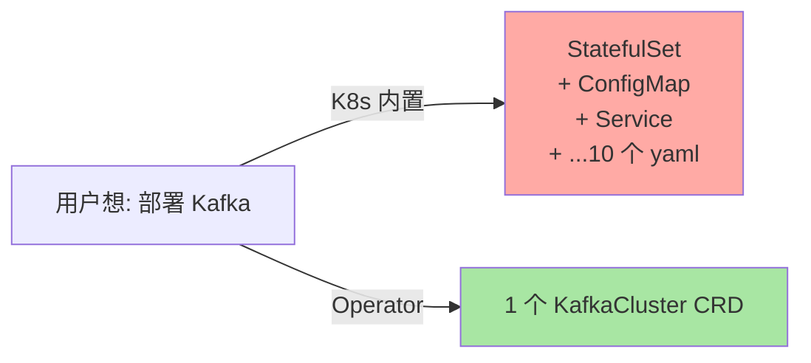
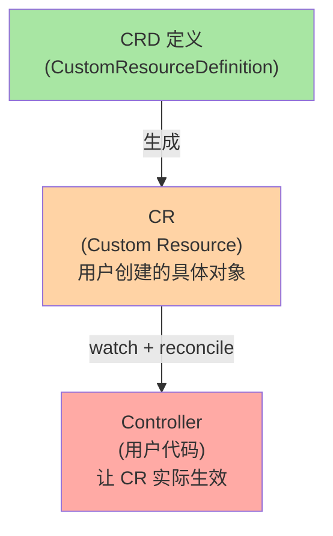
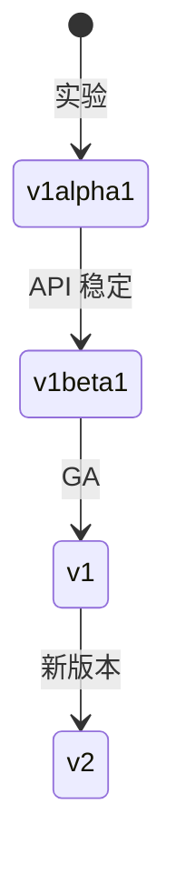
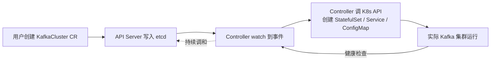
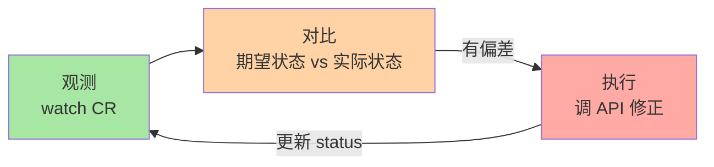
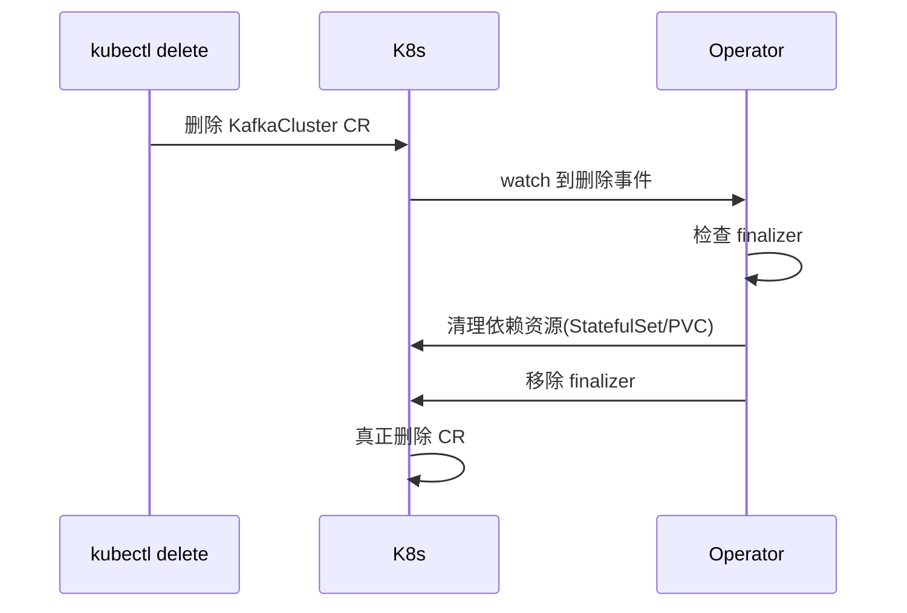

# CRD 与 Operator 模式原理：K8s 扩展的真相

> K8s 自身只内置 30+ 资源（Pod/Service/Deployment 等）。但你看到的 Prometheus Operator、Istio、Kafka Operator 等都是「自定义资源 + 控制器」——这就是 CRD + Operator。本篇讲清三个事：CRD 是什么、Operator 怎么工作、什么时候该自己写。

## 一句话摘要

CRD（Custom Resource Definition）扩展 K8s API，定义新资源类型；Operator = 自定义资源 + 自定义控制器，把领域知识封装为 K8s 控制器，实现「用 K8s 风格管理任何应用」；Operator SDK/Kubebuilder 是开发框架。

## 一、为什么需要 CRD + Operator

### 1.1 内置资源的局限

K8s 内置资源都是「通用」的：

| 资源 | 抽象什么 |
|---|---|
| Pod | 容器组 |
| Service | 服务发现 |
| Deployment | 无状态副本 |
| StatefulSet | 有状态副本 |
| ConfigMap | 配置 |
| Secret | 密钥 |

但**专业领域**（数据库、消息队列、服务网格、AI 平台）需要复杂的状态管理——单纯的内置资源不够：



**Operator 的价值**：把领域知识封装，让用户「一行命令」就能跑复杂应用。

### 1.2 Operator 生态现状

| 领域 | 代表 Operator |
|---|---|
| **数据库** | postgres-operator / mysql-operator / mongodb-operator |
| **消息** | Strimzi (Kafka) / RabbitMQ Operator / NATS Operator |
| **可观测** | Prometheus Operator / Grafana Operator |
| **证书** | cert-manager |
| **GitOps** | Argo CD Operator / Flux Operator |
| **AI** | Kubeflow / Ray Operator / Volcano |
| **存储** | Rook (Ceph) / MinIO Operator |
| **Ingress** | Nginx Ingress Operator / Traefik Operator |

**行业认知**：CNCF 毕业 Operator 项目 ~30+，活跃项目 ~100+（公开统计）。

## 二、CRD：扩展 API

### 2.1 CRD 是什么

```yaml
apiVersion: apiextensions.k8s.io/v1
kind: CustomResourceDefinition
metadata:
  name: kafkaclusters.kafka.example.com
spec:
  group: kafka.example.com       # API group
  names:
    kind: KafkaCluster
    plural: kafkaclusters
    singular: kafkaCluster
    shortNames: [kc]
  scope: Namespaced             # Namespaced or Cluster
  versions:
  - name: v1
    served: true                # 启用此版本
    storage: true               # 存储为该版本
    schema:
      openAPIV3Schema:
        type: object
        properties:
          spec:
            type: object
            properties:
              brokers:
                type: integer
                minimum: 1
                maximum: 10
              storageSize:
                type: string
              version:
                type: string
```

**效果**：用户可以使用 `kubectl get kafkaclusters`、`kubectl apply -f kafka.yaml`——就像内置资源一样。

### 2.2 CRD 的三层概念



| 概念 | 角色 | 比喻 |
|---|---|---|
| **CRD** | 定义资源类型（schema） | 「数据库表结构」 |
| **CR** | 资源实例（具体数据） | 「数据库一行记录」 |
| **Controller** | 控制器（让 CR 生效） | 「数据库触发器」 |

### 2.3 CRD 版本演进



**推荐**：用 v1 起手，alpha 仅用于实验。

### 2.4 OpenAPI Schema 校验

```yaml
# CRD schema 会被 API Server 用 OpenAPI v3 校验
# 用户提交的对象不符合 schema → 写入拒绝
spec:
  versions:
  - name: v1
    schema:
      openAPIV3Schema:
        properties:
          spec:
            properties:
              replicas:
                type: integer
                minimum: 1
                maximum: 100
```

## 三、Operator 模式：控制循环

### 3.1 Operator = CRD + Controller



### 3.2 控制循环（Control Loop）



```go
// 简化版 Reconciler
func (r *KafkaClusterReconciler) Reconcile(ctx context.Context, req ctrl.Request) (ctrl.Result, error) {
    // 1. 拿到期望状态（CR）
    var kc v1.KafkaCluster
    if err := r.Get(ctx, req.NamespacedName, &kc); err != nil {
        return ctrl.Result{}, client.IgnoreNotFound(err)
    }

    // 2. 拿到实际状态（StatefulSet）
    var sts appsv1.StatefulSet
    if err := r.Get(ctx, req.NamespacedName, &sts); err != nil {
        // 不存在 → 创建
        sts = newStatefulSetForKafka(&kc)
        r.Create(ctx, &sts)
    }

    // 3. 对比偏差
    if *sts.Spec.Replicas != kc.Spec.Brokers {
        sts.Spec.Replicas = &kc.Spec.Brokers
        r.Update(ctx, &sts)
        return ctrl.Result{Requeue: true}, nil
    }

    return ctrl.Result{}, nil
}
```

### 3.3 status 子资源

```yaml
apiVersion: kafka.example.com/v1
kind: KafkaCluster
metadata:
  name: my-kafka
spec:
  brokers: 3
status:                          # status 由 Controller 更新
  brokers:
  - id: 0
    state: Ready
    endpoint: my-kafka-0.kafka:9092
  - id: 1
    state: Ready
  - id: 2
    state: NotReady               # 还没起来
  phase: Reconciling
```

**spec vs status**：
- spec = 用户期望（用户写）
- status = 控制器报告的实际状态（Controller 写）

## 四、Operator 开发框架

### 4.1 三大框架对比

| 框架 | 语言 | 特点 |
|---|---|---|
| **Kubebuilder** | Go | 官方推荐，go.mod 原生 |
| **Operator SDK** | Go / Ansible / Helm | Red Hat 维护，多语言 |
| **Metacontroller** | 任意语言 | 用 Webhook 实现控制器 |

### 4.2 Kubebuilder 项目结构

```
my-operator/
├── api/
│   └── v1/
│       ├── kafka_types.go        # CRD 类型定义
│       ├── groupversion_info.go  # API group/version
│       └── zz_generated.deepcopy.go  # 自动生成
├── controllers/
│   └── kafka_controller.go        # Reconciler
├── config/
│   ├── default/                  # 默认部署配置
│   ├── rbac/                     # RBAC 权限
│   └── manager/                  # Controller Manager
└── main.go                       # 入口
```

### 4.3 核心开发流程

```bash
# 1. 初始化项目
kubebuilder init --domain example.com

# 2. 创建 API
kubebuilder create api \
  --group kafka \
  --version v1 \
  --kind KafkaCluster

# 3. 编辑 types 和 controller 代码

# 4. 生成 CRD 和 RBAC
make manifests

# 5. 本地测试
make run

# 6. 部署
make deploy
```

## 五、Operator 高级模式

### 5.1 多实例协作：Leader Election

```go
// Operator 通常部署多个副本避免单点故障
// 但同时只能有一个 active reconcile（避免冲突）
func main() {
    mgr, _ := ctrl.NewManager(...)
    mgr.Start(ctrl.SetupSignalHandler())  // 内置 Leader Election
}
```

### 5.2 Webhook 准入控制

```go
// ValidatingWebhook: 校验 CR 是否合法
// MutatingWebhook: 自动填充 CR 默认值

type KafkaClusterDefaulter struct{}

func (d *KafkaClusterDefaulter) Default(ctx context.Context, obj runtime.Object) error {
    kc := obj.(*v1.KafkaCluster)
    if kc.Spec.Brokers == 0 {
        kc.Spec.Brokers = 3   // 默认 3 副本
    }
    return nil
}
```

### 5.3 Finalizer 与级联删除



**为什么需要 Finalizer**：避免「删了 CR 但依赖资源还在」的孤儿资源。

## 六、典型场景

### 6.1 用 Operator 部署 Kafka

```yaml
# 用户只写一个 CR
apiVersion: kafka.strimzi.io/v1beta2
kind: Kafka
metadata:
  name: my-cluster
spec:
  kafka:
    replicas: 3
    listeners:
      - name: plain
        port: 9092
  zookeeper:
    replicas: 3
---
# Operator 自动创建：StatefulSet + Service + ConfigMap + PDB + ...
```

### 6.2 用 cert-manager 申请证书

```yaml
apiVersion: cert-manager.io/v1
kind: Certificate
metadata:
  name: my-cert
spec:
  secretName: my-tls
  dnsNames:
  - example.com
  issuerRef:
    name: letsencrypt
    kind: ClusterIssuer
---
# cert-manager Controller 申请证书 + 写入 Secret
```

### 6.3 用 Prometheus Operator 抓取指标

```yaml
apiVersion: monitoring.coreos.com/v1
kind: ServiceMonitor
metadata:
  name: my-app
spec:
  selector:
    matchLabels:
      app: my-app
  endpoints:
  - port: metrics
    interval: 30s
```

## 七、自测三问

1. **CRD 和 Controller 的关系是什么？**
   - CRD 定义资源类型（schema）；Controller 监听 CR 并让其实际生效。两者必须配对——没有 Controller 的 CRD 就是「空架子」，没有 CRD 的 Controller 没有「自定义资源」概念。

2. **spec 和 status 字段的本质区别？**
   - spec 是用户期望（用户写）；status 是控制器报告的实际状态（Controller 写）。两者分离避免用户误改状态。

3. **Finalizer 解决什么问题？**
   - 解决「级联删除」——删除 CR 时确保依赖资源（StatefulSet/PVC）也被清理，避免孤儿资源。

## 📌 数据与事实声明

- 写于 2026-09-07，针对 K8s 1.30+
- CRD GA：K8s 1.16（2019-10），结构化 schema + status 子资源 + validation
- Operator SDK 当前版本：v1.x
- Kubebuilder 当前版本：v3.x
- 行业认知：Operator 已成为「复杂应用上 K8s」的标准模式（公开讨论）
- 免责：Operator SDK / Kubebuilder 版本演进快

## 📚 参考资料

| 类型 | 标题 | 来源 |
|---|---|---|
| 官方文档 | CRD | kubernetes.io/docs/tasks/extend-kubernetes/custom-resources/custom-resource-definitions/ |
| 官方文档 | Operator Pattern | kubernetes.io/docs/concepts/extend-kubernetes/operator/ |
| Kubebuilder | book.kubebuilder.io | book.kubebuilder.io |
| Operator SDK | sdk.operatorframework.io | sdk.operatorframework.io |
| 实战 | Sample Operators | github.com/operator-framework/awesome-operators |
