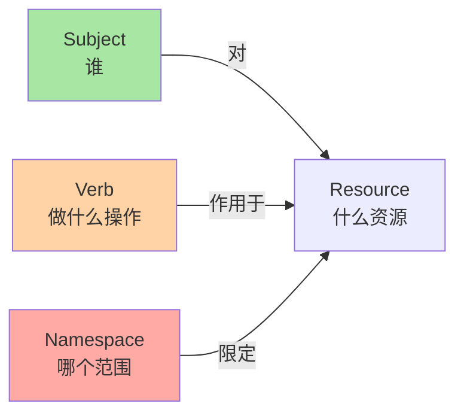
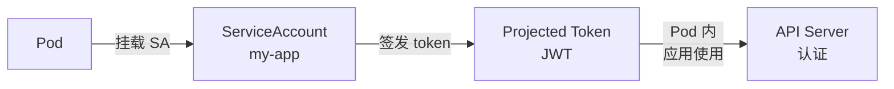
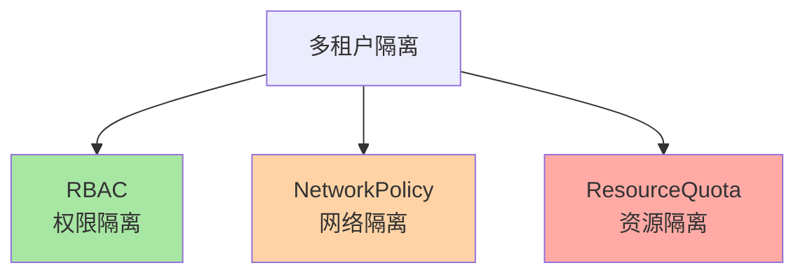
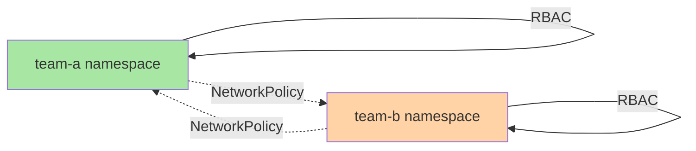

# RBAC 与多租户隔离：权限模型的真相

> K8s 默认权限模型是 RBAC——谁（Subject）能对哪些资源（Resource）做哪些操作（Verb）。本篇讲清 4 个角色（ServiceAccount/User/Group/Node）、3 个抽象（Role/ClusterRole/Binding）、多租户隔离的设计思路。

## 一句话摘要

RBAC 通过 Subject（谁）+ Resource（什么）+ Verb（做什么）+ Namespace（哪个范围）四元组控制权限；Role/RoleBinding 是 namespace 内，ClusterRole/ClusterRoleBinding 是集群级；多租户隔离依赖 RBAC + NetworkPolicy + ResourceQuota 三件套。

## 一、为什么需要 RBAC

### 1.1 默认权限：太宽松

K8s 默认所有 ServiceAccount 没有任何权限——Pod 必须显式挂载 ServiceAccount 才能调 API。但**默认 RBAC 配置 + 默认 ServiceAccount 仍可能有权限漏洞**。

### 1.2 真实场景：多团队共享集群

```
10 个开发团队 → 共享 1 个 K8s 集群
   ↓
team-a 不应能删 team-b 的 Deployment
team-c 不应能读 finance 命名空间的 Secret
   ↓
RBAC 解决「谁能做什么」
```

## 二、RBAC 四元组



### 2.1 Subject（谁）

| Subject | 含义 | 典型场景 |
|---|---|---|
| **User** | 真实用户（人） | 开发者、运维 |
| **Group** | 用户组 | 整个 team、OIDC group |
| **ServiceAccount** | Pod 内的身份 | 应用访问 K8s API |
| **Node** | 节点 | kubelet 访问 API |

### 2.2 Resource（什么资源）

K8s 内置资源 + CRD 都是 resource：

```bash
# 内置资源
pods, services, deployments, configmaps, secrets, ...

# CRD 资源（用户定义的）
kafkaclusters.kafka.example.com
certificates.cert-manager.io
```

### 2.3 Verb（操作）

| Verb | 含义 |
|---|---|
| `get` | 读单个 |
| `list` | 读列表 |
| `watch` | 订阅事件 |
| `create` | 创建 |
| `update` | 更新 |
| `patch` | 部分更新 |
| `delete` | 删除单个 |
| `deletecollection` | 删除多个 |

### 2.4 Namespace（范围）

- Role + RoleBinding = namespace 内权限
- ClusterRole + ClusterRoleBinding = 集群级权限

## 三、Role 与 ClusterRole

### 3.1 Role（namespace 内）

```yaml
apiVersion: rbac.authorization.k8s.io/v1
kind: Role
metadata:
  name: pod-reader
  namespace: default
rules:
- apiGroups: [""]             # 核心 API group
  resources: ["pods"]
  verbs: ["get", "list", "watch"]
- apiGroups: ["apps"]
  resources: ["deployments"]
  verbs: ["get", "list"]
```

### 3.2 ClusterRole（集群级）

```yaml
apiVersion: rbac.authorization.k8s.io/v1
kind: ClusterRole
metadata:
  name: secret-reader
rules:
- apiGroups: [""]
  resources: ["secrets"]
  verbs: ["get"]              # 集群级，能读所有 namespace 的 secret
```

**关键认知**：ClusterRole 也可被 RoleBinding 引用——用来**复用规则**到某个 namespace。

## 四、Binding：把权限授予 Subject

### 4.1 RoleBinding（namespace 内）

```yaml
apiVersion: rbac.authorization.k8s.io/v1
kind: RoleBinding
metadata:
  name: read-pods
  namespace: default
subjects:
- kind: User                  # 用户
  name: jane
  apiGroup: rbac.authorization.k8s.io
- kind: ServiceAccount         # ServiceAccount
  name: my-app
  namespace: default
roleRef:
  kind: Role
  name: pod-reader
  apiGroup: rbac.authorization.k8s.io
```

### 4.2 ClusterRoleBinding（集群级）

```yaml
apiVersion: rbac.authorization.k8s.io/v1
kind: ClusterRoleBinding
metadata:
  name: read-secrets-cluster
subjects:
- kind: Group
  name: manager               # 整个 manager 组
  apiGroup: rbac.authorization.k8s.io
roleRef:
  kind: ClusterRole
  name: secret-reader
  apiGroup: rbac.authorization.k8s.io
```

## 五、ServiceAccount 深度

### 5.1 什么是 ServiceAccount



**关键认知**：ServiceAccount 是**Pod 内的身份**——给 Pod 一个身份，让 Pod 能调 API。

### 5.2 K8s 1.24+ 重大变化

```bash
# K8s 1.24 前：ServiceAccount 自动创建 long-lived token
# K8s 1.24 后：默认不创建 token，Pod 通过 TokenRequest API 申请 short-lived token
```

```yaml
# 1.24+ 用 projected volume 挂载 SA token
spec:
  serviceAccountName: my-app
  containers:
  - name: app
    volumeMounts:
    - name: sa-token
      mountPath: /var/run/secrets/kubernetes.io/serviceaccount
      readOnly: true
  volumes:
  - name: sa-token
    projected:
      sources:
      - serviceAccountToken:
          audience: api
          expirationSeconds: 3600   # 1 小时过期
          path: token
```

### 5.3 Pod 内应用如何调 API

```python
# Python 客户端示例
from kubernetes import client, config

# 1. 加载集群内 config（自动用 SA token）
config.load_incluster_config()

# 2. 创建 API 客户端
v1 = client.CoreV1Api()

# 3. 列 Pod
pods = v1.list_namespaced_pod(namespace="default")
```

## 六、常见权限设计模式

### 6.1 开发者权限（自己 namespace 全部权限）

```yaml
kind: Role
metadata:
  name: dev-full
  namespace: team-a
rules:
- apiGroups: ["", "apps", "batch", "networking.k8s.io"]
  resources: ["*"]
  verbs: ["*"]
---
kind: RoleBinding
metadata:
  name: team-a-devs
  namespace: team-a
subjects:
- kind: Group
  name: team-a-developers
  apiGroup: rbac.authorization.k8s.io
roleRef:
  kind: Role
  name: dev-full
  apiGroup: rbac.authorization.k8s.io
```

### 6.2 只读权限（监控）

```yaml
kind: ClusterRole
metadata:
  name: read-only
rules:
- apiGroups: ["*"]
  resources: ["*"]
  verbs: ["get", "list", "watch"]
```

### 6.3 CI/CD 权限（部署应用）

```yaml
kind: Role
metadata:
  name: cicd-deploy
  namespace: app-prod
rules:
- apiGroups: ["apps"]
  resources: ["deployments"]
  verbs: ["get", "list", "update", "patch"]
- apiGroups: [""]
  resources: ["pods"]
  verbs: ["get", "list", "watch"]
```

## 七、多租户隔离三件套



### 7.1 RBAC（权限隔离）

team-a 用户不能操作 team-b 资源——见上 6.1。

### 7.2 NetworkPolicy（网络隔离）

```yaml
apiVersion: networking.k8s.io/v1
kind: NetworkPolicy
metadata:
  name: team-a-isolation
  namespace: team-a
spec:
  podSelector: {}                # 选所有 Pod
  policyTypes: ["Ingress", "Egress"]
  ingress:
  - from:
    - namespaceSelector:
        matchLabels: { name: team-a }   # 只允许 team-a namespace
  egress:
  - to:
    - namespaceSelector:
        matchLabels: { name: team-a }
```

### 7.3 ResourceQuota（资源隔离）

```yaml
apiVersion: v1
kind: ResourceQuota
metadata:
  name: team-a-quota
  namespace: team-a
spec:
  hard:
    pods: 50                     # 最多 50 个 Pod
    requests.cpu: 20             # CPU requests 总量 20 核
    requests.memory: 100Gi
    persistentvolumeclaims: 20
```

## 八、典型场景

### 8.1 多团队共享集群



### 8.2 第三方应用接入

```yaml
# 给 Prometheus Operator 的权限
kind: ServiceAccount
metadata:
  name: prometheus
  namespace: monitoring
---
kind: ClusterRole
metadata:
  name: prometheus
rules:
- apiGroups: [""]
  resources: ["nodes", "nodes/metrics", "services", "endpoints", "pods"]
  verbs: ["get", "list", "watch"]
- apiGroups: ["networking.k8s.io"]
  resources: ["ingress"]
  verbs: ["get", "list", "watch"]
```

### 8.3 跨 namespace 访问

```yaml
# service-account-a (namespace-a) 访问 namespace-b
# 用 RoleBinding + ClusterRole（复用）
kind: RoleBinding
metadata:
  name: sa-a-read-secrets-b
  namespace: b
subjects:
- kind: ServiceAccount
  name: service-account-a
  namespace: a
roleRef:
  kind: ClusterRole           # 复用 ClusterRole
  name: secret-reader
  apiGroup: rbac.authorization.k8s.io
```

## 九、自测三问

1. **Role 和 ClusterRole 的本质区别？**
   - Role 只能 namespace 内；ClusterRole 集群级。但 ClusterRole 也可被 RoleBinding 引用（复用规则到某 namespace）。

2. **ServiceAccount 的 token 有什么变化？**
   - K8s 1.24+ 默认不创建 long-lived token；通过 TokenRequest API 签发 short-lived token（默认 1 小时过期）。

3. **多租户隔离需要哪些组件配合？**
   - RBAC（权限）+ NetworkPolicy（网络）+ ResourceQuota（资源）三件套——单 RBAC 不足以完全隔离。

## 📌 数据与事实声明

- 写于 2026-09-07，针对 K8s 1.30+
- K8s 1.24（2022-05）默认不创建 SA long-lived token
- RBAC 评估：每个 API 请求评估一次（O(用户的 RoleBinding 数)）
- 行业认知：RBAC 配置错误是 K8s 安全事件 TOP 3（公开讨论）
- 免责：PSP 已弃用，被 PodSecurity 取代

## 📚 参考资料

| 类型 | 标题 | 来源 |
|---|---|---|
| 官方文档 | RBAC | kubernetes.io/docs/reference/access-authn-authz/rbac/ |
| 官方文档 | ServiceAccount | kubernetes.io/docs/reference/access-authn-authz/service-accounts-admin/ |
| 官方文档 | Network Policies | kubernetes.io/docs/tasks/administer-cluster/declare-network-policy/ |
| 官方文档 | Resource Quotas | kubernetes.io/docs/concepts/policy/resource-quotas/ |
| 实战 | RBAC Best Practices | kubernetes.io/docs/reference/access-authn-authz/rbac/#good-practices |
